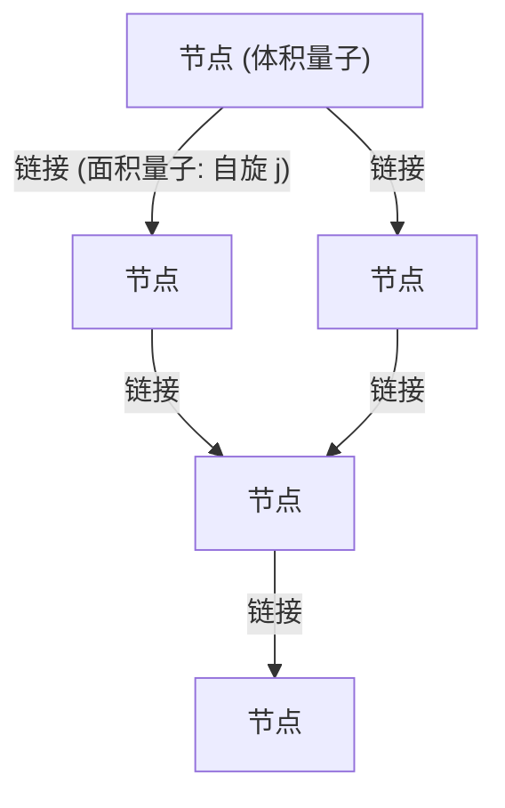

# 引言：连续体幻想的终结与“量子化空间”

在人类试图理解宇宙结构的过程中，我们始终将“空间”视为物质存在的舞台，即可以无限分割的连续背景。即使在发生从牛顿力学中的绝对空间到爱因斯坦广义相对论中动态弯曲时空的范式转变之后，“时空是连续的”这一隐含前提依然得以保留。然而，在现代物理学的最前沿，这种连续体的概念已越来越难以维持。

在试图统一描述微观世界的量子力学与描述宏观引力的广义相对论的过程中，诞生的有力候选理论之一就是**圈量子引力理论（Loop Quantum Gravity: LQG）**。LQG所呈现的世界观从根本上颠覆了我们的直觉。它认为“空间本身是量子化的，由无法再分割的最小单位组成”。

如果空间像乐高积木一样具有离散的结构，我们是否能够重组这些积木，从而“设计”出新的结构？从这个问题衍生出来的，正是本文的主题——**“环路工程（Loop Engineering）”**这一全新概念。本文将剖析LQG的基础概念，并结合当前物理学的局限性与理论假说，深入探讨在未来如果能在普朗克长度尺度上操作时空结构，将为人类技术带来怎样的突破。

---

# 1. 圈量子引力理论（LQG）的基础架构

## 1.1 广义相对论与量子力学的冲突及背景独立性

在自然界的四种基本相互作用中，电磁力、强相互作用力和弱相互作用力这三种力已在量子力学框架下被完全描述，并形成了完善的标准模型。然而，唯独引力始终顽固地拒绝被量子化。其根本原因在于广义相对论是一个“背景独立（Background Independent）”的理论。

现有的量子场论是在如平坦的闵可夫斯基时空等“固定的背景时空”上展开的。但在广义相对论中，时空本身就是动力学变量，会随着物质的分布而弯曲。也就是说，将引力微观量子化，就意味着**将时空本身量子化**。弦理论（String Theory）采取的方法是假设一个特定的背景时空，并将引力子（Graviton）描述为在其中传播的弦；而LQG则严格遵循爱因斯坦的背景独立性，采取了直接将时空几何本身量子化的方法。

## 1.2 自旋网络：空间的“原子”

在LQG中，描述空间结构的数学工具是**自旋网络（Spin Network）**。这一概念最初由罗杰·彭罗斯（Roger Penrose）提出，后来由卡洛·罗韦利（Carlo Rovelli）和李·斯莫林（Lee Smolin）等人将其严格表述为LQG的量子态。

自旋网络可以被可视化为由节点（Node）和链接（Link）组成的图结构。

- **节点（Node）**: 节点代表空间的“体积”量子。每个节点对应于普朗克体积（约 $10^{-99} \text{cm}^3$）尺度的微小空间块。
- **链接（Link）**: 连接节点之间的链接代表相邻空间块相交的“面积”量子。链接被赋予半整数 $j$（自旋），它决定了面积的大小。面积的本征值由 $A \propto \ell_P^2 \sqrt{j(j+1)}$ 给出（$\ell_P$ 为普朗克长度）。

也就是说，我们所认识的连续空间，当放大到极微小尺度时，会呈现出由这种自旋网络的节点和链接错综复杂交织而成的网络结构。空间不再是“存在”的东西，而是由节点之间的关系（链接）“涌现（创生）”出来的。

## 1.3 自旋泡沫：时空的历史与演化

自旋网络描述的是“某一瞬间空间”的结构，而描述其如何随时间变化的则是**自旋泡沫（Spin Foam）**。

就像量子力学中费曼的路径积分一样，从某个初始自旋网络状态到最终状态的跃迁概率，是通过对所有可能的自旋泡沫进行求和来计算的。自旋泡沫可以被想象为一种类似泡沫的高维网络结构：节点在时间方向上描绘出轨迹成为“边（Edge）”，而链接则扫过成为“面（Face）”。所谓时空，正是作为这种自旋泡沫复杂相互作用的叠加，在宏观上涌现出的现象。

---

# 2. 环路工程：空间的设计与操作

假设LQG正确地描述了自然，在技术发展到极致的未来，我们有可能可以人工操作这种自旋网络的结构。这就是“环路工程”。

继操作原子的纳米技术、操作原子核的核工程之后，直接操作空间最小单位即“普朗克尺度几何学”的**几何工程（Geometry Engineering）**应运而生。

## 2.1 空间拓扑的直接编辑

现代技术仅限于在空间内移动和改变物质与能量。然而在环路工程中，我们将能够切断自旋网络的链接，并将其重新连接到其他节点上。在数学上，这意味着可以局部地改变空间的拓扑（拓扑结构）。

### 虫洞的人工构建
作为科幻经典元素的虫洞，虽然作为广义相对论的解（爱因斯坦-罗森桥）是可能存在的，但为了维持它，需要具有“负能量”的奇异物质，其实现可能性被认为极低。

但是，如果能在普朗克尺度上进行操作，那么无需依赖宏观的负能量，通过直接重写自旋网络结构，就有可能生成微小的虫洞。如果将相隔遥远的两个区域的节点直接用链接连接起来，那里就会产生新的邻近关系。如果能使这束微小的链接生长到宏观尺度（引发自旋网络的巨大相变），或许就能构建出可穿越的（Traversable）虫洞。

## 2.2 超光速通信（FTL）与几何纠缠

量子纠缠不能用于信息传递（不能超越光速），这是量子力学的一大原则。然而，在圈量子引力理论和全息原理的背景下，提出了ER=EPR猜想（虫洞与纠缠的等价性），即“空间本身的连接（链接）是由量子纠缠产生的”。

通过环路工程，如果能在特定节点之间人工构建并稳定极强的纠缠态，或许就能无视空间距离，实现信息的直接转录。这等同于在自旋网络上创建了一条“捷径”，从而有可能实现表观上的超光速通信（Faster-Than-Light communication）。

## 2.3 引力控制与自旋网络的“密度”

相对论告诉我们，质量的存在会使空间弯曲从而产生引力。但从LQG的视角来看，质量（物质场）与自旋网络相互作用，起到了改变其链接分布和节点密度的作用。

如果不通过物质，而是利用电磁场或某种高能场，直接激发自旋网络的局部状态，使节点密度和链接拓扑发生偏移，那么**在没有质量存在的地方生成人工引力场**将成为可能。

- **反引力（引力屏蔽）**: 通过排列自旋网络的链接，展开能阻止外部几何扭曲传播的可变（Variable）拓扑护盾，从而完全屏蔽引力的影响。
- **阿库别瑞引擎的环路实现**: 通过连续操作，增加宇宙飞船前方自旋网络的节点密度以收缩空间，同时减少后方密度以使其膨胀，从而实现曲速航行。

---

# 3. 物理学极限与实现突破的条件

当然，实现环路工程面临着难以逾越的障碍。

## 3.1 普朗克能量的壁垒

最大的障碍是能量尺度。为了探测和操作普朗克长度（$\sim 10^{-35}$ 米）的结构，根据不确定性原理，需要普朗克能量（$\sim 10^{19}$ GeV）。这大约是目前CERN大型强子对撞机（LHC）最大能量的一千万亿倍，是卡尔达肖夫指数中只有II型到III型文明才能达到的能量级别。

但是，这里的理论假说**“宏观量子引力效应”**带来了一线希望。

## 3.2 宏观量子引力效应的利用

就像我们无需知道单个水分子的运动也能通过流体力学来控制波浪一样，这种方法不逐个操作自旋网络的微观细节，而是利用整个系统的集体激发（Collective Excitation）。

例如，可以考虑利用极低温、高密度环境下如玻色-爱因斯坦凝聚（BEC）般的量子相干状态，在宏观尺度上共振时空涨落的技术。如果在特定电磁波的脉冲模式与自旋网络的激发模式之间存在非线性共振效应，那么即使达不到普朗克能量，仍有余地以相对较低的能量在时空结构中制造“干涉条纹”，从而控制拓扑。

---

# 结论：未来工程师的路标

圈量子引力理论所提出的“量子化空间”，不仅仅是用于揭示宇宙起源和黑洞奇点的理论工具。在遥远的未来，它有可能成为人类将宇宙结构本身作为画布，自由施展技术的终极“规格说明书”。

从材料工程到几何工程的范式转变。编织空间节点、塑造时间、构建连接群星的新基础设施——“环路工程师”们的诞生，意味着人类在真正意义上成为了宇宙的创造性参与者。此刻，我们正见证着基础理论构建的这一步，这是一项浩瀚无垠的工程的起点。
