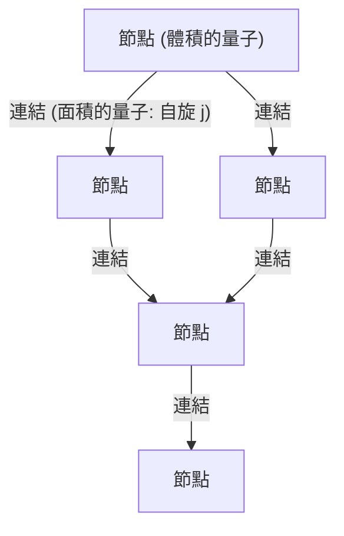
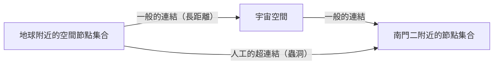

# 序論：連續體幻想的終結與「量子化空間」

人類在試圖理解宇宙結構的過程中，我們總是將「空間」視為物質存在的舞台，亦即一個可以無限分割的連續背景。從牛頓力學的絕對空間，到愛因斯坦廣義相對論中動態且彎曲的時空，即使經歷了典範轉移，「時空是連續的」這個隱含的前提依然被保留了下來。然而，在現代物理學的最前線，這個連續體的概念已經越來越難以維持。

試圖將描述微觀世界的量子力學與描述宏觀重力的廣義相對論統一起來的嘗試中，**迴圈量子重力理論（Loop Quantum Gravity: LQG）**是其中一個有力的候選者。LQG所呈現的世界觀，從根本上顛覆了我們的直覺。它認為「空間本身是量子化的，由無法再分割的最小單位所組成」。

如果空間像樂高積木一樣具有離散的結構，那麼我們是否可以重新組合這些積木，並「設計」出新的結構？從這個問題中誕生的，正是本文的主題——**「迴圈工程（Loop Engineering）」**這個全新的概念。本文將在剖析LQG基礎概念的同時，深入探討未來如果在普朗克長度尺度上操作時空結構變得可能時，結合目前的物理學極限與理論假說，人類技術將迎來什麼樣的突破。

---

# 1. 迴圈量子重力理論（LQG）的基礎架構

## 1.1 廣義相對論與量子力學的衝突及背景獨立性

在自然界的四種基本交互作用中，電磁力、強作用力與弱作用力這三者已完全在量子力學的框架下被描述，並完善為標準模型。然而，唯獨重力一直頑強地拒絕被量子化。其根本原因在於，廣義相對論是一個「背景獨立（Background Independent）」的理論。

現有的量子場論是在平坦的閔可夫斯基時空等「固定的背景時空」上展開的。但在廣義相對論中，時空本身是一個力學變數，會隨著物質的分布而彎曲。也就是說，將重力量子化，就意味著**將時空本身量子化**。相較於弦理論（String Theory）假設一個特定的背景時空，並將重力子（Graviton）描述為在該時空上傳播的弦的途徑，LQG則嚴格遵守愛因斯坦的背景獨立性，採取將時空幾何本身量子化的途徑。

## 1.2 自旋網路：空間的「原子」

在LQG中，用來描述空間結構的數學工具是**自旋網路（Spin Network）**。這原本是由羅傑·潘洛斯（Roger Penrose）構想出來的概念，後來由卡洛·羅威利（Carlo Rovelli）和李·斯莫林（Lee Smolin）等人將其嚴格地形式化為LQG的狀態。

自旋網路可以視覺化為一個由節點（點）和連結（線）所組成的圖結構。

- **節點（Node）**: 節點代表空間「體積」的量子。每個節點對應著普朗克體積（約 $10^{-99} \text{cm}^3$）尺度的微小空間區塊。
- **連結（Link）**: 連接節點之間的連結，代表相鄰空間區塊交會的「面積」量子。連結被賦予半整數 $j$（自旋），這決定了面積的大小。面積的特徵值由 $A \propto \ell_P^2 \sqrt{j(j+1)}$ 給出（$\ell_P$ 為普朗克長度）。

也就是說，我們所認知的連續空間，在放大到極微小的尺度時，會呈現出這個由自旋網路的節點和連結複雜交織而成的網路結構。空間不再是「存在」的，而是被重新理解為由節點之間的關係（連結）所「湧現」出來的。

## 1.3 自旋泡沫：時空的歷史與演化

如果自旋網路代表「某個瞬間的空間」結構，那麼描述它隨時間如何變化的，就是**自旋泡沫（Spin Foam）**。

就像量子力學中費曼的路徑積分一樣，從某個初始的自旋網路狀態過渡到最終狀態的機率，是由所有可能的自旋泡沫的總和來計算的。自旋泡沫可以想像成一個泡沫狀的高維度網路結構，其中節點在時間方向上描繪出軌跡成為「邊（Edge）」，而連結則成為「面」。所謂時空，正是這種自旋泡沫複雜交互作用的疊加，而在宏觀上湧現出來的現象。

---

# 2. 迴圈工程：空間的設計與操作

如果假設LQG正確地描述了自然界，在技術發展到極限的未來，我們或許就能夠人為地操作這個自旋網路的結構。這就是「迴圈工程」。

繼操作原子的奈米技術、操作原子核的核工程之後，這將是直接操作空間最小單位——「普朗克尺度幾何」的**幾何工程學（Geometry Engineering）**的誕生。

## 2.1 空間拓樸的直接編輯

現代技術僅限於在空間內移動或改變物質與能量。然而，在迴圈工程中，切斷自旋網路的連結並將其重新連接到另一個節點的操作將成為可能。在數學上，這意味著局部改變空間的拓樸（拓樸結構）。

### 蟲洞的人工建造
科幻小說中常見的蟲洞，作為廣義相對論的解（愛因斯坦-羅森橋）是可能存在的，但為了維持它，需要具有「負能量」的奇異物質，其實現的可能性一直被認為極低。

然而，如果能夠在普朗克尺度上進行操作，我們可能無需依賴宏觀的負能量，就能透過直接改寫自旋網路的結構來生成微小的蟲洞。如果在相隔遙遠的兩個區域內的節點之間直接建立連結，那裡就會產生新的相鄰關係。如果能夠將這束微小的連結成長到宏觀尺度（引發自旋網路的巨大相變），或許就能建造出可穿越（Traversable）的蟲洞。

## 2.2 超光速通訊（FTL）與幾何量子纏結

量子力學的一個大原則是，量子纏結不能用於傳遞資訊（無法超越光速）。然而，在迴圈量子重力理論和全像原理的脈絡下，有人提出了ER=EPR猜想（蟲洞與纏結的等價性），亦即「空間的連結本身，是由量子纏結所產生的」。

透過迴圈工程，如果能在特定節點之間人為地建立極強的纏結狀態並將其穩定下來，或許就能實現無視空間距離的資訊直接轉錄。這等同於在自旋網路上建立一條「捷徑」，可能實現表觀上的超光速通訊（Faster-Than-Light communication）。

## 2.3 重力控制與自旋網路的「密度」

相對論告訴我們，質量的存在會使空間彎曲並產生重力。但從LQG的觀點來看，質量（物質場）會與自旋網路交互作用，作為改變其連結分布和節點密度的因素。

如果我們能在不透過物質的情況下，使用電磁場或某種高能場，直接激發自旋網路的局部狀態，並使節點密度或連結的拓樸產生偏移，那麼就有可能**在沒有質量的地方產生人工重力場**。

- **反重力（重力屏蔽）**: 透過對齊自旋網路的連結，並展開可變（Variable）拓樸護盾以防止外部幾何扭曲的傳播，從而完全阻絕重力的影響。
- **阿庫別瑞引擎的迴圈實現**: 藉由連續地提高太空船前方自旋網路的節點密度以收縮空間，並減少後方的密度以使其膨脹，從而實現曲速航行。

---

# 3. 物理學極限與突破的條件

當然，要實現迴圈工程，前方還有著巨大的阻礙。

## 3.1 普朗克能量之壁

最大的障礙是能量尺度。根據不確定性原理，為了解析並操作普朗克長度（$\sim 10^{-35}$ 公尺）的結構，需要普朗克能量（$\sim 10^{19}$ GeV）。這大約是目前CERN大型強子對撞機（LHC）最大能量的一千萬億倍，是卡爾達肖夫指數中II型到III型文明才能達到的能量等級。

然而，在這裡帶來一絲希望的是**「宏觀量子重力效應」**的理論假說。

## 3.2 宏觀量子重力效應的利用

就像我們不需要知道個別水分子的行為也能透過流體力學來控制波浪一樣，這是一種不直接個別操作自旋網路的微觀細節，而是利用整個系統集體激發（Collective Excitation）的方法。

例如，可以考慮利用極低溫、高密度環境下的玻色-愛因斯坦凝結（BEC）等量子同調狀態，在宏觀尺度上使時空起伏產生共振的技術。如果在特定電磁波的脈衝模式與自旋網路的激發模式之間存在非線性共振效應，那麼即使達不到普朗克能量，也還有可能在相對較低的能量下，於時空結構中製造出「干涉條紋」並控制拓樸。

---

# 結論：未來工程師的路標

迴圈量子重力理論所提出的「量子化空間」，不僅僅是解開宇宙起源或黑洞奇異點的理論工具。在遙遠的未來，它有可能成為人類將宇宙結構本身作為畫布，自由施展技術的終極「規格書」。

從材料工程到幾何工程的典範轉移。編織空間節點、塑造時間、建構連結星辰的新基礎設施的「迴圈工程師」們的誕生，意味著人類將成為真正意義上的宇宙創造參與者的那一刻。我們現在，正是建構基礎理論這無比宏偉尺度第一步的見證者。
