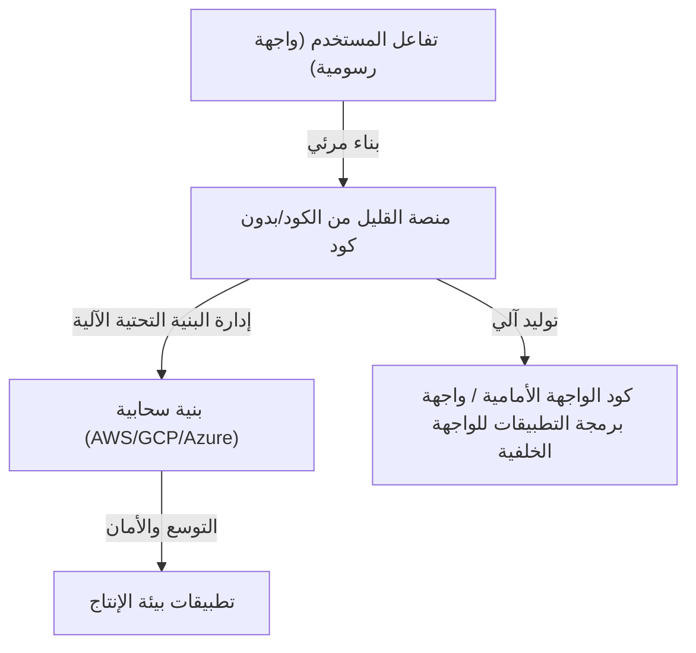
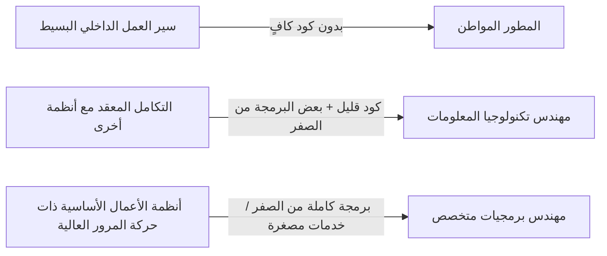

# أضواء وظلال التطوير بالقليل من الكود وبدون كود: هل سيفقد المبرمجون وظائفهم، أم سيكتسبون أسلحة جديدة؟

في عالم تطوير البرمجيات، اجتاحت مصطلحات "القليل من الكود" (Low-Code) و"بدون كود" (No-Code) الصناعة منذ فترة طويلة. واجهات بديهية تعتمد على السحب والإفلات، وبناء قواعد بيانات ببضع نقرات، وبنية تحتية سحابية جاهزة للنشر الفوري. هذه التطورات قلصت وقت تطوير تطبيقات الويب والهواتف المحمولة من أسابيع إلى مجرد أيام، أو حتى ساعات.

أمام هذا التقدم التكنولوجي السريع، يطرح الكثيرون سؤالاً واحداً: "في النهاية، هل ستصبح مهنة المبرمج غير ضرورية؟"

في هذا المقال، سنتعمق في هذا السؤال. سنشرح بشكل شامل كل شيء بدءاً من الخلفية التاريخية لتوليد البرامج باستخدام واجهات المستخدم الرسومية (GUI)، مروراً بظهور المنصات الحديثة القائمة على البرمجيات كخدمة (SaaS)، وصولاً إلى التحول في الأعمال الذي يحدثه "المطور المواطن" (Citizen Developer)، والمخاطر المصاحبة لـ "تقنية المعلومات في الظل" (Shadow IT) ومشاكل التقيد بمورد معين (Vendor Lock-in). كما سنستكشف لماذا يظل "كتابة الكود" أمراً لا غنى عنه في حالات المنطق التجاري المعقد وتحسين الأداء، وكيف سيتطور دور المطورين في المستقبل.

---

## 1. تاريخ توليد البرامج باستخدام الواجهات الرسومية: من أدوات CASE إلى SaaS الحديثة

قد يبدو مصطلح بدون كود/قليل الكود حديثاً نسبياً، لكن مفهوم "صنع البرمجيات دون كتابة كود" قديم قدم تاريخ هندسة البرمجيات نفسه.

### ثمانينيات القرن العشرين: صعود وهبوط أدوات CASE
في الثمانينيات، مع الزيادة الكبيرة في الطلب على البرمجيات، أصبح تحسين إنتاجية التطوير أمراً ملحاً. ومن هنا ظهرت أدوات "هندسة البرمجيات بمساعدة الحاسوب" (CASE). هدفت هذه الأدوات إلى رسم مخططات النظام باستخدام لغات نمذجة بصرية مثل UML، ثم توليد الكود المصدري منها تلقائياً. ومع ذلك، وبسبب التكنولوجيا المتاحة آنذاك، كان الكود المولد ضعيف الجودة وضعيف الأداء وصعب الصيانة (حيث أن التعديل اليدوي على الكود المولد كان يؤدي إلى فقدان المزامنة مع النموذج، وهي مشكلة تُعرف بـ "رحلة الذهاب والإياب")، مما حال دون انتشارها الواسع.

### التسعينيات - العقد الأول من القرن الحادي والعشرين: أدوات RAD و 4GL
بعد ذلك، ظهرت أدوات "التطوير السريع للتطبيقات" (RAD) مثل Visual Basic و Delphi. اعتمدت هذه الأدوات نهجاً ثورياً يتمثل في وضع عناصر الواجهة الرسومية (كالأزرار ومربعات النص) على النماذج، وكتابة كود قصير (نص برمجي) لكل حدث. أدى هذا إلى تحسين سرعة تطوير تطبيقات سطح المكتب بشكل جذري. في الوقت نفسه، انتشرت لغات الجيل الرابع (4GL) المتخصصة في عمليات قواعد البيانات، واستمرت المحاولات لبناء أنظمة باستخدام قواعد لغوية أقرب إلى لغة البشر.

### العصر الحديث: منصات SaaS السحابية الأصلية
أما في العصر الحديث، تمتلك منصات القليل من الكود وبدون كود الحديثة مثل OutSystems و Mendix و Bubble و Retool بنية مختلفة جذرياً عن أدوات الماضي. الميزة الرئيسية هي أنها "سحابية أصلية" (Cloud-Native).
تقوم الأدوات الحديثة باستيعاب الكثير من "المتطلبات غير الوظيفية" التي كان يقوم بها المطورون ومهندسو البنية التحتية يدوياً في الماضي، مثل توفير البنية التحتية، وتوسيع قواعد البيانات، وتطبيق تصحيحات الأمان. يحتاج المستخدم فقط إلى تجميع المكونات على المتصفح، وفي الخلفية تعمل أطر الواجهة الأمامية الحديثة مثل React والبنية التحتية السحابية القوية مثل AWS/GCP معاً بشكل تلقائي.

تم حل مشكلة قابلية الصيانة التي كانت تعاني منها "أدوات توليد الكود" السابقة جزئياً من خلال نهج "عدم إظهار الكود للمستخدمين، وتفسيره وتنفيذه ديناميكياً على بيئة تشغيل المنصة".

---

## 2. صعود المطور المواطن وإضفاء الطابع الديمقراطي على الأعمال

الإنجاز الأكبر لأدوات بدون كود يكمن في "إضفاء الطابع الديمقراطي على تطوير البرمجيات". في السابق، عندما كانت أقسام الأعمال (مثل المبيعات والموارد البشرية والتسويق) تحتاج إلى أدوات داخلية جديدة، كان الإجراء المعتاد هو تحديد المتطلبات وتقديم طلب لقسم تكنولوجيا المعلومات، وتأمين الميزانية، والانتظار لأشهر في قائمة الانتظار قبل أن يبدأ التطوير أخيراً.

ومع ذلك، مع انتشار أدوات بدون كود، أصبح بإمكان رجال الأعمال الذين لم يتلقوا تعليماً متخصصاً في البرمجة - ويُعرفون باسم "المطورين المواطنين" - بناء التطبيقات بأنفسهم لحل مشكلاتهم المباشرة.

* **تحسن جذري في المرونة**: نظراً لأن الأشخاص الأكثر دراية بمشاكل العمل الميداني يمكنهم إنشاء الأدوات وتحسينها بأنفسهم، فإن دورة الملاحظات تصبح قصيرة للغاية.
* **تحرير موارد قسم تكنولوجيا المعلومات**: يمكن لأقسام تكنولوجيا المعلومات الحالية تركيز مواردها على مهام أكثر تقدماً وتخصصاً، مثل صيانة الأنظمة الأساسية وبناء بنية تحتية أمنية على مستوى الشركة بأكملها.

يمكن القول إن هذا هو التطور المنطقي في العصر السحابي للدور الذي كانت تلعبه وحدات ماكرو Excel و VBA.

---

## 3. الظل خلف الضوء: مخاطر تقنية المعلومات في الظل

إلا أن إضفاء الطابع الديمقراطي على التكنولوجيا يخلق في الوقت نفسه مخاطر جديدة. هذه هي مشكلة "تقنية المعلومات في الظل" (Shadow IT).

تقنية المعلومات في الظل هي أنظمة تكنولوجيا المعلومات والخدمات السحابية التي يتم تقديمها وتشغيلها بناءً على قرارات فردية من الأقسام أو الموظفين دون إدارة أو موافقة من قسم تكنولوجيا المعلومات. مع امتلاك المطورين المواطنين لأدوات قوية، تضخم هذا الخطر إلى نطاق غير مسبوق.

### نقص الحوكمة والمخاطر الأمنية
حقيقة أن موظفي الخطوط الأمامية يمكنهم بسهولة إنشاء قواعد بيانات وربطها بواجهات برمجة التطبيقات الخاصة بخدمات SaaS الخارجية تعني أن هناك خطراً يتمثل في تخزين ونقل المعلومات السرية والبيانات الشخصية بطرق تنتهك السياسات الأمنية للشركة. يعد تسرب المعلومات بسبب أخطاء في إعدادات صلاحيات الوصول أحد الحوادث التي تتكرر كثيراً في الأنظمة الداخلية المبنية باستخدام أدوات بدون كود.

### المنطق المرئي يتحول إلى "خلطة سرية"
التطبيقات بدون كود التي يتم بناؤها دون فهم المفاهيم الأساسية للبرمجة مثل "التركيب النمطي" (Modularization)، و"التحكم في الإصدار" (Version Control)، و"أتمتة الاختبار" (Test Automation)، سرعان ما تصبح معقدة وتتحول في النهاية إلى صندوق أسود لا يمكن لأحد غير منشئها التعديل عليه.
"سباغيتي العقد" (مخططات الانسياب المتشابكة والمعقدة) - بدلاً من "سباغيتي الكود" - يصعب فك تشفيرها أكثر من الأكواد النصية. إذا استقال المنشئ وتوقف هذا النظام فجأة، فسيجد قسم تكنولوجيا المعلومات نفسه يتجول في بحر من المنطق المرئي المجهول، بدون وجود وثائق أو أكواد اختبار.

---

## 4. التقيد بمورد معين: ثمن الحرية

التحدي الاستراتيجي الأكبر الذي تواجهه الشركات عند اعتماد منصات القليل من الكود/بدون كود هو "التقيد بمورد معين" (Vendor Lock-in).

في التطوير التقليدي القائم على الأكواد، تكون الأكواد المصدرية ملكية فكرية للشركة، وهناك حرية في الانتقال من AWS إلى GCP، أو إلى الخوادم المحلية (حتى وإن لم يكن الأمر سهلاً، فهو ليس مستحيلاً).
أما في معظم منصات بدون كود، يتم حفظ منطق التطبيقات المبنية وتعريفات واجهة المستخدم بصيغة خاصة بتلك المنصة (مغلقة المصدر).

* **الضعف أمام تغييرات الأسعار**: حتى لو غيرت المنصة نظام التراخيص وارتفعت رسوم الاستخدام بعدة أضعاف، لا يمكن الانتقال بسهولة إلى منصة شركة أخرى. يتطلب الأمر فعلياً إعادة البناء من الصفر.
* **القيود الوظيفية**: إذا دعت الحاجة إلى ميزة لا توفرها المنصة (مثل التحكم في أجهزة معينة، أو أحدث خوارزميات التشفير، أو الاتصال عبر بروتوكول خاص)، فإن التطوير سيصل إلى طريق مسدود تماماً.

لذلك، عند إدخال تقنية "القليل من الكود" في قطاع المؤسسات، من بالغ الأهمية رسم حدود هيكلية واضحة تحدد "الأنظمة التي سيتم بناؤها باستخدام القليل من الكود، والأنظمة التي سيتم تطويرها من الصفر".

---

## 5. لماذا يظل "كتابة الكود" أمراً ضرورياً؟

لنعد هنا إلى سؤالنا الأول. هل ستقضي تقنيات بدون كود/قليل الكود على وظائف المبرمجين؟
الخلاصة هي أن **"وظيفة إنشاء تطبيقات CRUD (إنشاء، قراءة، تحديث، حذف) النمطية ستختفي بلا شك."** ومع ذلك، فإن القيمة الجوهرية لهندسة البرمجيات تكمن في أجزاء أخرى.

### القدرة على التعبير عن المنطق التجاري المعقد
البرمجة المرئية باستخدام واجهات المستخدم الرسومية مناسبة للتفرعات الشرطية البسيطة والمعالجة المتسلسلة، لكنها مقيدة في التعبير عن المنطق التجاري حيث تتشابك الخوارزميات شديدة التعقيد وقواعد النطاق المتنوعة.
الكود المعتمد على النص (لغات البرمجة) هو "الواجهة الأعلى كثافة للتعبير عن المنطق بدقة وإيجاز"، والتي طورها البشر على مدى عقود. محاولة التعبير عن إدارة الحالة المعقدة أو المعالجة المتزامنة في مخططات انسيابية تؤدي إلى الكثير من الضوضاء البصرية، متجاوزة القدرات الإدراكية للإنسان.

### حاجز الأداء والتحسين
لزيادة التنوع، تحتوي أدوات بدون كود على العديد من طبقات التجريد بداخلها. هذا يولد عبئاً إضافياً (انخفاض في الأداء) مقابل زيادة الإنتاجية.
في الأنظمة التي تتطلب معالجة الوصول المتزامن لملايين المستخدمين، أو الأنظمة المالية التي تتطلب سرعة استجابة تقاس بأجزاء من الألف من الثانية، أو أجهزة إنترنت الأشياء (IoT) ذات الموارد المحدودة للغاية، حيث يلزم التحسين بالقرب من حدود الأجهزة، يظل الكود البرمجي الذي يمكنه الوصول المباشر إلى إدارة الذاكرة وهياكل البيانات أمراً لا غنى عنه.

### التعامل مع المناطق الحدودية والحالات المتطرفة
عند مواجهة متطلبات لا تتناسب مع إطار "المكونات القياسية" التي توفرها المنصة (حالات متطرفة)، فإن المهندسين القادرين على كتابة الكود هم وحدهم من يمتلكون القدرة على اختراق هذا الحاجز. حتى في أدوات القليل من الكود، من الشائع توفير "بوابات هروب" تسمح بكتابة أكواد مثل JavaScript أو SQL لإجراء تخصيصات متقدمة.

---

## 6. مستقبل المبرمجين: القليل من الكود كسلاح جديد

بالتزامن مع انتشار توليد الأكواد بواسطة الذكاء الاصطناعي (مثل Copilot)، فإن دور مهندس البرمجيات ينتقل بثبات من "حرفي يطبع الأكواد" إلى "مهندس معماري يحل مشاكل الأعمال باستخدام التكنولوجيا".

المهندسون المتميزون لا ينظرون إلى القليل من الكود/بدون كود كـ "عدو" أو "تهديد". بل على العكس، يستخدمونها بنشاط كـ **"سلاح قوي"** لتقليل الوقت المستغرق في كتابة الأكواد النمطية المملة (Boilerplate) وإنشاء شاشات الإدارة البسيطة.

وسيبدؤون في تركيز وقتهم ومواردهم الفكرية على المجالات المتقدمة التالية، مع مراعاة التحسين الشامل للنظام:

1. **توسيع المنصات**: تطوير مكونات مخصصة ووحدات تكامل واجهات برمجة التطبيقات (عن طريق كتابة الأكواد) لبيئات القليل من الكود، لتسهيل استخدامها من قبل المطورين المواطنين.
2. **تصميم بنية الأنظمة**: تصميم كيفية ربط العديد من الخدمات بدون كود مع الخدمات المصغرة المطورة داخلياً، مع ضمان تناسق البيانات والأمان.
3. **خلق القيمة الأساسية**: إنشاء قيم لا يمكن أبداً صنعها باستخدام القوالب الجاهزة، والتي تشكل مصدر الميزة التنافسية للشركة، مثل تطوير خوارزميات فريدة، وتنفيذ نماذج التعلم الآلي، والسعي وراء تجربة مستخدم لا مثيل لها.

### خاتمة

إن الجانب المشرق من تطوير البرمجيات بالقليل من الكود وبدون كود هو التحسن الهائل في الإنتاجية الذي يمنح الجميع القدرة على إنشاء البرمجيات. ولكن في الظل، تكمن فخاخ عميقة ومظلمة مثل فقدان الحوكمة، وتحول الأنظمة إلى صناديق سوداء، والتقيد بمورد معين.

لن يفقد المبرمجون وظائفهم. ومع ذلك، فإن "العمال الذين يكتفون بإنشاء الشاشات كما يُطلب منهم" سيتم استبعادهم. التطور التكنولوجي يطرح على المهندسين أسئلة ذات مستوى أعلى: "لماذا نبني هذا النظام؟" و "كيف يمكننا تعظيم القيمة التجارية؟".

من المفارقات أنه كلما زاد انتشار المنصات التي لا تتطلب كتابة أكواد، زادت أكثر من أي وقت مضى قيمة "هندسة البرمجيات الحقيقية" اللازمة لبناء تلك المنصات وتوسيعها واختراق حدودها.
