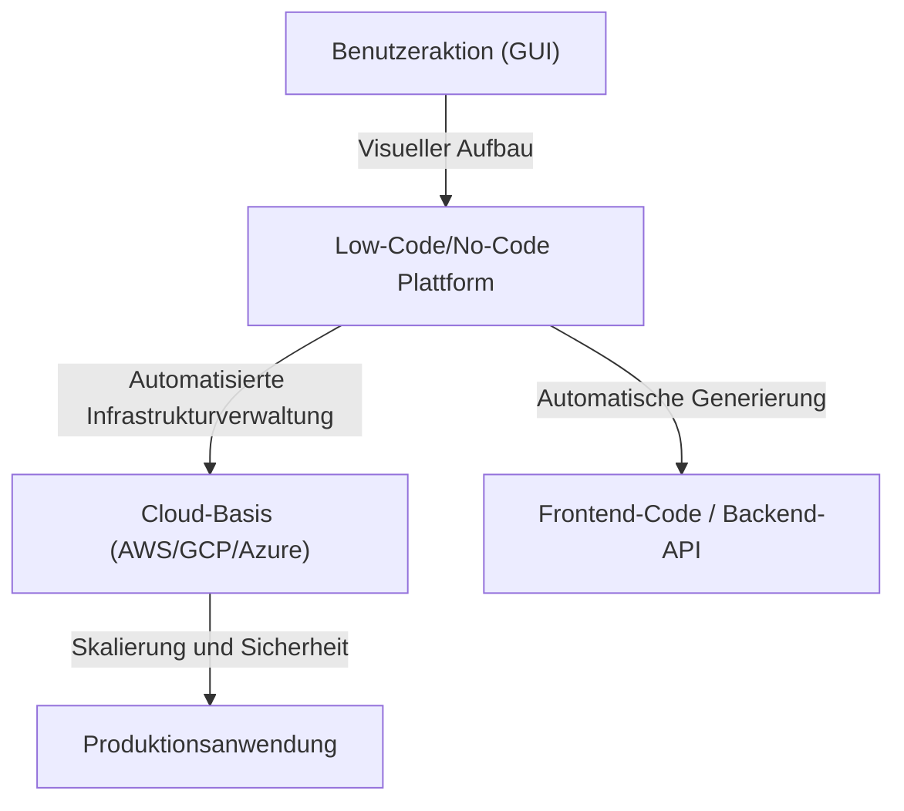
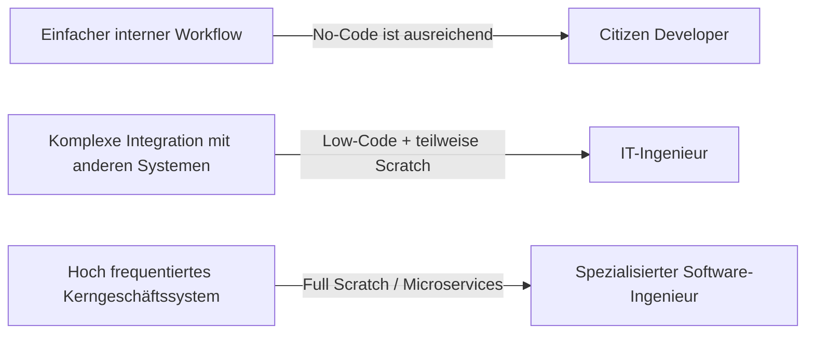

# Licht und Schatten der Low-Code/No-Code-Entwicklung: Werden Programmierer arbeitslos, oder erhalten sie eine neue Waffe?

In der Welt der Softwareentwicklung beherrschen die Schlagwörter "Low-Code" und "No-Code" schon seit geraumer Zeit die Branche. Intuitive Drag-and-Drop-Schnittstellen, Datenbankaufbau mit wenigen Klicks und sofort einsatzbereite Cloud-Infrastrukturen. Diese haben die Entwicklung von Web- und mobilen Anwendungen, die früher Wochen dauerte, auf wenige Tage oder sogar Stunden verkürzt.

Angesichts dieses rasanten technologischen Fortschritts stellen sich viele eine Frage: "Wird der Beruf des Programmierers letztendlich überflüssig?"

Dieser Artikel geht dieser Frage auf den Grund. Wir geben einen umfassenden Überblick über den historischen Hintergrund der GUI-basierten Programmgenerierung, den Aufstieg moderner SaaS-basierter Plattformen sowie den Wandel, den "Citizen Developer" in die Geschäftswelt bringen. Zudem beleuchten wir die damit verbundenen Risiken von "Schatten-IT" und die Problematik des Vendor-Lock-in. Schließlich untersuchen wir, warum bei komplexer Geschäftslogik und Leistungsoptimierung der Akt des "Codeschreibens" nach wie vor unerlässlich ist und wie sich die Rolle der Entwickler in Zukunft entwickeln wird.

---

## 1. Die Geschichte der GUI-basierten Programmgenerierung: Von CASE-Tools zum modernen SaaS

Die Begriffe No-Code und Low-Code mögen relativ neue Buzzwords sein, aber das Konzept, "Software zu erstellen, ohne Code zu schreiben", ist so alt wie die Geschichte des Software Engineerings.

### 1980er Jahre: Der Aufstieg und Fall der CASE-Tools
In den 1980er Jahren, als die Nachfrage nach Software stark anstieg, wurde die Verbesserung der Entwicklungsproduktivität zu einer dringenden Aufgabe. Dies führte zum Aufkommen von "CASE (Computer-Aided Software Engineering)"-Tools. CASE-Tools zielten darauf ab, Blaupausen von Systemen mithilfe visueller Modellierungssprachen wie UML zu zeichnen und daraus automatisch Quellcode zu generieren. Die damalige Technologie wies jedoch eine geringe Qualität des generierten Codes, eine schlechte Leistung und eine geringe Wartbarkeit auf (das "Round-Trip-Problem", bei dem die manuelle Änderung des generierten Codes zur Asynchronität mit dem Modell führte), sodass sie keine weite Verbreitung fanden.

### 1990er bis 2000er Jahre: RAD-Tools und 4GL
Anschließend erschienen "RAD (Rapid Application Development)"-Tools wie Visual Basic und Delphi. Sie verfolgten einen bahnbrechenden Ansatz, bei dem GUI-Komponenten (Schaltflächen, Textfelder) auf einem Formular platziert und kurze Codes (Skripte) für jedes Ereignis geschrieben wurden. Dies verbesserte die Entwicklungsgeschwindigkeit von Desktop-Anwendungen drastisch. Gleichzeitig verbreiteten sich 4GL (Programmiersprachen der vierten Generation), die auf Datenbankoperationen spezialisiert waren, und es wurden weiterhin Versuche unternommen, Systeme mit einer menschenähnlicheren Syntax aufzubauen.

### Gegenwart: Cloud-native SaaS-Plattformen
Und nun zur Gegenwart. Moderne Low-Code/No-Code-Plattformen wie OutSystems, Mendix, Bubble und Retool haben eine grundlegend andere Architektur als Tools der Vergangenheit. Sie sind "Cloud-nativ".
Moderne Tools nehmen Entwicklern und Infrastruktur-Ingenieuren viele der "nicht-funktionalen Anforderungen" ab, die früher manuell durchgeführt wurden, wie die Bereitstellung von Infrastruktur, die Skalierung von Datenbanken und die Anwendung von Sicherheitspatches. Benutzer müssen lediglich Komponenten in ihrem Browser kombinieren, während im Hintergrund moderne Frontend-Frameworks wie React und robuste Cloud-Infrastrukturen wie AWS/GCP automatisch zusammenarbeiten.

Die Wartungsprobleme früherer "Code-Generierungstools" wurden teilweise durch den Ansatz gelöst, "den Code selbst vor dem Benutzer zu verbergen und ihn dynamisch auf der Laufzeitumgebung der Plattform zu interpretieren und auszuführen."

---

## 2. Der Aufstieg der Citizen Developer und die Demokratisierung des Geschäfts

Die größte Errungenschaft von No-Code-Tools liegt in der "Demokratisierung der Softwareentwicklung". Wenn eine Geschäftsabteilung (Vertrieb, Personal, Marketing usw.) in der Vergangenheit ein neues internes Tool benötigte, war es üblich, die Anforderungen zu definieren, sie bei der IT-Abteilung anzufragen, Budget zu sichern und nach monatelangem Warten (Backlog) endlich mit der Entwicklung zu beginnen.

Mit der Verbreitung von No-Code-Tools können nun jedoch Geschäftsleute, die keine spezielle Programmierausbildung haben – sogenannte "Citizen Developer" –, Anwendungen direkt entwickeln, um ihre eigenen Probleme zu lösen.

* **Dramatische Verbesserung der Agilität**: Personen, die die Herausforderungen vor Ort am besten kennen, können selbst Tools erstellen und verbessern, was die Feedback-Schleife extrem verkürzt.
* **Freisetzung von Ressourcen der IT-Abteilung**: Die bestehenden IT-Abteilungen können ihre Ressourcen auf anspruchsvollere und spezialisierte Aufgaben konzentrieren, wie z. B. die Wartung von Kernsystemen und den Aufbau unternehmensweiter Sicherheitsinfrastrukturen.

Man könnte sagen, dass dies die rechtmäßige Entwicklung der Rolle ist, die Excel-Makros und VBA in der Cloud-Ära gespielt haben.

---

## 3. Der Schatten hinter dem Licht: Die Risiken der Schatten-IT

Die Demokratisierung der Technologie bringt jedoch gleichzeitig neue Risiken mit sich. Dies ist das Problem der "Schatten-IT".

Schatten-IT bezieht sich auf IT-Systeme und Cloud-Services, die von Abteilungen oder Einzelpersonen ohne die Verwaltung oder Genehmigung der IT-Abteilung nach eigenem Ermessen eingeführt und betrieben werden. Da Citizen Developer mächtige Werkzeuge in die Hände bekommen haben, ist dieses Risiko auf ein beispielloses Ausmaß angewachsen.

### Mangelnde Governance und Sicherheitsrisiken
Die Tatsache, dass Mitarbeiter an vorderster Front einfach Datenbanken erstellen und eine API-Integration mit externen SaaS einrichten können, bedeutet die Gefahr, dass vertrauliche und persönliche Informationen in einer Weise gespeichert und übertragen werden, die von der Sicherheitsrichtlinie des Unternehmens abweicht. Informationslecks aufgrund von falsch konfigurierten Zugriffsberechtigungen gehören zu den häufigsten Vorfällen in internen Systemen, die mit No-Code-Tools erstellt wurden.

### Visuelle Logik wird zur "Geheimrezeptur"
No-Code-Anwendungen, die ohne Konzepte wie "Modularisierung", "Versionskontrolle" und "Testautomatisierung", die Grundlagen der Programmierung, erstellt wurden, werden schnell komplex und verwandeln sich in Blackboxen, die niemand außer dem Ersteller verändern kann.
"Knotenspaghetti (komplex verflochtene Flussdiagramme)" anstelle von "Code-Spaghetti" sind noch schwieriger zu entschlüsseln als Textcode. Wenn der Ersteller das Unternehmen verlässt und das System plötzlich ausfällt, wird die IT-Abteilung in einem Meer unbekannter visueller Logik herumirren, ohne dass Dokumentationen oder Testcode vorhanden sind.

---

## 4. Vendor Lock-in: Der Preis der Freiheit

Die größte strategische Herausforderung, vor der Unternehmen bei der Einführung von Low-Code/No-Code-Plattformen stehen, ist der "Vendor Lock-in".

Bei traditioneller codebasierter Entwicklung war der Quellcode geistiges Eigentum des Unternehmens, und es bestand die Freiheit, von AWS zu GCP oder On-Premise zu migrieren (wenn auch nicht einfach, so doch nicht unmöglich).
Bei vielen No-Code-Plattformen werden die Logik und die UI-Definition der erstellten Anwendung jedoch im proprietären Format dieser Plattform gespeichert.

* **Anfälligkeit für Preisänderungen**: Selbst wenn die Plattform ihr Lizenzmodell ändert und die Nutzungsgebühren in die Höhe schnellen, ist eine einfache Migration auf eine andere Plattform nicht möglich. Im Prinzip muss man bei null anfangen.
* **Funktionale Einschränkungen**: Wenn Funktionen benötigt werden, die nicht von der Plattform bereitgestellt werden (spezifische Hardwaresteuerung, neueste Verschlüsselungsalgorithmen, Kommunikation mit speziellen Protokollen usw.), stößt die Entwicklung an eine absolute Wand.

Aus diesem Grund ist es bei der Einführung von Low-Code im Unternehmensbereich äußerst wichtig, eine klare architektonische Grenze zu ziehen, "welche Systeme mit Low-Code und welche von Grund auf (Scratch) entwickelt werden sollen".

---

## 5. Warum "Codeschreiben" immer noch notwendig ist

Kommen wir auf die ursprüngliche Frage zurück. Werden No-Code und Low-Code Programmierern ihre Jobs wegnehmen?
Das Fazit lautet: **"Der Job, lediglich routinemäßige CRUD-Anwendungen (Create, Read, Update, Delete) zu erstellen, wird definitiv verschwinden."** Der wesentliche Wert des Software Engineerings liegt jedoch in anderen Bereichen.

### Ausdruckskraft komplexer Geschäftslogik
Die visuelle Programmierung über GUI eignet sich für einfache bedingte Verzweigungen und sequentielle Verarbeitung, stößt jedoch bei der Darstellung komplexer Algorithmen oder Geschäftslogiken, bei denen sich eine Vielzahl von Domänenregeln überschneidet, an ihre Grenzen.
Textbasierter Code (Programmiersprachen) ist die "Schnittstelle mit der höchsten Dichte für den präzisen und prägnanten Ausdruck von Logik", die die Menschheit über Jahrzehnte hinweg entwickelt hat. Der Versuch, komplexes State Management oder parallele Verarbeitung in einem Flussdiagramm darzustellen, erzeugt zu viel visuelles Rauschen und überschreitet die menschlichen kognitiven Grenzen.

### Die Barriere von Leistung und Optimierung
No-Code-Tools verfügen über viele interne Abstraktionsschichten, um ihre Vielseitigkeit zu erhöhen. Dies erzeugt Overhead (Leistungseinbußen) im Austausch für Produktivität.
In Szenarien, in denen Optimierungen nahe an den Hardwaregrenzen erforderlich sind, wie z.B. Systeme, die gleichzeitige Zugriffe von Millionen von Benutzern verarbeiten, Finanzsysteme, die Antwortzeiten im Millisekundenbereich erfordern, oder IoT-Geräte mit extrem begrenzten Ressourcen, ist Programmiercode, der direkt auf die Speicherverwaltung und Datenstrukturen zugreifen kann, nach wie vor unerlässlich.

### Umgang mit Randbereichen und Edge Cases
Wenn man auf Anforderungen (Edge Cases) stößt, die nicht in den Rahmen der "Standardkomponenten" der Plattform passen, sind Ingenieure, die Code schreiben können, die einzigen, die die Macht haben, diese zu durchbrechen. Selbst in Low-Code-Tools gibt es normalerweise "Escape Hatches" (Notausstiege), in denen man Code in JavaScript, SQL usw. schreiben kann, um fortgeschrittene Anpassungen vorzunehmen.

---

## 6. Die Zukunft des Programmierers: Low-Code als neue Waffe

Gepaart mit der zunehmenden Verbreitung von KI-Code-Generierung (wie Copilot) verschiebt sich die Rolle des Software-Ingenieurs definitiv vom "Handwerker, der Code eintippt" zum "Architekten, der Geschäftsprobleme mit Technologie löst".

Exzellente Ingenieure betrachten Low-Code/No-Code nicht als "Feind" oder "Bedrohung". Vielmehr nutzen sie es aktiv als **"mächtige Waffe"**, um die Zeit zu reduzieren, die für das Schreiben von langweiligem Boilerplate-Code und das Erstellen einfacher Verwaltungsoberflächen benötigt wird.

Sie werden das gesamte System optimieren und ihre Zeit und intellektuellen Ressourcen auf fortgeschrittene Bereiche wie die folgenden konzentrieren:

1. **Plattformerweiterung**: Entwicklung (durch das Schreiben von Code) von benutzerdefinierten Komponenten und API-Integrationsmodulen für Low-Code-Umgebungen, um sie für Citizen Developer benutzerfreundlicher zu machen.
2. **Design der Systemarchitektur**: Entwurf, wie mehrere No-Code-Services und intern entwickelte Microservices verbunden werden können, um Datenkonsistenz und Sicherheit zu gewährleisten.
3. **Schaffung von Core Value**: Schaffung von Werten, die mit Vorlagen niemals erreicht werden können, wie z.B. die Entwicklung proprietärer Algorithmen, die Implementierung von Machine-Learning-Modellen und das Streben nach einer überwältigenden Benutzererfahrung, die die Quelle der Wettbewerbsfähigkeit des Unternehmens darstellt.

### Fazit

Das Licht der Low-Code/No-Code-Entwicklung ist der überwältigende Produktivitätsschub, der jedem die Macht der Softwareerstellung verleiht. Im Schatten verbergen sich jedoch tiefe und dunkle Fallstricke: der Verlust der Governance, das Verwandeln von Systemen in Blackboxen und der Vendor-Lock-in.

Programmierer werden nicht arbeitslos. Allerdings werden "Arbeiter, die nur Bildschirme genau nach Vorgabe erstellen", aussortiert. Die Entwicklung der Technologie stellt Entwickler vor die höherdimensionale Frage: "Warum wird dieses System gebaut?" und "Wie kann der Geschäftswert maximiert werden?".

Je weiter sich code-freie Plattformen verbreiten, desto ironischerweise steigt der Wert von "echtem Software Engineering", das erforderlich ist, um diese Plattformen selbst aufzubauen, zu erweitern und ihre Grenzen zu überwinden, auf ein beispielloses Niveau.
