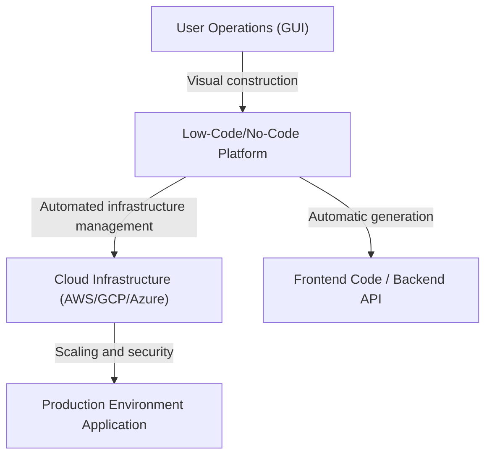
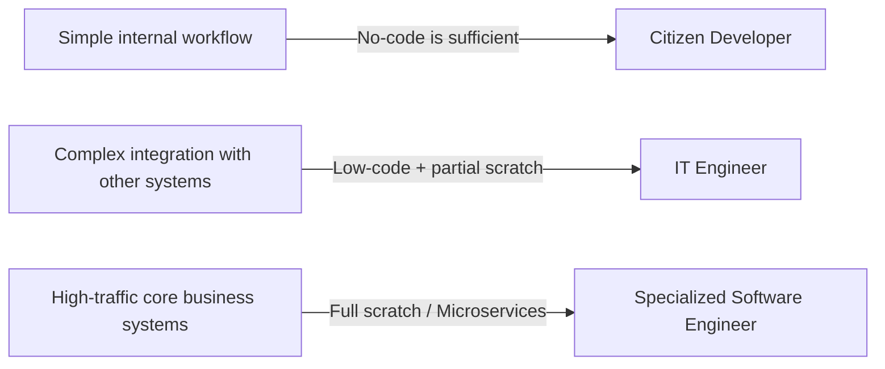

# The Light and Shadow of Low-Code/No-Code Development: Will Programmers Lose Their Jobs, or Will They Gain New Weapons?

In the world of software development, the keywords "Low-Code" and "No-Code" have long taken the industry by storm. Intuitive drag-and-drop interfaces, database construction completed with a few clicks, and instantly deployable cloud infrastructure. These have shortened the development of web and mobile applications, which used to take weeks, to just a few days or even hours.

Faced with this rapid technological advancement, many harbor a single question: "Will the programmer profession ultimately become obsolete?"

This article delves deep into this question. It provides a comprehensive explanation spanning the historical background of GUI-based program generation, the rise of modern SaaS-based platforms, the business transformation brought about by "citizen developers," and the accompanying risks of "Shadow IT" and vendor lock-in issues. Furthermore, it explores why the act of "writing code" remains indispensable for complex business logic and performance optimization, and how the role of developers will evolve in the future.

---

## 1. The History of GUI-based Program Generation: From CASE Tools to Modern SaaS

While the terms low-code/no-code themselves might be relatively new buzzwords, the concept of "building software without writing code" is as old as the history of software engineering.

### The 1980s: The Rise and Fall of CASE Tools
In the 1980s, amid rapidly increasing software demand, improving development productivity became an urgent task. This led to the emergence of "CASE (Computer-Aided Software Engineering)" tools. CASE tools aimed to draw system blueprints using visual modeling languages like UML and automatically generate source code from them. However, with the technology at the time, the generated code was of low quality, exposing poor performance and low maintainability (the "round-trip problem" where manually modifying generated code caused it to fall out of sync with the model), and they failed to achieve widespread adoption.

### The 1990s to 2000s: RAD Tools and 4GL
Subsequently, "RAD (Rapid Application Development)" tools like Visual Basic and Delphi appeared. These adopted a groundbreaking approach of placing GUI components (buttons and text boxes) on a form and writing short code (scripts) for each event. This dramatically accelerated desktop application development speed. Simultaneously, 4GLs (Fourth-Generation Languages) specializing in database operations also proliferated, continuing attempts to build systems with a syntax closer to human language.

### Modern Era: Cloud-Native SaaS Platforms
And now, the modern era. Contemporary low-code/no-code platforms like OutSystems, Mendix, Bubble, and Retool possess a fundamentally different architecture from past tools. That is, they are "cloud-native."
Modern tools absorb many of the "non-functional requirements"—such as infrastructure provisioning, database scaling, and security patch application—that developers and infrastructure engineers once performed manually, on the platform side. Users only need to assemble components in a browser, while behind the scenes, modern frontend frameworks like React and robust cloud infrastructures like AWS/GCP automatically coordinate and operate.

The maintainability problems that past "code generation tools" faced are partially solved by the approach of "not showing the code itself to the user, but dynamically interpreting and executing it on the platform's runtime."

---

## 2. The Rise of Citizen Developers and the Democratization of Business

The greatest achievement of no-code tools lies in the "democratization of software development." Traditionally, when business departments (sales, HR, marketing, etc.) needed new internal tools, they would typically define requirements, request them from the IT department, secure a budget, and only after months of backlog would development finally begin.

However, with the spread of no-code tools, business professionals who have not received specialized programming education, known as "citizen developers," can now directly build applications to solve their own challenges.

* **Dramatic improvement in agility**: Because those who know the on-the-ground challenges best can create and improve tools themselves, the feedback loop becomes extremely short.
* **Releasing IT department resources**: Existing IT departments can focus their resources on more advanced and specialized tasks, such as maintaining core systems and building company-wide security infrastructures.

This can be said to be the legitimate, cloud-era evolution of the role that Excel macros and VBA have played.

---

## 3. The Shadow Behind the Light: The Risk of Shadow IT

However, the democratization of technology simultaneously creates new risks. This is the problem of "Shadow IT."

Shadow IT refers to IT systems and cloud services introduced and operated by departments or individuals based on their own judgment, without passing through the management or approval of the IT department. With citizen developers acquiring powerful tools, this risk has swollen to an unprecedented scale.

### Lack of Governance and Security Risks
The fact that frontline employees can easily create databases and integrate APIs with external SaaS means there is a danger that confidential and personal information will be stored and transferred in ways that deviate from company security policies. Information leakage due to misconfigured access permissions is one of the incidents that frequently occurs in internal systems built with no-code tools.

### Visual Logic Turning into "Secret Sauce"
No-code applications built without concepts that form the foundation of programming, such as "modularization," "version control," and "test automation," rapidly become complex and eventually turn into black boxes that no one but the creator can touch.
"Node spaghetti (complexly intertwined flowcharts)," rather than "code spaghetti," is even harder to decipher than text code. If the system suddenly stops after the creator resigns, the IT department will be left wandering in a sea of unknown visual logic with no documentation or test code.

---

## 4. Vendor Lock-in: The Price of Freedom

When adopting low-code/no-code platforms, the biggest strategic challenge companies face is "vendor lock-in."

With traditional code-based development, the source code was the company's intellectual property, giving them the freedom to migrate from AWS to GCP, or to on-premises (while not easy, it was not impossible).
However, in many no-code platforms, the logic and UI definitions of the built applications are saved in the platform's proprietary format.

* **Vulnerability to pricing changes**: Even if the platform changes its licensing structure and usage fees jump several times over, you cannot easily migrate to another company's platform. Effectively, you have to rebuild from scratch.
* **Functional constraints**: If a function not provided by the platform becomes necessary (specific hardware control, the latest encryption algorithms, communication via special protocols, etc.), development completely hits a wall.

For this reason, when introducing low-code in the enterprise domain, it becomes extremely important to clearly draw architectural boundaries specifying "which systems to build with low-code and which systems to develop from scratch."

---

## 5. Why "Writing Code" is Still Necessary

Let's return to the initial question. Will no-code/low-code take jobs away from programmers?
To state the conclusion first, **the job of "just building routine CRUD (Create, Read, Update, Delete) applications" will undoubtedly be taken away.** However, the essential value of software engineering exists in other areas.

### The Expressiveness of Complex Business Logic
Visual programming via GUI is suitable for simple conditional branching and sequential processing, but it has limits in expressing highly complex algorithms and business logic intertwined with diverse domain rules.
Text-based code (programming languages) is the "highest-density interface for accurately and concisely expressing logic," evolved by humanity over decades. Trying to express complex state management and concurrent processing with flowcharts creates too much visual noise, exceeding human cognitive limits.

### The Wall of Performance and Optimization
No-code tools possess many internal abstraction layers to increase versatility. This creates overhead (performance degradation) in exchange for productivity.
In situations that require optimization near the limits of hardware—such as systems handling simultaneous access from millions of users, financial systems demanding millisecond response speeds, or IoT devices with extremely constrained resources—programming code that allows direct access to memory management and data structures remains indispensable.

### Handling Boundary Areas and Edge Cases
When facing requirements (edge cases) that do not fit within the "standard components" prepared by the platform, the only ones with the power to break through are engineers who can write code. Even with low-code tools, "escape hatches" where one can write code like JavaScript or SQL are generally provided for advanced customization.

---

## 6. The Future of Programmers: Low-Code as a New Weapon

Coupled with the spread of AI-driven code generation (such as Copilot), the role of the software engineer is steadily shifting from a "craftsman who types code" to an "architect who solves business challenges with technology."

Excellent engineers do not view low-code/no-code as an "enemy" or a "threat." Rather, they actively utilize it as a **"powerful weapon"** to reduce the time spent writing tedious boilerplate (routine code) and creating simple management screens.

Thinking about overall system optimization, they begin to focus their time and intellectual resources on advanced areas such as:

1. **Platform extension**: Developing (by writing code) custom components and API integration modules for the low-code environment so that citizen developers can easily use them.
2. **System architecture design**: Designing how to integrate multiple no-code services with internally developed microservices, ensuring data consistency and security.
3. **Creation of core value**: Producing value that can never be created with templates, such as developing proprietary algorithms, implementing machine learning models, and pursuing overwhelming user experiences, which become the source of a company's competitiveness.

### Conclusion

The light of low-code/no-code development is an overwhelming improvement in productivity that empowers everyone to create software. On the other hand, lurking in its shadow are deep, dark pitfalls: the loss of governance, the black-boxing of systems, and vendor lock-in.

Programmers will not lose their jobs. However, "workers who only build screens exactly as told" will be weeded out. The evolution of technology confronts engineers with higher-dimensional questions: "Why are we building this system?" and "How can we maximize business value?"

The more platforms that do not require writing code proliferate, the higher the value of "true software engineering"—to build, extend, and break through the limits of those platforms themselves—will ironically become.
