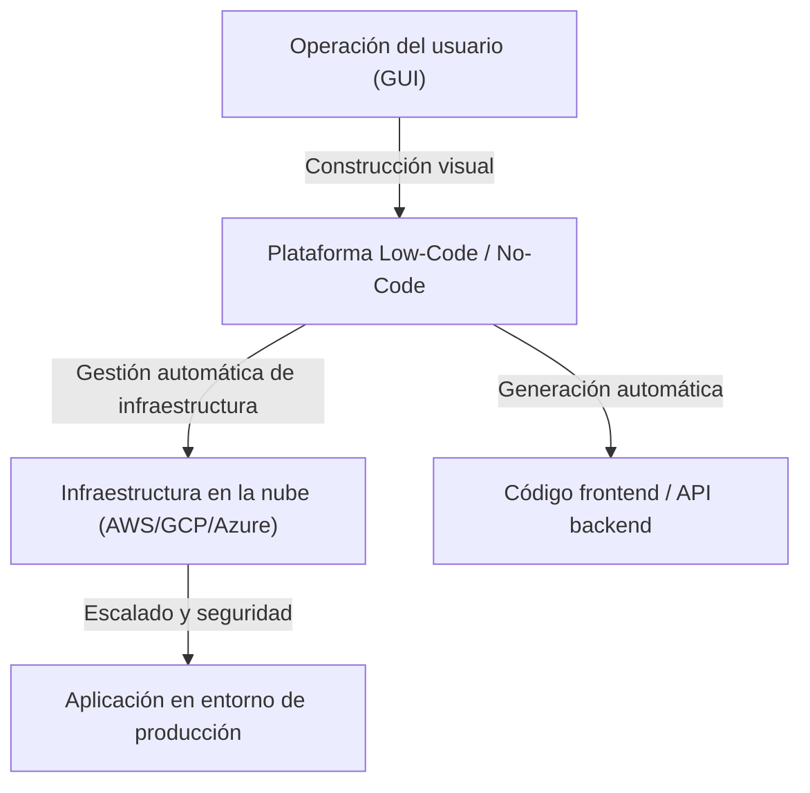
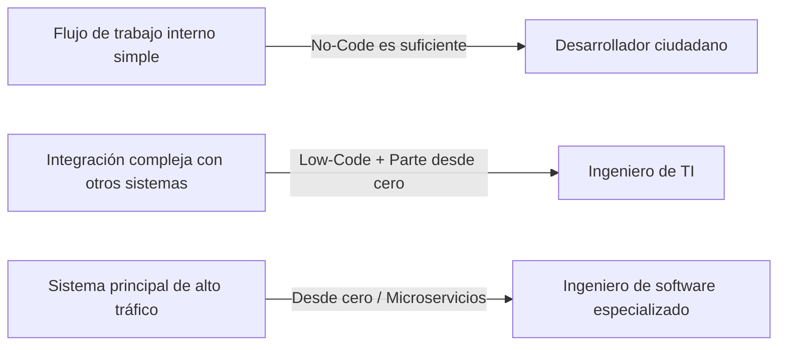

# Luces y sombras del desarrollo Low-Code / No-Code: ¿Perderán los programadores sus empleos o adquirirán una nueva herramienta?

En el mundo del desarrollo de software, palabras clave como "Low-Code" y "No-Code" han estado dominando la industria durante un buen tiempo. Interfaces intuitivas de arrastrar y soltar, construcción de bases de datos completadas con unos pocos clics, y una infraestructura en la nube lista para su despliegue inmediato. Estos avances han reducido el desarrollo de aplicaciones web o móviles, que antes tomaba semanas, a tan solo unos días o incluso horas.

Ante este rápido avance tecnológico, muchas personas se plantean una duda: "¿Finalmente la profesión de programador se volverá obsoleta?"

En este artículo, profundizaremos en esta pregunta. Explicaremos de manera exhaustiva desde los antecedentes históricos de la generación de programas a través de GUI, pasando por el auge de las plataformas basadas en SaaS modernas, hasta la transformación empresarial impulsada por los "desarrolladores ciudadanos" (citizen developers), junto con los riesgos asociados como el "Shadow IT" (TI en la sombra) y el problema de la dependencia del proveedor (vendor lock-in). Luego, exploraremos por qué el acto de "escribir código" sigue siendo esencial para la lógica de negocios compleja y la optimización del rendimiento, y cómo evolucionará el papel del desarrollador en el futuro.

---

## 1. La historia de la generación de programas por GUI: Desde las herramientas CASE hasta el SaaS moderno

Aunque términos como No-Code / Low-Code pueden parecer palabras de moda relativamente recientes, el concepto de "crear software sin escribir código" es tan antiguo como la propia historia de la ingeniería de software.

### Años 1980: El auge y el fracaso de las herramientas CASE
En la década de 1980, con la demanda de software en rápido aumento, mejorar la productividad del desarrollo se convirtió en una necesidad urgente. Así surgieron las herramientas "CASE" (Computer-Aided Software Engineering). Estas herramientas buscaban dibujar planos del sistema usando lenguajes de modelado visual como UML y, a partir de ellos, generar automáticamente el código fuente. Sin embargo, con la tecnología de la época, el código generado era de baja calidad; el mal rendimiento y la baja mantenibilidad del código generado (el problema de "ida y vuelta" en el que modificar manualmente el código desincronizaba el modelo) se hicieron evidentes, por lo que nunca llegaron a popularizarse ampliamente.

### Años 1990 - 2000: Herramientas RAD y 4GL
Posteriormente, aparecieron herramientas "RAD" (Rapid Application Development) como Visual Basic y Delphi. Estas adoptaron un enfoque innovador: colocar componentes de GUI (como botones o cuadros de texto) en un formulario y escribir fragmentos de código (scripts) para los eventos de cada componente. Esto mejoró drásticamente la velocidad de desarrollo de las aplicaciones de escritorio. Al mismo tiempo, se popularizaron los lenguajes de cuarta generación (4GL) especializados en operaciones de bases de datos, continuando los intentos de construir sistemas con una sintaxis más cercana a la humana.

### Actualidad: Plataformas SaaS nativas de la nube
Y en la actualidad. Las plataformas modernas de Low-Code / No-Code como OutSystems, Mendix, Bubble o Retool, tienen una arquitectura fundamentalmente diferente a las herramientas del pasado. Son "nativas de la nube" (cloud-native).
Las herramientas modernas absorben muchos de los "requisitos no funcionales" que antes realizaban manualmente los desarrolladores o ingenieros de infraestructura: el aprovisionamiento de infraestructuras, la escalabilidad de bases de datos o la aplicación de parches de seguridad. Los usuarios solo necesitan ensamblar componentes en el navegador, mientras que en segundo plano los frameworks modernos de frontend (como React) y la sólida infraestructura en la nube (como AWS/GCP) trabajan juntos automáticamente.

El problema de mantenibilidad que tenían las "herramientas de generación de código" del pasado se ha resuelto en parte mediante el enfoque de "no mostrar el código en sí al usuario, sino interpretarlo y ejecutarlo dinámicamente en el entorno de ejecución (runtime) de la plataforma".

---

## 2. El auge del desarrollador ciudadano y la democratización empresarial

El mayor logro de las herramientas No-Code es la "democratización del desarrollo de software". Históricamente, cuando los departamentos comerciales (ventas, recursos humanos, marketing, etc.) necesitaban una nueva herramienta interna, solían definir los requisitos, solicitarla al departamento de TI, asegurar el presupuesto y, tras varios meses en el backlog, finalmente comenzaba el desarrollo.

Sin embargo, con la popularización de las herramientas No-Code, los propios profesionales de negocios sin educación especializada en programación, los llamados "desarrolladores ciudadanos" (citizen developers), ahora pueden construir directamente aplicaciones para resolver sus propios problemas.

* **Mejora drástica de la agilidad**: Las personas que mejor conocen los problemas en el campo pueden crear y mejorar herramientas por sí mismas, acortando enormemente el ciclo de retroalimentación.
* **Liberación de recursos del departamento de TI**: El departamento de TI existente puede concentrar sus recursos en tareas más avanzadas y especializadas, como el mantenimiento de sistemas centrales o la construcción de una infraestructura de seguridad en toda la empresa.

Podría decirse que esta es la evolución legítima, en la era de la nube, del papel que desempeñaban las macros de Excel y VBA.

---

## 3. La sombra detrás de la luz: El riesgo del "Shadow IT"

Sin embargo, la democratización de la tecnología genera nuevos riesgos simultáneamente. Este es el problema del "Shadow IT" (TI en la sombra).

El Shadow IT se refiere a los sistemas de TI y servicios en la nube que son introducidos y operados por departamentos o individuos según su propio criterio, sin pasar por la gestión ni aprobación del departamento de TI. A medida que los desarrolladores ciudadanos han adquirido herramientas poderosas, este riesgo ha crecido a una escala sin precedentes.

### Falta de gobernanza y riesgos de seguridad
El hecho de que los empleados de primera línea puedan crear fácilmente bases de datos y vincularlas mediante API a SaaS externos, implica el peligro de que información confidencial y datos personales sean almacenados y transferidos eludiendo las políticas de seguridad de la empresa. Las fugas de información debido a errores en la configuración de los permisos de acceso son uno de los incidentes más frecuentes en sistemas internos construidos con herramientas No-Code.

### Lógica visual convertida en "salsa secreta" (caja negra)
Las aplicaciones No-Code construidas sin conceptos fundamentales de programación como "modularidad", "control de versiones" y "automatización de pruebas", se vuelven rápidamente complejas y eventualmente se transforman en una caja negra intocable para cualquier persona distinta de su creador.
En lugar del "código espagueti", se forma un "espagueti de nodos" (diagramas de flujo intrincados y entrelazados), que es aún más difícil de descifrar que el código de texto. Si el creador abandona la empresa y el sistema deja de funcionar repentinamente, el departamento de TI se verá obligado a vagar en un mar de lógica visual desconocida, sin documentación ni código de prueba.

---

## 4. Dependencia del proveedor (Vendor Lock-in): El precio de la libertad

Al adoptar plataformas de Low-Code / No-Code, el mayor desafío estratégico al que se enfrentan las empresas es la "dependencia del proveedor" (vendor lock-in).

Con el desarrollo tradicional basado en código, el código fuente es propiedad intelectual de la empresa, dándole la libertad de migrar de AWS a GCP, o a entornos on-premise (aunque no sea fácil, no es imposible).
Pero en muchas plataformas No-Code, la lógica de la aplicación construida y la definición de la interfaz de usuario (UI) se almacenan en un formato exclusivo (propietario) de esa plataforma.

* **Vulnerabilidad ante revisiones de precios**: Incluso si la plataforma cambia su estructura de licencias y las tarifas aumentan drásticamente, no es posible migrar fácilmente a la plataforma de otra empresa. En la práctica, habría que reconstruir la aplicación desde cero.
* **Limitaciones funcionales**: Si se requiere una función no provista por la plataforma (control de hardware específico, algoritmos de cifrado de última generación, comunicación a través de protocolos especiales, etc.), el desarrollo se topa de lleno con un muro.

Por este motivo, en la implementación de Low-Code a nivel empresarial, es extremadamente importante trazar límites arquitectónicos claros: "qué sistemas construir con Low-Code y qué sistemas desarrollar desde cero".

---

## 5. Por qué "escribir código" sigue siendo necesario

Volvamos aquí a nuestra pregunta inicial. ¿Robará el No-Code / Low-Code los puestos de trabajo a los programadores?
En conclusión, **el "trabajo que consiste solo en crear aplicaciones CRUD (Crear, Leer, Actualizar, Borrar) rutinarias" sin duda se perderá.** Sin embargo, el valor intrínseco de la ingeniería de software reside en otras áreas.

### Capacidad expresiva de la lógica de negocios compleja
La programación visual a través de GUI es adecuada para ramificaciones condicionales simples y procesos secuenciales, pero tiene límites a la hora de expresar algoritmos altamente complejos y lógicas de negocio donde se entrelazan múltiples reglas de dominio.
El código basado en texto (lenguajes de programación) es la "interfaz de mayor densidad para expresar la lógica de manera precisa y concisa" que la humanidad ha evolucionado a lo largo de décadas. Intentar representar gestiones de estado complejas o procesamientos paralelos mediante diagramas de flujo genera demasiado "ruido visual" y supera los límites cognitivos humanos.

### La barrera del rendimiento y la optimización
Para aumentar la versatilidad, las herramientas No-Code tienen muchas capas de abstracción internas. A cambio de productividad, esto genera sobrecarga (disminución del rendimiento).
En situaciones que requieren optimizaciones cercanas a los límites del hardware, como sistemas que manejan accesos simultáneos de millones de usuarios, sistemas financieros que exigen velocidades de respuesta de milisegundos, o dispositivos IoT con recursos extremadamente limitados, el código de programación que permite acceso directo a la gestión de la memoria y estructuras de datos sigue siendo indispensable.

### Respuestas a áreas límite y casos extremos (Edge Cases)
Cuando nos enfrentamos a requisitos (casos extremos) que no caben en el marco de los "componentes estándar" proporcionados por la plataforma, solo los ingenieros que pueden escribir código tienen el poder de superarlos. Incluso en herramientas Low-Code, es común que dispongan de "vías de escape" (escape hatches) donde se pueda escribir código en JavaScript, SQL, etc., para realizar personalizaciones avanzadas.

---

## 6. El futuro de los programadores: Low-Code como una nueva herramienta

Junto con la popularización de la generación de código mediante IA (como Copilot), el rol de los ingenieros de software se está desplazando sin duda de "artesanos que teclean código" a "arquitectos que resuelven problemas de negocio utilizando la tecnología".

Los ingenieros sobresalientes no ven el Low-Code / No-Code como un "enemigo" o una "amenaza". Al contrario, lo aprovechan activamente como una **"herramienta poderosa"** para reducir el tiempo invertido en escribir código repetitivo (boilerplate) y crear pantallas de gestión simples.

Empezarán a pensar en la optimización general del sistema y concentrarán su tiempo y recursos intelectuales en áreas avanzadas como las siguientes:

1. **Extensión de la plataforma**: Desarrollar (escribiendo código) componentes personalizados y módulos de integración API para entornos Low-Code, de forma que a los desarrolladores ciudadanos les resulte más fácil utilizarlos.
2. **Diseño de la arquitectura del sistema**: Diseñar cómo integrar múltiples servicios No-Code con los microservicios desarrollados por la propia empresa, garantizando la consistencia y seguridad de los datos.
3. **Creación de valor central (Core Value)**: Crear valores que jamás podrían construirse con plantillas: desarrollo de algoritmos propios que sean la fuente de competitividad de la empresa, implementación de modelos de aprendizaje automático y la búsqueda de experiencias de usuario (UX) excepcionales.

### Conclusión

La luz del desarrollo Low-Code / No-Code es una abrumadora mejora en la productividad que otorga a cualquier persona el poder de crear software. Por otro lado, en su sombra acechan profundas y oscuras trampas: la pérdida de gobernanza, la conversión de los sistemas en cajas negras, y la dependencia del proveedor (vendor lock-in).

Los programadores no perderán sus empleos. Sin embargo, los "operarios que solo crean las pantallas que se les piden" acabarán desapareciendo. La evolución de la tecnología está planteando a los ingenieros preguntas de orden superior: "¿por qué construimos este sistema?" y "¿cómo maximizamos el valor para el negocio?".

Irónicamente, a medida que se popularicen las plataformas que no requieren escribir código, el valor de la "verdadera ingeniería de software" —para construir, expandir y superar los límites de esas mismas plataformas— será más alto que nunca.
