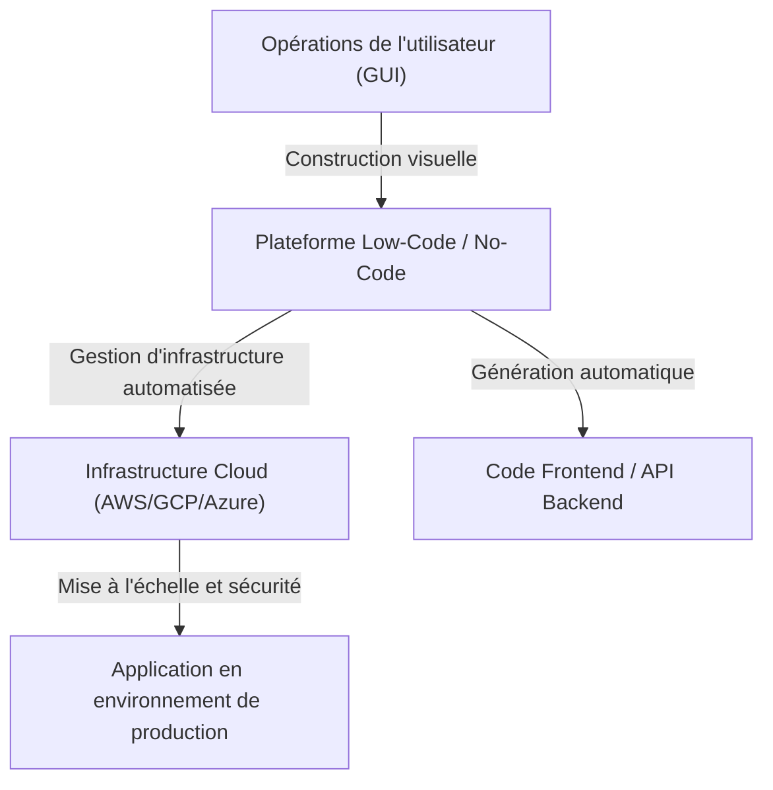
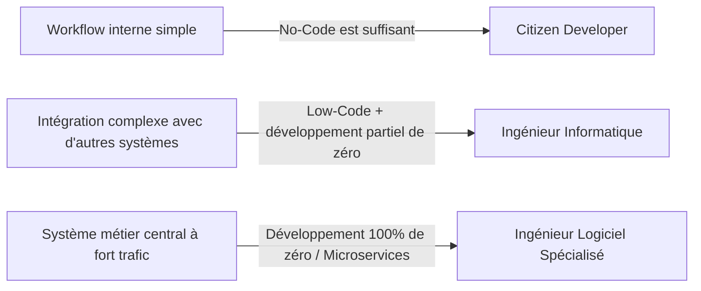

# Les lumières et les ombres du développement Low-Code / No-Code : Les programmeurs vont-ils perdre leur emploi ou acquérir une nouvelle arme ?

Dans le monde du développement logiciel, les mots-clés "Low-Code" et "No-Code" ont pris d'assaut l'industrie depuis un certain temps déjà. Des interfaces intuitives par glisser-déposer, la création de bases de données en quelques clics, et des infrastructures cloud prêtes à être déployées instantanément. Celles-ci ont réduit le développement d'applications web ou mobiles, qui prenait autrefois des semaines, à quelques jours, voire quelques heures.

Face à cette avancée technologique rapide, beaucoup se posent une question : "Au final, le métier de programmeur ne deviendra-t-il pas obsolète ?"

Cet article explore cette question en profondeur. Du contexte historique de la génération de programmes via des interfaces graphiques (GUI), à l'émergence des plateformes SaaS modernes, jusqu'aux transformations commerciales apportées par les "Citizen Developers" (développeurs citoyens), et les risques associés de "Shadow IT" (informatique de l'ombre) et de dépendance au fournisseur (vendor lock-in). Nous analyserons ensuite pourquoi l'acte d'"écrire du code" reste indispensable pour la logique métier complexe et l'optimisation des performances, et comment le rôle des développeurs évoluera à l'avenir.

---

## 1. L'histoire de la génération de programmes par GUI : Des outils CASE au SaaS moderne

Bien que les termes No-Code et Low-Code puissent sembler être de nouveaux mots à la mode, le concept de "créer des logiciels sans écrire de code" est aussi ancien que l'histoire de l'ingénierie logicielle elle-même.

### Les années 1980 : L'essor et l'échec des outils CASE
Dans les années 1980, face à l'augmentation rapide de la demande de logiciels, l'amélioration de la productivité du développement est devenue urgente. C'est alors que sont apparus les outils "CASE" (Computer-Aided Software Engineering). Les outils CASE visaient à dessiner des plans de systèmes à l'aide de langages de modélisation visuelle comme UML, puis à générer automatiquement du code source à partir de ceux-ci. Cependant, avec la technologie de l'époque, la qualité du code généré était faible, entraînant de mauvaises performances et une faible maintenabilité (le "problème de l'aller-retour" : si le code généré était modifié manuellement, il perdait sa synchronisation avec le modèle). Par conséquent, ces outils ne se sont pas largement démocratisés.

### Des années 1990 aux années 2000 : Les outils RAD et le 4GL
Ensuite, des outils "RAD" (Rapid Application Development) comme Visual Basic et Delphi sont apparus. Ils ont adopté une approche révolutionnaire consistant à placer des composants GUI (boutons, zones de texte) sur un formulaire et à écrire des codes courts (scripts) pour chaque événement. Cela a considérablement accéléré le développement d'applications de bureau. Simultanément, les 4GL (langages de quatrième génération), spécialisés dans la manipulation de bases de données, se sont répandus, poursuivant les tentatives de construire des systèmes avec une syntaxe plus proche de la langue humaine.

### L'époque moderne : Les plateformes SaaS cloud-natives
Aujourd'hui, les plateformes modernes de Low-Code / No-Code comme OutSystems, Mendix, Bubble, ou Retool ont une architecture fondamentalement différente de celle des outils passés : elles sont "cloud-natives".
Les outils modernes absorbent côté plateforme une grande partie des "exigences non fonctionnelles" – telles que le provisionnement de l'infrastructure, la mise à l'échelle des bases de données et l'application des correctifs de sécurité – des tâches autrefois effectuées manuellement par les développeurs et les ingénieurs d'infrastructure. L'utilisateur a simplement besoin d'assembler des composants dans un navigateur, et en arrière-plan, des frameworks frontend modernes comme React ou des infrastructures cloud robustes comme AWS/GCP fonctionnent ensemble automatiquement.

Les problèmes de maintenabilité dont souffraient les anciens "outils de génération de code" ont été partiellement résolus grâce à l'approche consistant à "ne pas montrer le code à l'utilisateur, mais à l'interpréter et l'exécuter dynamiquement sur le runtime de la plateforme".

---

## 2. L'essor des Citizen Developers et la démocratisation des affaires

La plus grande réussite des outils No-Code réside dans la "démocratisation du développement logiciel". Traditionnellement, lorsqu'un département métier (ventes, RH, marketing, etc.) avait besoin d'un nouvel outil interne, il devait définir les exigences pour le département informatique, obtenir un budget, et attendre des mois dans le backlog avant que le développement ne commence.

Cependant, avec la démocratisation des outils No-Code, les "Citizen Developers" – des professionnels sans éducation formelle en programmation – peuvent désormais concevoir directement des applications pour résoudre leurs propres défis.

* **Amélioration spectaculaire de l'agilité** : Ceux qui connaissent le mieux les problèmes du terrain peuvent créer et améliorer les outils eux-mêmes, réduisant considérablement la boucle de rétroaction.
* **Libération des ressources du département informatique** : Les équipes informatiques existantes peuvent concentrer leurs ressources sur des tâches plus avancées et spécialisées, comme la maintenance des systèmes centraux et la mise en place d'une infrastructure de sécurité à l'échelle de l'entreprise.

On peut dire qu'il s'agit de l'évolution légitime, à l'ère du cloud, du rôle que les macros Excel et VBA ont joué autrefois.

---

## 3. Les ombres derrière la lumière : Les risques du Shadow IT

Toutefois, la démocratisation technologique crée également de nouveaux risques, notamment le problème du "Shadow IT".

Le Shadow IT fait référence aux systèmes informatiques et aux services cloud introduits et gérés par des départements ou des individus indépendamment de l'approbation ou de la supervision du département informatique. Avec des outils puissants désormais entre les mains des Citizen Developers, ce risque a atteint une ampleur sans précédent.

### Manque de gouvernance et risques de sécurité
Le fait que des employés sur le terrain puissent facilement créer des bases de données et se connecter via des API à des SaaS externes signifie qu'il existe un risque que des informations confidentielles ou personnelles soient stockées ou transférées en violation de la politique de sécurité de l'entreprise. Les fuites d'informations dues à de mauvaises configurations des droits d'accès sont l'un des incidents les plus fréquents dans les systèmes internes utilisant des outils No-Code.

### La logique visuelle devenant une "sauce secrète"
Les applications No-Code construites sans les concepts fondamentaux de la programmation tels que la "modularisation", le "contrôle de version" ou les "tests automatisés", deviennent rapidement complexes et se transforment en boîtes noires que personne d'autre que leur créateur ne peut modifier.
Les "spaghettis de nœuds" (des organigrammes enchevêtrés de manière complexe), plutôt que les "spaghettis de code", sont encore plus difficiles à déchiffrer que du code textuel. Si le créateur quitte l'entreprise et que le système s'arrête soudainement, le département informatique se retrouve à errer dans un océan de logique visuelle inconnue, sans aucune documentation ni code de test.

---

## 4. Dépendance au fournisseur (Vendor Lock-in) : Le prix de la liberté

Lors de l'adoption d'une plateforme Low-Code / No-Code, le plus grand défi stratégique auquel les entreprises sont confrontées est le "Vendor Lock-in" (dépendance au fournisseur).

Dans le cadre d'un développement traditionnel basé sur du code, le code source constitue la propriété intellectuelle de l'entreprise, et il y a une liberté de migrer d'AWS vers GCP ou vers des serveurs sur site (bien que cela ne soit pas facile, ce n'est pas impossible).
Cependant, dans de nombreuses plateformes No-Code, la logique et les définitions de l'interface utilisateur de l'application construite sont enregistrées dans le format propriétaire de cette plateforme.

* **Vulnérabilité face aux changements de tarification** : Si la plateforme modifie sa structure de licences et que les frais d'utilisation grimpent en flèche, il n'est pas possible de migrer facilement vers la plateforme d'une autre entreprise. En pratique, il faut tout reconstruire de zéro.
* **Limitations fonctionnelles** : Si une fonctionnalité non fournie par la plateforme est requise (contrôle matériel spécifique, algorithmes de cryptage récents, communication via des protocoles spéciaux, etc.), le développement se heurte à un mur infranchissable.

Pour cette raison, lors de l'implémentation du Low-Code dans le domaine de l'entreprise, il est extrêmement important de tracer des frontières architecturales claires pour déterminer "quels systèmes seront construits en Low-Code et quels systèmes seront développés de zéro (from scratch)".

---

## 5. Pourquoi "écrire du code" reste toujours nécessaire

Revenons à la question initiale : Le No-Code / Low-Code va-t-il voler le travail des programmeurs ?
En conclusion, **"les emplois consistant uniquement à créer des applications CRUD (Créer, Lire, Mettre à jour, Supprimer) standards seront certainement éliminés".** Cependant, la valeur essentielle de l'ingénierie logicielle se situe ailleurs.

### L'expressivité des logiques métier complexes
La programmation visuelle par interface graphique est adaptée aux branchements conditionnels simples et aux processus séquentiels, mais elle atteint ses limites lorsqu'il s'agit d'exprimer une logique métier où s'entremêlent des algorithmes très complexes et des règles de domaine diverses.
Le code textuel (les langages de programmation) est "l'interface de la plus haute densité pour exprimer la logique de manière précise et concise", que l'humanité a fait évoluer sur des décennies. Essayer de représenter une gestion d'état complexe ou un traitement parallèle avec des organigrammes génère trop de bruit visuel et dépasse les limites cognitives humaines.

### Le mur de la performance et de l'optimisation
Pour augmenter leur polyvalence, les outils No-Code possèdent de nombreuses couches d'abstraction internes. Cela engendre des surcoûts (overhead et dégradation des performances) au profit de la productivité.
Dans des situations nécessitant des optimisations proches des limites matérielles – comme les systèmes traitant des accès simultanés de millions d'utilisateurs, les systèmes financiers exigeant des temps de réponse en millisecondes, ou les appareils IoT aux ressources extrêmement limitées – un code de programmation permettant un accès direct à la gestion de la mémoire ou aux structures de données reste indispensable.

### Gestion des cas limites (Edge Cases) et des frontières
Lorsqu'on est confronté à des exigences qui ne rentrent pas dans le cadre des "composants standards" fournis par la plateforme (cas limites), seuls les ingénieurs capables d'écrire du code ont le pouvoir de surmonter ces obstacles. Même avec les outils Low-Code, des "trappes de secours" (escape hatches) permettant d'écrire du code en JavaScript ou en SQL sont généralement prévues pour permettre une personnalisation avancée.

---

## 6. L'avenir du programmeur : Le Low-Code comme nouvelle arme

Couplé à la démocratisation de la génération de code par l'IA (comme Copilot), le rôle de l'ingénieur logiciel est en train de passer de "l'artisan qui tape du code" à "l'architecte qui résout des problèmes commerciaux avec la technologie".

Les excellents ingénieurs ne considèrent pas le Low-Code / No-Code comme un "ennemi" ou une "menace". Au contraire, ils l'utilisent activement comme une **"arme puissante"** pour réduire le temps consacré à l'écriture de code passe-partout (boilerplate) ennuyeux et à la création d'interfaces d'administration simples.

Ils réfléchissent à l'optimisation globale du système et concentrent leur temps et leurs ressources intellectuelles sur des domaines avancés tels que :

1. **L'extension des plateformes** : Développer (en écrivant du code) des composants personnalisés et des modules d'intégration d'API pour les environnements Low-Code, afin de les rendre plus faciles à utiliser pour les Citizen Developers.
2. **La conception de l'architecture du système** : Concevoir comment relier de multiples services No-Code avec des microservices développés en interne, tout en garantissant la cohérence et la sécurité des données.
3. **La création de valeurs fondamentales** : Créer de la valeur qui ne pourra jamais être produite avec des modèles préconçus, comme le développement d'algorithmes exclusifs, l'implémentation de modèles d'apprentissage automatique, ou la poursuite d'une expérience utilisateur exceptionnelle, qui constituent la source de l'avantage concurrentiel d'une entreprise.

### Conclusion

La lumière du développement Low-Code / No-Code réside dans l'amélioration spectaculaire de la productivité, donnant à tous le pouvoir de créer des logiciels. D'un autre côté, son ombre cache des pièges profonds et sombres, tels que la perte de gouvernance, la transformation des systèmes en boîtes noires, et la dépendance au fournisseur.

Les programmeurs ne se retrouveront pas au chômage. Cependant, les "exécutants qui se contentent de créer des écrans comme on le leur a demandé" seront éliminés. L'évolution de la technologie place les ingénieurs face à des questions d'un niveau supérieur : "Pourquoi construisons-nous ce système ?" et "Comment pouvons-nous maximiser sa valeur commerciale ?".

Ironiquement, plus les plateformes sans code se répandent, plus la valeur de la "véritable ingénierie logicielle" – qui consiste à construire, étendre, et repousser les limites de ces plateformes elles-mêmes – deviendra plus élevée que jamais.
