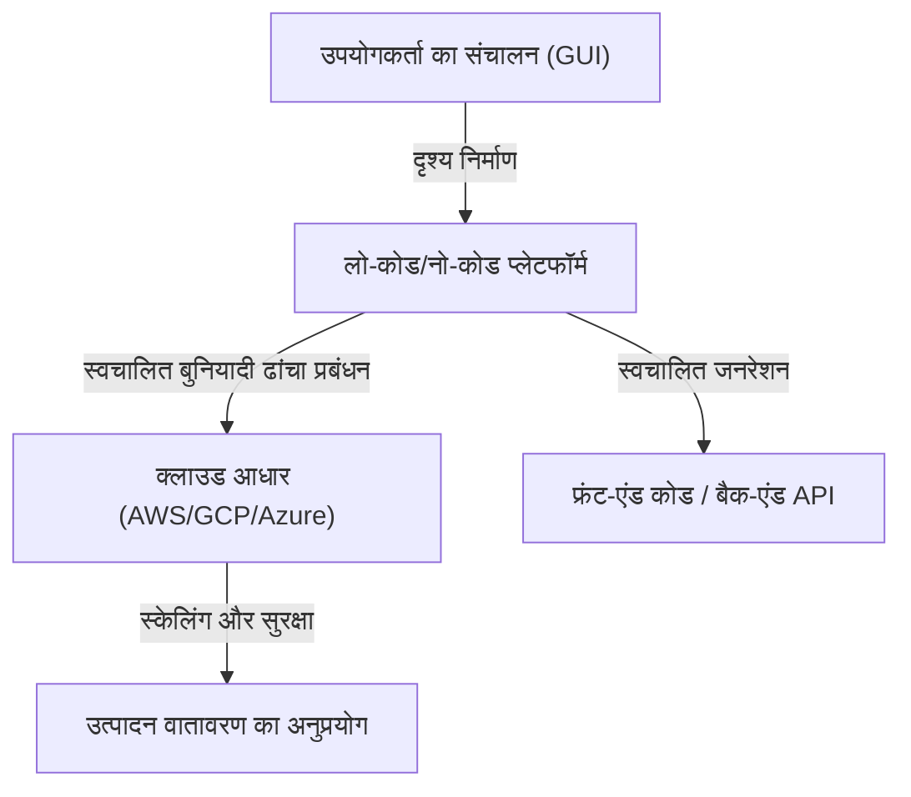
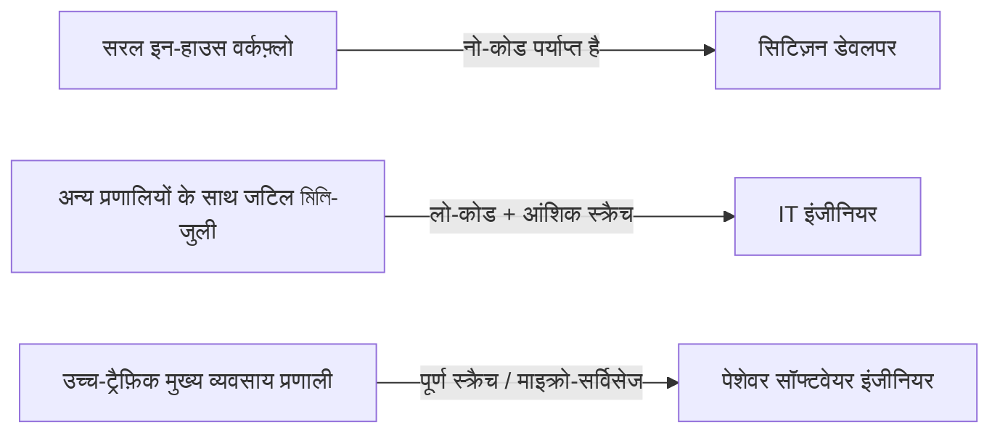

# लो-कोड / नो-कोड विकास का प्रकाश और अंधकार: क्या प्रोग्रामर अपनी नौकरी खो देंगे, या उन्हें एक नया हथियार मिलेगा?

सॉफ्टवेयर विकास की दुनिया में, "लो-कोड" (Low-Code) और "नो-कोड" (No-Code) जैसे कीवर्ड्स ने लंबे समय से उद्योग में तहलका मचा रखा है। ड्रैग-एंड-ड्रॉप (drag-and-drop) के सहज इंटरफेस, कुछ क्लिक में पूरे होने वाले डेटाबेस निर्माण, और तुरंत तैनात (deploy) किए जा सकने वाले क्लाउड बुनियादी ढांचे। इन्होंने वेब एप्लिकेशन और मोबाइल ऐप के विकास के समय को, जिसमें कभी हफ्तों लग जाते थे, घटाकर कुछ दिनों या यहां तक कि कुछ घंटों में बदल दिया है।

इस तेजी से होती तकनीकी प्रगति के सामने, कई लोगों के मन में एक सवाल है: "क्या अंततः प्रोग्रामर के पेशे की आवश्यकता समाप्त हो जाएगी?"

इस लेख में, हम इस प्रश्न पर गहराई से विचार करेंगे। GUI का उपयोग करके प्रोग्राम जनरेशन की ऐतिहासिक पृष्ठभूमि से लेकर, आधुनिक SaaS-आधारित प्लेटफ़ॉर्म के उदय, और "सिटिज़न डेवलपर" (Citizen Developer) द्वारा व्यापार में लाए गए बदलावों, साथ ही "शैडो IT" (Shadow IT) के जोखिमों और वेंडर लॉक-इन (vendor lock-in) की समस्याओं तक सब कुछ विस्तार से समझाया जाएगा। अंत में, हम यह पता लगाएंगे कि जटिल बिजनेस लॉजिक और प्रदर्शन (performance) के अनुकूलन में, "कोड लिखने" का कार्य अभी भी अनिवार्य क्यों है, और भविष्य में डेवलपर्स की भूमिका कैसे विकसित होगी।

---

## 1. GUI द्वारा प्रोग्राम जनरेशन का इतिहास: CASE टूल्स से लेकर आधुनिक SaaS तक

नो-कोड / लो-कोड शब्द भले ही अपेक्षाकृत नया बज़वर्ड हो, लेकिन "बिना कोड लिखे सॉफ्टवेयर बनाना" की अवधारणा उतनी ही पुरानी है जितना कि सॉफ्टवेयर इंजीनियरिंग का इतिहास।

### 1980 का दशक: CASE टूल्स का उदय और पतन
1980 के दशक में, जब सॉफ्टवेयर की मांग तेजी से बढ़ रही थी, तब विकास उत्पादकता में सुधार की तत्काल आवश्यकता थी। यहीं पर "CASE (Computer-Aided Software Engineering)" टूल्स सामने आए। CASE टूल्स का उद्देश्य UML जैसी विजुअल मॉडलिंग भाषाओं का उपयोग करके सिस्टम के ब्लूप्रिंट बनाना और वहां से स्वचालित रूप से स्रोत कोड (source code) उत्पन्न करना था। हालांकि, तत्कालीन तकनीक से उत्पन्न कोड की गुणवत्ता खराब थी, प्रदर्शन कमजोर था, और उत्पन्न कोड की रखरखाव क्षमता बहुत कम थी (जैसे "राउंड-ट्रिप समस्या", जहां उत्पन्न कोड को मैन्युअल रूप से संशोधित करने पर यह मॉडल के साथ सिंक नहीं हो पाता था), जिसके कारण यह व्यापक रूप से लोकप्रिय नहीं हो सका।

### 1990 से 2000 का दशक: RAD टूल्स और 4GL
इसके बाद, Visual Basic और Delphi जैसे "RAD (Rapid Application Development)" टूल्स का आगमन हुआ। इन्होंने फॉर्म पर GUI घटकों (बटन और टेक्स्ट बॉक्स) को रखने और प्रत्येक इवेंट के लिए छोटे कोड (स्क्रिप्ट) लिखने का एक क्रांतिकारी दृष्टिकोण अपनाया। इससे डेस्कटॉप एप्लिकेशन के विकास की गति में नाटकीय रूप से सुधार हुआ। उसी समय, डेटाबेस संचालन में विशेषज्ञता वाली 4GL (चौथी पीढ़ी की भाषाएं) भी लोकप्रिय हुईं, और मानवीय व्याकरण के करीब जाकर सिस्टम बनाने के प्रयास जारी रहे।

### आधुनिक युग: क्लाउड-नेटिव SaaS प्लेटफॉर्म
और अब आधुनिक युग। OutSystems, Mendix, Bubble, और Retool जैसे आधुनिक लो-कोड/नो-कोड प्लेटफॉर्म का आर्किटेक्चर पुराने टूल्स से बुनियादी रूप से अलग है। वे "क्लाउड-नेटिव" (cloud-native) हैं।
आधुनिक टूल बुनियादी ढांचे के प्रावधान (provisioning), डेटाबेस स्केलिंग, और सुरक्षा पैच लागू करने जैसी "गैर-कार्यात्मक आवश्यकताओं" (non-functional requirements) का अधिकांश हिस्सा प्लेटफॉर्म पर ही संभाल लेते हैं, जो कभी डेवलपर्स या इंफ्रास्ट्रक्चर इंजीनियरों द्वारा मैन्युअल रूप से किया जाता था। उपयोगकर्ताओं को केवल ब्राउज़र पर घटकों को संयोजित करने की आवश्यकता होती है, और पृष्ठभूमि में, React जैसे आधुनिक फ्रंट-एंड फ्रेमवर्क और AWS/GCP जैसे मजबूत क्लाउड इंफ्रास्ट्रक्चर स्वचालित रूप से एक साथ काम करते हैं।

पिछले "कोड जनरेशन टूल्स" द्वारा सामना की जाने वाली रखरखाव की समस्याओं को "प्लेटफ़ॉर्म के रनटाइम पर गतिशील रूप से व्याख्या और निष्पादन, उपयोगकर्ता से कोड को छिपाते हुए" दृष्टिकोण द्वारा आंशिक रूप से हल किया गया है।

---

## 2. सिटिज़न डेवलपर का उदय और व्यवसाय का लोकतंत्रीकरण

नो-कोड टूल्स की सबसे बड़ी उपलब्धि "सॉफ्टवेयर विकास का लोकतंत्रीकरण" (democratization of software development) है। परंपरागत रूप से, जब व्यापारिक विभागों (बिक्री, मानव संसाधन, विपणन, आदि) को नए आंतरिक उपकरणों की आवश्यकता होती थी, तो वे IT विभाग को आवश्यकताएं परिभाषित करके अनुरोध करते थे, बजट प्राप्त करते थे, और महीनों के बैकलॉग के बाद विकास शुरू होता था।

हालांकि, नो-कोड टूल्स के प्रसार के साथ, "सिटिज़न डेवलपर" कहे जाने वाले व्यावसायिक पेशेवर, जिनके पास प्रोग्रामिंग की विशेष शिक्षा नहीं है, अब अपनी समस्याओं को हल करने के लिए सीधे एप्लिकेशन बना सकते हैं।

* **फुर्ती (Agility) में नाटकीय सुधार**: जो व्यक्ति साइट की समस्याओं को सबसे अच्छी तरह जानता है, वह स्वयं उपकरण बना और सुधार सकता है, जिससे फीडबैक लूप (feedback loop) बहुत छोटा हो जाता है।
* **IT विभाग के संसाधनों की मुक्ति**: मौजूदा IT विभाग कोर सिस्टम के रखरखाव और कंपनी-व्यापी सुरक्षा बुनियादी ढांचे के निर्माण जैसे अधिक उन्नत और विशेष कार्यों पर संसाधनों को केंद्रित कर सकते हैं।

यह क्लाउड युग में एक्सेल मैक्रोज़ (Excel macros) और VBA द्वारा निभाई गई भूमिका का सही विकास कहा जा सकता है।

---

## 3. प्रकाश के पीछे का अंधकार: शैडो IT का जोखिम

हालांकि, प्रौद्योगिकी का लोकतंत्रीकरण एक साथ नए जोखिम भी पैदा करता है। यह "शैडो IT" (Shadow IT) की समस्या है।

शैडो IT उन IT प्रणालियों और क्लाउड सेवाओं को संदर्भित करता है जिन्हें IT विभाग के प्रबंधन या अनुमोदन के बिना व्यक्तिगत विभागों या व्यक्तियों द्वारा उनके स्वयं के निर्णय के आधार पर पेश और संचालित किया जाता है। सिटिज़न डेवलपर्स के हाथ में शक्तिशाली उपकरण आ जाने से, यह जोखिम अभूतपूर्व पैमाने पर बढ़ गया है।

### शासन की कमी और सुरक्षा जोखिम
तथ्य यह है कि फ्रंटलाइन कर्मचारी आसानी से डेटाबेस बना सकते हैं और बाहरी SaaS के साथ API को एकीकृत कर सकते हैं, इसका अर्थ है कि गोपनीय जानकारी और व्यक्तिगत जानकारी कंपनी की सुरक्षा नीतियों के उल्लंघन में सहेजी और स्थानांतरित की जा सकती है। एक्सेस विशेषाधिकारों की गलत सेटिंग के कारण सूचना का रिसाव (Information leakage) नो-कोड टूल्स का उपयोग करने वाले इन-हाउस सिस्टम में होने वाली लगातार घटनाओं में से एक है।

### विजुअल लॉजिक का "गुप्त नुस्खा" (Black box) बनना
"मॉड्यूलरिटी", "वर्जन कंट्रोल", और "स्वचालित परीक्षण" जैसी प्रोग्रामिंग की मूलभूत अवधारणाओं के बिना बनाए गए नो-कोड एप्लिकेशन तेजी से जटिल हो जाते हैं, और अंततः एक ब्लैक बॉक्स बन जाते हैं जिसे निर्माता के अलावा कोई नहीं छू सकता।
"नोड स्पेगेटी" (जटिल रूप से आपस में जुड़े फ़्लोचार्ट), "कोड स्पेगेटी" की तरह, टेक्स्ट कोड की तुलना में डिकोड करना अधिक कठिन है। यदि निर्माता के कंपनी छोड़ने के बाद सिस्टम अचानक बंद हो जाता है, तो IT विभाग अज्ञात विजुअल लॉजिक के समुद्र में भटकता रह जाएगा जहां न कोई दस्तावेज़ है और न ही कोई परीक्षण कोड।

---

## 4. वेंडर लॉक-इन: स्वतंत्रता की कीमत

लो-कोड/नो-कोड प्लेटफॉर्म को अपनाते समय कंपनियों के सामने सबसे बड़ी रणनीतिक चुनौती "वेंडर लॉक-इन" (vendor lock-in) है।

पारंपरिक कोड-आधारित विकास के साथ, स्रोत कोड कंपनी की बौद्धिक संपदा है, और उनके पास AWS से GCP या ऑन-प्रिमाइसेस में माइग्रेट करने की स्वतंत्रता थी (आसान नहीं है, लेकिन असंभव भी नहीं है)।
हालाँकि, कई नो-कोड प्लेटफ़ॉर्म में, बनाए गए एप्लिकेशन का लॉजिक और UI परिभाषाएँ प्लेटफ़ॉर्म के मालिकाना (proprietary) प्रारूप में सहेजी जाती हैं।

* **मूल्य संशोधन के प्रति भेद्यता**: भले ही प्लेटफ़ॉर्म प्रदाता लाइसेंसिंग संरचना को बदल दे और उपयोग शुल्क कई गुना बढ़ जाए, लेकिन आप आसानी से किसी अन्य कंपनी के प्लेटफ़ॉर्म पर माइग्रेट नहीं कर सकते हैं। प्रभावी रूप से, आपको खरोंच से फिर से निर्माण करने की आवश्यकता है।
* **कार्यात्मक सीमाएँ**: यदि आपको ऐसी कार्यक्षमता की आवश्यकता है जो प्लेटफ़ॉर्म प्रदान नहीं करता है (जैसे कि विशिष्ट हार्डवेयर नियंत्रण, नवीनतम एन्क्रिप्शन एल्गोरिदम, विशेष प्रोटोकॉल के साथ संचार, आदि), तो विकास पूरी तरह से ठप हो जाता है।

इस कारण से, एंटरप्राइज़ स्पेस में लो-कोड पेश करते समय, आर्किटेक्चरल सीमा को स्पष्ट रूप से खींचना अत्यंत महत्वपूर्ण है: "किन प्रणालियों को लो-कोड के साथ बनाया जाना चाहिए और किन प्रणालियों को खरोंच (scratch) से विकसित किया जाना चाहिए।"

---

## 5. "कोड लिखना" अभी भी क्यों आवश्यक है

अब, पहले प्रश्न पर वापस आते हैं। क्या नो-कोड/लो-कोड प्रोग्रामर्स से उनकी नौकरी छीन लेगा?
निष्कर्ष के तौर पर, **"नियमित CRUD (Create, Read, Update, Delete) एप्लिकेशन बनाने का काम" निश्चित रूप से छीन लिया जाएगा।** हालाँकि, सॉफ्टवेयर इंजीनियरिंग का आवश्यक मूल्य अन्य क्षेत्रों में मौजूद है।

### जटिल बिजनेस लॉजिक की अभिव्यक्ति
GUI का उपयोग करके विजुअल प्रोग्रामिंग सरल सशर्त ब्रांचिंग (conditional branching) और अनुक्रमिक प्रसंस्करण (sequential processing) के लिए उपयुक्त है, लेकिन इसमें अत्यधिक जटिल एल्गोरिदम या बिजनेस लॉजिक को व्यक्त करने की सीमाएँ हैं जहां कई डोमेन नियम आपस में जुड़े हुए हैं।
टेक्स्ट-आधारित कोड (प्रोग्रामिंग भाषा) "तर्क को सटीक और संक्षेप में व्यक्त करने के लिए उच्चतम-घनत्व इंटरफ़ेस" है जिसे मानवता ने दशकों में विकसित किया है। यदि आप फ़्लोचार्ट का उपयोग करके जटिल स्थिति प्रबंधन या समवर्ती प्रसंस्करण (concurrent processing) को व्यक्त करने का प्रयास करते हैं, तो विज़ुअल शोर बहुत अधिक हो जाता है और यह मानव संज्ञानात्मक सीमाओं को पार कर जाता है।

### प्रदर्शन और अनुकूलन की दीवार
नो-कोड टूल्स में बहुमुखी प्रतिभा को बढ़ाने के लिए अंदर कई अमूर्त परतें (abstraction layers) होती हैं। यह उत्पादकता की कीमत पर ओवरहेड (खराब प्रदर्शन) पैदा करता है।
उन स्थितियों में जहां हार्डवेयर की सीमा के करीब अनुकूलन की आवश्यकता होती है, जैसे कि लाखों उपयोगकर्ताओं की समवर्ती पहुंच को संभालने वाले सिस्टम, वित्तीय प्रणाली जिन्हें मिलीसेकंड प्रतिक्रिया गति की आवश्यकता होती है, या बेहद सीमित संसाधनों वाले IoT डिवाइस, प्रोग्रामिंग कोड जो सीधे मेमोरी प्रबंधन और डेटा संरचनाओं तक पहुंच सकता है, अभी भी अपरिहार्य है।

### सीमावर्ती क्षेत्रों और एज केसेस (Edge cases) से निपटना
जब ऐसी आवश्यकताओं (एज केसेस) का सामना करना पड़ता है जो प्लेटफॉर्म द्वारा तैयार किए गए "मानक घटकों" की सीमा के भीतर नहीं आती हैं, तो केवल वे इंजीनियर जो कोड लिख सकते हैं, उनमें इसे पार करने की शक्ति होती है। यहां तक कि लो-कोड टूल्स में भी, उन्नत अनुकूलन के लिए "एस्केप हैच" (escape hatches) प्रदान किए जाते हैं, जहां आप जावास्क्रिप्ट या एसक्यूएल (SQL) जैसे कोड लिख सकते हैं।

---

## 6. प्रोग्रामर का भविष्य: एक नए हथियार के रूप में लो-कोड

AI कोड जनरेशन (जैसे Copilot) के प्रसार के साथ, सॉफ्टवेयर इंजीनियर की भूमिका निश्चित रूप से "एक शिल्पकार जो कोड टाइप करता है" से "एक आर्किटेक्ट जो तकनीक के साथ व्यापार की समस्याओं को हल करता है" में बदल रही है।

उत्कृष्ट इंजीनियर लो-कोड/नो-कोड को "दुश्मन" या "खतरा" नहीं मानते हैं। बल्कि, वे सक्रिय रूप से इसका उपयोग उबाऊ बॉयलरप्लेट (boilerplate) कोड लिखने और सरल प्रबंधन स्क्रीन बनाने में लगने वाले समय को कम करने के लिए **"एक शक्तिशाली हथियार"** के रूप में करते हैं।

वे सिस्टम के समग्र अनुकूलन पर विचार करते हैं और अपना समय और बौद्धिक संसाधन निम्नलिखित उन्नत क्षेत्रों पर केंद्रित करते हैं:

1. **प्लेटफॉर्म विस्तार**: सिटिज़न डेवलपर्स के लिए उपयोग में आसान बनाने के लिए कस्टम घटकों और API एकीकरण मॉड्यूल (कोड लिखकर) का विकास करना।
2. **सिस्टम आर्किटेक्चर का डिज़ाइन**: यह डिज़ाइन करना कि डेटा स्थिरता और सुरक्षा सुनिश्चित करने के लिए कई नो-कोड सेवाओं को इन-हाउस विकसित माइक्रो-सर्विसेज (microservices) के साथ कैसे जोड़ा जाए।
3. **मुख्य मूल्य निर्माण (Core value creation)**: अद्वितीय एल्गोरिदम विकसित करना, मशीन लर्निंग मॉडल लागू करना, और भारी उपयोगकर्ता अनुभव प्राप्त करना, जो कंपनी की प्रतिस्पर्धात्मकता का स्रोत हैं, और ऐसा मूल्य बनाना जो टेम्प्लेट के साथ कभी नहीं बनाया जा सकता है।

### निष्कर्ष

लो-कोड/नो-कोड विकास का प्रकाश भारी उत्पादकता में सुधार है जो हर किसी को सॉफ्टवेयर बनाने की शक्ति देता है। दूसरी ओर, इसकी छाया में शासन का नुकसान, प्रणालियों का ब्लैक बॉक्स बनना, और वेंडर लॉक-इन जैसे गहरे और अंधेरे नुकसान छिपे हुए हैं।

प्रोग्रामर कभी अपनी नौकरी नहीं खोएंगे। हालाँकि, जो "श्रमिक केवल बताए अनुसार स्क्रीन बनाते हैं" उन्हें हटा दिया जाएगा। प्रौद्योगिकी का विकास इंजीनियरों के सामने एक उच्च-स्तरीय प्रश्न खड़ा कर रहा है: "आप वह सिस्टम क्यों बना रहे हैं?" और "आप व्यावसायिक मूल्य को अधिकतम कैसे करते हैं?"

जितना अधिक बिना कोड लिखे प्लेटफॉर्म लोकप्रिय होंगे, विडंबना यह है कि प्लेटफॉर्म को स्वयं बनाने, विस्तार करने और सीमाओं को पार करने के लिए "सच्ची सॉफ्टवेयर इंजीनियरिंग" का मूल्य पहले से कहीं अधिक बढ़ जाएगा।
