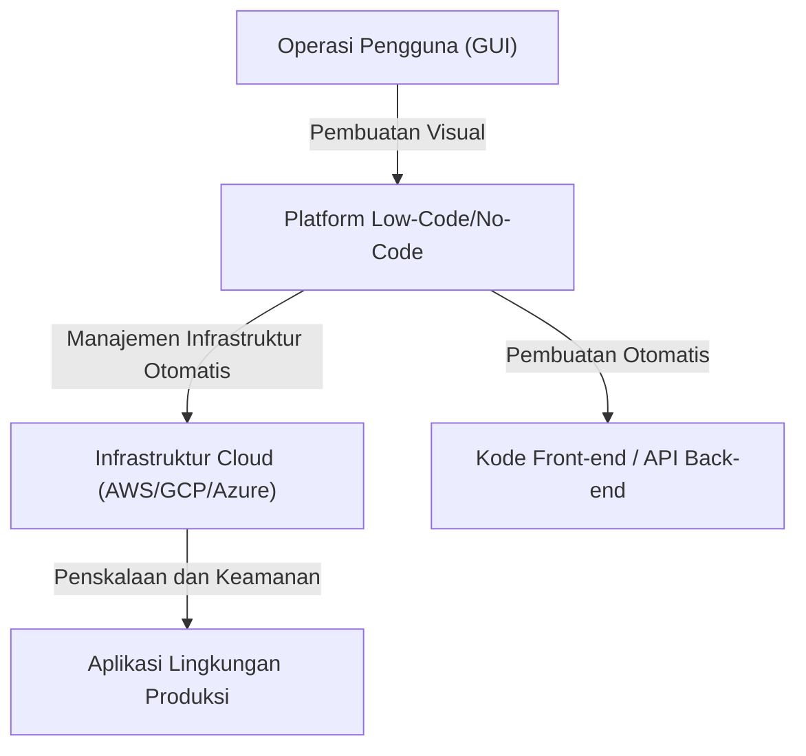
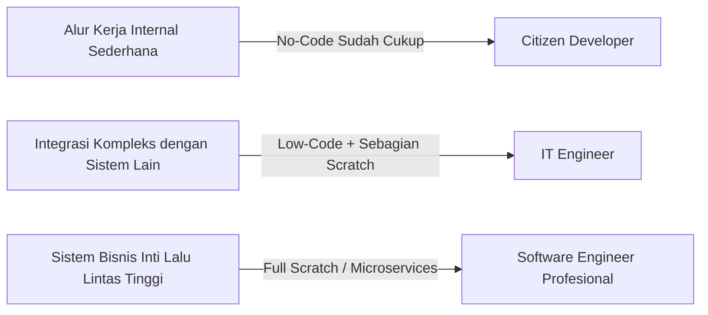

# Cahaya dan Bayangan Pengembangan Low-Code/No-Code: Apakah Programmer Akan Kehilangan Pekerjaan, atau Mendapatkan Senjata Baru?

Di dunia pengembangan perangkat lunak, kata kunci "Low-Code" dan "No-Code" telah lama mendominasi industri. Antarmuka drag-and-drop yang intuitif, pembuatan basis data yang selesai hanya dengan beberapa klik, dan infrastruktur cloud yang siap dideploy seketika. Ini semua telah mempersingkat pengembangan aplikasi web dan aplikasi seluler yang sebelumnya memakan waktu berminggu-minggu, menjadi hanya beberapa hari, atau bahkan beberapa jam saja.

Menghadapi kemajuan teknologi yang begitu pesat ini, banyak orang memiliki satu pertanyaan yang sama: "Apakah pada akhirnya profesi programmer tidak lagi dibutuhkan?"

Artikel ini akan mengupas tuntas pertanyaan tersebut. Mulai dari latar belakang historis pembuatan program berbasis GUI, kebangkitan platform berbasis SaaS modern, hingga transformasi bisnis yang dibawa oleh "Citizen Developer" (Pengembang Mandiri), serta penjelasan komprehensif mengenai risiko "Shadow IT" dan masalah vendor lock-in yang menyertainya. Kemudian, kita akan mengeksplorasi mengapa tindakan "menulis kode" masih sangat diperlukan, terutama dalam logika bisnis yang kompleks dan optimalisasi kinerja, serta bagaimana peran pengembang akan berevolusi di masa depan.

---

## 1. Sejarah Pembuatan Program Berbasis GUI: Dari Alat CASE hingga SaaS Modern

Meskipun istilah no-code/low-code mungkin merupakan buzzword yang relatif baru, konsep "membuat perangkat lunak tanpa menulis kode" sebenarnya sama tuanya dengan sejarah rekayasa perangkat lunak itu sendiri.

### Tahun 1980-an: Kebangkitan dan Kegagalan Alat CASE
Pada tahun 1980-an, seiring dengan melonjaknya permintaan terhadap perangkat lunak, peningkatan produktivitas pengembangan menjadi kebutuhan yang mendesak. Di sinilah muncul alat "CASE (Computer-Aided Software Engineering)". Alat CASE bertujuan untuk menggambar cetak biru sistem menggunakan bahasa pemodelan visual seperti UML, dan kemudian secara otomatis menghasilkan kode sumber darinya. Namun, dengan teknologi pada saat itu, kualitas kode yang dihasilkan masih rendah, kinerjanya buruk, dan pemeliharaannya sangat sulit (masalah "round-trip" di mana modifikasi manual pada kode yang dihasilkan akan menghilangkan sinkronisasi dengan model), sehingga alat ini tidak berhasil diadopsi secara luas.

### Tahun 1990-an - 2000-an: Alat RAD dan 4GL
Setelah itu, muncul alat "RAD (Rapid Application Development)" seperti Visual Basic dan Delphi. Alat-alat ini mengadopsi pendekatan inovatif dengan menempatkan komponen GUI (tombol, kotak teks) pada sebuah formulir, lalu menuliskan kode pendek (skrip) untuk setiap kejadian (event). Hal ini secara dramatis meningkatkan kecepatan pengembangan aplikasi desktop. Pada saat yang sama, bahasa generasi ke-4 (4GL) yang dikhususkan untuk operasi basis data juga mulai populer, dan upaya untuk membangun sistem dengan sintaks yang lebih mirip dengan bahasa manusia pun terus berlanjut.

### Era Modern: Platform SaaS Cloud-Native
Dan di era modern, platform low-code/no-code masa kini seperti OutSystems, Mendix, Bubble, dan Retool memiliki arsitektur yang secara fundamental berbeda dari alat-alat di masa lalu. Perbedaannya terletak pada aspek "cloud-native".
Alat modern mampu menyerap banyak "persyaratan non-fungsional" di sisi platform, seperti penyediaan infrastruktur, penskalaan basis data, dan penerapan patch keamanan—hal-hal yang dulunya dilakukan secara manual oleh pengembang atau insinyur infrastruktur. Pengguna hanya perlu menggabungkan komponen-komponen di browser, sementara di balik layar, kerangka kerja front-end modern seperti React dan infrastruktur cloud yang tangguh seperti AWS/GCP secara otomatis bekerja sama dengan mulus.

Masalah pemeliharaan yang membayangi "alat pembuat kode" di masa lalu sebagian telah teratasi melalui pendekatan yang "tidak memperlihatkan kode itu sendiri kepada pengguna, melainkan secara dinamis menafsirkan dan mengeksekusinya di runtime platform."

---

## 2. Kebangkitan Citizen Developer dan Demokratisasi Bisnis

Pencapaian terbesar dari alat no-code terletak pada "demokratisasi pengembangan perangkat lunak." Secara tradisional, ketika departemen bisnis (seperti penjualan, SDM, pemasaran) membutuhkan alat internal baru, mereka biasanya harus mendefinisikan persyaratan dan memintanya ke departemen IT, mengamankan anggaran, dan akhirnya pengembangan baru dimulai setelah menunggu backlog selama berbulan-bulan.

Namun, dengan meluasnya penggunaan alat no-code, para profesional bisnis yang tidak memiliki pendidikan formal dalam pemrograman—yang kini disebut sebagai "Citizen Developer"—dapat secara langsung membangun aplikasi untuk memecahkan masalah mereka sendiri.

* **Peningkatan Agilitas yang Dramatis**: Individu yang paling memahami masalah di lapangan dapat membuat dan menyempurnakan alat mereka sendiri, yang membuat siklus umpan balik (feedback loop) menjadi sangat singkat.
* **Pelepasan Sumber Daya Departemen IT**: Departemen IT yang ada dapat memusatkan sumber dayanya pada tugas-tugas yang lebih canggih dan terspesialisasi, seperti pemeliharaan sistem inti dan pembangunan infrastruktur keamanan berskala perusahaan.

Ini dapat dikatakan sebagai evolusi yang sah di era cloud dari peran yang sebelumnya dimainkan oleh makro Excel dan VBA.

---

## 3. Bayangan di Balik Cahaya: Risiko Shadow IT

Akan tetapi, demokratisasi teknologi juga menciptakan risiko baru pada saat yang bersamaan. Ini adalah masalah "Shadow IT".

Shadow IT merujuk pada sistem IT atau layanan cloud yang diadopsi dan dioperasikan secara mandiri oleh departemen atau individu tanpa melalui manajemen atau persetujuan departemen IT. Dengan alat canggih yang kini berada di tangan para Citizen Developer, risiko ini telah membengkak ke skala yang belum pernah terjadi sebelumnya.

### Kurangnya Tata Kelola dan Risiko Keamanan
Fakta bahwa karyawan di lapangan dapat dengan mudah membuat basis data dan berintegrasi dengan SaaS eksternal melalui API berarti bahwa ada bahaya informasi rahasia atau data pribadi disimpan dan ditransfer dengan cara yang menyimpang dari kebijakan keamanan perusahaan. Kebocoran informasi akibat kesalahan pengaturan hak akses adalah salah satu insiden yang sering terjadi pada sistem internal yang dibangun menggunakan alat no-code.

### Logika Visual yang Menjadi "Resep Rahasia"
Aplikasi no-code yang dibangun tanpa pemahaman tentang konsep-konsep dasar pemrograman seperti "modularisasi," "kontrol versi," dan "pengujian otomatis" dapat dengan cepat menjadi rumit dan pada akhirnya berubah menjadi kotak hitam (black box) yang tidak bisa diutak-atik oleh siapa pun kecuali pembuat aslinya.
Bukan sekadar "kode spageti," melainkan "node spageti" (diagram alur yang saling terkait rumit) bahkan bisa lebih sulit diuraikan daripada kode teks biasa. Ketika pembuatnya mengundurkan diri dan sistem tersebut tiba-tiba berhenti bekerja, departemen IT akan dibiarkan tersesat di lautan logika visual yang tidak dikenal, tanpa adanya dokumentasi maupun kode pengujian (test code).

---

## 4. Vendor Lock-in: Harga Sebuah Kebebasan

Tantangan strategis terbesar yang dihadapi perusahaan saat mengadopsi platform low-code/no-code adalah "vendor lock-in."

Dalam pengembangan berbasis kode tradisional, kode sumber merupakan kekayaan intelektual perusahaan, dan terdapat kebebasan untuk bermigrasi dari AWS ke GCP, atau ke lingkungan on-premise (meskipun tidak mudah, tetapi bukan tidak mungkin).
Namun, pada banyak platform no-code, logika dan definisi UI dari aplikasi yang dibangun disimpan dalam format eksklusif (proprietary) milik platform tersebut.

* **Kerentanan terhadap Perubahan Harga**: Jika pihak platform mengubah struktur lisensi dan melipatgandakan biaya penggunaan, perusahaan tidak dapat dengan mudah bermigrasi ke platform lain. Pada praktiknya, aplikasi harus dibangun ulang dari nol.
* **Keterbatasan Fungsional**: Jika fitur yang tidak disediakan oleh platform (seperti kontrol perangkat keras tertentu, algoritma enkripsi terbaru, atau komunikasi melalui protokol khusus) tiba-tiba dibutuhkan, pengembangan akan menemui jalan buntu.

Karena alasan ini, ketika memperkenalkan low-code di tingkat enterprise, sangat penting untuk menarik garis arsitektur yang jelas mengenai "sistem mana yang akan dibangun dengan low-code, dan sistem mana yang akan dikembangkan dari awal (scratch)."

---

## 5. Mengapa "Menulis Kode" Masih Tetap Diperlukan

Mari kembali ke pertanyaan awal. Apakah no-code/low-code akan merampas pekerjaan programmer?
Kesimpulannya, **"Pekerjaan yang hanya sekadar membuat aplikasi CRUD (Create, Read, Update, Delete) rutin memang pasti akan tergantikan."** Namun, nilai esensial dari rekayasa perangkat lunak terletak pada bagian selain itu.

### Kemampuan Ekspresi untuk Logika Bisnis yang Kompleks
Pemrograman visual menggunakan GUI memang cocok untuk percabangan kondisional sederhana atau pemrosesan berurutan, tetapi memiliki keterbatasan dalam mengekspresikan algoritma yang sangat kompleks atau logika bisnis yang melibatkan berbagai aturan domain yang saling terkait.
Kode berbasis teks (bahasa pemrograman) adalah "antarmuka dengan kepadatan tertinggi untuk mengekspresikan logika secara akurat dan ringkas," yang telah berevolusi selama beberapa dekade. Upaya untuk mengekspresikan manajemen state yang kompleks atau pemrosesan paralel dalam bentuk diagram alur akan menghasilkan terlalu banyak gangguan (noise) visual dan melampaui batas kognitif manusia.

### Hambatan Kinerja dan Optimalisasi
Untuk meningkatkan fleksibilitas, alat no-code memiliki banyak lapisan abstraksi di dalamnya. Ini menghasilkan overhead (penurunan kinerja) yang menjadi bayaran atas produktivitas.
Dalam skenario yang membutuhkan optimalisasi hingga mendekati batas perangkat keras—seperti sistem yang menangani akses simultan dari jutaan pengguna, sistem keuangan yang membutuhkan kecepatan respons dalam hitungan milidetik, atau perangkat IoT dengan sumber daya yang sangat terbatas—kode pemrograman yang dapat mengakses langsung manajemen memori dan struktur data masih mutlak diperlukan.

### Menangani Area Batas dan Kasus Tepi (Edge Cases)
Ketika menghadapi persyaratan (edge cases) yang tidak sesuai dengan batas "komponen standar" yang disediakan oleh platform, hanya engineer yang bisa menulis kode yang memiliki kemampuan untuk menembus batasan tersebut. Bahkan pada alat low-code, biasanya disediakan "jalur keluar (escape hatch)" di mana kode seperti JavaScript atau SQL dapat ditulis untuk melakukan kustomisasi tingkat lanjut.

---

## 6. Masa Depan Programmer: Low-Code sebagai Senjata Baru

Seiring dengan meluasnya penggunaan pembuatan kode oleh AI (seperti Copilot), peran software engineer dipastikan bergeser dari sekadar "tukang yang mengetik kode" menjadi "arsitek yang memecahkan masalah bisnis dengan teknologi."

Engineer yang hebat tidak memandang low-code/no-code sebagai "musuh" atau "ancaman." Sebaliknya, mereka akan secara proaktif menggunakannya sebagai **"senjata yang ampuh"** untuk mengurangi waktu yang dihabiskan dalam menulis boilerplate (kode rutin) yang membosankan atau membuat layar manajemen yang sederhana.

Mereka akan mempertimbangkan optimalisasi keseluruhan sistem dan memusatkan waktu serta sumber daya intelektual mereka pada area tingkat lanjut seperti:

1. **Ekstensi Platform**: (Dengan menulis kode) mengembangkan komponen kustom atau modul integrasi API untuk lingkungan low-code agar mudah digunakan oleh para Citizen Developer.
2. **Desain Arsitektur Sistem**: Merancang bagaimana mengintegrasikan berbagai layanan no-code dengan microservices yang dikembangkan secara in-house, serta memastikan integritas dan keamanan data.
3. **Penciptaan Nilai Inti (Core Value)**: Menciptakan nilai-nilai yang tidak akan pernah bisa dibuat melalui template, seperti pengembangan algoritma eksklusif yang menjadi sumber daya saing perusahaan, implementasi model machine learning, atau pencarian pengalaman pengguna (UX) yang luar biasa.

### Kesimpulan

Cahaya dari pengembangan low-code/no-code adalah peningkatan produktivitas yang luar biasa dalam memberikan kekuatan penciptaan perangkat lunak kepada semua orang. Di sisi lain, dalam bayang-bayangnya, tersembunyi jebakan gelap seperti hilangnya tata kelola, sistem yang menjadi kotak hitam, dan vendor lock-in.

Programmer tidak akan kehilangan pekerjaannya. Namun, "pekerja yang hanya bisa membuat layar sesuai instruksi" akan tersingkir. Evolusi teknologi telah menantang para engineer dengan pertanyaan pada tingkat yang lebih tinggi: "Mengapa sistem ini dibuat?" dan "Bagaimana cara memaksimalkan nilai bisnisnya?"

Ironisnya, semakin luas penyebaran platform yang tidak memerlukan penulisan kode, semakin tinggi pula nilai dari "rekayasa perangkat lunak sejati" untuk membangun, memperluas, dan melampaui batas dari platform itu sendiri.
