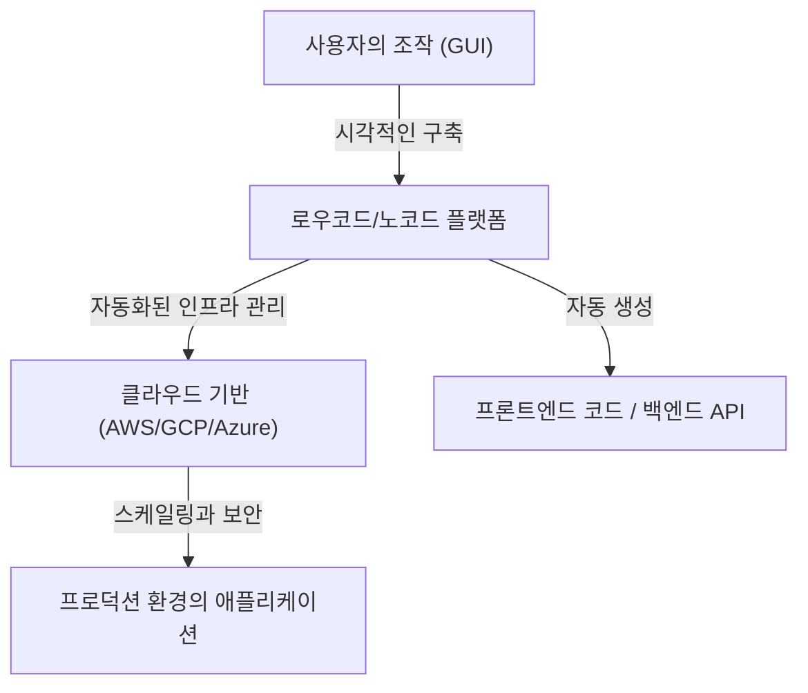
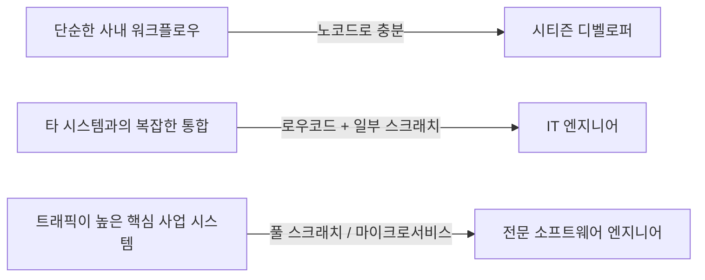

# 로우코드/노코드 개발의 빛과 그림자: 프로그래머는 실직할 것인가, 아니면 새로운 무기를 얻을 것인가

소프트웨어 개발 세계에서 '로우코드(Low-Code)' 및 '노코드(No-Code)'라는 키워드가 업계를 휩쓴 지 오래입니다. 드래그 앤 드롭의 직관적인 인터페이스, 몇 번의 클릭으로 완료되는 데이터베이스 구축, 그리고 즉각적으로 배포 가능한 클라우드 기반. 이것들은 과거 몇 주가 걸리던 웹 애플리케이션이나 모바일 앱 개발을 불과 며칠, 혹은 몇 시간으로 단축시켰습니다.

이 급속한 기술 발전을 앞두고 많은 사람이 하나의 의문을 품고 있습니다. "결과적으로 프로그래머라는 직업은 불필요해지는 것이 아닐까?"

본 기사에서는 이 의문을 깊이 파헤쳐 봅니다. GUI를 이용한 프로그램 생성의 역사적 배경부터 현대 SaaS 기반 플랫폼의 대두, 그리고 '시티즌 디벨로퍼(시민 개발자)'가 가져오는 비즈니스로의 변혁과 그에 수반하는 '섀도우 IT(Shadow IT)'의 위험성 및 벤더 종속(Vendor Lock-in) 문제까지 망라하여 해설합니다. 나아가 복잡한 비즈니스 로직이나 성능 최적화에 있어서 왜 여전히 '코드를 작성한다'는 행위가 필수적인지, 개발자의 역할이 앞으로 어떻게 진화해 나갈 것인지 살펴봅니다.

---

## 1. GUI를 통한 프로그램 생성의 역사: CASE 도구에서 현대 SaaS까지

노코드/로우코드라는 단어 자체는 비교적 새로운 버즈워드일지 모르지만, "코드를 작성하지 않고 소프트웨어를 만든다"는 개념은 소프트웨어 엔지니어링의 역사만큼이나 오래되었습니다.

### 1980년대: CASE 도구의 대두와 좌절
1980년대, 소프트웨어 수요가 급증하는 가운데 개발 생산성 향상이 시급한 과제가 되었습니다. 그래서 등장한 것이 'CASE(Computer-Aided Software Engineering)' 도구입니다. CASE 도구는 UML 등 시각적인 모델링 언어를 사용하여 시스템 설계도를 그리고, 거기서 자동으로 소스 코드를 생성하는 것을 목표로 했습니다. 그러나 당시 기술로는 생성되는 코드의 품질이 낮았고, 성능 저하나 생성된 코드의 유지보수성 문제(한 번 생성한 코드를 수동으로 수정하면 모델과 동기화가 끊어지는 '라운드 트립 문제')가 드러나면서 널리 보급되지는 못했습니다.

### 1990년대~2000년대: RAD 도구와 4GL
그 후 Visual Basic이나 Delphi 등의 'RAD(Rapid Application Development)' 도구가 등장합니다. 이들은 GUI 부품(버튼이나 텍스트 박스)을 폼 위에 배치하고, 각각의 이벤트에 대해 짧은 코드(스크립트)를 작성한다는 획기적인 접근 방식을 채택했습니다. 이를 통해 데스크톱 애플리케이션의 개발 속도는 극적으로 향상되었습니다. 동시에 데이터베이스 조작에 특화된 4GL(제4세대 언어)도 보급되어 더 인간에 가까운 문법으로 시스템을 구축하려는 시도가 계속되었습니다.

### 현대: 클라우드 네이티브한 SaaS 플랫폼
그리고 현대. OutSystems, Mendix, Bubble, Retool과 같은 현대의 로우코드/노코드 플랫폼은 과거의 도구들과는 근본적으로 다른 아키텍처를 가지고 있습니다. 바로 '클라우드 네이티브'라는 점입니다.
현대의 도구는 인프라 프로비저닝, 데이터베이스 스케일링, 보안 패치 적용 등 과거 개발자나 인프라 엔지니어가 수작업으로 하던 '비기능 요구사항'의 대부분을 플랫폼 측에서 흡수해 줍니다. 사용자는 브라우저 상에서 컴포넌트를 조합하기만 하면 되고, 그 이면에서는 React 등 모던 프론트엔드 프레임워크나 AWS/GCP 등 견고한 클라우드 인프라스트럭처가 자동으로 연동되어 작동합니다.

과거의 '코드 생성 도구'가 안고 있던 유지보수성 문제는 "코드 자체를 사용자에게 보여주지 않고, 플랫폼의 런타임 상에서 동적으로 해석하고 실행한다"는 접근 방식을 통해 부분적으로 해결되었습니다.

---

## 2. 시티즌 디벨로퍼의 대두와 비즈니스의 민주화

노코드 도구의 가장 위대한 공적은 "소프트웨어 개발의 민주화"에 있습니다. 종래에는 현업 부서(영업, 인사, 마케팅 등)가 새로운 사내 도구를 필요로 할 경우, IT 부서에 요구사항을 정의하여 의뢰하고, 예산을 확보하며, 몇 달 분량의 백로그를 거친 후에야 비로소 개발이 시작되는 것이 일반적이었습니다.

그러나 노코드 도구의 보급으로 '시티즌 디벨로퍼(시민 개발자)'라 불리는, 프로그래밍 전문 교육을 받지 않은 비즈니스 담당자 스스로가 자신들의 과제를 해결하기 위한 애플리케이션을 직접 구축할 수 있게 되었습니다.

* **애질리티(Agility)의 극적인 향상**: 현장의 과제를 가장 잘 아는 사람이 스스로 도구를 만들고 개선할 수 있기 때문에 피드백 루프가 극도로 짧아집니다.
* **IT 부서의 리소스 해방**: 기존 IT 부서는 기간 시스템의 유지보수나 전사적인 보안 기반 구축 등 보다 고도화되고 전문적인 작업에 리소스를 집중할 수 있습니다.

이것은 Excel의 매크로나 VBA가 수행해 온 역할의, 클라우드 시대에 걸맞은 정당한 진화 형태라고 할 수 있을 것입니다.

---

## 3. 빛 이면의 그림자: 섀도우 IT의 위험성

그러나 기술의 민주화는 동시에 새로운 위험성을 낳습니다. 그것이 바로 '섀도우 IT(Shadow IT)'의 문제입니다.

섀도우 IT란 IT 부서의 관리나 승인을 거치지 않고, 각 부서나 개인이 독자적인 판단으로 도입 및 운영하고 있는 IT 시스템이나 클라우드 서비스를 말합니다. 시티즌 디벨로퍼가 강력한 도구를 손에 쥐게 되면서 이 위험성은 과거 유례없는 규모로 부풀어 오르고 있습니다.

### 거버넌스의 결여와 보안 위험성
현장의 직원이 간단하게 데이터베이스를 만들고 외부 SaaS와 API를 연동할 수 있다는 것은, 기밀 정보나 개인 정보가 회사의 보안 정책을 벗어난 형태로 저장 및 전송될 위험성을 의미합니다. 접근 권한 설정 실수로 인한 정보 유출은 노코드 도구를 사용한 사내 시스템에서 빈번하게 일어나는 인시던트 중 하나입니다.

### '비법 소스'화 되는 비주얼 로직
프로그래밍의 기초인 '모듈화', '버전 관리', '테스트 자동화' 등의 개념 없이 구축된 노코드 애플리케이션은 급속도로 복잡해지며, 이내 작성자 외에는 손을 댈 수 없는 블랙박스로 전락합니다.
'스파게티 코드'가 아닌 '스파게티 노드(복잡하게 얽힌 순서도)'는 텍스트 코드 이상으로 해독이 어렵습니다. 작성자가 퇴사한 후 해당 시스템이 갑자기 멈춘다면, IT 부서는 문서도 테스트 코드도 존재하지 않는 미지의 비주얼 로직의 바다를 헤매게 될 것입니다.

---

## 4. 벤더 종속: 자유의 대가

로우코드/노코드 플랫폼을 도입할 때 기업이 직면하는 가장 큰 전략적 과제는 '벤더 종속(Vendor Lock-in)'입니다.

기존 코드 기반 개발이라면 소스 코드는 기업의 지적 재산이며, AWS에서 GCP로, 혹은 온프레미스로 전환할 수 있는 자유가 있었습니다(쉽지는 않을지언정 불가능한 것은 아닙니다).
그러나 많은 노코드 플랫폼에서 구축한 애플리케이션의 로직이나 UI 정의는 해당 플랫폼의 독자적인 형식(프로프라이어터리)으로 저장됩니다.

* **가격 변경에 대한 취약성**: 플랫폼 측에서 라이선스 체계를 변경하여 이용 요금이 수배로 뛰어오른다 해도, 타사 플랫폼으로 쉽게 이전할 수 없습니다. 사실상 백지에서 다시 만들어야 합니다.
* **기능적 제약**: 플랫폼이 제공하지 않는 기능(특정 하드웨어 제어, 최신 암호화 알고리즘, 특수한 프로토콜 통신 등)이 필요해질 경우 개발은 완전히 장벽에 부딪히게 됩니다.

이러한 이유로 엔터프라이즈 영역에서 로우코드를 도입할 때에는 "어떤 시스템을 로우코드로 만들고, 어떤 시스템을 스크래치로 개발할 것인가"라는 아키텍처의 경계선을 명확히 긋는 것이 극히 중요해집니다.

---

## 5. 왜 '코드를 작성하는' 일은 여전히 필요한가

여기서 처음의 질문으로 돌아가 봅시다. 노코드/로우코드는 프로그래머의 일자리를 빼앗을까요?
결론부터 말하자면, **"정형적인 CRUD(생성, 읽기, 갱신, 삭제) 애플리케이션을 만드는 일"은 틀림없이 빼앗길 것입니다.** 그러나 소프트웨어 엔지니어링의 본질적인 가치는 그 외의 부분에 존재합니다.

### 복잡한 비즈니스 로직의 표현력
GUI를 통한 비주얼 프로그래밍은 단순한 조건 분기나 순차적인 처리에는 적합하지만, 고도로 복잡한 알고리즘이나 다방면에 걸친 도메인 규칙이 얽혀있는 비즈니스 로직을 표현하는 데에는 한계가 있습니다.
텍스트 기반의 코드(프로그래밍 언어)는 인류가 수십 년에 걸쳐 진화시켜 온 "논리를 정확하고 간결하게 표현하기 위한 최고 밀도의 인터페이스"입니다. 복잡한 상태 관리나 병행 처리를 순서도로 표현하려고 하면 시각적인 노이즈가 너무 커져 인간의 인지 한계를 넘어서게 됩니다.

### 성능과 최적화의 장벽
노코드 도구는 범용성을 높이기 위해 내부에 많은 추상화 계층을 가지고 있습니다. 이는 생산성과 맞바꿔 오버헤드(성능 저하)를 발생시킵니다.
수백만 명의 사용자로부터 오는 동시 접속을 처리하는 시스템, 밀리초 단위의 응답 속도가 요구되는 금융 시스템, 리소스가 극단적으로 제한된 IoT 기기 등 하드웨어의 한계에 가까운 영역에서 최적화가 필요한 상황에서는 여전히 메모리 관리나 자료 구조에 직접 접근할 수 있는 프로그래밍 코드가 필수적입니다.

### 경계 영역과 엣지 케이스에 대한 대응
플랫폼이 준비한 '표준 컴포넌트'의 틀 안에 들어맞지 않는 요구사항(엣지 케이스)에 직면했을 때, 이를 돌파할 힘을 가진 것은 코드를 작성할 수 있는 엔지니어뿐입니다. 로우코드 도구라 할지라도 고도화된 커스터마이징을 하기 위해 JavaScript나 SQL 등의 코드를 작성할 수 있는 '이스케이프 해치(Escape Hatch)'가 준비되어 있는 것이 일반적입니다.

---

## 6. 프로그래머의 미래: 새로운 무기로서의 로우코드

AI를 통한 코드 생성(Copilot 등)의 보급과 맞물려, 소프트웨어 엔지니어의 역할은 '코드를 타이핑하는 장인'에서 '비즈니스 과제를 기술로 해결하는 아키텍트'로 확실하게 이동하고 있습니다.

우수한 엔지니어는 로우코드/노코드를 '적'이나 '위협'으로 간주하지 않습니다. 오히려 지루한 보일러플레이트(상용구 코드) 작성이나 단순한 관리자 화면 생성에 드는 시간을 줄이기 위한 **'강력한 무기'**로 적극 활용합니다.

이들은 시스템의 전체 최적화를 생각하며, 다음과 같은 고도화된 영역에 자신의 시간과 지적 리소스를 집중하게 됩니다.

1. **플랫폼의 확장**: 시티즌 디벨로퍼가 사용하기 쉽도록, 로우코드 환경을 위한 맞춤형 컴포넌트나 API 연동 모듈을 (코드를 작성하여) 개발합니다.
2. **시스템 아키텍처 설계**: 여러 노코드 서비스와 자체 개발한 마이크로서비스를 어떻게 연동시키고, 데이터 무결성과 보안을 담보할 것인지를 설계합니다.
3. **핵심 가치(Core Value) 창출**: 기업의 경쟁력 원천이 되는 독자적인 알고리즘 개발, 머신러닝 모델 구현, 압도적인 사용자 경험 추구 등 템플릿으로는 결코 만들 수 없는 가치를 창출해 냅니다.

### 결론

로우코드/노코드 개발의 빛은 모든 사람에게 소프트웨어를 창조할 힘을 부여한다는 압도적인 생산성 향상입니다. 한편 그 그림자에는 거버넌스의 상실, 시스템의 블랙박스화, 그리고 벤더 종속이라는 깊고 어두운 함정이 도사리고 있습니다.

프로그래머가 실직하는 일은 없을 것입니다. 그러나 "지시받은 대로 화면만 만드는 단순 작업자"는 도태될 것입니다. 기술의 진화는 엔지니어에게 "왜 그 시스템을 만드는가", "어떻게 비즈니스 가치를 극대화할 것인가"라는 더 차원 높은 질문을 던지고 있습니다.

코드를 작성하지 않는 플랫폼이 보급되면 될수록, 그 플랫폼 자체를 구축하고 확장하며 한계를 돌파하기 위한 '진정한 소프트웨어 엔지니어링'의 가치는 역설적이게도 그 어느 때보다 높아질 것입니다.
