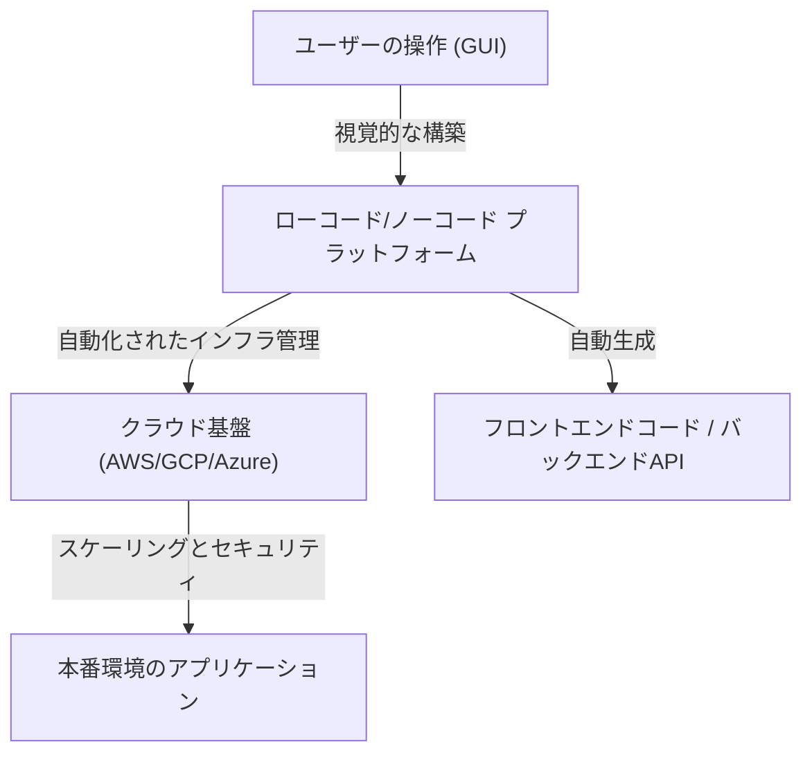
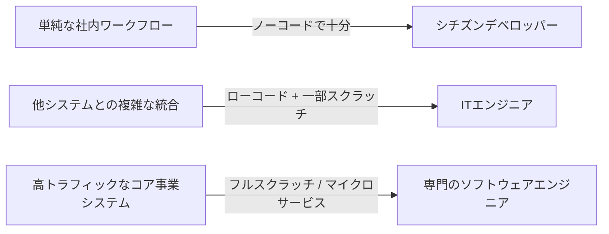

# ローコード／ノーコード開発の光と影：プログラマーは失業するのか、それとも新しい武器を手にするのか

ソフトウェア開発の世界において、「ローコード（Low-Code）」および「ノーコード（No-Code）」というキーワードが業界を席巻して久しいです。ドラッグ＆ドロップの直感的なインターフェース、数回のクリックで完了するデータベースの構築、そして即座にデプロイ可能なクラウド基盤。これらは、かつて何週間もかかっていたWebアプリケーションやモバイルアプリの開発を、わずか数日、あるいは数時間へと短縮しました。

この急速な技術の進歩を前にして、多くの人が一つの疑問を抱いています。「最終的に、プログラマーという職業は不要になるのではないか？」

本記事では、この疑問に深く切り込みます。GUIを用いたプログラム生成の歴史的背景から、現代のSaaSベースのプラットフォームの台頭、そして「シチズンデベロッパー（市民開発者）」がもたらすビジネスへの変革と、それに伴う「シャドーIT」のリスクやベンダーロックインの問題までを網羅的に解説します。そして、複雑なビジネスロジックやパフォーマンスの最適化において、なぜ依然として「コードを書く」という行為が不可欠なのか、開発者の役割が今後どのように進化していくのかを探ります。

---

## 1. GUIによるプログラム生成の歴史：CASEツールから現代のSaaSまで

ノーコード／ローコードという言葉自体は比較的新しいバズワードかもしれませんが、「コードを書かずにソフトウェアを作る」という概念は、ソフトウェアエンジニアリングの歴史と同じくらい古いものです。

### 1980年代：CASEツールの台頭と挫折
1980年代、ソフトウェアの需要が急増する中で、開発の生産性向上が急務となりました。そこで登場したのが「CASE（Computer-Aided Software Engineering）」ツールです。CASEツールは、UMLなどの視覚的なモデリング言語を用いてシステムの設計図を描き、そこから自動的にソースコードを生成することを目指しました。しかし、当時の技術では生成されるコードの品質が低く、パフォーマンスの悪さや、生成されたコードの保守性の低さ（一度生成したコードを手動で修正すると、モデルとの同期が取れなくなる「ラウンドトリップ問題」）が露呈し、広く普及するには至りませんでした。

### 1990年代〜2000年代：RADツールと4GL
その後、Visual BasicやDelphiなどの「RAD（Rapid Application Development）」ツールが登場します。これらは、GUI部品（ボタンやテキストボックス）をフォーム上に配置し、それぞれのイベントに対して短いコード（スクリプト）を記述するという画期的なアプローチを採用しました。これにより、デスクトップアプリケーションの開発速度は劇的に向上しました。同時に、データベース操作に特化した4GL（第4世代言語）も普及し、より人間に近い文法でシステムを構築しようとする試みが続きました。

### 現代：クラウドネイティブなSaaSプラットフォーム
そして現代。OutSystems、Mendix、Bubble、Retoolといった現代のローコード／ノーコードプラットフォームは、過去のツールとは根本的に異なるアーキテクチャを持っています。それは「クラウドネイティブ」であるという点です。
現代のツールは、インフラのプロビジョニング、データベースのスケーリング、セキュリティパッチの適用といった、かつて開発者やインフラエンジニアが手作業で行っていた「非機能要件」の多くをプラットフォーム側で吸収してくれます。ユーザーはブラウザ上でコンポーネントを組み合わせるだけでよく、背後ではReactなどのモダンなフロントエンドフレームワークや、AWS/GCPなどの堅牢なクラウドインフラストラクチャが自動的に連携して動作します。

過去の「コード生成ツール」が抱えていた保守性の問題は、「コード自体をユーザーに見せず、プラットフォームのランタイム上で動的に解釈・実行する」というアプローチによって部分的に解決されています。

---

## 2. シチズンデベロッパーの台頭とビジネスの民主化

ノーコードツールの最も偉大な功績は、「ソフトウェア開発の民主化」にあります。従来、業務部門（営業、人事、マーケティングなど）が新しい社内ツールを必要とした場合、IT部門に要件を定義して依頼し、予算を獲得し、数ヶ月のバックログの後にようやく開発が始まるというのが一般的でした。

しかし、ノーコードツールの普及により、「シチズンデベロッパー（市民開発者）」と呼ばれる、プログラミングの専門教育を受けていないビジネスパーソン自身が、自分たちの課題を解決するためのアプリケーションを直接構築できるようになりました。

* **アジリティの劇的な向上**: 現場の課題を最もよく知る人間が、自らツールを作成・改善できるため、フィードバックループが極めて短くなります。
* **IT部門のリソース解放**: 既存のIT部門は、基幹システムの保守や全社的なセキュリティ基盤の構築など、より高度で専門的なタスクにリソースを集中させることができます。

これは、ExcelのマクロやVBAが果たしてきた役割の、クラウド時代における正当な進化形と言えるでしょう。

---

## 3. 光の裏にある影：シャドーITのリスク

しかし、技術の民主化は同時に新たなリスクを生み出します。それが「シャドーIT」の問題です。

シャドーITとは、IT部門の管理や承認を通さずに、各部門や個人が独自の判断で導入・運用しているITシステムやクラウドサービスのことです。シチズンデベロッパーが強力なツールを手にしたことで、このリスクはかつてない規模に膨れ上がっています。

### ガバナンスの欠如とセキュリティリスク
現場の従業員が簡単にデータベースを作成し、外部のSaaSとAPI連携できるということは、機密情報や個人情報が、会社のセキュリティポリシーを逸脱した形で保存・転送される危険性を意味します。アクセス権限の設定ミスによる情報漏洩は、ノーコードツールを用いた社内システムで頻繁に起きるインシデントの一つです。

### 「秘伝のタレ」化するビジュアルロジック
プログラミングの基礎である「モジュール化」「バージョン管理」「テストの自動化」といった概念を持たないまま構築されたノーコードアプリケーションは、急速に複雑化し、やがて作成者以外には手出しができないブラックボックスと化します。
「コードスパゲティ」ならぬ「ノードスパゲティ（複雑に絡み合ったフローチャート）」は、テキストのコード以上に解読が困難です。作成者が退職した後、そのシステムが突然停止した場合、IT部門はドキュメントもテストコードも存在しない、未知のビジュアルロジックの海を彷徨うことになります。

---

## 4. ベンダーロックイン：自由の代償

ローコード／ノーコードプラットフォームを採用する際、企業が直面する最大の戦略的課題は「ベンダーロックイン」です。

従来のコードベースの開発であれば、ソースコードは企業の知的財産であり、AWSからGCPへ、あるいはオンプレミスへと移行する自由がありました（容易ではないにせよ、不可能ではありません）。
しかし、多くのノーコードプラットフォームにおいて、構築したアプリケーションのロジックやUI定義は、そのプラットフォームの独自形式（プロプライエタリ）で保存されています。

* **価格改定への脆弱性**: プラットフォーム側がライセンス体系を変更し、利用料金が数倍に跳ね上がった場合でも、他社プラットフォームへ簡単に移行することはできません。事実上、ゼロから作り直す必要があります。
* **機能的制約**: プラットフォームが提供していない機能（特定のハードウェア制御、最新の暗号化アルゴリズム、特殊なプロトコルでの通信など）が必要になった場合、開発は完全に壁にぶつかります。

このため、エンタープライズ領域でのローコード導入においては、「どのシステムをローコードで作り、どのシステムをスクラッチで開発するか」というアーキテクチャの境界線を明確に引くことが極めて重要になります。

---

## 5. なぜ「コードを書く」ことは依然として必要なのか

ここで最初の問いに戻りましょう。ノーコード／ローコードはプログラマーから仕事を奪うのでしょうか？
結論から言えば、**「定型的なCRUD（作成・読み取り・更新・削除）アプリケーションを作るだけの仕事」は間違いなく奪われます。** しかし、ソフトウェアエンジニアリングの本質的な価値は、それ以外の部分に存在しています。

### 複雑なビジネスロジックの表現力
GUIによるビジュアルプログラミングは、単純な条件分岐や順次処理には適していますが、高度に複雑なアルゴリズムや、多岐にわたるドメインルールが絡み合うビジネスロジックの表現には限界があります。
テキストベースのコード（プログラミング言語）は、人類が数十年かけて進化させてきた「論理を正確かつ簡潔に表現するための最高密度のインターフェース」です。複雑な状態管理や並行処理をフローチャートで表現しようとすると、視覚的なノイズが大きくなりすぎ、人間の認知限界を超えてしまいます。

### パフォーマンスと最適化の壁
ノーコードツールは汎用性を高めるために、内部に多くの抽象化レイヤーを持っています。これは生産性と引き換えに、オーバーヘッド（パフォーマンスの低下）を生み出します。
数百万人のユーザーからの同時アクセスを処理するシステム、ミリ秒単位の応答速度が求められる金融システム、リソースが極端に制限されたIoTデバイスなど、ハードウェアの限界に近い領域での最適化が必要な場面では、依然としてメモリ管理やデータ構造に直接アクセスできるプログラミングコードが不可欠です。

### 境界領域とエッジケースへの対応
プラットフォームが用意した「標準コンポーネント」の枠内に収まらない要件（エッジケース）に直面したとき、それを突破する力を持つのはコードを書けるエンジニアだけです。ローコードツールであっても、高度なカスタマイズを行うためにはJavaScriptやSQLなどのコードを記述できる「エスケープハッチ」が用意されているのが一般的です。

---

## 6. プログラマーの未来：新しい武器としてのローコード

AIによるコード生成（Copilotなど）の普及とも相まって、ソフトウェアエンジニアの役割は「コードをタイピングする職人」から、「ビジネス課題をテクノロジーで解決するアーキテクト」へと確実にシフトしています。

優秀なエンジニアは、ローコード／ノーコードを「敵」や「脅威」とは見なしません。むしろ、退屈なボイラープレート（定型コード）の記述や、単純な管理画面の作成にかかる時間を削減するための**「強力な武器」**として積極的に活用します。

彼らは、システムの全体最適を考え、以下のような高度な領域に自らの時間と知的リソースを集中させるようになります。

1. **プラットフォームの拡張**: シチズンデベロッパーが使いやすいように、ローコード環境向けのカスタムコンポーネントやAPI連携モジュールを（コードを書いて）開発する。
2. **システムアーキテクチャの設計**: 複数のノーコードサービスと、自社開発のマイクロサービスをどのように連携させ、データの整合性とセキュリティを担保するかを設計する。
3. **コアバリューの創造**: 企業の競争力の源泉となる、独自のアルゴリズム開発、機械学習モデルの実装、圧倒的なユーザー体験の追求など、テンプレートでは決して作れない価値を生み出す。

### 結論

ローコード／ノーコード開発の光は、あらゆる人々にソフトウェア創造の力を与えるという圧倒的な生産性の向上です。一方でその影には、ガバナンスの喪失、システムのブラックボックス化、そしてベンダーロックインという深く暗い落とし穴が潜んでいます。

プログラマーが失業することはありません。しかし、「言われた通りの画面を作るだけの作業者」は淘汰されるでしょう。テクノロジーの進化は、エンジニアに対して「なぜそのシステムを作るのか」「どのようにビジネス価値を最大化するのか」という、より高次元の問いを突きつけているのです。

コードを書かないプラットフォームが普及すればするほど、そのプラットフォーム自体を構築し、拡張し、限界を突破するための「真のソフトウェアエンジニアリング」の価値は、皮肉なことにこれまで以上に高まっていくのです。
