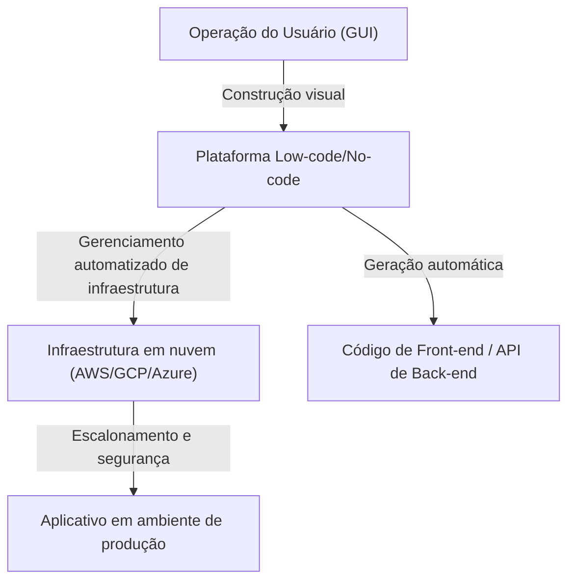
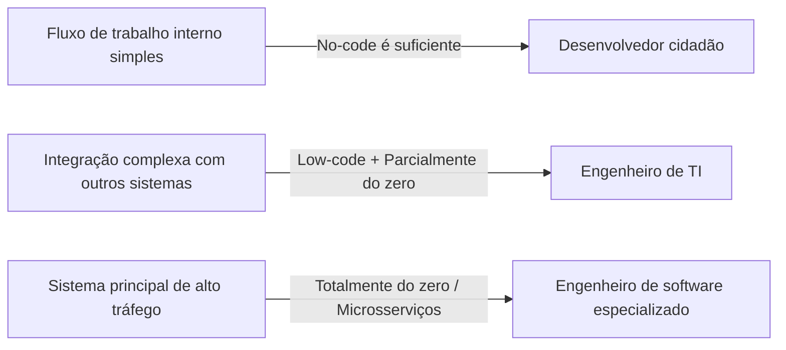

# Luzes e Sombras do Desenvolvimento Low-Code e No-Code: Os programadores ficarão desempregados ou ganharão uma nova arma?

No mundo do desenvolvimento de software, palavras-chave como "Low-Code" (baixo código) e "No-Code" (sem código) já dominam a indústria há algum tempo. Interfaces intuitivas de arrastar e soltar, construção de banco de dados concluída em poucos cliques e infraestruturas em nuvem prontas para implantação imediata. Isso reduziu o desenvolvimento de aplicativos da web e aplicativos móveis, que antes levava semanas, para apenas alguns dias ou até horas.

Diante desse rápido avanço tecnológico, muitos levantam uma questão: "No fim das contas, a profissão de programador se tornará obsoleta?"

Neste artigo, aprofundaremos essa questão. Explicaremos de forma abrangente desde o contexto histórico da geração de programas usando GUI até a ascensão das modernas plataformas baseadas em SaaS e a transformação nos negócios trazida pelos "desenvolvedores cidadãos" (citizen developers), juntamente com os riscos associados à "Shadow IT" e aos problemas de dependência de fornecedor (vendor lock-in). Em seguida, exploraremos por que o ato de "escrever código" ainda é essencial quando se trata de lógicas de negócios complexas e otimização de desempenho, e como o papel do desenvolvedor evoluirá no futuro.

---

## 1. A História da Geração de Programas via GUI: Das Ferramentas CASE aos Modernos SaaS

Embora os termos no-code e low-code possam ser palavras da moda relativamente novas, o conceito de "criar software sem escrever código" é tão antigo quanto a história da própria engenharia de software.

### Anos 1980: A Ascensão e Queda das Ferramentas CASE
Na década de 1980, com a demanda por software crescendo rapidamente, o aumento da produtividade no desenvolvimento tornou-se uma necessidade urgente. Foi assim que surgiram as ferramentas "CASE" (Computer-Aided Software Engineering). As ferramentas CASE tentavam desenhar os projetos de sistemas usando linguagens de modelagem visual como UML e gerar automaticamente o código-fonte a partir disso. No entanto, com a tecnologia da época, a qualidade do código gerado era baixa, e os problemas de desempenho, juntamente com a dificuldade de manutenção do código gerado (o problema de "ida e volta", em que a edição manual do código gerado quebrava a sincronização com o modelo), tornaram-se aparentes, impedindo sua adoção generalizada.

### Anos 1990 aos anos 2000: Ferramentas RAD e 4GL
Posteriormente, surgiram ferramentas "RAD" (Rapid Application Development) como Visual Basic e Delphi. Elas adotaram uma abordagem inovadora de colocar componentes de GUI (botões, caixas de texto) em um formulário e escrever um pequeno trecho de código (script) para cada evento correspondente. Como resultado, a velocidade de desenvolvimento de aplicativos de desktop melhorou drasticamente. Simultaneamente, as 4GLs (Linguagens de Quarta Geração), especializadas em operações de banco de dados, tornaram-se populares, dando continuidade à tentativa de construir sistemas usando uma sintaxe mais próxima da linguagem humana.

### Atualidade: Plataformas SaaS Nativas da Nuvem
E, na atualidade, plataformas modernas de low-code/no-code, como OutSystems, Mendix, Bubble e Retool, possuem uma arquitetura fundamentalmente diferente das ferramentas do passado. Trata-se do fato de serem "nativas da nuvem".
As ferramentas modernas absorvem, do lado da plataforma, muitos dos "requisitos não funcionais" que os desenvolvedores e engenheiros de infraestrutura costumavam tratar manualmente, como o provisionamento de infraestrutura, o dimensionamento de banco de dados e a aplicação de patches de segurança. Os usuários só precisam montar componentes em seus navegadores; nos bastidores, os frameworks de front-end modernos, como o React, e infraestruturas robustas de nuvem, como AWS/GCP, operam automaticamente em conjunto.

Os problemas de manutenção enfrentados pelas antigas "ferramentas de geração de código" foram parcialmente resolvidos por meio de uma abordagem que "não expõe o próprio código ao usuário, mas o interpreta e executa dinamicamente no tempo de execução (runtime) da plataforma".

---

## 2. A Ascensão do Desenvolvedor Cidadão e a Democratização dos Negócios

A maior conquista das ferramentas no-code está na "democratização do desenvolvimento de software". Tradicionalmente, quando os departamentos de negócios (Vendas, RH, Marketing, etc.) precisavam de novas ferramentas internas, eles geralmente tinham que definir os requisitos e enviá-los ao departamento de TI, garantir um orçamento e, depois de meses na fila de espera, o desenvolvimento finalmente começava.

Entretanto, devido à proliferação de ferramentas no-code, profissionais de negócios que não têm treinamento formal em programação, agora chamados de "desenvolvedores cidadãos" (citizen developers), podem construir diretamente aplicativos para resolver seus próprios problemas.

* **Melhoria dramática na agilidade**: As pessoas que melhor conhecem os problemas em campo podem criar e melhorar as ferramentas sozinhas, tornando os ciclos de feedback extremamente curtos.
* **Liberação de recursos do departamento de TI**: O departamento de TI existente pode concentrar seus recursos em tarefas mais avançadas e especializadas, como a manutenção dos sistemas principais e a construção da base de segurança de toda a empresa.

Isso pode ser considerado a legítima evolução do papel que as macros do Excel e o VBA desempenharam, na era da nuvem.

---

## 3. As Sombras por Trás da Luz: Os Riscos da Shadow IT

No entanto, a democratização da tecnologia também cria novos riscos. Este é o problema da "Shadow IT" (TI Invisível).

A Shadow IT refere-se aos sistemas de TI e serviços em nuvem que cada departamento ou indivíduo adota e opera a seu próprio critério, sem a gestão ou aprovação do departamento de TI. Como os desenvolvedores cidadãos agora possuem ferramentas poderosas, esse risco cresceu a uma escala sem precedentes.

### Falta de Governança e Riscos de Segurança
O fato de os funcionários de linha de frente poderem criar facilmente bancos de dados e integrar-se a SaaS externos via API significa o risco de informações confidenciais ou dados pessoais serem armazenados e transmitidos de forma a violar a política de segurança da empresa. O vazamento de informações devido à má configuração dos direitos de acesso é um dos incidentes mais frequentes em sistemas internos construídos com ferramentas no-code.

### Lógica Visual que se Transforma em um "Segredo Comercial Obscuro"
Aplicativos no-code construídos sem noções fundamentais de programação, como "modularização", "controle de versão" e "automação de testes", rapidamente se tornam complexos, transformando-se em caixas-pretas nas quais ninguém além do criador pode intervir.
O "Spaghetti de Nós" (Node Spaghetti, fluxogramas intrincados) é ainda mais difícil de decifrar do que o código espaguete textual. Se o criador se demitir e o sistema parar repentinamente de funcionar, o departamento de TI ficará à deriva em um mar de lógicas visuais desconhecidas, sem documentação ou código de teste.

---

## 4. Vendor Lock-in (Dependência de Fornecedor): O Preço da Liberdade

Ao adotar uma plataforma low-code/no-code, o maior desafio estratégico que uma empresa enfrenta é o "vendor lock-in".

Com o desenvolvimento tradicional baseado em código-fonte, esse código é propriedade intelectual da empresa, concedendo a liberdade de migrar da AWS para a GCP ou para as instalações físicas (on-premise) – mesmo que não seja fácil, não é impossível.
No entanto, em muitas plataformas no-code, as definições de lógica e UI do aplicativo construído são salvas no formato proprietário da plataforma.

* **Vulnerabilidade a mudanças de preços**: Mesmo que a plataforma altere sua estrutura de licenciamento e os custos de uso se multipliquem em várias vezes, não é possível migrar facilmente para a plataforma de outra empresa. Na prática, é necessário recriar tudo do zero.
* **Restrições Funcionais**: Se houver necessidade de recursos não oferecidos pela plataforma (como controle de hardware específico, os algoritmos de criptografia mais recentes ou comunicação por protocolos especiais), o desenvolvimento fica completamente paralisado.

Por esse motivo, ao introduzir low-code no espaço corporativo (enterprise), é de extrema importância desenhar limites arquitetônicos claros entre "quais sistemas serão criados usando low-code e quais serão construídos do zero (scratch)".

---

## 5. Por Que "Escrever Código" Ainda é Necessário

Voltemos à primeira pergunta. O no-code/low-code vai tirar o emprego dos programadores?
Concluindo, **o trabalho de "apenas criar aplicações CRUD (Criar, Ler, Atualizar, Excluir) rotineiras" certamente será eliminado.** No entanto, o valor intrínseco da engenharia de software reside nos demais aspectos.

### O Poder de Expressar a Lógica de Negócios Complexa
A programação visual por meio de GUI é adequada para ramificações condicionais simples e processos sequenciais, mas tem limites quando se trata de expressar a lógica de negócios, onde algoritmos altamente complexos e regras de domínio extensas se entrelaçam.
O código baseado em texto (linguagens de programação) é a "interface de maior densidade para expressar a lógica de forma precisa e concisa", que a humanidade tem evoluído ao longo das décadas. A tentativa de expressar o gerenciamento complexo de estados ou processos simultâneos por meio de fluxogramas gera tanto ruído visual que supera os limites cognitivos humanos.

### A Barreira do Desempenho e da Otimização
Para melhorar a versatilidade, as ferramentas no-code têm muitas camadas internas de abstração. Isso gera sobrecarga (diminuição de desempenho) em troca de produtividade.
Em áreas onde a otimização próxima dos limites do hardware é necessária — como sistemas que lidam com milhões de acessos simultâneos de usuários, sistemas financeiros que exigem tempo de resposta na ordem de milissegundos, ou dispositivos IoT com recursos extremamente restritos —, o código de programação com acesso direto ao gerenciamento de memória e estruturas de dados continua sendo indispensável.

### Lidando com Áreas de Fronteira e Casos Extremos (Edge Cases)
Ao se depararem com requisitos que ultrapassam os limites dos "componentes padrão" fornecidos por uma plataforma (casos extremos), são os engenheiros capazes de escrever código que têm o poder de superar essas barreiras. Mesmo com ferramentas de low-code, é comum fornecerem uma "escotilha de escape" onde códigos como JavaScript ou SQL podem ser escritos a fim de realizar personalizações avançadas.

---

## 6. O Futuro dos Programadores: O Low-Code Como Uma Nova Arma

Juntamente com a popularização da geração de código por IA (como o Copilot), o papel do engenheiro de software está, sem dúvida, mudando de um "artesão que digita código" para um "arquiteto que resolve problemas de negócios através da tecnologia".

Engenheiros talentosos não veem o low-code/no-code como "inimigo" ou "ameaça". Em vez disso, usam essas plataformas de forma proativa como **"uma arma poderosa"** para reduzir o tempo gasto escrevendo códigos padronizados e entediantes ou criando telas administrativas simples.

Eles passam a considerar a otimização geral do sistema e a concentrar seu tempo e recursos intelectuais em áreas avançadas como as seguintes:

1. **Expansão da plataforma**: Desenvolver (escrevendo código) componentes personalizados e módulos de integração de API em ambientes low-code para que sejam fáceis de usar pelos desenvolvedores cidadãos.
2. **Desenho da arquitetura do sistema**: Projetar como integrar vários serviços no-code com microsserviços desenvolvidos internamente, além de assegurar a consistência dos dados e a segurança.
3. **Criação de Valor Central (Core Value)**: Gerar valores que nunca poderiam ser construídos com modelos prontos (templates), os quais são a fonte da competitividade da empresa, como o desenvolvimento de algoritmos exclusivos, a implementação de modelos de aprendizado de máquina e a busca por uma experiência de usuário excepcional.

### Conclusão

A luz do desenvolvimento low-code/no-code é a esmagadora melhoria da produtividade, capacitando todas as pessoas com o poder de criar software. Por outro lado, em suas sombras, escondem-se armadilhas profundas e escuras: a perda da governança, sistemas transformados em caixas-pretas e o vendor lock-in.

Os programadores não perderão seus empregos. Entretanto, "o operário que apenas cria telas de acordo com o que lhe dizem" será eliminado. A evolução tecnológica impõe uma questão de mais alto nível aos engenheiros: "por que estamos criando este sistema?" e "como maximizamos o valor do negócio?".

Ironicamente, à medida que plataformas que não exigem a escrita de código se tornam mais populares, o valor da "verdadeira engenharia de software" – construir, expandir e superar os limites da própria plataforma – se tornará maior do que nunca.
