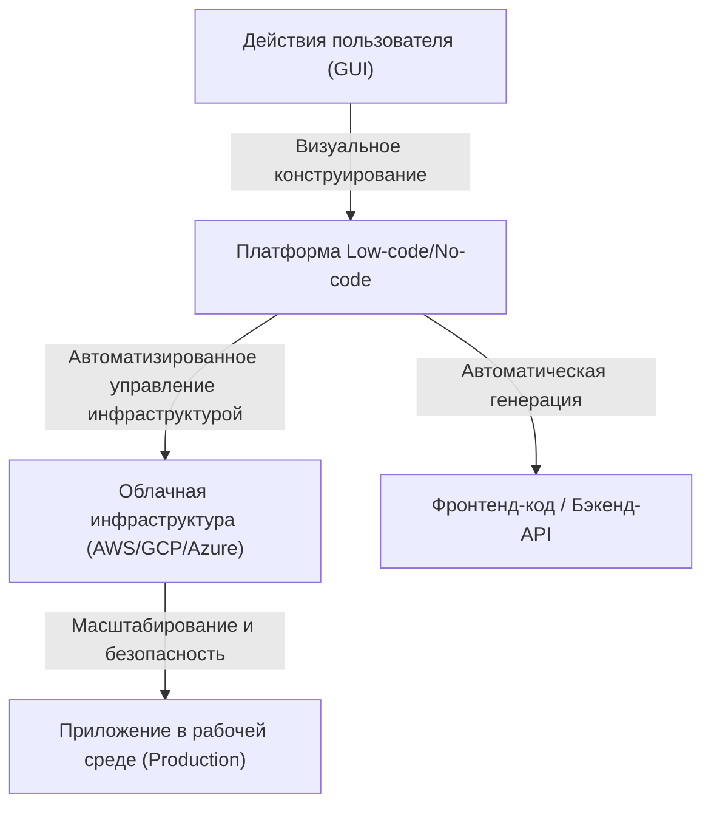
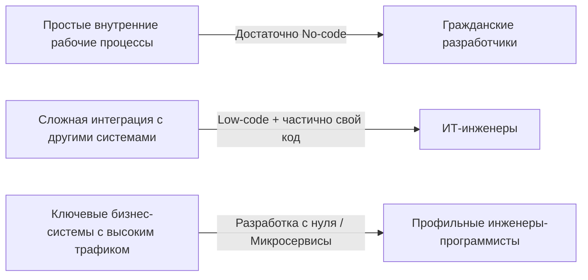

# Свет и тень low-code/no-code разработки: Останутся ли программисты без работы, или же получат новое оружие?

В мире разработки программного обеспечения ключевые слова «low-code» и «no-code» уже давно захватили индустрию. Интуитивно понятные интерфейсы с функцией drag-and-drop, создание баз данных в несколько кликов и мгновенно развертываемая облачная инфраструктура. Всё это сократило время разработки веб- и мобильных приложений с нескольких недель, как это было раньше, до считанных дней или даже часов.

Столкнувшись со столь стремительным техническим прогрессом, многие задаются одним вопросом: «Не станет ли в конечном итоге профессия программиста ненужной?»

В этой статье мы глубоко погрузимся в этот вопрос. Мы всесторонне рассмотрим исторический контекст создания программ с использованием графического интерфейса пользователя (GUI), развитие современных SaaS-платформ, трансформацию бизнеса, вызванную «гражданскими разработчиками» (citizen developers), а также связанные с этим риски «теневых ИТ» (shadow IT) и проблему привязки к поставщику (vendor lock-in). Кроме того, мы выясним, почему написание кода по-прежнему необходимо для сложной бизнес-логики и оптимизации производительности, и как в будущем изменится роль разработчика.

---

## 1. История генерации программ с помощью GUI: от CASE-средств до современных SaaS

Сами термины no-code и low-code могут показаться относительно новыми модными словечками, но концепция «создания программного обеспечения без написания кода» так же стара, как и история программной инженерии.

### 1980-е годы: взлет и падение CASE-средств
В 1980-х годах спрос на программное обеспечение резко возрос, и повышение производительности разработки стало насущной необходимостью. Так появились CASE-средства (Computer-Aided Software Engineering). Они были нацелены на автоматическую генерацию исходного кода из системных схем, созданных с использованием визуальных языков моделирования, таких как UML. Однако из-за технологических ограничений того времени качество генерируемого кода было низким, он имел плохую производительность и низкую ремонтопригодность (так называемая «проблема кругового пути», когда ручное редактирование сгенерированного кода приводило к потере синхронизации с моделью), что помешало их широкому распространению.

### 1990-е – 2000-е годы: RAD-средства и 4GL
Затем появились средства RAD (Rapid Application Development), такие как Visual Basic и Delphi. Они использовали революционный подход: размещение элементов GUI (кнопок, текстовых полей) на формах и написание короткого кода (скриптов) для каждого события. Это кардинально увеличило скорость разработки десктопных приложений. В то же время получили распространение языки 4GL (языки четвертого поколения), специализирующиеся на операциях с базами данных, и попытки создавать системы с использованием синтаксиса, более близкого к человеческому языку, продолжились.

### Современность: облачные SaaS-платформы (Cloud-Native)
И вот мы в современности. Современные low-code/no-code платформы, такие как OutSystems, Mendix, Bubble и Retool, имеют принципиально иную архитектуру по сравнению со своими предшественниками. Они являются «облачными» (cloud-native).
Современные инструменты берут на себя большую часть «нефункциональных требований», таких как выделение инфраструктуры, масштабирование баз данных и применение патчей безопасности — задач, которые раньше выполнялись разработчиками и инфраструктурными инженерами вручную. Пользователю достаточно собрать компоненты воедино в браузере, а в фоновом режиме современные фронтенд-фреймворки, такие как React, и надежная облачная инфраструктура, такая как AWS/GCP, будут автоматически работать вместе.

Проблемы с ремонтопригодностью, с которыми сталкивались «инструменты генерации кода» в прошлом, частично решены за счет подхода, при котором «сам код не показывается пользователю, а динамически интерпретируется и выполняется в среде выполнения (runtime) платформы».

---

## 2. Появление гражданских разработчиков и демократизация бизнеса

Величайшим достижением no-code инструментов является «демократизация разработки программного обеспечения». Традиционно, если бизнес-подразделению (продажи, HR, маркетинг и т. д.) требовался новый внутренний инструмент, оно формулировало требования и обращалось в ИТ-отдел, добивалось бюджета, и только после нескольких месяцев ожидания в бэклоге начиналась разработка.

Однако с распространением no-code инструментов бизнес-профессионалы, не имеющие специального образования в области программирования и получившие название «гражданские разработчики», теперь могут самостоятельно создавать приложения для решения собственных задач.

* **Кардинальное повышение гибкости (Agility)**: Люди, которые лучше всех знают проблемы на местах, могут сами создавать и улучшать инструменты, что делает цикл обратной связи чрезвычайно коротким.
* **Освобождение ресурсов ИТ-отдела**: Существующие ИТ-отделы могут сосредоточить свои ресурсы на более продвинутых и специализированных задачах, таких как обслуживание критически важных бизнес-систем и создание масштабах всей компании инфраструктуры безопасности.

Это можно назвать закономерной эволюцией в эпоху облачных технологий той роли, которую играли макросы Excel и VBA.

---

## 3. Тень за светом: риски теневых ИТ (Shadow IT)

Но в то же время демократизация технологий порождает новые риски. Это проблема «теневых ИТ».

Теневые ИТ — это ИТ-системы и облачные сервисы, которые внедряются и эксплуатируются отделами или отдельными лицами по их собственному усмотрению, без контроля и одобрения со стороны ИТ-отдела. Поскольку гражданские разработчики получили в свои руки мощные инструменты, этот риск вырос до невиданных ранее масштабов.

### Отсутствие контроля (Governance) и риски безопасности
Тот факт, что рядовые сотрудники могут легко создавать базы данных и интегрировать их с внешними SaaS-решениями через API, означает риск того, что конфиденциальная и личная информация будет храниться и передаваться в нарушение политики безопасности компании. Утечки данных из-за неправильно настроенных прав доступа являются одним из самых частых инцидентов во внутренних системах, построенных с использованием no-code инструментов.

### Визуальная логика превращается в «секретный соус»
No-code приложения, созданные без понимания таких основ программирования, как модульность, контроль версий и автоматизированное тестирование, быстро становятся сложными и в конечном итоге превращаются в черные ящики, которые не может поддерживать никто, кроме их создателя.
«Узловые спагетти» (сложно переплетенные блок-схемы) вместо привычного «спагетти-кода» расшифровать еще сложнее, чем текстовый код. Если система внезапно перестает работать после увольнения ее создателя, ИТ-отдел оказывается блуждающим в море неизвестной визуальной логики без какой-либо документации или тестового кода.

---

## 4. Привязка к поставщику (Vendor Lock-in): цена свободы

При внедрении low-code/no-code платформ самая большая стратегическая проблема, с которой сталкиваются компании, — это «привязка к поставщику».

В случае традиционной разработки на основе кода исходный код является интеллектуальной собственностью компании, и существует свобода (хоть и не всегда легкая, но возможная) перехода с AWS на GCP или на локальную инфраструктуру (on-premises).
Однако во многих no-code платформах логика и определения пользовательского интерфейса (UI) созданного приложения сохраняются в собственном, закрытом (проприетарном) формате этой платформы.

* **Уязвимость к изменению цен**: Даже если платформа изменит свою систему лицензирования и плата за использование возрастет в несколько раз, вы не сможете легко перейти на платформу другой компании. По сути, вам придется создавать все заново с нуля.
* **Функциональные ограничения**: Если вам потребуется функция, которую не предоставляет платформа (специфическое управление оборудованием, новейшие алгоритмы шифрования, связь по нестандартному протоколу и т. д.), разработка полностью зайдет в тупик.

По этой причине при внедрении low-code в корпоративном секторе крайне важно четко провести архитектурную границу: «какие системы будут создаваться с помощью low-code, а какие разрабатываться с нуля (scratch)».

---

## 5. Почему написание кода по-прежнему необходимо

Здесь мы возвращаемся к нашему первоначальному вопросу. Оставят ли no-code/low-code технологии программистов без работы?
Если говорить кратко, то **задачи, заключающиеся лишь в «создании стандартных CRUD (Create, Read, Update, Delete) приложений», несомненно, будут автоматизированы и исчезнут.** Однако истинная ценность программной инженерии кроется в другом.

### Выразительность сложной бизнес-логики
Визуальное программирование с использованием GUI подходит для простых условных переходов и последовательной обработки, но оно имеет ограничения, когда дело доходит до выражения сложной бизнес-логики, в которой переплетаются сложные алгоритмы и разнообразные доменные правила.
Текстовый код (языки программирования) — это «интерфейс высочайшей плотности для точного и лаконичного выражения логики», который человечество развивало десятилетиями. Попытка выразить сложное управление состояниями и параллельную обработку с помощью блок-схем создает слишком много визуального шума и превышает когнитивные пределы человека.

### Барьеры производительности и оптимизации
Для повышения универсальности no-code инструменты имеют внутри множество уровней абстракции. Это приводит к накладным расходам (снижению производительности) в обмен на продуктивность.
В ситуациях, требующих оптимизации на уровне, близком к аппаратным ограничениям — например, системы, обрабатывающие одновременный доступ миллионов пользователей, финансовые системы, требующие времени отклика в миллисекундах, или устройства Интернета вещей (IoT) с крайне ограниченными ресурсами, — по-прежнему необходим программный код, который может напрямую управлять памятью и структурами данных.

### Работа с пограничными областями и исключительными случаями (Edge Cases)
Сталкиваясь с требованиями (исключительными случаями), которые не вписываются в «стандартные компоненты», предоставленные платформой, только инженеры, умеющие писать код, способны преодолеть эти ограничения. Даже в low-code инструментах обычно предусмотрены «лазейки» (escape hatches), позволяющие писать код на JavaScript, SQL и т. д. для выполнения глубокой кастомизации.

---

## 6. Будущее программистов: Low-code как новое оружие

В сочетании с распространением генерации кода с помощью ИИ (например, Copilot), роль инженеров-программистов неуклонно смещается от «ремесленников, печатающих код» к «архитекторам, решающим бизнес-задачи с помощью технологий».

Выдающиеся инженеры не рассматривают low-code/no-code как «врага» или «угрозу». Напротив, они активно используют его как **«мощное оружие»** для сокращения времени, затрачиваемого на написание скучного шаблонного кода (boilerplate) и создание простых панелей администратора.

Они будут рассматривать общую оптимизацию системы и концентрировать свое время и интеллектуальные ресурсы на следующих передовых областях:

1. **Расширение платформ**: Разработка (путем написания кода) пользовательских компонентов и модулей интеграции API для low-code сред, чтобы гражданским разработчикам было проще ими пользоваться.
2. **Проектирование архитектуры систем**: Проектирование того, как интегрировать множество no-code сервисов с микросервисами собственной разработки, обеспечивая при этом целостность данных и безопасность.
3. **Создание ключевой ценности (Core Value)**: Создание ценности, которую невозможно получить с помощью шаблонов, например разработка уникальных алгоритмов, внедрение моделей машинного обучения и стремление к обеспечению превосходного пользовательского опыта, которые являются источниками конкурентоспособности компании.

### Заключение

Светлая сторона low-code/no-code разработки заключается в огромном повышении производительности, которое дает возможность создания программного обеспечения каждому. С другой стороны, в тени скрываются глубокие и темные ловушки: потеря контроля, превращение систем в черные ящики и привязка к поставщику.

Программисты не останутся без работы. Однако те, кто является просто «работниками, которые лишь создают экраны по инструкции», будут отсеяны. Эволюция технологий ставит перед инженерами вопросы более высокого порядка: «Зачем мы создаем эту систему?» и «Как мы можем максимизировать ее бизнес-ценность?».

По иронии судьбы, чем большее распространение будут получать платформы без написания кода, тем выше будет становиться ценность «настоящей программной инженерии» — для создания, расширения и преодоления ограничений самих этих платформ.
