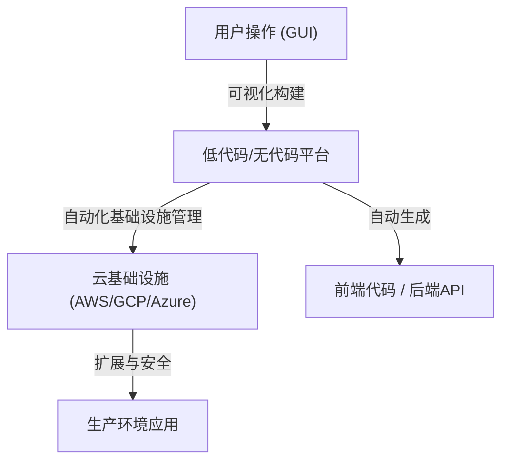
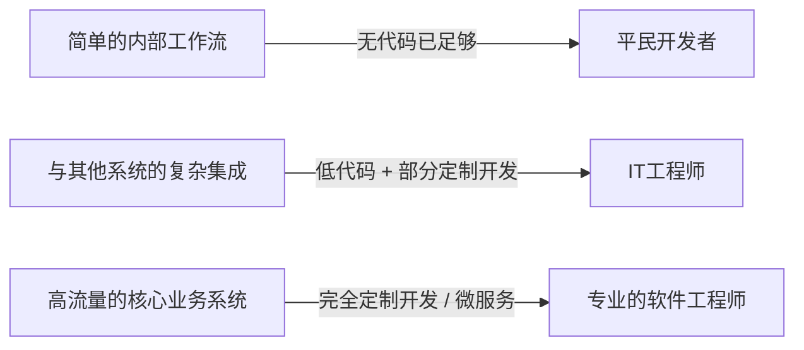

# 低代码/无代码开发的光与影：程序员是会失业，还是会获得新的武器？

在软件开发领域，“低代码（Low-Code）”和“无代码（No-Code）”这两个关键词席卷行业已经有很长一段时间了。拖拽式的直观界面、只需点击几次即可完成的数据库构建，以及可以立即部署的云基础设施。这些工具将过去需要数周时间的Web应用或移动应用的开发缩短到了短短几天甚至几个小时。

面对这种快速的技术进步，许多人心中产生了一个疑问：“程序员这个职业最终会被淘汰吗？”

本文将深入探讨这一疑问。从使用GUI生成程序的历史背景，到现代基于SaaS的平台的崛起，再到“平民开发者（Citizen Developer）”为商业带来的变革，以及随之而来的“影子IT”风险和供应商锁定问题，本文将进行全面的解析。同时，我们还将探讨在处理复杂的业务逻辑和性能优化时，为什么“编写代码”这一行为依然不可或缺，以及开发者的角色在未来将如何演变。

---

## 1. 基于GUI的代码生成历史：从CASE工具到现代SaaS

虽然“无代码/低代码”这个词本身可能是一个相对较新的流行语，但“不写代码构建软件”的概念与软件工程的历史一样悠久。

### 1980年代：CASE工具的崛起与挫折
20世纪80年代，随着软件需求的激增，提高开发生产力成为了当务之急。应运而生的是“CASE（计算机辅助软件工程）”工具。CASE工具试图使用UML等可视化建模语言绘制系统蓝图，并从中自动生成源代码。然而，当时的技术生成的代码质量较低，性能差，而且生成的代码可维护性低（一旦手动修改生成的代码，就会与模型失去同步，即所谓的“往返问题”），因此未能得到广泛普及。

### 1990年代至2000年代：RAD工具与4GL
随后，Visual Basic和Delphi等“RAD（快速应用开发）”工具出现了。它们采用了一种革命性的方法，即将GUI组件（按钮和文本框）放置在表单上，并为每个事件编写简短的代码（脚本）。这极大地提高了桌面应用程序的开发速度。与此同时，专门用于数据库操作的4GL（第四代语言）也得到了普及，人们继续尝试使用更接近人类自然语言的语法来构建系统。

### 现代：云原生SaaS平台
到了现代，OutSystems、Mendix、Bubble和Retool等现代低代码/无代码平台拥有了与过去工具根本不同的架构。那就是它们是“云原生”的。
现代工具将曾经由开发者或基础设施工程师手动执行的许多“非功能性需求”（如基础设施配置、数据库扩展和安全补丁应用）转移到了平台层。用户只需在浏览器中组合组件，在后台，React等现代前端框架和AWS/GCP等强大的云基础设施会自动协同工作。

过去“代码生成工具”面临的可维护性问题，由于采用了“向用户隐藏代码本身，并在平台的运行时动态解释和执行”的方法，得到了部分解决。

---

## 2. 平民开发者的崛起与业务民主化

无代码工具最伟大的成就在于“软件开发的民主化”。过去，当业务部门（销售、人力资源、营销等）需要新的内部工具时，通常需要向IT部门定义需求并提出请求，获得预算，在经过数月的积压之后，开发才最终开始。

然而，随着无代码工具的普及，被称为“平民开发者”的没有受过专业编程教育的商务人士，也可以直接构建应用程序来解决他们自身面临的问题。

* **敏捷性的极大提升**：最了解现场问题的人可以自己创建和改进工具，因此反馈循环极短。
* **解放IT部门的资源**：现有的IT部门可以将资源集中在核心系统的维护和全公司安全基础设施的构建等更高级、更专业的任务上。

这可以说是Excel宏和VBA在云时代的合法进化形态。

---

## 3. 光芒背后的阴影：影子IT的风险

然而，技术的民主化同时也带来了新的风险。这就是“影子IT”的问题。

影子IT是指各个部门或个人在未经IT部门管理和批准的情况下，自行决定引入和运营的IT系统或云服务。随着平民开发者掌握了强大的工具，这种风险已经膨胀到了前所未有的规模。

### 缺乏治理和安全风险
一线员工能够轻松创建数据库并与外部SaaS进行API集成，这意味着机密信息和个人信息有可能在违反公司安全策略的情况下被存储和传输。由于访问权限设置错误导致的信息泄露，是使用无代码工具构建的内部系统中经常发生的事件之一。

### 可视化逻辑的“秘方化”
如果没有编程基础中的“模块化”、“版本控制”和“测试自动化”等概念，构建出来的无代码应用程序会迅速变得复杂，并最终成为一个除了创建者之外无人能触碰的黑盒。
与“面条代码”相似的“面条节点（复杂交织的流程图）”，比纯文本代码更难解读。如果创建者离职，系统突然停止运行，IT部门将不得不在既没有文档也没有测试代码的未知可视化逻辑的海洋中徘徊。

---

## 4. 供应商锁定：自由的代价

在采用低代码/无代码平台时，企业面临的最大战略挑战是“供应商锁定（Vendor Lock-in）”。

在传统的基于代码的开发中，源代码是企业的知识产权，企业拥有将其从AWS迁移到GCP，或者迁移到本地部署的自由（尽管不容易，但并非不可能）。
但是，在许多无代码平台中，构建的应用程序逻辑和UI定义都以该平台的专有格式保存。

* **容易受到价格调整的影响**：即使平台方改变了许可体系，使使用费飙升数倍，也很难轻易迁移到其他公司的平台。实际上，需要从零开始重新构建。
* **功能限制**：如果需要平台未提供的功能（特定的硬件控制、最新的加密算法、特殊协议通信等），开发就会彻底碰壁。

因此，在企业领域引入低代码时，明确划定“哪些系统使用低代码构建，哪些系统从头开始开发（Scratch）”的架构边界是极其重要的。

---

## 5. 为什么“编写代码”仍然是必要的

现在让我们回到最初的问题：无代码/低代码会抢走程序员的工作吗？
从结论上讲，**“仅仅是创建标准CRUD（创建、读取、更新、删除）应用程序的工作”肯定会被抢走。**但是，软件工程的核心价值存在于其他部分。

### 表达复杂业务逻辑的能力
通过GUI进行的可视化编程适合简单的条件分支和顺序处理，但在表达高度复杂的算法或交织着广泛领域规则的业务逻辑方面存在局限性。
基于文本的代码（编程语言）是人类经过几十年进化而来的“准确且简洁地表达逻辑的最高密度接口”。如果试图用流程图来表达复杂的状态管理和并发处理，视觉噪音会变得太大，超出人类的认知极限。

### 性能与优化的壁垒
为了提高通用性，无代码工具在内部有许多抽象层。这是以性能下降（开销）为代价换取生产力的结果。
在需要接近硬件极限的优化的场景中，比如处理数百万用户并发访问的系统、要求毫秒级响应速度的金融系统、资源极其受限的物联网设备等，能够直接访问内存管理和数据结构的编程代码仍然是必不可少的。

### 处理边界领域和边缘情况
当面临平台提供的“标准组件”框架内无法容纳的需求（边缘情况）时，只有能写代码的工程师才有能力突破这一限制。即便是低代码工具，通常也会提供允许编写JavaScript或SQL等代码的“逃生舱口（Escape Hatch）”，以进行高级定制。

---

## 6. 程序员的未来：低代码作为新的武器

伴随AI代码生成（如Copilot）的普及，软件工程师的角色正稳步从“敲击代码的工匠”向“用技术解决业务问题的架构师”转变。

优秀的工程师不会将低代码/无代码视为“敌人”或“威胁”。相反，他们会积极将其作为**“强大的武器”**，用于减少编写繁琐的样板代码（Boilerplate）或创建简单管理后台所需的时间。

他们会着眼于系统的全局优化，并将自己的时间和智慧资源集中在以下高级领域：

1. **平台扩展**：为了方便平民开发者使用，（通过编写代码）为低代码环境开发自定义组件和API集成模块。
2. **系统架构设计**：设计如何将多个无代码服务与自主开发的微服务相结合，以确保数据的完整性和安全性。
3. **核心价值创造**：进行企业竞争力源泉的独特算法开发、机器学习模型实现、追求极致的用户体验等，创造模板永远无法产生的价值。

### 结论

低代码/无代码开发的光芒在于其带来的压倒性的生产力提升，它赋予了所有人创造软件的能力。然而，在它的阴影下，隐藏着治理丧失、系统黑盒化以及供应商锁定等深深的陷阱。

程序员不会失业。但是，那些“仅仅是按照指示制作页面的打工者”将会被淘汰。技术的发展正在向工程师提出更高维度的问题：“为什么要构建这个系统？”以及“如何将商业价值最大化？”

具有讽刺意味的是，不写代码的平台越普及，为了构建、扩展和突破这些平台自身的极限所需的“真正的软件工程”的价值就会比以往任何时候都要高。
