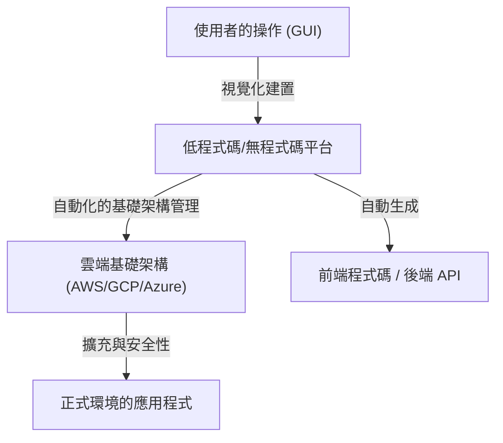
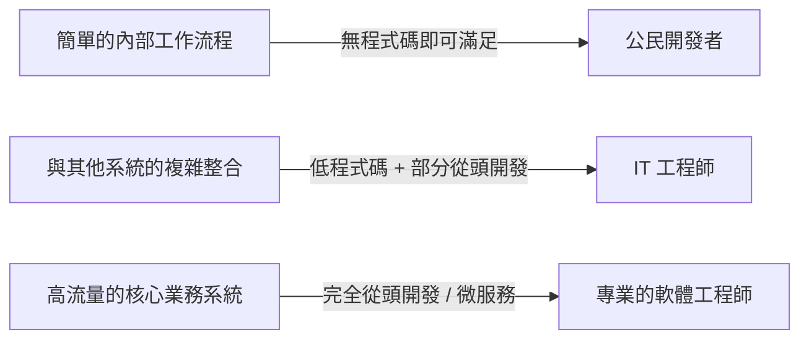

# 低程式碼/無程式碼開發的光與影：程式設計師會失業嗎，還是會獲得新的武器？

在軟體開發的世界裡，「低程式碼 (Low-Code)」和「無程式碼 (No-Code)」這兩個關鍵字席捲業界已經有很長一段時間了。直觀的拖曳介面、只需點擊幾次即可完成的資料庫建置，以及能立即部署的雲端基礎架構。這些工具將過去需要花費數週才能完成的 Web 應用程式或行動應用程式開發，縮短到了短短幾天，甚至幾小時。

面對這種快速的技術進步，許多人都產生了一個疑問：「最終，程式設計師這個職業會不會變得不再需要？」

本文將深入探討這個問題。從使用 GUI 生成程式的歷史背景開始，到現代基於 SaaS 平台的崛起，再到「公民開發者 (Citizen Developer)」為企業帶來的變革，以及伴隨而來的「影子 IT (Shadow IT)」風險和供應商鎖定 (Vendor Lock-in) 問題，我們將進行全面的解說。此外，我們也將探討為什麼在複雜的業務邏輯和效能最佳化中，「寫程式碼」這個行為依然不可或缺，以及開發者的角色在未來將會如何演變。

---

## 1. 透過 GUI 生成程式的歷史：從 CASE 工具到現代 SaaS

無程式碼/低程式碼這個詞本身或許是比較新的流行語，但「不寫程式碼就能製作軟體」的概念，卻和軟體工程的歷史一樣古老。

### 1980年代：CASE 工具的崛起與挫折
在 1980 年代，隨著軟體需求激增，提升開發的生產力成了當務之急。在此背景下登場的就是「CASE (Computer-Aided Software Engineering，電腦輔助軟體工程)」工具。CASE 工具的目標是使用如 UML 等視覺化的塑模語言來繪製系統藍圖，並從中自動產生原始碼。然而，以當時的技術，產生的程式碼品質低落、效能不佳，加上產生的程式碼可維護性很低（一旦手動修改了產生的程式碼，就無法再與模型同步，即「往返問題 (Round-trip problem)」），因此未能廣泛普及。

### 1990年代〜2000年代：RAD 工具與 4GL
隨後，出現了 Visual Basic 和 Delphi 等「RAD (Rapid Application Development，快速應用程式開發)」工具。這些工具採用了劃時代的方法，將 GUI 元件（按鈕、文字方塊）放置在表單上，並為各自的事件撰寫簡短的程式碼（指令碼）。這使得桌面應用程式的開發速度有了戲劇性的提升。同時，專注於資料庫操作的 4GL（第四代語言）也逐漸普及，人們持續嘗試用更貼近人類語言的語法來建置系統。

### 現代：雲端原生的 SaaS 平台
來到現代。OutSystems、Mendix、Bubble、Retool 等現代的低程式碼/無程式碼平台，擁有與過去工具截然不同的架構。那就是它們具備「雲端原生 (Cloud Native)」的特性。
現代的工具，可以將過去由開發者或基礎架構工程師手動執行的基礎架構配置、資料庫擴展、安全修補程式套用等許多「非功能性需求」，交由平台端來吸收處理。使用者只需在瀏覽器上組合元件即可，而在背後，React 等現代前端框架，以及 AWS/GCP 等堅固的雲端基礎架構，將會自動協同運作。

過去「程式碼生成工具」所面臨的可維護性問題，透過「不讓使用者看到程式碼本身，而是在平台的執行環境上動態直譯並執行」的方法，已經得到部分的解決。

---

## 2. 公民開發者的崛起與企業民主化

無程式碼工具最偉大的貢獻在於「軟體開發的民主化」。以往，當業務單位（如業務、人資、行銷等）需要新的內部工具時，通常必須向 IT 部門定義需求並提出申請，爭取預算，並在經過數個月的待辦清單等待後，才終於開始開發。

然而，隨著無程式碼工具的普及，被稱為「公民開發者 (Citizen Developer)」、未受過程式設計專業教育的商務人士，也能親自建置應用程式來解決他們所面臨的問題。

* **敏捷性的劇烈提升**: 最了解第一線問題的人，能夠親自建立並改善工具，因此回饋循環會變得極短。
* **釋放 IT 部門的資源**: 現有的 IT 部門可以將資源集中在更進階、更專業的任務上，例如核心系統的維護，以及全公司安全基礎架構的建置等。

這可以說是由 Excel 巨集和 VBA 所扮演的角色，在雲端時代的正統進化。

---

## 3. 光芒背後的陰影：影子 IT 的風險

然而，技術的民主化同時也帶來了新的風險。這就是「影子 IT (Shadow IT)」的問題。

影子 IT 是指未經 IT 部門的管理或批准，由各部門或個人自行決定導入與營運的 IT 系統或雲端服務。隨著公民開發者掌握了強大的工具，這種風險已經膨脹到了前所未有的規模。

### 缺乏治理與安全風險
第一線員工能夠輕易地建立資料庫並與外部的 SaaS 進行 API 串接，這意味著機密資訊或個人資訊，有偏離公司安全政策而遭到儲存、傳輸的危險。由於存取權限設定錯誤而導致的資訊外洩，正是使用無程式碼工具建立的內部系統中經常發生的資安事件之一。

### 變成「祖傳秘方」的視覺化邏輯
在缺乏「模組化」、「版本控制」、「自動化測試」等程式設計基礎概念的情況下所建置的無程式碼應用程式，會迅速變得複雜，最終變成除了建立者之外無人能插手的黑盒子。
與其說是「義大利麵條式程式碼 (Code Spaghetti)」，不如說是「義大利麵條式節點 (Node Spaghetti)」(錯綜複雜的流程圖)，它比文字形式的程式碼更難以解讀。當建立者離職後，若該系統突然停止運作，IT 部門就會迷失在既沒有文件也沒有測試程式碼，充滿未知視覺化邏輯的汪洋中。

---

## 4. 供應商鎖定：自由的代價

在採用低程式碼/無程式碼平台時，企業面臨的最大戰略性挑戰就是「供應商鎖定 (Vendor Lock-in)」。

如果是傳統的基於程式碼庫的開發，原始碼是企業的智慧財產，企業擁有從 AWS 遷移到 GCP，或是遷移到地端環境的自由（雖然不容易，但並非不可能）。
然而，在許多的無程式碼平台中，所建置的應用程式邏輯和 UI 定義，都是以該平台的專屬格式 (Proprietary) 來儲存的。

* **面對價格調整的脆弱性**: 即使平台方更改授權體系，導致使用費飆升數倍，企業也無法輕易轉移到其他公司的平台。實際上，這需要從零開始重新製作。
* **功能上的限制**: 當需要平台未提供的功能（如特定的硬體控制、最新的加密演算法、特殊通訊協定的傳輸等）時，開發將會完全碰壁。

因此，在企業級領域導入低程式碼時，清楚劃分「哪些系統要用低程式碼製作，哪些系統要從頭開發」的架構界線，就變得極為重要。

---

## 5. 為什麼「寫程式碼」依然是必要的？

現在讓我們回到最初的問題。無程式碼/低程式碼會奪走程式設計師的工作嗎？
就結論而言，**「只負責製作常規的 CRUD（建立、讀取、更新、刪除）應用程式的工作」絕對會被奪走。** 但是，軟體工程的本質價值，存在於這些以外的部分。

### 複雜業務邏輯的表達能力
使用 GUI 的視覺化程式設計，雖然適合簡單的條件分支或循序處理，但在表達高度複雜的演算法，或交織著各種領域規則的業務邏輯時，就有其極限。
基於文字的程式碼（程式語言），是人類花了數十年所進化而來，「為了正確且簡潔地表達邏輯的最高密度介面」。若試圖用流程圖來表達複雜的狀態管理或並行處理，視覺上的雜訊會變得過大，進而超越人類的認知極限。

### 效能與最佳化的障礙
無程式碼工具為了提高通用性，內部包含了許多抽象化分層。這雖然帶來了生產力，卻也產生了額外負擔（效能降低）。
在需要處理數百萬使用者同時存取的系統、要求毫秒級回應速度的金融系統、資源極度受限的 IoT 裝置等，必須在接近硬體極限的領域進行最佳化的場合，能夠直接存取記憶體管理和資料結構的程式碼依然是不可或缺的。

### 應對邊界領域和極端情況
當面臨超出平台所準備的「標準元件」範圍的需求（極端情況）時，能夠突破這個限制的，只有能夠撰寫程式碼的工程師。即使是低程式碼工具，為了進行高度客製化，通常也會準備可以撰寫 JavaScript 或 SQL 等程式碼的「逃生艙口 (Escape Hatch)」。

---

## 6. 程式設計師的未來：低程式碼作為新的武器

結合由 AI 進行程式碼生成（如 Copilot 等）的普及，軟體工程師的角色，正確實地從「打程式碼的工匠」，轉變為「用科技解決業務問題的架構師」。

優秀的工程師不會將低程式碼/無程式碼視為「敵人」或「威脅」。相反地，他們會積極將其作為**「強大的武器」**，用來減少撰寫枯燥的樣板程式碼（Boilerplate）或製作簡單管理介面所花費的時間。

他們將考量系統的整體最佳化，並將自己的時間和知識資源集中在以下等更高階的領域：

1. **平台擴充**: 為了讓公民開發者更容易使用，（透過寫程式碼）開發適用於低程式碼環境的自訂元件或 API 串接模組。
2. **系統架構設計**: 設計如何將多個無程式碼服務與自家開發的微服務進行串接，並確保資料的一致性與安全性。
3. **創造核心價值**: 創造出模板絕對無法做出的價值，例如獨特的演算法開發、機器學習模型的實作、追求極致的使用者體驗等，這些都是企業競爭力的泉源。

### 結論

低程式碼/無程式碼開發的光芒，在於它賦予了所有人創造軟體的力量，帶來壓倒性的生產力提升。然而，在它的陰影下，卻潛藏著失去治理、系統黑盒子化，以及供應商鎖定等深不見底的陷阱。

程式設計師不會失業。但是，「只會依照指示製作畫面的作業員」將會被淘汰。技術的進化，正向工程師提出「為什麼要製作那個系統？」、「要如何將商業價值最大化？」等更高層次的問題。

不寫程式碼的平台越普及，為了解決該平台本身的建置、擴展，以及突破其極限的「真正軟體工程」價值，諷刺地，將會變得比以往任何時候都還要高。
