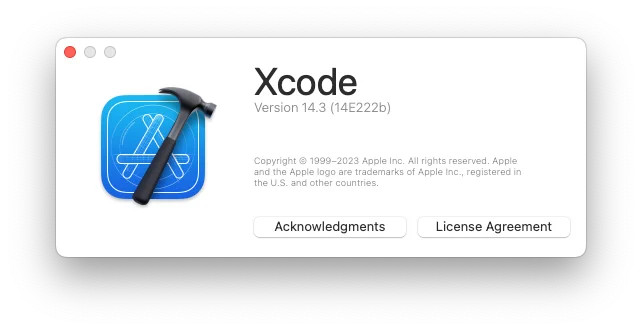
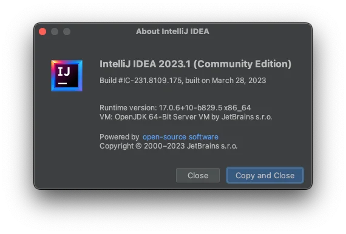

---
title: 'أسباب شراء جهاز Mac mini (2018) مستعمل لتطوير تطبيقات iOS والمواصفات'
slug: "mac mini(2018)を購入"
date: 2023-04-02T18:05:30+09:00
tags: ["Apple", "mac mini", "xcode"]
draft: false
image: "img.webp"
categories: ["الكمبيوتر والأدوات"]
description: 'من أجل بناء بيئة مريحة لتطوير تطبيقات iOS في المنزل، قمت بشراء طراز قديم من Mac mini (2018) من Mercari. نقدم الأسباب الحاسمة للشراء، والمواصفات التفصيلية، والخطوة الأولى في إعداد بيئة العمل.'
---

# شراء mac mini(2018)

اشتريت جهاز mac mini(2018) مستعملًا من طراز قديم على Mercari. المواصفات كالتالي:

- المعالج: 3.2GHz 6-core Intel Core i7
- الذاكرة: 32GB
- التخزين: 1TB SSD

السعر 77,000 ين.

# سبب الشراء

- أستخدم جهاز mac mini بنفس المواصفات تقريبًا في العمل لتطوير تطبيقات الهواتف الذكية، وأردت إعداد بيئة تطوير في المنزل أيضًا (خاصة بيئة تشغيل xcode).
- أمتلك جهاز macbook pro، ولكني اشتريته قبل 9 سنوات وهو بطيء جدًا لذا لا أستخدمه تقريبًا.
- كنت أرغب شخصيًا في تطوير تطبيقات iOS.

# قمت بتثبيت xcode و inteliJ IDEA على الفور

إصدار xcode هو Version 14.3 (14E222b)

إصدار inteliJ IDEA هو 2023.1

هيا بنا! سأبدأ في التطوير!
