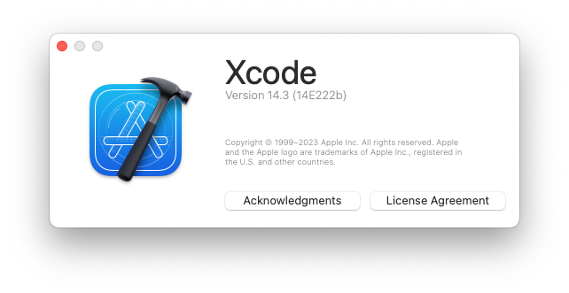
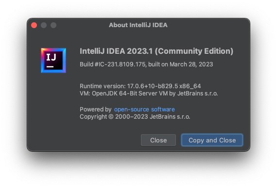

# Покупка mac mini(2018)

Я купил подержанный mac mini(2018) предыдущего поколения на Mercari. Характеристики следующие:

- Процессор: 3.2GHz 6-ядерный Intel Core i7
- Оперативная память: 32GB
- Накопитель: 1TB SSD

Цена составляет 77 000 иен.

# Причина покупки

- Я использую mac mini с почти такими же характеристиками на работе для разработки мобильных приложений, и хотел создать среду разработки и дома (особенно среду выполнения xcode).
- У меня есть macbook pro, но я купил его 9 лет назад, и он работает довольно медленно, поэтому я его почти не использую.
- Я хотел заниматься разработкой приложений для iOS в личных целях.

# Сразу же установил xcode и inteliJ IDEA

Версия xcode — Version 14.3 (14E222b)

Версия inteliJ IDEA — 2023.1

Ну что ж! Начнем разработку!
