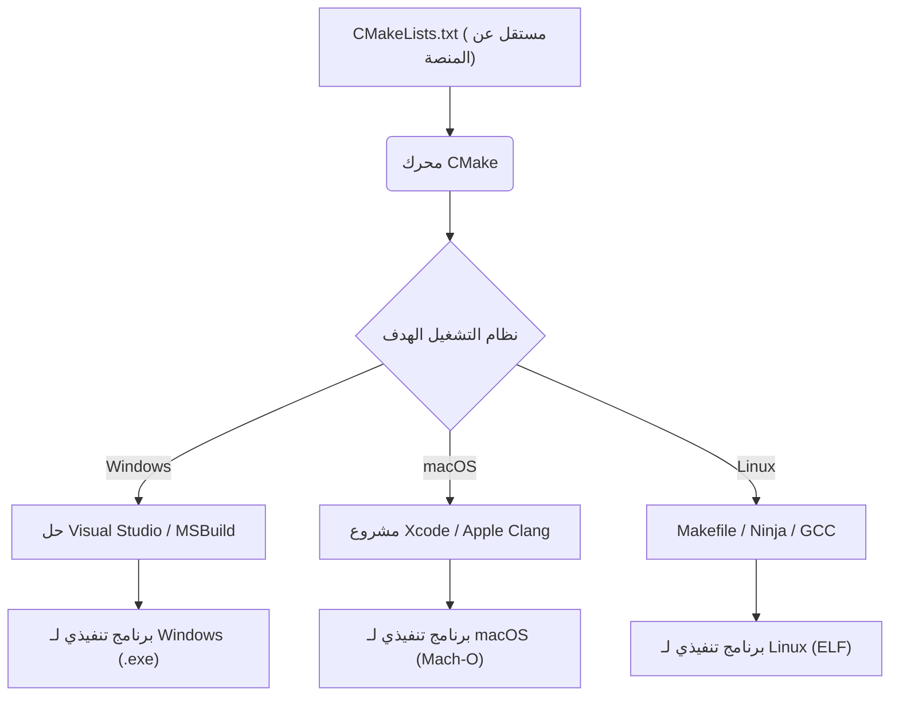
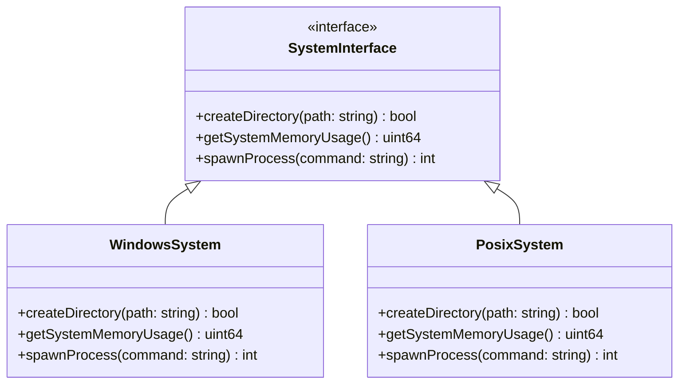
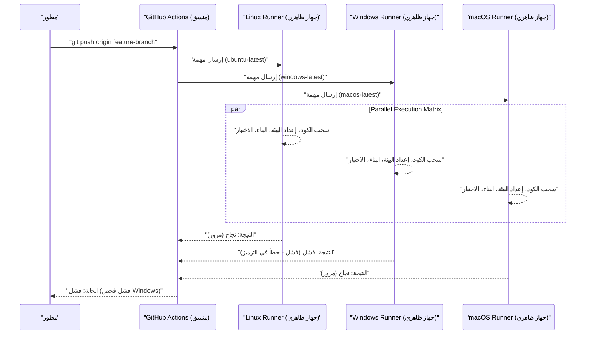

يعد تطوير المنصات المشتركة عبر أنظمة تشغيل (OS) متعددة مثل Mac (macOS) و Windows، وحتى Linux (بما في ذلك WSL)، مسارًا لا مفر منه في هندسة البرمجيات الحديثة. عند بناء تطوير الويب، أو الواجهات الخلفية لتطبيقات الأجهزة المحمولة، أو تطبيقات سطح المكتب عبر الأنظمة الأساسية (مثل Electron و Tauri و Qt)، فإن استخدام أنظمة تشغيل مختلفة داخل الفريق يؤدي إلى مواجهة العديد من "الأخطاء الناتجة عن اختلافات نظام التشغيل".

يتمتع كل نظام تشغيل بخلفية تاريخية وفلسفة تصميم مختلفة. يمتلك Windows بنية فريدة مشتقة من MS-DOS (واجهة برمجة تطبيقات Win32، نواة NT)، بينما يعتمد macOS على UNIX (نظام Darwin المستند إلى FreeBSD)، ويتوافق Linux مع معيار POSIX. يخلق هذا الاختلاف الأساسي "فخاخاً" تزعج المطورين في كل جانب، مثل أنظمة الملفات، والشبكات، ومعالجة العمليات.

في هذه المقالة، سنشرح بالتفصيل وبشكل عملي الاختلافات الفنية وأفضل الممارسات التي يجب معرفتها تمامًا في فرق التطوير التي تمزج بين Mac و Windows، أو في تطوير التطبيقات التي تستهدف كلا نظامي التشغيل.

---

## 1. فخاخ رموز نهاية السطر (CRLF مقابل LF) والإعدادات الصارمة لـ Git

أحد الأسباب الأكثر شيوعًا والتي تؤدي إلى إرباك تطوير الفريق هو مشكلة "رموز نهاية السطر (Line Endings)". هذه مشكلة تاريخية تعود إلى عصر الآلات الكاتبة.

*   **Windows**: يستخدم **CRLF**، وهو مزيج من إرجاع النقل (CR, `\r`, `0x0D`) وتغذية السطر (LF, `\n`, `0x0A`)، كرمز قياسي لنهاية السطر.
*   **macOS / Linux**: يستخدم تغذية السطر الفردية **LF** كرمز قياسي لنهاية السطر. (*حتى الإصدارات الأولى من Mac OS 9، كان يتم استخدام CR وحده، ولكن منذ Mac OS X أصبح مبنيًا على UNIX وأصبح يستخدم LF)

بسبب هذا الاختلاف، عند مشاركة التعليمات البرمجية المصدر في مستودع Git، قد تمتد الفروق (diff) إلى الملف بأكمله، أو قد يصبح البرنامج النصي للصدفة (`.sh`) الذي يُفترض تشغيله في بيئة Linux يحتوي على CRLF لأنه تم تحريره في Windows، مما يتسبب في أخطاء مثل `\r: command not found` حيث يتم تفسير `\r` كحرف غير صالح عند التنفيذ.

### الحل في Git: الإدارة باستخدام `.gitattributes`

يحتوي Git على إعداد يسمى `core.autocrlf`، لكن الاعتماد عليه أمر خطير. وذلك لأنه يعتمد على الإعدادات العالمية للآلة المحلية الخاصة بالمطور الفردي، مما يجعله عرضة للمشاكل بسبب نسيان الإعداد عند انضمام أعضاء جدد إلى الفريق.

أفضل ممارسة هي وضع ملف `.gitattributes` في الدليل الجذر للمستودع، وتحديد كيفية التعامل مع رموز نهاية السطر بوضوح على مستوى المستودع. يضمن ذلك سلوكًا ثابتًا بغض النظر عن البيئة التي يتم استنساخ المستودع فيها.

```gitattributes
# بشكل افتراضي، تعامل كملفات نصية، وقم بتسويتها إلى LF داخل المستودع (على قاعدة بيانات Git)
# سيتم تحويلها إلى رمز نهاية السطر القياسي لكل نظام تشغيل عند الخروج (checkout)
* text=auto

# ومع ذلك، للامتدادات المعينة مثل التعليمات البرمجية المصدر، فرض LF دائمًا بغض النظر عن نظام التشغيل
*.sh text eol=lf
*.py text eol=lf
*.cpp text eol=lf
*.hpp text eol=lf
*.js text eol=lf
*.json text eol=lf

# فرض CRLF للملفات الدفعية المخصصة لـ Windows وما شابه ذلك
*.cmd text eol=crlf
*.bat text eol=crlf

# لا تقم بتحويل رموز نهاية السطر للملفات مثل الصور أو الثنائيات المبنية مسبقًا (لمنع التلف)
*.png binary
*.jpg binary
*.pdf binary
```

---

## 2. حساسية حالة الأحرف في نظام الملفات (Case Sensitivity)

تعتبر حساسية حالة الأحرف (Case Sensitivity) في أنظمة الملفات أيضًا واحدة من أكبر العقبات في تطوير المنصات المشتركة.

*   **macOS (APFS / HFS+)**: بشكل افتراضي **غير حساس لحالة الأحرف (Case-Insensitive)**، ولكنه **يحافظ على الحالة (Case-Preserving)**. بمعنى آخر، إذا قمت بحفظه كـ `File.txt` فسيتم عرضه كـ `File.txt`، ولكن يمكنك أيضًا قراءته عن طريق الوصول إليه كـ `file.txt` من البرنامج.
*   **Windows (NTFS)**: تمامًا مثل macOS، بشكل افتراضي **غير حساس لحالة الأحرف (Case-Insensitive)**، و**يحافظ على الحالة (Case-Preserving)**.
*   **Linux / WSL (مثل ext4)**: **حساس تمامًا لحالة الأحرف (Case-Sensitive)**. يمكن أن يتعايش `File.txt` و `file.txt` في نفس الدليل كملفات مختلفة تمامًا.

### الأخطاء النموذجية التي تحدث

أثناء التطوير على Mac أو Windows، حتى إذا حددت أحرفًا صغيرة في التعليمات البرمجية المصدر كـ `#include "myclass.h"` (أو `import "./myclass"`)، وكان الملف الفعلي هو `MyClass.h`، فإن البناء سينجح لأن نظام التشغيل في البيئة المحلية غير حساس لحالة الأحرف.

ومع ذلك، إذا قمت بالالتزام (commit) بهذا الكود وتشغيل البناء على خادم CI/CD (عادةً Linux مثل Ubuntu)، فسيؤدي ذلك إلى خطأ في التجميع يوضح "لم يتم العثور على الملف" لأن نظام ملفات ext4 الخاص بـ Linux حساس لحالة الأحرف.

### منظور خوارزمي: تعقيد وقت البحث عن الملفات والتسوية (Normalization)

دعونا نفكر رياضيًا في نوع المعالجة التي تحدث داخليًا عندما يحل نظام الملفات مسار الملف.

في حالة ext4 الذي يميز بين الأحرف الكبيرة والصغيرة، تتم إدارة الإدخالات في الدليل باستخدام هياكل مثل جداول التجزئة (Hash Tables) أو أشجار B (B-Trees). بافتراض أن عدد الملفات في الدليل هو $N$، وطول اسم الملف هو $L$، فإن تعقيد الوقت للبحث الثنائي البسيط أو البحث في الشجرة سيكون على النحو التالي:

$$ T_{search}(N) = O(L \log N) $$

من ناحية أخرى، في أنظمة الملفات التي لا تميز بين الأحرف الكبيرة والصغيرة مثل NTFS و APFS، هناك حاجة إلى تسوية (Case Folding) كلا السلسلتين إلى نفس الحالة (كبيرة أو صغيرة) قبل مقارنة السلاسل. لا يمكن إنجاز تحويل الأحرف الكبيرة/الصغيرة الذي يأخذ في الاعتبار تسوية Unicode واللغة (Locale) بمجرد عمليات بت ASCII البسيطة، ويتطلب البحث في الجداول (Table Lookup).

إذا افترضنا أن التكلفة الحسابية لدالة التحويل هي ثابت $C_{fold}$، فسيكون هناك عبء إضافي لكل عملية مقارنة بين السلاسل.

$$ T_{insensitive\_search}(N) = O( (L \times C_{fold}) \log N ) $$

تقوم أنظمة التشغيل الحديثة بتخزين هذا بشكل متقدم (Caching)، ولكن الاختلاف الأساسي في السلوك لا يمكن تقييده إلا من خلال الاتفاقيات على مستوى التطوير. الطريقة الأكثر أمانًا هي وضع قاعدة للمشروع تنص على **"توحيد جميع أسماء الملفات والأدلة لتكون بأحرف صغيرة مع شرطات (kebab-case) أو شرطات سفلية (snake_case)"**.

---

## 3. فواصل المسارات (Path Separators) وتجريد مسار الملف

يعكس التعامل مع الفواصل التي تشير إلى التسلسل الهرمي للدليل اختلافات أساسية بين أنظمة التشغيل.

*   **Windows**: يستخدم الشرطة المائلة العكسية `\` (قد تظهر كرمز الين `¥` بناءً على الخط في البيئات اليابانية)، ويوجد أيضًا مفهوم حروف محركات الأقراص (مثل `C:\`) ومسارات UNC (مثل `\\Server\Share`).
*   **macOS / Linux**: يستخدم الشرطة المائلة `/`، وتمتلك جميع أنظمة الملفات بنية هرمية تبدأ من جذر واحد `/` (Single Root Hierarchy).

تقوم العديد من لغات البرمجة بتفسير `/` كفاصل ملفات بشكل صحيح حتى على Windows (لأن واجهة برمجة تطبيقات Win32 نفسها تدعم `/` في بعض الأجزاء). ومع ذلك، فإن تمرير المسارات كوسيطات لسطر الأوامر، أو استدعاء النظام (System Call) مباشرة، أو مقارنة وتحليل المسارات كسلاسل سيؤدي إلى أخطاء فادحة.

### أفضل الممارسات لكل لغة (تجريد نظام التشغيل)

**تجنب تمامًا** بناء مسارات الملفات من خلال تسلسل السلاسل (مثال: `path + "\\" + filename`). استخدم المكتبات القياسية لمعالجة المسار المتوفرة في كل لغة (طبقة تجريد نظام التشغيل - OS Abstraction Layer).

#### مثال C++ (`std::filesystem`)
منذ C++17، تم تقديم `<filesystem>`، مما يجعل من الممكن تجريد الاختلافات في المسارات بين المنصات.

```cpp
#include <iostream>
#include <filesystem>

namespace fs = std::filesystem;

int main() {
    // بناء مسار مستقل عن نظام التشغيل (تجريد من خلال التحميل الزائد للمشغل - Operator Overloading)
    fs::path dir = "data";
    fs::path file = "config.json";
    fs::path full_path = dir / file; // يصبح "data\config.json" في Windows، و "data/config.json" في Mac/Linux

    std::cout << "Full path: " << full_path.string() << std::endl;
    return 0;
}
```

#### مثال Python (`pathlib`)
في الماضي كان يتم استخدام `os.path.join()`، لكن المعيار الآن هو استخدام وحدة `pathlib` الموجهة للكائنات.

```python
from pathlib import Path

# تم تجاوز المشغل / لإنشاء كائن مسار يتوافق مع نظام التشغيل
base_dir = Path("user_data")
config_file = base_dir / "settings" / "app.ini"

# يمكن حل المسارات وقراءة الملفات باستخدام طرق متسقة
if config_file.exists():
    text = config_file.read_text(encoding="utf-8")
```

#### مثال Node.js (وحدة `path`)

```javascript
const path = require('path');

// path.join يأخذ الوسائط ويجمعها باستخدام الفاصل المناسب لنظام التشغيل الحالي
const configPath = path.join('config', 'default.json');
console.log(configPath); 
// Windows: "config\default.json"
// macOS/Linux: "config/default.json"
```

---

## 4. ترميز الأحرف (UTF-8 مقابل CP932/Shift-JIS) وجدار Unicode

أكبر مصدر للصداع في البيئة اليابانية لنظام Windows هو ترميز الأحرف.
في التطوير الحديث، يتم توحيد macOS و Linux بالكامل مع **UTF-8** للنظام بأكمله، والمحطة الطرفية (Terminal)، وحتى ترميز الملفات. ومع ذلك، فإن الترميز القياسي للنسخة اليابانية من Windows ("صفحة رموز ANSI" المستندة إلى لغة النظام) لا يزال يعمل غالبًا مع **CP932 (امتداد Microsoft لـ Shift-JIS)** كإعداد افتراضي.
*تمثيل السلسلة الداخلي لواجهة برمجة تطبيقات Win32 هو UTF-16LE (`wchar_t`).

عند قراءة وكتابة الملفات في Python وما إلى ذلك، إذا لم تحدد الترميز بوضوح، فسيحاول Windows تفسيره وفقًا لنتيجة `locale.getpreferredencoding()` (والتي هي CP932). نتيجة لذلك، قد تحدث `UnicodeDecodeError` عند محاولة قراءة ملف محفوظ بـ UTF-8، أو قد يظهر نص مشوه (Mojibake).

### النموذج الرياضي لتحويل رمز الأحرف والعبء الإضافي (Overhead)

عند تحويل سلسلة من ترميز (UTF-8) إلى ترميز آخر (UTF-16 أو CP932)، يتناسب تعقيد الحالة الأسوأ مع طول السلسلة. إذا افترضنا أن طول السلسلة بالبايت هو $B$، فإن تعقيد التحويل هو $O(B)$. ومع ذلك، بسبب تحليل UTF-8 (وهو ترميز متغير الطول)، وحساب أزواج البدائل (Surrogate Pairs)، والبحث في جدول التحويل (Lookup)، ينشأ عبء إضافي لا يمكن تجاهله.

إذا كان طول السلسلة هو $N$، ودالة التعيين (Mapping Function) من الأحرف متعددة البايتات إلى نقاط تشفير Unicode هي $f_{decode}$، ودالة التعيين من نقاط التشفير إلى الترميز الهدف هي $f_{encode}$، فسيتم تقريب وقت التحويل الإجمالي $T_{conv}$ على النحو التالي:

$$ T_{conv} = \sum_{i=1}^{N} \Big( C_{decode} \cdot f_{decode}(x_i) + C_{encode} \cdot f_{encode}(y_i) \Big) \approx O(N) $$

في التطبيقات المشتركة بين المنصات، من الضروري إدراك أن تكلفة التحويل هذه تحدث في كل مرة يتم فيها استدعاء واجهة برمجة التطبيقات الأصلية (Native API) لنظام التشغيل (تجاوز حدود الإدخال/الإخراج) (خاصة عند التطوير بـ C++ لـ Windows، تحدث تحويلات إلى UTF-16 بشكل متكرر باستخدام `MultiByteToWideChar` وما إلى ذلك).

### التدابير المضادة للترميز

أكثر التدابير المؤكدة هو **"تحديد UTF-8 دائمًا بوضوح في جميع الأوقات"**.

```python
# مثال جيد في Python: حدد دائمًا encoding="utf-8"
with open("data.txt", "w", encoding="utf-8") as f:
    f.write("مرحباً، أيها العالم!")
```

بالإضافة إلى ذلك، لعرض مخرجات UTF-8 بشكل صحيح في أجهزة Windows الطرفية (Command Prompt أو PowerShell)، قد تحتاج إلى تعيين متغير البيئة `PYTHONUTF8=1` عند بدء تشغيل التطبيق، أو تغيير صفحة رموز وحدة التحكم (Console Code Page) مؤقتًا إلى UTF-8 باستخدام الأمر `chcp 65001` في بيئات مثل Node.js.

---

## 5. الاختلافات في متغيرات البيئة وبيئات الصدفة (bash/zsh مقابل PowerShell)

تعتبر الاختلافات في الصدفة (Shell) (مترجم سطر الأوامر) عند تنفيذ نصوص البناء البرمجية وأدوات التطوير عقبة رئيسية أخرى عبر الأنظمة الأساسية.

*   **macOS / Linux**: `bash` أو `zsh` هما السائدان. يقومان بمعالجة خطوط الأنابيب (Pipeline) القائمة على النصوص.
*   **Windows**: موجه الأوامر (`cmd.exe`) أو `PowerShell`. يعتمد PowerShell على .NET ويحتوي على خط أنابيب قوي موجه للكائنات، لكن بناء الجملة الخاص به يختلف تمامًا عن صدفة POSIX.

نظرًا لأن طرق الإشارة إلى متغيرات البيئة وتعيينها مختلفة، فإن كتابة رموز تعتمد على نظام التشغيل في منطقة `scripts` من `package.json` الخاصة بـ Node.js ستجعلها تتوقف عن العمل في بيئات أخرى.

```json
// ❌ مثال سيء: في Windows، لن يتم التعرف على "NODE_ENV" كأمر وسيحدث خطأ
"scripts": {
  "build": "NODE_ENV=production webpack"
}
```

### الحل: الاستفادة من الأدوات المشتركة بين المنصات

في بيئة Node.js، يمكنك استخدام حزم مثل `cross-env` لتجريد إعداد متغيرات البيئة.

```json
// ✅ مثال جيد: يستوعب cross-env اختلافات نظام التشغيل ويعين متغيرات البيئة بشكل صحيح لبدء webpack
"scripts": {
  "build": "cross-env NODE_ENV=production webpack",
  "clean": "rimraf dist/" // استخدم مزيلًا مشتركًا بين المنصات بدلاً من rm -rf
}
```

للمشاريع واسعة النطاق التي تتطلب برامج نصية معقدة للصدفة، تتمثل أفضل الممارسات الحالية في جعل استخدام WSL (النظام الفرعي لـ Windows لـ Linux) أو Git Bash قياسيًا حتى للمطورين في بيئة Windows، وإدارة جميع المعالجات الدفعية بشكل موحد كبرامج نصية `.sh`.

---

## 6. أنظمة البناء والمجمعين (Compilers) المشتركة بين المنصات

عند التعامل مع التعليمات البرمجية الأصلية (اللغات التي يتم تجميعها مباشرة في كود الآلة) مثل C++ أو Rust، من الضروري التغلب على اختلافات نظام البناء والمترجم، وليس فقط واجهات برمجة التطبيقات الخاصة بنظام التشغيل.

*   **المجمّعون (Compilers)**:
    *   Windows: MSVC (Microsoft Visual C++), MinGW (GCC for Windows)
    *   macOS: Apple Clang
    *   Linux: GCC, Clang
*   **تنسيق الثنائيات (Binary Format)**:
    *   Windows: PE (Portable Executable) `.exe` / `.dll`
    *   macOS: Mach-O
    *   Linux: ELF (Executable and Linkable Format) `.so`

### الاستفادة من أنظمة البناء الوصفية (Meta-Build Systems) باستخدام CMake

في مشاريع C/C++، يُعد **CMake** المعيار العالمي الفعلي لتحقيق التوافق عبر الأنظمة الأساسية. لا يقوم CMake بتجميع الكود المصدري مباشرة، بل يعمل كـ "منشئ (Generator)" يقوم بإنشاء ملفات تكوين البناء الأصلية المصممة لكل بيئة (ملفات حل Visual Studio لنظام Windows، ونصوص البناء لـ Makefile أو Ninja لنظامي Linux/Mac).



باستخدام CMake، يمكنك استيعاب الاختلافات بين البيئات وإنشاء ثنائيات محسّنة لكل نظام تشغيل من ملف تكوين واحد (`CMakeLists.txt`). يمكن أيضًا كتابة حلول المكتبات التابعة (`find_package`) وربط مكتبات محددة لكل نظام تشغيل بسهولة باستخدام التفرع الشرطي.

```cmake
# مثال لجزء من CMakeLists.txt
if(WIN32)
    # ربط مكتبات خاصة بـ Windows (مثل WS2_32.lib)
    target_link_libraries(my_app PRIVATE ws2_32)
    add_compile_definitions(OS_WINDOWS)
elseif(APPLE)
    # ربط إطارات عمل خاصة بـ macOS
    target_link_libraries(my_app PRIVATE "-framework Foundation")
    add_compile_definitions(OS_MACOS)
elseif(UNIX AND NOT APPLE)
    # ربط لـ Linux (مثل pthread)
    target_link_libraries(my_app PRIVATE pthread)
    add_compile_definitions(OS_LINUX)
endif()
```

---

## 7. الاستفادة من الأنماط المعمارية: طبقة تجريد نظام التشغيل (OSAL)

يعد فصل العمليات المعتمدة على النظام (عمليات الملفات، إنشاء العمليات/المؤشرات الترابطية، إدارة الذاكرة، اتصالات مآخذ التوصيل، إلخ) تمامًا عن منطق الأعمال الأساسي للتطبيق أمرًا ضروريًا في التطوير المشترك بين الأنظمة الأساسية.

ولتحقيق ذلك، نستخدم نمطًا يسمى **طبقة تجريد نظام التشغيل (OS Abstraction Layer, OSAL)**.

فيما يلي مثال لتصميم فئة (Class) يغلف واجهات برمجة التطبيقات الخاصة بكل نظام تشغيل ويوفر واجهة مشتركة. يمكنك تبديل التنفيذ باستخدام تعدد الأشكال (Polymorphism) أو باستخدام مفاتيح الماكرو أثناء وقت التجميع.



من خلال عزل التعليمات البرمجية الخاصة بالمنصة في مكان واحد (عادةً في أدلة مثل `src/platform/windows/` أو `src/platform/posix/`)، يمكنك الحفاظ على 95٪ من التعليمات البرمجية المتبقية (منطق واجهة المستخدم الرسومية، ومعالجة البيانات، وتحليل بروتوكولات الاتصال، إلخ) بشكل مشترك تمامًا بين المنصات وقابل للاختبار.

---

## 8. التحقق من المنصات المشتركة في CI/CD (بناء المصفوفة - Matrix Build)

بغض النظر عن مدى دقة المطورين في البرمجة في بيئاتهم المحلية، فإن الحصن الأخير للتوافق عبر الأنظمة الأساسية هو **خط أنابيب CI/CD (التكامل المستمر / النشر المستمر)**. لا حصر للحالات التي يعمل فيها الرمز في بيئة محلية (مثل Mac) ولكنه يؤدي إلى أخطاء في التجميع في نظام تشغيل آخر (Windows).

استفد من أدوات CI الحديثة مثل GitHub Actions و GitLab CI، وقم بإعداد بناء المصفوفة (Matrix Build) **لإجراء البناء والاختبار بالتوازي في جميع بيئات Windows و macOS و Linux** في كل مرة يتم فيها إنشاء طلب سحب (Pull Request).

```yaml
# مثال على تكوين CI للمنصات المشتركة باستخدام GitHub Actions
name: Cross-Platform Build and Test

on: [push, pull_request]

jobs:
  build:
    runs-on: ${{ matrix.os }}
    strategy:
      fail-fast: false # استمر في اختبار أنظمة التشغيل الأخرى حتى في حالة فشل أحدهما
      matrix:
        # حدد ثلاثة أنظمة تشغيل: Windows و macOS و Linux
        os: [ubuntu-latest, windows-latest, macos-latest]

    steps:
    - uses: actions/checkout@v3
    - name: Set up Python Environment
      uses: actions/setup-python@v4
      with:
        python-version: '3.11'
        cache: 'pip' # التخزين المؤقت للتبعيات حتى عبر المنصات
        
    - name: Install dependencies
      run: python -m pip install --upgrade pip && pip install -r requirements.txt
      
    - name: Run Test Suite
      run: pytest -v
```

إذا قمنا بتصور تدفق CI/CD هذا، فسيبدو كالتالي:



من خلال جمع نتائج الاختبار تلقائيًا لكل نظام تشغيل وتعيين قواعد حماية الفرع (Branch Protection Rules) بحيث **يُسمح بالدمج في الفرع main فقط إذا كانت جميع البيئات خضراء (ناجحة)**، فإنك تمنع دخول الأخطاء المعتمدة على النظام الأساسي إلى بيئة الإنتاج أو بنيات الإصدار مسبقًا.

---

## الملخص

يحتوي التطوير المشترك بين منصات Mac و Windows على مجموعة متنوعة من التحديات المتجذرة في الخلفية التاريخية.

1.  **رموز نهاية السطر**: فرض التسوية على مستوى المستودع (مثل توحيد LF) باستخدام `.gitattributes`.
2.  **حساسية حالة الأحرف**: لا تعتمد على السلوك "غير الحساس" لـ macOS/Windows، بل ضع قواعد صارمة لتسمية الملفات، واحرص على مطابقة حالة الأحرف بدقة.
3.  **فواصل المسارات**: استخدم واجهات برمجة تطبيقات معالجة المسارات القياسية للغة (وحدات `std::filesystem`, `pathlib`, `path`) لاستيعاب اختلافات نظام التشغيل.
4.  **الترميز**: حدد UTF-8 دائمًا للتخلص تمامًا من تأثير CP932، وهو السلوك الافتراضي لـ Windows.
5.  **متغيرات البيئة والصدفة**: استخدم أدوات التجريد مثل `cross-env`، أو وحّد بيئة التنفيذ إلى WSL/Docker وما إلى ذلك.
6.  **أنظمة البناء**: في حالة C/C++، استفد من أنظمة البناء الوصفية مثل CMake لإنشاء أفضل سلسلة أدوات أصلية (Native Toolchain) لكل نظام تشغيل.
7.  **التعليمات البرمجية المعتمدة على نظام التشغيل**: صمم طبقة تجريد نظام التشغيل (OSAL) لفصل وعزل المنطق المعتمد على المنصة.
8.  **CI/CD**: قم بتقديم بناء المصفوفة (Matrix Build) لأتمتة البناء والاختبار النظيف على جميع أنظمة التشغيل المستهدفة، والقضاء على الاعتماد على الأفراد.

اليوم، تستوعب أطر العمل القوية مثل Electron و Tauri و .NET الكثير من هذه الاختلافات، لكن المعرفة بالسلوك الأصلي لنظام التشغيل الأساسي (نظام الملفات والترميز) لا تزال ضرورية عند حل مشاكل الأداء الخطيرة أو الأخطاء المستعصية. من خلال مشاركة أفضل الممارسات هذه وتطبيقها بدقة عبر الفريق بأكمله من المراحل الأولى للمشروع، ستتمكن من تقليل وقت التصحيح العقيم الناتج عن اختلافات نظام التشغيل بشكل كبير، والتركيز على خلق القيمة الأساسية للبرنامج.
