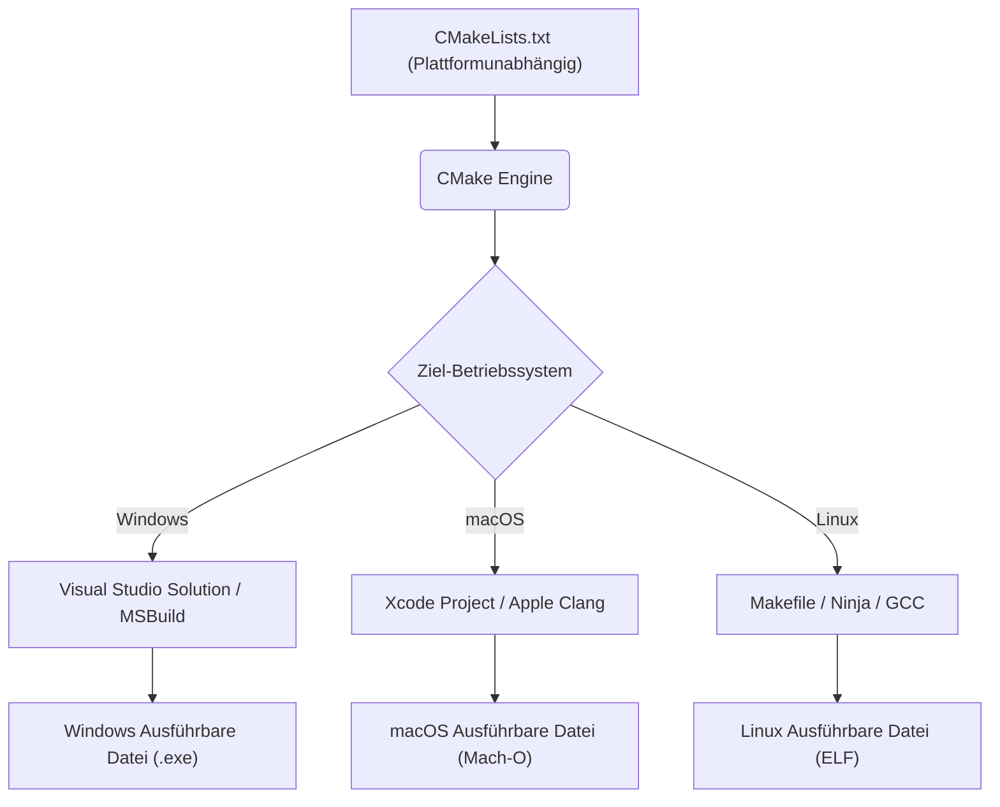
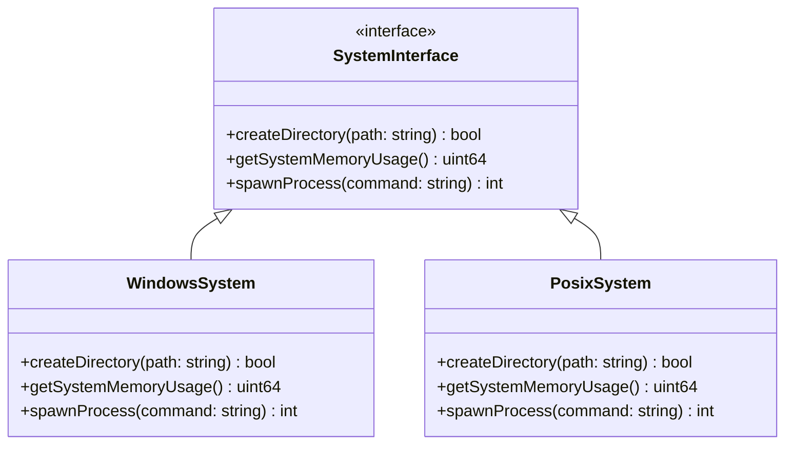
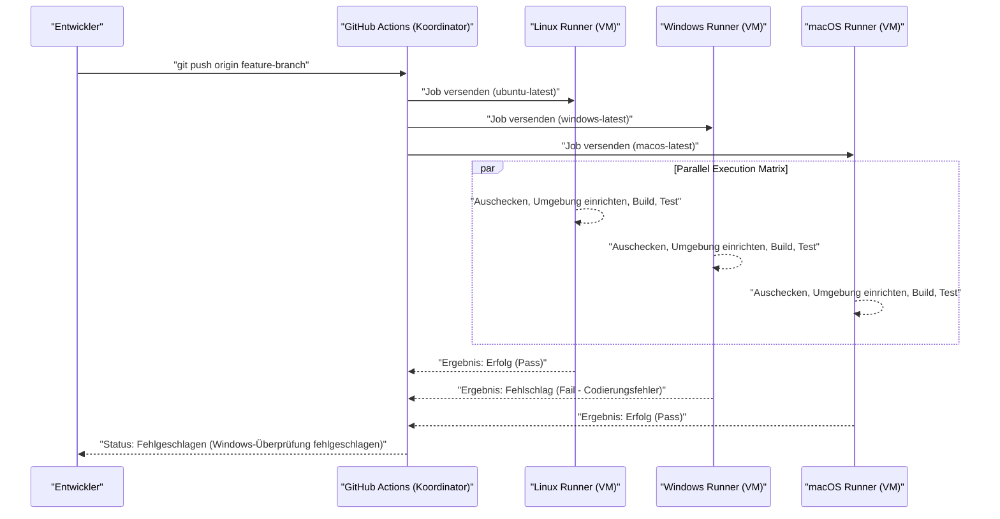

Die plattformübergreifende Entwicklung über mehrere Betriebssysteme (OS) hinweg, wie Mac (macOS) und Windows sowie Linux (einschließlich WSL), ist ein unvermeidlicher Weg im modernen Software-Engineering. Wenn bei der Entwicklung von Webanwendungen, mobilen App-Backends oder plattformübergreifenden Desktop-Apps (wie Electron, Tauri, Qt) unterschiedliche Betriebssysteme innerhalb des Teams verwendet werden, stößt man auf zahlreiche „durch Betriebssystemunterschiede verursachte Fehler“.

Jedes Betriebssystem hat einen unterschiedlichen historischen Hintergrund und eine andere Designphilosophie. Windows hat eine proprietäre Architektur, die von MS-DOS abgeleitet ist (Win32-API, NT-Kernel), während macOS auf UNIX (dem FreeBSD-basierten Darwin) basiert und Linux dem POSIX-Standard entspricht. Diese grundlegenden Unterschiede schaffen „Fallen“, die Entwickler in allen möglichen Situationen plagen, etwa bei der Handhabung von Dateisystemen, Netzwerken und Prozessen.

In diesem Artikel werden die technischen Unterschiede und Best Practices, die Sie unbedingt kennen sollten, wenn Sie in einem Entwicklungsteam mit einer Mischung aus Mac und Windows arbeiten oder Anwendungen für beide Betriebssysteme entwickeln, sehr detailliert und praxisnah erläutert.

---

## 1. Die Falle der Zeilenumbrüche (CRLF vs. LF) und strikte Git-Einstellungen

Eines der häufigsten Probleme, das die Teamentwicklung ins Chaos stürzt, ist das Problem der „Zeilenumbrüche (Line Endings)“. Dies ist ein historisches Problem, das bis in die Zeit der Schreibmaschinen zurückreicht.

*   **Windows**: Verwendet **CRLF**, eine Kombination aus Wagenrücklauf (CR, `\r`, `0x0D`) und Zeilenvorschub (LF, `\n`, `0x0A`), als Standard-Zeilenumbruch.
*   **macOS / Linux**: Verwendet ausschließlich den Zeilenvorschub **LF** als Standard-Zeilenumbruch. (* Bis zum frühen Mac OS 9 war es nur CR, aber seit Mac OS X, das UNIX-basiert ist, wurde es zu LF.)

Dieser Unterschied führt dazu, dass beim Teilen von Quellcode in einem Git-Repository das Diff die gesamte Datei umfassen kann. Wenn ein Shell-Skript (`.sh`), das für die Ausführung in einer Linux-Umgebung vorgesehen ist, unter Windows bearbeitet wird, wird es zu CRLF, wodurch `\r` bei der Ausführung als ungültiges Zeichen interpretiert wird und Fehler wie `\r: command not found` verursacht.

### Lösung in Git: Verwaltung durch `.gitattributes`

Git hat eine Einstellung namens `core.autocrlf`, aber es ist gefährlich, sich darauf zu verlassen. Da dies von den globalen Einstellungen auf der lokalen Maschine des jeweiligen Entwicklers abhängt, kann es leicht zu Problemen durch vergessene Einstellungen kommen, wenn neue Mitglieder dem Team beitreten.

Die beste Vorgehensweise besteht darin, eine `.gitattributes`-Datei im Stammverzeichnis des Repositorys zu platzieren und die Behandlung von Zeilenumbrüchen auf Repository-Ebene explizit zu definieren. Dadurch wird ein konsistentes Verhalten garantiert, unabhängig davon, in welcher Umgebung das Repository geklont wird.

```gitattributes
# Standardmäßig als Textdatei behandeln und im Repository (Git-Datenbank) zu LF normalisieren
# Wird beim Auschecken in den Standard-Zeilenumbruch des jeweiligen Betriebssystems konvertiert
* text=auto

# Für bestimmte Dateierweiterungen wie Quellcode jedoch immer LF erzwingen, unabhängig vom Betriebssystem
*.sh text eol=lf
*.py text eol=lf
*.cpp text eol=lf
*.hpp text eol=lf
*.js text eol=lf
*.json text eol=lf

# CRLF für Windows-spezifische Batch-Dateien erzwingen
*.cmd text eol=crlf
*.bat text eol=crlf

# Zeilenumbruch-Konvertierung für Dateien wie Bilder und vorkompilierte Binärdateien nicht durchführen (um Beschädigungen zu vermeiden)
*.png binary
*.jpg binary
*.pdf binary
```

---

## 2. Groß- und Kleinschreibung im Dateisystem (Case Sensitivity)

Die Unterscheidung zwischen Groß- und Kleinschreibung (Case Sensitivity) im Dateisystem ist ebenfalls eine der größten Hürden bei der plattformübergreifenden Entwicklung.

*   **macOS (APFS / HFS+)**: Standardmäßig **nicht zwischen Groß- und Kleinschreibung unterscheidend (Case-Insensitive)**, aber **beibehaltend (Case-Preserving)**. Das heißt, wenn Sie es als `File.txt` speichern, wird es als `File.txt` angezeigt, aber Sie können auch aus einem Programm als `file.txt` darauf zugreifen, um es zu lesen.
*   **Windows (NTFS)**: Ähnlich wie bei macOS ist es standardmäßig **nicht zwischen Groß- und Kleinschreibung unterscheidend (Case-Insensitive)** und **beibehaltend (Case-Preserving)**.
*   **Linux / WSL (ext4 usw.)**: **Unterscheidet streng zwischen Groß- und Kleinschreibung (Case-Sensitive)**. `File.txt` und `file.txt` können als völlig unterschiedliche Dateien im selben Verzeichnis koexistieren.

### Typische auftretende Fehler

Wenn Sie unter Mac oder Windows entwickeln und im Quellcode Kleinbuchstaben wie `#include "myclass.h"` (oder `import "./myclass"`) angeben, während die tatsächliche Datei `MyClass.h` lautet, ist der Build erfolgreich, da das Betriebssystem in der lokalen Umgebung Case-Insensitive ist.

Wenn Sie diesen Code jedoch committen und den Build auf einem CI/CD-Server (normalerweise Linux wie Ubuntu) ausführen, führt dies zu einem Kompilierungsfehler „Datei nicht gefunden“, da das ext4-Dateisystem von Linux Case-Sensitive ist.

### Algorithmische Perspektive: Rechenaufwand der Dateisuche und Normalisierung

Betrachten wir mathematisch, welche interne Verarbeitung stattfindet, wenn das Dateisystem einen Dateipfad auflöst.

Bei ext4, das zwischen Groß- und Kleinschreibung unterscheidet, werden die Einträge im Verzeichnis in Strukturen wie Hash-Tabellen oder B-Bäumen verwaltet. Wenn die Anzahl der Dateien im Verzeichnis $N$ und die Länge des Dateinamens $L$ ist, ist die Komplexität im Falle einer einfachen binären Suche oder Baumsuchen wie folgt:

$$ T_{search}(N) = O(L \log N) $$

Andererseits erfordern Dateisysteme wie NTFS und APFS, die nicht zwischen Groß- und Kleinschreibung unterscheiden, einen Prozess der Normalisierung (Case Folding), bei dem beide Zeichenfolgen auf denselben Fall (Groß- oder Kleinbuchstaben) normalisiert werden, bevor sie verglichen werden. Unicode-Normalisierung und lokale Groß-/Kleinschreibungskonvertierung lassen sich nicht durch einfache ASCII-Bitoperationen lösen, sondern erfordern Tabellen-Lookups.

Angenommen, die Berechnungskosten der Konvertierungsfunktion sind eine Konstante $C_{fold}$, fällt bei jedem Zeichenfolgenvergleich ein zusätzlicher Overhead an.

$$ T_{insensitive\_search}(N) = O( (L \times C_{fold}) \log N ) $$

Obwohl moderne Betriebssysteme dies stark zwischenspeichern, können die grundlegenden Verhaltensunterschiede nur durch Konventionen auf Entwicklungsebene eingeschränkt werden. Der sicherste Ansatz besteht darin, eine Projektkonvention festzulegen: **„Alle Datei- und Verzeichnisnamen müssen in Kleinbuchstaben und mit Bindestrichen (Kebab-Case) oder Unterstrichen (Snake-Case) vereinheitlicht werden.“**

---

## 3. Pfadtrennzeichen (Path Separators) und Abstraktion von Dateipfaden

Die Behandlung von Trennzeichen, die die Verzeichnishierarchie anzeigen, spiegelt einen grundlegenden Unterschied zwischen den Betriebssystemen wider.

*   **Windows**: Verwendet Backslashes `\` (können in japanischen Umgebungen je nach Schriftart als Yen-Symbol `¥` angezeigt werden) und es gibt das Konzept von Laufwerksbuchstaben (z. B. `C:\`) und UNC-Pfaden (z. B. `\\Server\Share`).
*   **macOS / Linux**: Verwendet Slashes `/` und alle Dateisysteme haben eine hierarchische Struktur, die von einem einzigen Stammverzeichnis `/` (Single Root Hierarchy) ausgeht.

Viele Programmiersprachen interpretieren `/` auch unter Windows sinnvollerweise als Dateitrennzeichen (da auch die Win32-API selbst `/` teilweise unterstützt). Es kann jedoch zu schwerwiegenden Fehlern führen, wenn Pfade als Befehlszeilenargumente übergeben werden, wenn Systemaufrufe direkt ausgeführt werden oder wenn Pfade als Zeichenfolgen verglichen oder geparst werden.

### Best Practices nach Sprache (OS-Abstraktion)

Das Erstellen von Dateipfaden durch Zeichenfolgenverkettung (z. B. `path + "\\" + filename`) sollte **unbedingt vermieden werden**. Verwenden Sie die in jeder Sprache verfügbaren Standardbibliotheken für Pfadoperationen (OS Abstraction Layer).

#### C++-Beispiel (`std::filesystem`)
Seit C++17 wurde `<filesystem>` eingeführt, wodurch es möglich ist, Pfadunterschiede zwischen Plattformen zu abstrahieren.

```cpp
#include <iostream>
#include <filesystem>

namespace fs = std::filesystem;

int main() {
    // OS-unabhängige Pfadkonstruktion (Abstraktion durch Operatorüberladung)
    fs::path dir = "data";
    fs::path file = "config.json";
    fs::path full_path = dir / file; // Unter Windows "data\config.json", unter Mac/Linux "data/config.json"

    std::cout << "Full path: " << full_path.string() << std::endl;
    return 0;
}
```

#### Python-Beispiel (`pathlib`)
Früher wurde `os.path.join()` verwendet, aber heute ist es Standard, das objektorientierte `pathlib`-Modul zu verwenden.

```python
from pathlib import Path

# Der /-Operator ist überladen und erzeugt ein an das Betriebssystem angepasstes Pfadobjekt
base_dir = Path("user_data")
config_file = base_dir / "settings" / "app.ini"

# Pfadauflösung und das Lesen von Dateien sind ebenfalls durch konsistente Methoden möglich
if config_file.exists():
    text = config_file.read_text(encoding="utf-8")
```

#### Node.js-Beispiel (`path`-Modul)

```javascript
const path = require('path');

// path.join nimmt Argumente entgegen und verbindet sie mit dem für das aktuelle Betriebssystem geeigneten Trennzeichen
const configPath = path.join('config', 'default.json');
console.log(configPath); 
// Windows: "config\default.json"
// macOS/Linux: "config/default.json"
```

---

## 4. Zeichencodierung (UTF-8 vs. CP932/Shift-JIS) und die Unicode-Barriere

Die größte Sorge in der japanischen Windows-Umgebung ist die Zeichencodierung.
In der modernen Entwicklung sind macOS und Linux vollständig auf **UTF-8** für das gesamte System, das Terminal und die Dateicodierung vereinheitlicht. Die Standardcodierung der japanischen Version von Windows („ANSI-Codepage“ basierend auf dem Systemgebietsschema) arbeitet jedoch in vielen Situationen standardmäßig immer noch mit **CP932 (Microsoft-Erweiterung von Shift-JIS)**.
※ Die interne Zeichenfolgendarstellung der Win32-API ist UTF-16LE (`wchar_t`).

Wenn Sie in Python oder anderen Sprachen Dateien lesen oder schreiben, ohne die Codierung explizit anzugeben, versucht Windows, das Ergebnis gemäß `locale.getpreferredencoding()` (CP932) zu interpretieren. Wenn versucht wird, eine in UTF-8 gespeicherte Datei zu lesen, führt dies zu einem `UnicodeDecodeError` oder zu verstümmelten Zeichen (Mojibake).

### Mathematisches Modell und Overhead der Zeichencodekonvertierung

Bei der Konvertierung eines Strings von einer Codierung (UTF-8) in eine andere Codierung (UTF-16 oder CP932) ist die Komplexität im ungünstigsten Fall proportional zur Länge des Strings. Angenommen, die Bytelänge der Zeichenfolge ist $B$, dann beträgt die Berechnungskomplexität der Konvertierung $O(B)$. Das Parsen von UTF-8 (einer Codierung mit variabler Länge), die Berechnung von Ersatzzeichenpaaren (Surrogate Pairs) und das Suchen in der Konvertierungstabelle (Lookup) verursachen jedoch einen Overhead, der nicht ignoriert werden kann.

Wenn die Länge der Zeichenfolge $N$ ist, die Zuordnungsfunktion von Multibyte-Zeichen zu Unicode-Codepunkten $f_{decode}$ und die Zuordnungsfunktion von Codepunkten zur Zielcodierung $f_{encode}$, dann kann die gesamte Konvertierungszeit $T_{conv}$ wie folgt angenähert werden:

$$ T_{conv} = \sum_{i=1}^{N} \Big( C_{decode} \cdot f_{decode}(x_i) + C_{encode} \cdot f_{encode}(y_i) \Big) \approx O(N) $$

Bei plattformübergreifenden Anwendungen müssen Sie sich bewusst sein, dass diese Konvertierungskosten bei jedem Aufruf der nativen API des Betriebssystems (Überschreiten der I/O-Grenze) anfallen (insbesondere bei der Entwicklung in C++ für Windows kommt es häufig zu Konvertierungen nach UTF-16 durch `MultiByteToWideChar` usw.).

### Gegenmaßnahmen bezüglich der Codierung

Die sicherste Gegenmaßnahme besteht darin, **„jederzeit explizit UTF-8 anzugeben“**.

```python
# Gutes Beispiel in Python: Immer encoding="utf-8" angeben
with open("data.txt", "w", encoding="utf-8") as f:
    f.write("Hallo, Welt!")
```

Um die UTF-8-Ausgabe im Windows-Terminal (Eingabeaufforderung oder PowerShell) korrekt anzuzeigen, müssen Sie möglicherweise die Umgebungsvariable `PYTHONUTF8=1` beim Starten der Anwendung festlegen oder in Node.js vorübergehend die Konsolen-Codepage mit dem Befehl `chcp 65001` auf UTF-8 ändern.

---

## 5. Unterschiede zwischen Umgebungsvariablen und Shell-Umgebungen (bash/zsh vs. PowerShell)

Der Unterschied in den Shells (Kommandozeileninterpretern) beim Ausführen von Build-Skripten und Entwicklungstools stellt ebenfalls eine große Hürde auf verschiedenen Plattformen dar.

*   **macOS / Linux**: `bash` oder `zsh` sind der Mainstream. Sie führen textbasierte Pipeline-Verarbeitungen durch.
*   **Windows**: Eingabeaufforderung (`cmd.exe`) oder `PowerShell`. PowerShell ist .NET-basiert und verfügt über eine leistungsstarke objektorientierte Pipeline, hat jedoch eine völlig andere Syntax als die POSIX-Shell.

Da sich die Art und Weise, wie auf Umgebungsvariablen verwiesen wird und wie sie festgelegt werden, unterscheidet, funktioniert ein betriebssystemabhängiger Code, z. B. im Abschnitt `scripts` der `package.json` in Node.js, in anderen Umgebungen nicht mehr.

```json
// ❌ Schlechtes Beispiel: Unter Windows wird "NODE_ENV" nicht als Befehl erkannt und führt zu einem Fehler
"scripts": {
  "build": "NODE_ENV=production webpack"
}
```

### Lösung: Nutzung von plattformübergreifenden Tools

In einer Node.js-Umgebung können Pakete wie `cross-env` verwendet werden, um die Festlegung von Umgebungsvariablen zu abstrahieren.

```json
// ✅ Gutes Beispiel: cross-env gleicht Betriebssystemunterschiede aus und startet webpack mit den entsprechend gesetzten Umgebungsvariablen
"scripts": {
  "build": "cross-env NODE_ENV=production webpack",
  "clean": "rimraf dist/" // Plattformübergreifendes Entfernungstool anstelle von rm -rf verwenden
}
```

Wenn komplexe Shell-Skripte für große Projekte erforderlich sind, ist es die aktuelle Best Practice, die Nutzung von WSL (Windows Subsystem for Linux) oder Git Bash auch für Entwickler in der Windows-Umgebung zum Standard zu machen und die gesamte Stapelverarbeitung einheitlich in `.sh`-Skripten zu verwalten.

---

## 6. Plattformübergreifende Build-Systeme und Compiler

Beim Umgang mit nativem Code (Sprachen, die direkt in Maschinencode kompiliert werden) wie C++ oder Rust müssen nicht nur OS-spezifische APIs, sondern auch Unterschiede in Build-Systemen und Compilern überwunden werden.

*   **Compiler**:
    *   Windows: MSVC (Microsoft Visual C++), MinGW (GCC for Windows)
    *   macOS: Apple Clang
    *   Linux: GCC, Clang
*   **Binärformat**:
    *   Windows: PE (Portable Executable) `.exe` / `.dll`
    *   macOS: Mach-O
    *   Linux: ELF (Executable and Linkable Format) `.so`

### Nutzung eines Meta-Build-Systems durch CMake

Bei C/C++-Projekten ist **CMake** der weltweite De-facto-Standard zur Realisierung der Plattformunabhängigkeit. Anstatt den Quellcode direkt zu kompilieren, fungiert CMake als „Generator“, der native Build-Konfigurationsdateien erstellt, die auf die jeweilige Umgebung zugeschnitten sind (wie Visual Studio-Lösungsdateien für Windows oder Makefiles und Ninja-Build-Skripte für Linux/Mac).



```cmake
# Beispiel für einen Teil von CMakeLists.txt
if(WIN32)
    # Windows-spezifische Bibliothek verlinken (z. B. WS2_32.lib)
    target_link_libraries(my_app PRIVATE ws2_32)
    add_compile_definitions(OS_WINDOWS)
elseif(APPLE)
    # macOS-spezifisches Framework verlinken
    target_link_libraries(my_app PRIVATE "-framework Foundation")
    add_compile_definitions(OS_MACOS)
elseif(UNIX AND NOT APPLE)
    # Link für Linux (wie pthread)
    target_link_libraries(my_app PRIVATE pthread)
    add_compile_definitions(OS_LINUX)
endif()
```

---

## 7. Nutzung von Architekturmustern: OS-Abstraktionsschicht (OSAL)

Die vollständige Trennung von systemabhängigen Prozessen (Dateioperationen, Prozess-/Thread-Erstellung, Speicherverwaltung, Socket-Kommunikation usw.) von der Kern-Geschäftslogik der Anwendung ist der Schlüssel zur plattformübergreifenden Entwicklung.

Um dies zu erreichen, wird ein Muster namens **OS Abstraction Layer (OSAL)** (OS-Abstraktionsschicht) verwendet.

Das Folgende ist ein Beispiel für ein Klassendesign, das betriebssystemspezifische APIs umschließt und eine gemeinsame Schnittstelle bietet. Die Implementierung wird entweder durch Polymorphismus oder durch Makroschalter zur Kompilierzeit umgeschaltet.



Durch das Isolieren von plattformspezifischem Code an einem einzigen Ort (normalerweise in Verzeichnissen wie `src/platform/windows/` oder `src/platform/posix/`) können die verbleibenden 95 % des Codes (GUI-Logik, Datenverarbeitung, Parsing von Kommunikationsprotokollen usw.) vollständig plattformübergreifend und in einem testbaren Zustand gehalten werden.

---

## 8. Plattformübergreifende Verifizierung in CI/CD (Matrix-Build)

Egal wie sorgfältig Entwickler in ihrer lokalen Umgebung programmieren, die letzte Bastion für die plattformübergreifende Unterstützung ist die **CI/CD-Pipeline (Continuous Integration / Continuous Deployment)**. Es kommt ständig vor, dass Code zwar in einer lokalen Umgebung (z. B. Mac) funktioniert, auf einem anderen Betriebssystem (Windows) jedoch zu Kompilierungsfehlern führt.

Nutzen Sie moderne CI-Tools wie GitHub Actions oder GitLab CI, um einen Matrix-Build (Matrix Build) einzurichten, der **Builds und Tests in allen Umgebungen (Windows, macOS, Linux) parallel ausführt**, sobald ein Pull Request erstellt wird.

```yaml
# Beispiel für ein plattformübergreifendes CI-Setup mit GitHub Actions
name: Cross-Platform Build and Test

on: [push, pull_request]

jobs:
  build:
    runs-on: ${{ matrix.os }}
    strategy:
      fail-fast: false # Tests auf anderen Betriebssystemen fortsetzen, auch wenn eines fehlschlägt
      matrix:
        # 3 Runner für Windows, macOS und Linux festlegen
        os: [ubuntu-latest, windows-latest, macos-latest]

    steps:
    - uses: actions/checkout@v3
    - name: Set up Python Environment
      uses: actions/setup-python@v4
      with:
        python-version: '3.11'
        cache: 'pip' # Abhängigkeiten auch plattformübergreifend zwischenspeichern
        
    - name: Install dependencies
      run: python -m pip install --upgrade pip && pip install -r requirements.txt
      
    - name: Run Test Suite
      run: pytest -v
```

Die Visualisierung dieses CI/CD-Ablaufs sieht folgendermaßen aus.



Durch die automatische Erfassung der Testergebnisse für jedes Betriebssystem und die Einrichtung von Branch-Protection-Regeln, die **ein Zusammenführen (Merge) in den main-Branch nur erlauben, wenn in allen Umgebungen ein grünes Licht (Erfolg) vorliegt**, wird verhindert, dass plattformabhängige Fehler in die Produktionsumgebung oder den Release-Build gelangen.

---

## Zusammenfassung

Die plattformübergreifende Entwicklung für Mac und Windows bringt eine Vielzahl von Herausforderungen mit sich, die in historischen Hintergründen verwurzelt sind.

1.  **Zeilenumbrüche**: Eine Normalisierung auf Repository-Ebene (wie die Vereinheitlichung auf LF) durch `.gitattributes` erzwingen.
2.  **Groß-/Kleinschreibung**: Sich nicht auf das „unterscheidungslose“ Verhalten von macOS/Windows verlassen, sondern strikte Dateibenennungsregeln festlegen und auf strenges Case-Matching achten.
3.  **Pfadtrennzeichen**: Standardmäßige Pfad-Operations-APIs der Sprache verwenden (`std::filesystem`, `pathlib`, `path`-Modul), um die Unterschiede der Betriebssysteme auszugleichen.
4.  **Codierung**: Immer UTF-8 angeben, um die Auswirkungen von CP932, dem Standardverhalten von Windows, vollständig zu eliminieren.
5.  **Umgebungsvariablen/Shell**: Abstraktionstools wie `cross-env` verwenden oder die Ausführungsumgebung auf WSL/Docker usw. vereinheitlichen.
6.  **Build-System**: Im Fall von C/C++ ein Meta-Build-System wie CMake nutzen, um die optimale native Toolchain für jedes Betriebssystem zu generieren.
7.  **OS-abhängiger Code**: Eine OS-Abstraktionsschicht (OSAL) entwerfen, um plattformabhängige Logik zu trennen und zu isolieren.
8.  **CI/CD**: Einen Matrix-Build einführen, um saubere Builds und Tests auf allen Zielbetriebssystemen zu automatisieren und die Abhängigkeit von Einzelpersonen zu beseitigen.

Heutzutage fangen leistungsstarke Frameworks wie Electron, Tauri und .NET viele dieser Unterschiede ab. Das Wissen über das native Verhalten des zugrunde liegenden Betriebssystems (Dateisysteme und Codierungen) ist jedoch nach wie vor unerlässlich, wenn schwerwiegende Leistungsprobleme und komplexe Fehler behoben werden müssen. Durch das Teilen und konsequente Umsetzen dieser Best Practices im gesamten Team von den frühen Phasen des Projekts an können unproduktive Debugging-Zeiten, die durch OS-Unterschiede entstehen, drastisch reduziert und sich auf die wesentliche Wertschöpfung der Software konzentriert werden.
