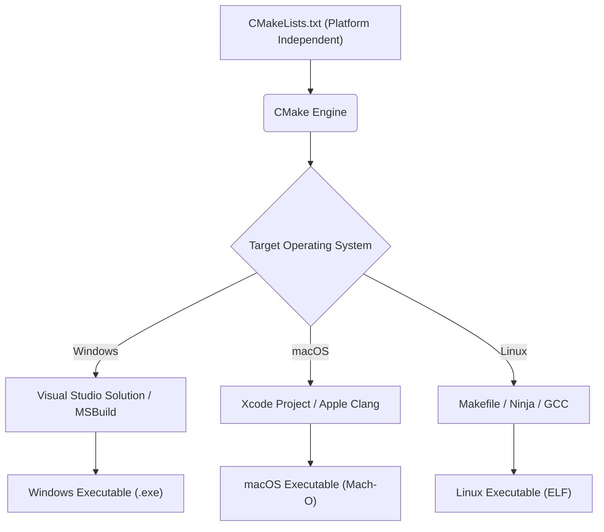
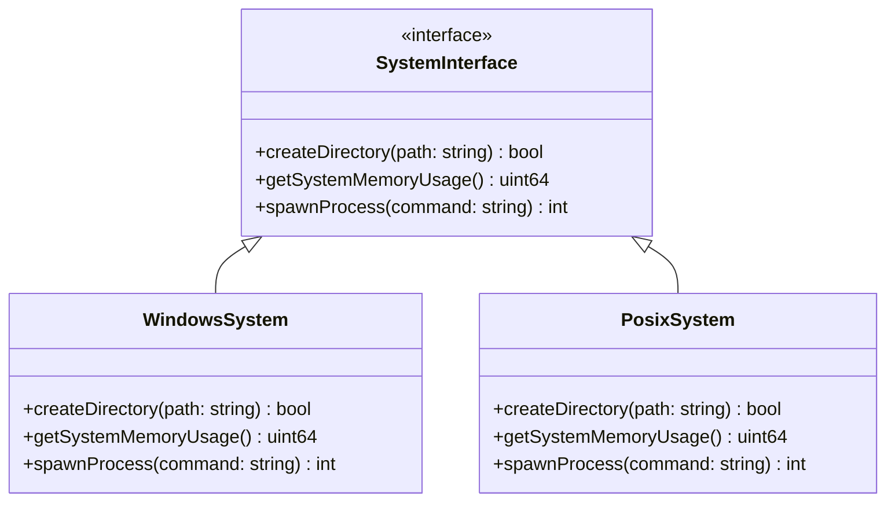
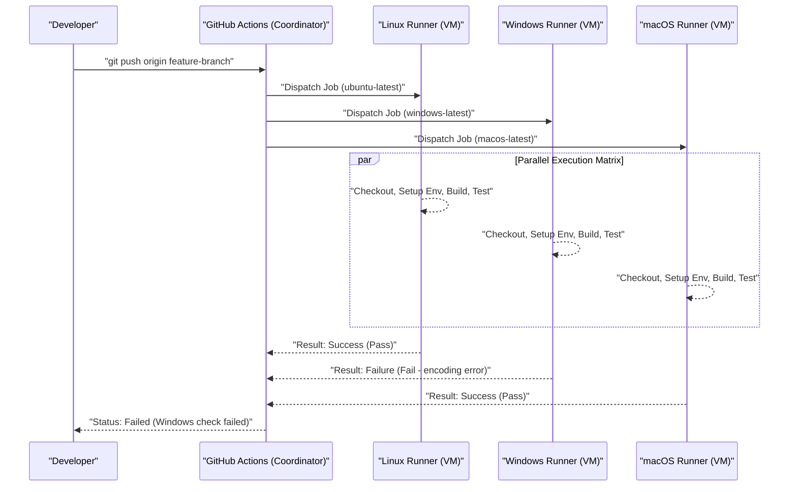

Cross-platform development spanning multiple operating systems (OS) such as Mac (macOS), Windows, and even Linux (including WSL) is an unavoidable path in modern software engineering. When building web development, mobile app backends, or cross-platform desktop apps (Electron, Tauri, Qt, etc.), if a team uses different OSs, you will encounter numerous "bugs caused by OS differences."

Each OS has its own historical background and design philosophy. Windows has a unique architecture derived from MS-DOS (Win32 API, NT Kernel), while macOS is based on UNIX (FreeBSD-based Darwin), and Linux conforms to POSIX standards. These fundamental differences create "pitfalls" that plague developers in all situations, such as file systems, networking, and process handling.

In this article, we will provide extremely detailed and practical explanations of the technical differences and best practices you absolutely need to know for development teams with a mix of Mac and Windows, or application development targeting both OSs.

---

## 1. The Line Ending Pitfall (CRLF vs LF) and Strict Git Configuration

One of the most frequent causes of confusion in team development is the issue of "Line Endings". This is a historical problem dating back to the typewriter era.

*   **Windows**: Uses **CRLF**, a combination of Carriage Return (CR, `\r`, `0x0D`) and Line Feed (LF, `\n`, `0x0A`), as the standard line ending.
*   **macOS / Linux**: Uses **LF**, which is a Line Feed alone, as the standard line ending. (*Up to the early Mac OS 9, it was CR alone, but since Mac OS X it became UNIX-based and uses LF).

Because of this difference, when sharing source code in a Git repository, differences (diffs) can extend to the entire file, or a shell script (`.sh`) intended to run in a Linux environment can become CRLF by being edited on Windows, causing `\r` to be interpreted as an invalid character at runtime, leading to errors like `\r: command not found`.

### Solution in Git: Management with `.gitattributes`

Git has a setting called `core.autocrlf`, but relying on it is dangerous. Because it depends on the global settings of individual developers' local machines, troubles are prone to occur due to missing settings when new members join the team.

The best practice is to place a `.gitattributes` file in the root directory of the repository and explicitly define the handling of line endings at the repository level. This guarantees consistent behavior no matter which environment it is cloned in.

```gitattributes
# Treat as text files by default, and normalize to LF in the repository (Git database)
# It will be converted to each OS's standard line ending upon checkout
* text=auto

# However, for specific extensions like source code, always force LF regardless of the OS
*.sh text eol=lf
*.py text eol=lf
*.cpp text eol=lf
*.hpp text eol=lf
*.js text eol=lf
*.json text eol=lf

# Force CRLF for Windows-specific batch files, etc.
*.cmd text eol=crlf
*.bat text eol=crlf

# Do not convert line endings for files such as images and pre-built binaries (prevents corruption)
*.png binary
*.jpg binary
*.pdf binary
```

---

## 2. File System Case Sensitivity

Case sensitivity in file systems is also one of the biggest hurdles in cross-platform development.

*   **macOS (APFS / HFS+)**: By default, **Case-Insensitive** but **Case-Preserving**. That is, if saved as `File.txt`, it will be displayed as `File.txt`, but you can also load it by accessing it as `file.txt` from a program.
*   **Windows (NTFS)**: Similar to macOS, it is **Case-Insensitive** and **Case-Preserving** by default.
*   **Linux / WSL (ext4 etc.)**: **Strictly Case-Sensitive**. `File.txt` and `file.txt` can coexist in the same directory as completely different files.

### Typical Bugs that Occur

When developing on Mac or Windows, even if you specify `#include "myclass.h"` (or `import "./myclass"`) in lowercase in the source code, if the actual file is `MyClass.h`, the build will succeed because the local OS is Case-Insensitive.

However, if you commit this code and run the build on a CI/CD server (usually Linux such as Ubuntu), you will get a "file not found" compilation error because the ext4 file system of Linux is Case-Sensitive.

### Algorithmic Perspective: File Search Complexity and Normalization

Let's think mathematically about what kind of processing takes place internally when a file system resolves a file path.

In the case of case-sensitive ext4, the entries in the directory are managed by structures such as hash tables or B-Trees. Assuming the number of files in the directory is $N$ and the length of the file name is $L$, the computational complexity for a simple binary search or tree search is as follows.

$$ T_{search}(N) = O(L \log N) $$

On the other hand, in case-insensitive file systems like NTFS and APFS, it is necessary to process Case Folding, which normalizes both strings to the same case (uppercase or lowercase) before comparing the strings. Case conversion considering Unicode normalization and locales cannot be completed with simple ASCII bit operations, and requires a table lookup.

Assuming the calculation cost of the conversion function is a constant $C_{fold}$, an extra overhead is incurred for each string comparison.

$$ T_{insensitive\_search}(N) = O( (L \times C_{fold}) \log N ) $$

Recent OSs highly cache this, but the fundamental behavioral difference can only be restricted by development conventions. The safest approach is to establish a project convention: **"Unify all file names and directory names to lowercase and hyphens (kebab-case) or underscores (snake-case)."**

---

## 3. Path Separators and File Path Abstraction

The handling of separators indicating the hierarchy of directories reflects a fundamental difference between OSs.

*   **Windows**: Uses a backslash `\` (which appears as a yen symbol `¥` depending on the font in Japanese environments), and also has the concepts of drive letters (e.g., `C:\`) and UNC paths (e.g., `\\Server\Share`).
*   **macOS / Linux**: Uses a slash `/`, and all file systems have a Single Root Hierarchy starting from a single root `/`.

Many programming languages will interpret `/` as a file separator even on Windows (partly because the Win32 API itself supports `/`). However, it can cause fatal errors when passing paths as command-line arguments, invoking system calls directly, or comparing/parsing paths as strings.

### Best Practices by Language (OS Abstraction)

**Absolutely avoid** constructing file paths through string concatenation (e.g., `path + "\\" + filename`). Use the standard libraries for path manipulation (OS Abstraction Layer) provided in each language.

#### Example in C++ (`std::filesystem`)
In C++17 and later, `<filesystem>` was introduced, making it possible to abstract path differences between platforms.

```cpp
#include <iostream>
#include <filesystem>

namespace fs = std::filesystem;

int main() {
    // Constructing an OS-independent path (abstraction via operator overloading)
    fs::path dir = "data";
    fs::path file = "config.json";
    fs::path full_path = dir / file; // Becomes "data\config.json" on Windows, "data/config.json" on Mac/Linux

    std::cout << "Full path: " << full_path.string() << std::endl;
    return 0;
}
```

#### Example in Python (`pathlib`)
In the past, `os.path.join()` was used, but today it is standard to use the object-oriented `pathlib` module.

```python
from pathlib import Path

# The / operator is overridden to generate a path object tailored to the OS
base_dir = Path("user_data")
config_file = base_dir / "settings" / "app.ini"

# Path resolution and file reading are also possible with consistent methods
if config_file.exists():
    text = config_file.read_text(encoding="utf-8")
```

#### Example in Node.js (`path` module)

```javascript
const path = require('path');

// path.join takes arguments and joins them with the appropriate separator for the current OS
const configPath = path.join('config', 'default.json');
console.log(configPath); 
// Windows: "config\default.json"
// macOS/Linux: "config/default.json"
```

---

## 4. Character Encoding (UTF-8 vs CP932/Shift-JIS) and the Unicode Barrier

The biggest headache in Japanese environments on Windows is character encoding.
In modern development, macOS and Linux are entirely unified to **UTF-8** throughout the system, terminal, and file encodings. However, the standard encoding of the Japanese version of Windows ("ANSI Code Page" based on system locale) still often operates with **CP932 (Microsoft extension of Shift-JIS)** as the default.
*The internal string representation of the Win32 API is UTF-16LE (`wchar_t`).

When reading and writing files in Python and other languages, if the encoding is not explicitly specified, Windows attempts to interpret it according to the result of `locale.getpreferredencoding()` (CP932). As a result, attempting to read a file saved in UTF-8 can cause a `UnicodeDecodeError` or result in garbled text (Mojibake).

### Mathematical Model of Character Encoding Conversion and Overhead

When converting a string from one encoding (UTF-8) to another (UTF-16 or CP932), the worst-case computational complexity is proportional to the length of the string. If the byte length of the string is $B$, the complexity of the conversion is $O(B)$. However, the parsing of the variable-length encoding UTF-8, surrogate pair calculations, and conversion table lookups cause overhead that cannot be ignored.

Assuming the string length is $N$, the mapping function from multi-byte characters to Unicode code points is $f_{decode}$, and the mapping function from code points to the target encoding is $f_{encode}$, the total conversion time $T_{conv}$ is approximated as follows.

$$ T_{conv} = \sum_{i=1}^{N} \Big( C_{decode} \cdot f_{decode}(x_i) + C_{encode} \cdot f_{encode}(y_i) \Big) \approx O(N) $$

In cross-platform applications, you must be aware that this conversion cost is incurred every time a native OS API is called (crossing an I/O boundary) (especially when developing in C++ for Windows, conversions to UTF-16 using `MultiByteToWideChar` etc. frequently occur).

### Countermeasures for Encoding

The most reliable countermeasure is to **"always explicitly specify UTF-8 at all times."**

```python
# Good example in Python: Always specify encoding="utf-8"
with open("data.txt", "w", encoding="utf-8") as f:
    f.write("Hello, World!")
```

Additionally, to display UTF-8 output correctly in a Windows terminal (Command Prompt or PowerShell), you may need workarounds such as setting the environment variable `PYTHONUTF8=1` when launching the application, or temporarily changing the console's code page to UTF-8 using the `chcp 65001` command for Node.js.

---

## 5. Environment Variables and Shell Environment Differences (bash/zsh vs PowerShell)

The difference in shells (command-line interpreters) when running build scripts or development tools is also a major barrier in cross-platform development.

*   **macOS / Linux**: `bash` or `zsh` are mainstream. They perform text-based pipeline processing.
*   **Windows**: Command Prompt (`cmd.exe`) or `PowerShell`. PowerShell is .NET-based and has a powerful object-oriented pipeline, but its syntax is completely different from POSIX shells.

Because the methods for referencing and setting environment variables differ, writing OS-dependent code in the `scripts` section of Node.js's `package.json` will cause it to break in other environments.

```json
// ❌ Bad example: On Windows, "NODE_ENV" is not recognized as a command, resulting in an error
"scripts": {
  "build": "NODE_ENV=production webpack"
}
```

### Solution: Utilizing Cross-Platform Tools

In a Node.js environment, use packages like `cross-env` to abstract the setting of environment variables.

```json
// ✅ Good example: cross-env absorbs OS differences and sets the environment variable appropriately before launching webpack
"scripts": {
  "build": "cross-env NODE_ENV=production webpack",
  "clean": "rimraf dist/" // Use a cross-platform remover instead of rm -rf
}
```

If a large-scale project requires complex shell scripts, the current best practice is to make the use of WSL (Windows Subsystem for Linux) or Git Bash standard for developers on Windows environments, and uniformly manage all batch processing as `.sh` scripts.

---

## 6. Cross-Platform Build Systems and Compilers

When dealing with native code (languages compiled directly into machine code) such as C++ and Rust, you must overcome not only OS-specific APIs but also differences in build systems and compilers.

*   **Compilers**:
    *   Windows: MSVC (Microsoft Visual C++), MinGW (GCC for Windows)
    *   macOS: Apple Clang
    *   Linux: GCC, Clang
*   **Binary Formats**:
    *   Windows: PE (Portable Executable) `.exe` / `.dll`
    *   macOS: Mach-O
    *   Linux: ELF (Executable and Linkable Format) `.so`

### Utilizing Meta-Build Systems with CMake

In C/C++ projects, the global de facto standard for achieving cross-platform compatibility is **CMake**. CMake does not compile source code directly, but functions as a "Generator" that generates native build configuration files tailored to each environment (Visual Studio solution files for Windows, Makefile or Ninja build scripts for Linux/Mac).



By using CMake, you can absorb environmental differences and generate the optimal binaries for each OS from a single configuration file (`CMakeLists.txt`). Resolving dependencies (`find_package`) and linking OS-specific libraries can also be easily written using conditional branching.

```cmake
# Example part of CMakeLists.txt
if(WIN32)
    # Link Windows-specific libraries (such as WS2_32.lib)
    target_link_libraries(my_app PRIVATE ws2_32)
    add_compile_definitions(OS_WINDOWS)
elseif(APPLE)
    # Link macOS-specific frameworks
    target_link_libraries(my_app PRIVATE "-framework Foundation")
    add_compile_definitions(OS_MACOS)
elseif(UNIX AND NOT APPLE)
    # Links for Linux (such as pthread)
    target_link_libraries(my_app PRIVATE pthread)
    add_compile_definitions(OS_LINUX)
endif()
```

---

## 7. Utilizing Architecture Patterns: OS Abstraction Layer (OSAL)

Completely separating system-dependent processing (file operations, process/thread creation, memory management, socket communication, etc.) from the core business logic of the application is the cornerstone of cross-platform development.

To achieve this, we use a pattern called the **OS Abstraction Layer (OSAL)**.

Below is an example of class design that wraps the specific APIs of each OS and provides a common interface. Implementations are switched using polymorphism or compile-time macro switches.



By isolating platform-specific code in one place (usually directories like `src/platform/windows/` or `src/platform/posix/`), you can keep the remaining 95% of the code (GUI logic, data processing, communication protocol parsing, etc.) completely cross-platform and testable.

---

## 8. Cross-Platform Verification in CI/CD (Matrix Build)

No matter how carefully developers code in their local environment, the ultimate stronghold for cross-platform support is the **CI/CD (Continuous Integration / Continuous Deployment) pipeline**. There is no end to cases where code runs in the local environment (e.g., Mac) but results in compilation errors on other OSs (Windows).

Utilize modern CI tools such as GitHub Actions or GitLab CI, and set up a Matrix Build that **executes builds and tests in parallel on all Windows, macOS, and Linux environments** every time a Pull Request is created.

```yaml
# Example cross-platform CI setup with GitHub Actions
name: Cross-Platform Build and Test

on: [push, pull_request]

jobs:
  build:
    runs-on: ${{ matrix.os }}
    strategy:
      fail-fast: false # Continue testing on other OSs even if one OS fails
      matrix:
        # Specify three runners: Windows, macOS, and Linux
        os: [ubuntu-latest, windows-latest, macos-latest]

    steps:
    - uses: actions/checkout@v3
    - name: Set up Python Environment
      uses: actions/setup-python@v4
      with:
        python-version: '3.11'
        cache: 'pip' # Cache dependencies across platforms
        
    - name: Install dependencies
      run: python -m pip install --upgrade pip && pip install -r requirements.txt
      
    - name: Run Test Suite
      run: pytest -v
```

Visualizing this CI/CD flow looks like the following.



By automatically collecting the test results on each OS and configuring branch protection rules to **allow merging into the main branch only if all environments turn green (success)**, you can proactively prevent platform-dependent bugs from slipping into the production environment or release builds.

---

## Summary

Cross-platform development for Mac and Windows has a wide variety of challenges rooted in historical backgrounds.

1.  **Line Endings**: Force repository-level normalization (such as LF unification) using `.gitattributes`.
2.  **Case Sensitivity**: Do not rely on the "case-insensitive" behavior of macOS/Windows; establish strict file naming conventions and practice strict case matching.
3.  **Path Separators**: Utilize standard language path manipulation APIs (`std::filesystem`, `pathlib`, `path` module) to absorb OS differences.
4.  **Encoding**: Always specify UTF-8 and thoroughly eliminate the influence of CP932, the default behavior in Windows.
5.  **Environment Variables & Shells**: Use abstraction tools like `cross-env` or unify the execution environment to WSL/Docker, etc.
6.  **Build Systems**: For C/C++, utilize meta-build systems like CMake to generate the optimal native toolchain for each OS.
7.  **OS-Dependent Code**: Design an OS Abstraction Layer (OSAL) to separate and isolate platform-dependent logic.
8.  **CI/CD**: Introduce matrix builds to automate clean builds and testing across all target OSs, eliminating person-dependency.

Today, powerful frameworks such as Electron, Tauri, and .NET absorb many of these differences, but knowledge of the native behavior of the underlying OS (file systems and encoding) remains indispensable when resolving severe performance issues or obscure bugs. By sharing and strictly enforcing these best practices across the team from the early stages of a project, you can significantly reduce unproductive debugging time caused by OS differences and focus on essential software value creation.
