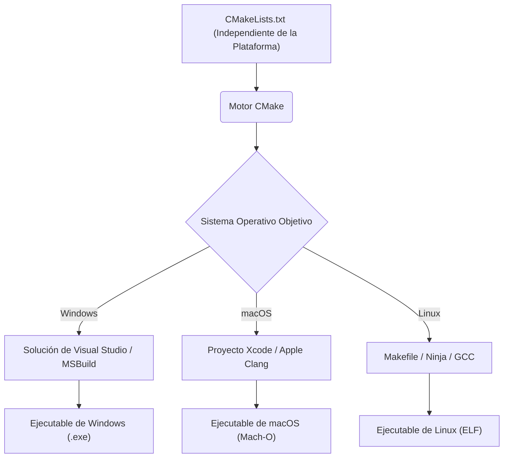
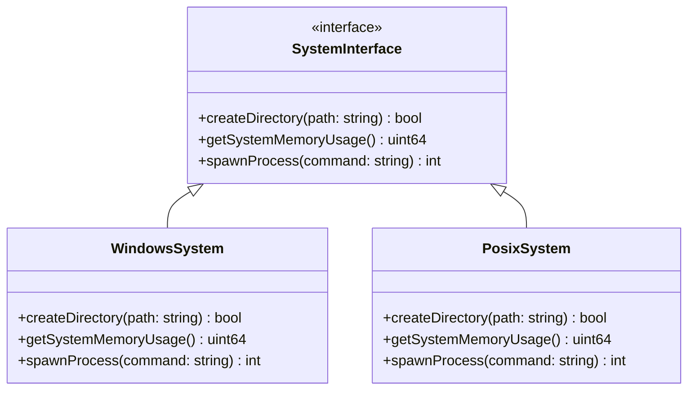
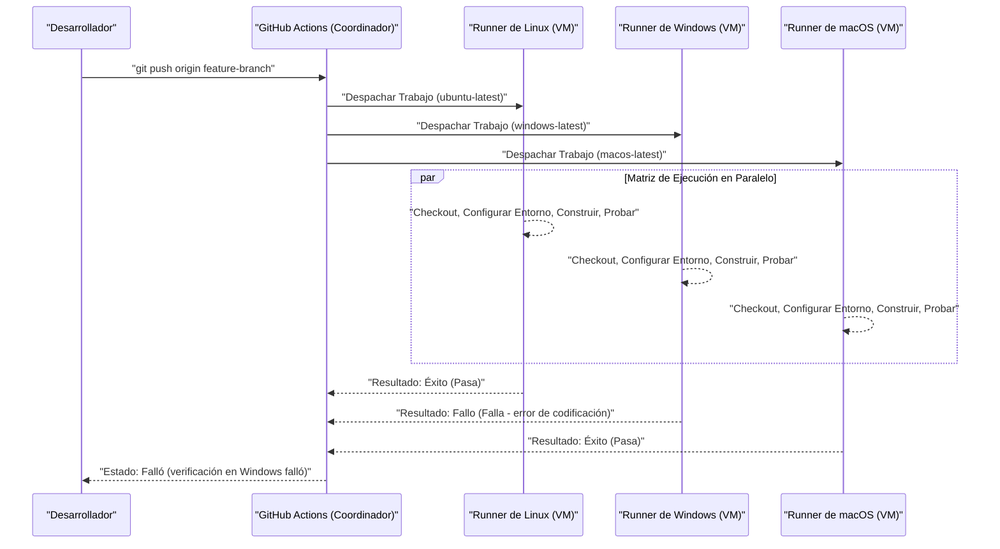

El desarrollo multiplataforma a través de múltiples sistemas operativos (SO) como Mac (macOS), Windows e incluso Linux (incluyendo WSL), es un camino inevitable en la ingeniería de software moderna. Al construir desarrollo web, backends de aplicaciones móviles, o aplicaciones de escritorio multiplataforma (Electron, Tauri, Qt, etc.), si se utilizan diferentes sistemas operativos dentro del equipo, te encontrarás con numerosos "errores causados por diferencias del SO".

Cada SO tiene un trasfondo histórico y filosofía de diseño diferentes. Windows tiene su propia arquitectura derivada de MS-DOS (API Win32, kernel NT), mientras que macOS se basa en UNIX (Darwin basado en FreeBSD), y Linux cumple con el estándar POSIX. Esta diferencia fundamental crea "trampas" que atormentan a los desarrolladores en todo tipo de situaciones como sistemas de archivos, redes y manejo de procesos.

En este artículo, explicaremos de forma extremadamente detallada y práctica las diferencias técnicas y las mejores prácticas que debes conocer absolutamente en equipos de desarrollo donde se mezclan Mac y Windows, o en el desarrollo de aplicaciones dirigidas a ambos SO.

---

## 1. La trampa de los códigos de nueva línea (CRLF vs LF) y la configuración estricta de Git

Una de las causas más frecuentes y que provoca más caos en el desarrollo en equipo es el problema de los "códigos de nueva línea (Line Endings)". Este es un problema histórico que se remonta a la era de las máquinas de escribir.

*   **Windows**: Utiliza **CRLF**, que es una combinación de retorno de carro (CR, `\r`, `0x0D`) y salto de línea (LF, `\n`, `0x0A`), como su código de nueva línea estándar.
*   **macOS / Linux**: Utiliza **LF**, que es solo un salto de línea, como su código de nueva línea estándar. (※Hasta los primeros Mac OS 9 era solo CR, pero a partir de Mac OS X se basó en UNIX y cambió a LF).

Debido a esta diferencia, al compartir código fuente dentro de un repositorio Git, la diferencia (diff) puede abarcar todo el archivo, o un script de shell (`.sh`) pensado para ejecutarse en un entorno Linux puede convertirse a CRLF porque fue editado en Windows, causando errores durante la ejecución donde `\r` se interpreta como un carácter inválido provocando un error como `\r: command not found`.

### Solución en Git: Gestión mediante `.gitattributes`

Git tiene una configuración llamada `core.autocrlf`, pero depender de esto es peligroso. Esto se debe a que depende de la configuración global de la máquina local individual de cada desarrollador, por lo que es probable que ocurran problemas por falta de configuración cuando nuevos miembros se unen al equipo.

La mejor práctica es colocar un archivo `.gitattributes` en el directorio raíz del repositorio y definir explícitamente el manejo de los códigos de nueva línea a nivel de repositorio. Esto garantiza un comportamiento consistente independientemente del entorno en el que se clone.

```gitattributes
# Por defecto se trata como archivo de texto, y se normaliza a LF dentro del repositorio (en la base de datos de Git)
# Se convierte al código de nueva línea estándar de cada SO al hacer checkout
* text=auto

# Sin embargo, ciertas extensiones específicas como el código fuente, siempre fuerzan LF independientemente del SO
*.sh text eol=lf
*.py text eol=lf
*.cpp text eol=lf
*.hpp text eol=lf
*.js text eol=lf
*.json text eol=lf

# Los archivos batch exclusivos de Windows fuerzan CRLF
*.cmd text eol=crlf
*.bat text eol=crlf

# Archivos como imágenes o binarios compilados no sufrirán conversión de códigos de nueva línea (para prevenir daños)
*.png binary
*.jpg binary
*.pdf binary
```

---

## 2. Sensibilidad a mayúsculas y minúsculas en el sistema de archivos (Case Sensitivity)

La distinción entre mayúsculas y minúsculas (Case Sensitivity) en los sistemas de archivos también es uno de los mayores obstáculos en el desarrollo multiplataforma.

*   **macOS (APFS / HFS+)**: Por defecto **no distingue entre mayúsculas y minúsculas (Case-Insensitive)**, pero **preserva el estado (Case-Preserving)**. Es decir, si se guarda como `File.txt` se mostrará como `File.txt`, pero también puedes acceder a él programáticamente leyéndolo como `file.txt`.
*   **Windows (NTFS)**: Al igual que macOS, por defecto **no distingue entre mayúsculas y minúsculas (Case-Insensitive)** y es **Case-Preserving**.
*   **Linux / WSL (ext4, etc.)**: **Distingue completamente entre mayúsculas y minúsculas (Case-Sensitive)**. `File.txt` y `file.txt` pueden coexistir en el mismo directorio como archivos completamente diferentes.

### Errores típicos que ocurren

Al desarrollar en Mac o Windows, incluso si especificas `#include "myclass.h"` (o `import "./myclass"`) en minúsculas en tu código fuente, si el archivo real es `MyClass.h`, la compilación tendrá éxito porque el SO del entorno local es Case-Insensitive.

Sin embargo, si haces commit de este código y ejecutas la compilación en un servidor CI/CD (normalmente un Linux como Ubuntu), el sistema de archivos ext4 de Linux es Case-Sensitive, lo que resultará en un error de compilación de "archivo no encontrado".

### Perspectiva algorítmica: Complejidad de búsqueda de archivos y normalización

Pensemos matemáticamente en el procesamiento interno que se realiza cuando el sistema de archivos resuelve la ruta de un archivo.

En el caso de ext4 que distingue entre mayúsculas y minúsculas, las entradas en un directorio se gestionan en estructuras como tablas hash o B-Tree. Si el número de archivos en un directorio es $N$ y la longitud del nombre del archivo es $L$, la complejidad computacional en el caso de una búsqueda binaria simple o de árbol es la siguiente:

$$ T_{search}(N) = O(L \log N) $$

Por otro lado, en sistemas de archivos que no distinguen entre mayúsculas y minúsculas como NTFS o APFS, es necesario un proceso de normalización (Case Folding) para convertir ambas cadenas de texto a un mismo caso (mayúsculas o minúsculas) antes de compararlas. La conversión de mayúsculas y minúsculas que tiene en cuenta la normalización Unicode y la localización no se puede resolver con simples operaciones de bits ASCII, sino que requiere búsquedas en tablas (table lookup).

Si la constante de coste computacional de la función de conversión es $C_{fold}$, se añade un sobrecoste adicional por cada comparación de cadenas de texto.

$$ T_{insensitive\_search}(N) = O( (L \times C_{fold}) \log N ) $$

Los SO modernos lo almacenan en caché (cache) de forma avanzada, pero las diferencias fundamentales de comportamiento solo se pueden limitar mediante reglas a nivel de desarrollo. **"Unificar todos los nombres de archivos y directorios con minúsculas y guiones (kebab-case) o guiones bajos (snake_case)"** es el enfoque más seguro al establecer reglas en el proyecto.

---

## 3. Separadores de ruta (Path Separators) y abstracción de rutas de archivos

El manejo de los caracteres separadores que indican la jerarquía de directorios refleja las diferencias fundamentales entre los SO.

*   **Windows**: Utiliza la barra invertida `\` (dependiendo de la fuente en entornos japoneses, puede mostrarse como el símbolo del yen `¥`), y además existen conceptos como letras de unidad (ej. `C:\`) o rutas UNC (ej. `\\Server\Share`).
*   **macOS / Linux**: Utiliza la barra normal `/`, y todos los sistemas de archivos tienen una estructura jerárquica a partir de una única raíz `/` (Single Root Hierarchy).

Muchos lenguajes de programación interpretan `/` correctamente como un separador de archivos incluso en Windows (ya que la propia API Win32 soporta `/` en algunas partes). Sin embargo, al pasar rutas como argumentos de línea de comandos, al invocar llamadas del sistema directamente, o al comparar o analizar rutas como cadenas de texto, esto causa errores fatales.

### Mejores prácticas por lenguaje (Abstracción del SO)

Construir rutas de archivos mediante concatenación de cadenas de texto (ej. `path + "\\" + filename`) debe **evitarse absolutamente**. Se deben utilizar las bibliotecas estándar de manipulación de rutas (Capa de Abstracción del SO) preparadas para cada lenguaje.

#### Ejemplo en C++ (`std::filesystem`)
A partir de C++17 se introdujo `<filesystem>`, que permite abstraer las diferencias de rutas entre plataformas.

```cpp
#include <iostream>
#include <filesystem>

namespace fs = std::filesystem;

int main() {
    // Construcción de rutas independientes del SO (abstracción mediante sobrecarga de operadores)
    fs::path dir = "data";
    fs::path file = "config.json";
    fs::path full_path = dir / file; // En Windows será "data\config.json", en Mac/Linux será "data/config.json"

    std::cout << "Full path: " << full_path.string() << std::endl;
    return 0;
}
```

#### Ejemplo en Python (`pathlib`)
Antiguamente se usaba `os.path.join()`, pero actualmente lo estándar es utilizar el módulo orientado a objetos `pathlib`.

```python
from pathlib import Path

# El operador / está sobrecargado, generando un objeto de ruta adecuado para el SO
base_dir = Path("user_data")
config_file = base_dir / "settings" / "app.ini"

# La resolución de rutas y lectura de archivos también se pueden hacer con métodos consistentes
if config_file.exists():
    text = config_file.read_text(encoding="utf-8")
```

#### Ejemplo en Node.js (módulo `path`)

```javascript
const path = require('path');

// path.join toma los argumentos y los combina con el carácter separador adecuado para el SO actual
const configPath = path.join('config', 'default.json');
console.log(configPath); 
// Windows: "config\default.json"
// macOS/Linux: "config/default.json"
```

---

## 4. Codificación de caracteres (UTF-8 vs CP932/Shift-JIS) y la barrera de Unicode

El mayor dolor de cabeza en entornos de Windows en japonés es la codificación de caracteres.
En el desarrollo moderno, macOS y Linux están completamente unificados en **UTF-8**, desde todo el sistema y la terminal hasta la codificación de archivos. Sin embargo, la codificación estándar (la "página de códigos ANSI" basada en la configuración regional del sistema) de las versiones en japonés de Windows a menudo funciona con **CP932 (la extensión de Microsoft de Shift-JIS)** como predeterminada en muchas situaciones.
※La representación interna de cadenas en la API Win32 es UTF-16LE (`wchar_t`).

Al leer o escribir archivos con Python, si no se especifica la codificación, Windows intentará interpretarla según el resultado de `locale.getpreferredencoding()` (CP932). Debido a esto, si intentas leer un archivo guardado en UTF-8, se producirá un `UnicodeDecodeError`, o los caracteres se corromperán (Mojibake).

### Modelo matemático de conversión de códigos de caracteres y sobrecoste

Cuando se convierte una cadena de una codificación (UTF-8) a otra (UTF-16 o CP932), la complejidad temporal en el peor de los casos es proporcional a la longitud de la cadena. Si la longitud de la cadena en bytes es $B$, la complejidad computacional de la conversión es $O(B)$. Sin embargo, debido al análisis (parsing) de UTF-8, que es una codificación de longitud variable, el cálculo de los pares subrogados y la búsqueda (Lookup) en las tablas de conversión, se produce un sobrecoste que no se puede ignorar.

Si la longitud de la cadena de texto es $N$, la función de mapeo de caracteres multibyte a puntos de código Unicode es $f_{decode}$, y la función de mapeo de puntos de código a la codificación de destino es $f_{encode}$, el tiempo total de conversión $T_{conv}$ se aproxima de la siguiente manera:

$$ T_{conv} = \sum_{i=1}^{N} \Big( C_{decode} \cdot f_{decode}(x_i) + C_{encode} \cdot f_{encode}(y_i) \Big) \approx O(N) $$

En aplicaciones multiplataforma, es necesario tener en cuenta que este coste de conversión se produce cada vez que se llama a una API nativa del SO (cruzando los límites de I/O) (especialmente al desarrollar en C++ para Windows, a menudo ocurren conversiones a UTF-16 mediante `MultiByteToWideChar` y otros métodos similares).

### Medidas relativas a la codificación

La medida más segura es **"especificar siempre explícitamente UTF-8 en todo momento"**.

```python
# Un buen ejemplo en Python: Especificar siempre encoding="utf-8"
with open("data.txt", "w", encoding="utf-8") as f:
    f.write("¡Hola, mundo!")
```

Además, para que la salida UTF-8 se muestre correctamente en la terminal de Windows (Símbolo del sistema o PowerShell), puede ser necesario tomar medidas como establecer la variable de entorno `PYTHONUTF8=1` al iniciar la aplicación, o en el caso de Node.js, cambiar temporalmente la página de códigos de la consola a UTF-8 usando el comando `chcp 65001`.

---

## 5. Variables de entorno y diferencias en el entorno del shell (bash/zsh vs PowerShell)

La diferencia en los shells (intérpretes de línea de comandos) al ejecutar scripts de construcción (build) o herramientas de desarrollo también es una gran barrera en el entorno multiplataforma.

*   **macOS / Linux**: `bash` o `zsh` son predominantes. Realizan un procesamiento de conductos (pipeline) basado en texto.
*   **Windows**: Símbolo del sistema (`cmd.exe`) o `PowerShell`. PowerShell está basado en .NET y tiene un potente pipeline orientado a objetos, pero su sintaxis es completamente diferente a la de los shells POSIX.

Como la forma de referenciar o establecer las variables de entorno difiere, si utilizas un formato dependiente del SO en el área `scripts` del archivo `package.json` de Node.js, no funcionará en otros entornos.

```json
// ❌ Mal ejemplo: En Windows no se reconoce como un comando "NODE_ENV" y dará error
"scripts": {
  "build": "NODE_ENV=production webpack"
}
```

### Solución: Utilizar herramientas para entornos multiplataforma

En el entorno de Node.js, abstrae la configuración de las variables de entorno utilizando paquetes como `cross-env`.

```json
// ✅ Buen ejemplo: cross-env absorbe las diferencias del SO, establece las variables de entorno adecuadamente e inicia webpack
"scripts": {
  "build": "cross-env NODE_ENV=production webpack",
  "clean": "rimraf dist/" // Usar un borrador multiplataforma en lugar de rm -rf
}
```

Para proyectos a gran escala donde se requieren scripts de shell complejos, la mejor práctica actual es normalizar el uso de WSL (Windows Subsystem for Linux) o Git Bash también para los desarrolladores en entornos Windows, y gestionar de forma centralizada todos los procesos por lotes (batch) como scripts `.sh`.

---

## 6. Sistemas de compilación y compiladores multiplataforma

Al trabajar con código nativo (lenguajes que se compilan directamente a código máquina) como C++ o Rust, es necesario superar no solo las APIs específicas del SO, sino también las diferencias en los sistemas de compilación y los compiladores.

*   **Compiladores**:
    *   Windows: MSVC (Microsoft Visual C++), MinGW (GCC para Windows)
    *   macOS: Apple Clang
    *   Linux: GCC, Clang
*   **Formatos de binarios**:
    *   Windows: PE (Portable Executable) `.exe` / `.dll`
    *   macOS: Mach-O
    *   Linux: ELF (Executable and Linkable Format) `.so`

### Utilización del sistema de meta-construcción con CMake

En proyectos C/C++, el estándar de facto a nivel mundial para lograr compatibilidad multiplataforma es **CMake**. CMake no compila el código fuente directamente, sino que funciona como un "Generador (Generator)" que crea archivos de configuración de construcción (build) nativos adecuados para cada entorno (archivos de solución de Visual Studio en Windows, o scripts de construcción de Makefile o Ninja en Linux/Mac).



Mediante el uso de CMake, puedes absorber las diferencias entre entornos y generar binarios óptimos para cada SO a partir de un único archivo de configuración (`CMakeLists.txt`). También puedes describir fácilmente la resolución de bibliotecas dependientes (`find_package`) y la vinculación de bibliotecas específicas para cada SO mediante ramificaciones condicionales (condicionales lógicos).

```cmake
# Ejemplo de una parte de CMakeLists.txt
if(WIN32)
    # Vincular bibliotecas específicas de Windows (como WS2_32.lib)
    target_link_libraries(my_app PRIVATE ws2_32)
    add_compile_definitions(OS_WINDOWS)
elseif(APPLE)
    # Vincular frameworks específicos de macOS
    target_link_libraries(my_app PRIVATE "-framework Foundation")
    add_compile_definitions(OS_MACOS)
elseif(UNIX AND NOT APPLE)
    # Enlaces para Linux (como pthread)
    target_link_libraries(my_app PRIVATE pthread)
    add_compile_definitions(OS_LINUX)
endif()
```

---

## 7. Utilización de patrones de arquitectura: Capa de Abstracción del SO (OSAL)

Separar completamente los procesos que dependen del sistema (manipulación de archivos, creación de procesos/hilos, gestión de memoria, comunicación por sockets, etc.) de la lógica de negocio central de la aplicación, es la clave para el desarrollo multiplataforma.

Para lograr esto, utilizamos el patrón llamado **Capa de Abstracción del SO (OS Abstraction Layer, OSAL)**.

A continuación, se muestra un ejemplo del diseño de una clase que envuelve (wraps) las APIs específicas de cada SO y proporciona una interfaz común. Se utiliza polimorfismo o interruptores macro (macros en tiempo de compilación) para alternar las implementaciones.



Al aislar el código específico de la plataforma de esta manera en un solo lugar (generalmente en un directorio como `src/platform/windows/` o `src/platform/posix/`), se puede mantener el 95% restante del código (lógica GUI, procesamiento de datos, análisis de protocolos de comunicación, etc.) en un estado completamente multiplataforma y comprobable (testable).

---

## 8. Verificación multiplataforma en CI/CD (Construcción Matricial)

No importa cuán cuidadosamente programe un desarrollador en un entorno local, el último bastión del soporte multiplataforma es la **cadena (pipeline) de CI/CD (Integración Continua / Despliegue Continuo)**. Son interminables los casos en los que funciona en un entorno local (por ejemplo, Mac) pero provoca errores de compilación en otro SO (Windows).

Utilicemos herramientas modernas de CI como GitHub Actions o GitLab CI, para configurar una construcción matricial (Matrix Build) que **ejecuta compilaciones y pruebas en paralelo en todos los entornos: Windows, macOS y Linux**, cada vez que se crea un Pull Request.

```yaml
# Ejemplo de configuración CI multiplataforma con GitHub Actions
name: Cross-Platform Build and Test

on: [push, pull_request]

jobs:
  build:
    runs-on: ${{ matrix.os }}
    strategy:
      fail-fast: false # Continuar las pruebas de otros SO incluso si uno falla
      matrix:
        # Especificar tres runners (entornos de ejecución): Windows, macOS y Linux
        os: [ubuntu-latest, windows-latest, macos-latest]

    steps:
    - uses: actions/checkout@v3
    - name: Set up Python Environment
      uses: actions/setup-python@v4
      with:
        python-version: '3.11'
        cache: 'pip' # Guardar en caché dependencias incluso en multiplataforma
        
    - name: Install dependencies
      run: python -m pip install --upgrade pip && pip install -r requirements.txt
      
    - name: Run Test Suite
      run: pytest -v
```

Si visualizamos este flujo de CI/CD, sería así:



Recopila automáticamente los resultados de las pruebas en cada SO, y configura las reglas de protección de rama (branch protection rules) para **permitir fusionar (merge) en la rama main solo cuando esté en verde (éxito) en todos los entornos**, de esta manera evitarás de forma proactiva que errores que dependen de la plataforma se introduzcan en entornos de producción o versiones (builds) de lanzamiento.

---

## Resumen

Existen una amplia gama de desafíos arraigados en los antecedentes históricos para el desarrollo multiplataforma entre Mac y Windows.

1.  **Código de nueva línea (Line Endings)**: Forzar la normalización a nivel de repositorio (como la unificación a LF) mediante `.gitattributes`.
2.  **Sensibilidad a mayúsculas y minúsculas**: No confiar en el comportamiento que "no distingue" de macOS/Windows; establecer reglas estrictas de nomenclatura de archivos y procurar que el emparejamiento (matching) de casos sea estricto.
3.  **Separador de rutas**: Utilizar las APIs estándar del lenguaje para manejar rutas (`std::filesystem`, `pathlib`, módulo `path`) para absorber las diferencias de los SO.
4.  **Codificación**: Especificar siempre UTF-8 de manera explícita y eliminar completamente la influencia del comportamiento predeterminado de Windows que es CP932.
5.  **Variables de entorno / shell**: Usar herramientas de abstracción como `cross-env`, o estandarizar el entorno de ejecución como WSL/Docker, etc.
6.  **Sistema de construcción (Build system)**: En caso de C/C++, aprovechar un sistema de meta-construcción como CMake para generar las cadenas de herramientas nativas óptimas para cada SO.
7.  **Código dependiente del SO**: Diseñar una Capa de Abstracción del SO (OSAL) para separar y aislar la lógica dependiente de la plataforma.
8.  **CI/CD**: Introducir construcciones matriciales (Matrix build) para automatizar una construcción limpia y la realización de pruebas en todos los SO objetivo, y así eliminar dependencias en personas específicas.

En la actualidad, potentes frameworks como Electron, Tauri, .NET, etc. absorben muchas de estas diferencias, pero el conocimiento del comportamiento nativo del sistema operativo subyacente (como el sistema de archivos y codificación) sigue siendo indispensable a la hora de solucionar problemas graves de rendimiento y errores complejos. Compartiendo y reforzando rigurosamente estas mejores prácticas en todo el equipo desde las fases iniciales de un proyecto, se puede reducir de manera significativa la pérdida de tiempo depurando a causa de diferencias en los SO, y enfocarse en la creación de valor intrínseco del software.
