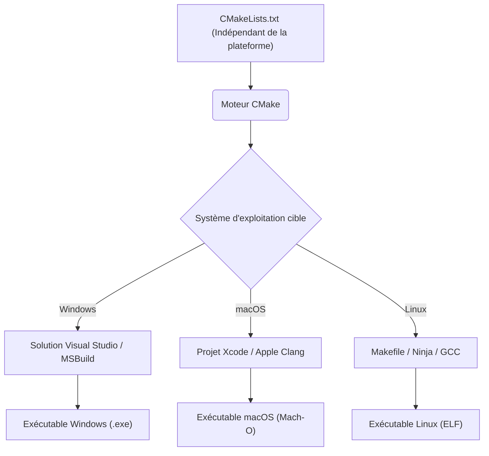
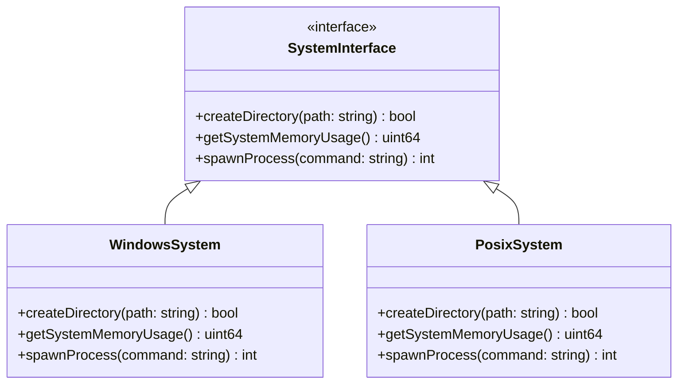
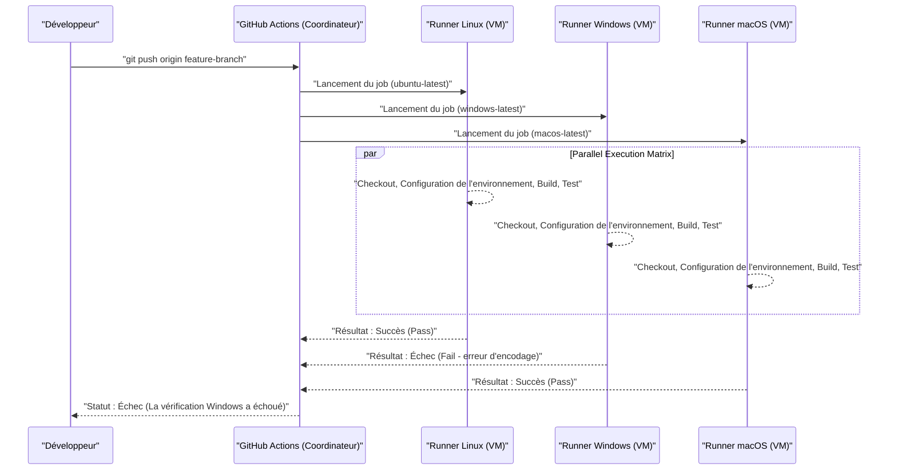

Le développement multiplateforme à travers plusieurs systèmes d'exploitation (OS) tels que Mac (macOS), Windows, et même Linux (y compris WSL), est une étape incontournable de l'ingénierie logicielle moderne. Que ce soit pour le développement web, le backend d'applications mobiles, ou la création d'applications de bureau multiplateformes (Electron, Tauri, Qt, etc.), l'utilisation d'OS différents au sein d'une même équipe vous expose à de nombreux "bugs liés aux différences d'OS".

Chaque OS possède un contexte historique et une philosophie de conception qui lui sont propres. Alors que Windows dispose d'une architecture unique dérivée de MS-DOS (API Win32, noyau NT), macOS est basé sur UNIX (Darwin, basé sur FreeBSD), et Linux est conforme à la norme POSIX. Cette différence fondamentale crée des "pièges" qui tourmentent les développeurs dans tous les domaines, notamment les systèmes de fichiers, le réseau et la gestion des processus.

Dans cet article, nous expliquerons de manière très détaillée et pratique les différences techniques et les meilleures pratiques que vous devez absolument connaître, que ce soit pour les équipes de développement mixtes Mac et Windows ou pour le développement d'applications ciblant les deux OS.

---

## 1. Le piège des caractères de fin de ligne (CRLF vs LF) et la configuration stricte de Git

L'une des causes les plus fréquentes de confusion dans le développement en équipe est le problème des "caractères de fin de ligne (Line Endings)". Il s'agit d'un problème historique remontant à l'époque des machines à écrire.

*   **Windows** : Utilise **CRLF**, une combinaison de retour chariot (CR, `\r`, `0x0D`) et de saut de ligne (LF, `\n`, `0x0A`), comme caractère de fin de ligne standard.
*   **macOS / Linux** : Utilise **LF** (saut de ligne) seul comme caractère de fin de ligne standard. (Note : jusqu'à Mac OS 9, seul CR était utilisé, mais depuis Mac OS X, basé sur UNIX, c'est LF).

En raison de cette différence, lors du partage de code source dans un dépôt Git, les différences (diffs) peuvent s'étendre à l'ensemble du fichier. De même, si un script shell (`.sh`) censé s'exécuter sous Linux est édité sous Windows et passe en CRLF, le `\r` sera interprété comme un caractère non valide à l'exécution, provoquant des erreurs telles que `\r: command not found`.

### La solution dans Git : Gérer avec `.gitattributes`

Bien que Git dispose du paramètre `core.autocrlf`, il est dangereux de s'y fier. Comme cela dépend de la configuration globale de la machine locale de chaque développeur, des problèmes surviennent souvent lorsqu'un nouveau membre rejoint l'équipe avec des paramètres manquants.

La meilleure pratique consiste à placer un fichier `.gitattributes` dans le répertoire racine du dépôt et à définir explicitement la gestion des caractères de fin de ligne au niveau du dépôt. Cela garantit un comportement cohérent, quel que soit l'environnement dans lequel il est cloné.

```gitattributes
# Par défaut, traite comme des fichiers texte et normalise en LF dans le dépôt (base de données Git)
# Converti dans le caractère de fin de ligne standard du système d'exploitation lors du checkout
* text=auto

# Cependant, pour certaines extensions comme le code source, LF est toujours forcé quel que soit l'OS
*.sh text eol=lf
*.py text eol=lf
*.cpp text eol=lf
*.hpp text eol=lf
*.js text eol=lf
*.json text eol=lf

# Pour les fichiers batch exclusifs à Windows, CRLF est forcé
*.cmd text eol=crlf
*.bat text eol=crlf

# Ne pas convertir les caractères de fin de ligne pour les images ou les binaires (pour éviter la corruption)
*.png binary
*.jpg binary
*.pdf binary
```

---

## 2. Sensibilité à la casse du système de fichiers (Case Sensitivity)

La sensibilité à la casse (Case Sensitivity) des systèmes de fichiers est également l'un des plus grands défis du développement multiplateforme.

*   **macOS (APFS / HFS+)** : Par défaut, **ne distingue pas les majuscules et minuscules (Case-Insensitive)**, mais **préserve la casse (Case-Preserving)**. En d'autres termes, si vous l'enregistrez sous `File.txt`, il s'affichera comme `File.txt`, mais vous pourrez toujours le lire depuis un programme en y accédant avec `file.txt`.
*   **Windows (NTFS)** : Comme macOS, il **ne distingue pas les majuscules et minuscules (Case-Insensitive)** par défaut, mais il **préserve la casse (Case-Preserving)**.
*   **Linux / WSL (ext4, etc.)** : **Sensible à la casse (Case-Sensitive)**. `File.txt` et `file.txt` peuvent coexister dans le même répertoire comme deux fichiers totalement différents.

### Bug typique rencontré

Lors du développement sur Mac ou Windows, si vous spécifiez `#include "myclass.h"` (ou `import "./myclass"`) en minuscules dans le code source alors que le fichier réel est `MyClass.h`, la compilation réussira car l'OS de l'environnement local est Case-Insensitive.

Cependant, lorsque vous commitez ce code et exécutez le build sur un serveur CI/CD (généralement Linux comme Ubuntu), le système de fichiers ext4 de Linux étant Case-Sensitive, cela provoquera une erreur de compilation "fichier introuvable".

### Perspective algorithmique : Complexité de la recherche de fichiers et normalisation

Voyons mathématiquement quel processus interne se produit lorsqu'un système de fichiers résout un chemin de fichier.

Dans le cas de ext4, qui distingue les majuscules et minuscules, les entrées dans un répertoire sont gérées par des structures telles que des tables de hachage ou des arbres B (B-Tree). Si le nombre de fichiers dans un répertoire est $N$ et la longueur du nom de fichier est $L$, la complexité d'une simple recherche binaire ou d'une recherche dans l'arbre sera la suivante :

$$ T_{search}(N) = O(L \log N) $$

En revanche, pour les systèmes de fichiers comme NTFS et APFS qui ne font pas la distinction entre les majuscules et minuscules, il est nécessaire de normaliser (Case Folding) les deux chaînes dans la même casse (majuscule ou minuscule) avant de les comparer. La normalisation Unicode et la conversion de casse prenant en compte les paramètres régionaux (locale) ne se limitent pas à de simples opérations sur les bits ASCII, mais nécessitent des recherches dans des tables (table lookup).

Si nous considérons le coût de calcul de la fonction de conversion comme une constante $C_{fold}$, une surcharge (overhead) supplémentaire s'ajoute à chaque comparaison de chaîne.

$$ T_{insensitive\_search}(N) = O( (L \times C_{fold}) \log N ) $$

Les systèmes d'exploitation récents mettent ces données en cache de manière avancée, mais les différences fondamentales de comportement ne peuvent être contraintes que par des règles au niveau du développement. L'approche la plus sûre consiste à établir une règle de projet stipulant que **"tous les noms de fichiers et de répertoires doivent être uniformisés en minuscules et avec des tirets (kebab-case) ou des tirets bas (snake_case)"**.

---

## 3. Séparateurs de chemin (Path Separators) et abstraction des chemins de fichiers

La gestion des caractères de séparation indiquant la hiérarchie des répertoires reflète les différences fondamentales entre les OS.

*   **Windows** : Utilise l'antislash `\` (parfois affiché comme le symbole Yen `¥` selon les polices dans les environnements japonais) et possède également les concepts de lettre de lecteur (ex : `C:\`) et de chemin UNC (ex : `\\Server\Share`).
*   **macOS / Linux** : Utilise le slash `/`, et tous les systèmes de fichiers ont une structure hiérarchique partant d'une racine unique `/` (Single Root Hierarchy).

De nombreux langages de programmation interprètent intelligemment `/` comme un séparateur de fichiers même sous Windows (l'API Win32 elle-même prenant en partie en charge `/`). Cependant, cela provoque des erreurs fatales lors de la transmission de chemins en tant qu'arguments de ligne de commande, lors de l'appel direct d'appels système, ou lors de la comparaison ou de l'analyse de chemins sous forme de chaînes de caractères.

### Meilleures pratiques selon les langages (Abstraction de l'OS)

Évitez **absolument** de construire des chemins de fichiers par concaténation de chaînes (ex : `path + "\\" + filename`). Utilisez les bibliothèques standard de manipulation de chemins (OS Abstraction Layer) fournies par chaque langage.

#### Exemple en C++ (`std::filesystem`)
Depuis C++17, `<filesystem>` a été introduit pour abstraire les différences de chemins entre les plateformes.

```cpp
#include <iostream>
#include <filesystem>

namespace fs = std::filesystem;

int main() {
    // Construction de chemin indépendante de l'OS (abstraction par surcharge d'opérateur)
    fs::path dir = "data";
    fs::path file = "config.json";
    fs::path full_path = dir / file; // Devient "data\config.json" sous Windows et "data/config.json" sous Mac/Linux

    std::cout << "Full path: " << full_path.string() << std::endl;
    return 0;
}
```

#### Exemple en Python (`pathlib`)
Auparavant, `os.path.join()` était utilisé, mais de nos jours, il est standard d'utiliser le module orienté objet `pathlib`.

```python
from pathlib import Path

# L'opérateur / est surchargé et génère un objet chemin adapté à l'OS
base_dir = Path("user_data")
config_file = base_dir / "settings" / "app.ini"

# La résolution de chemin et la lecture de fichiers sont également possibles avec des méthodes cohérentes
if config_file.exists():
    text = config_file.read_text(encoding="utf-8")
```

#### Exemple en Node.js (Module `path`)

```javascript
const path = require('path');

// path.join prend des arguments et les combine avec le séparateur approprié pour l'OS actuel
const configPath = path.join('config', 'default.json');
console.log(configPath); 
// Windows: "config\default.json"
// macOS/Linux: "config/default.json"
```

---

## 4. Encodage des caractères (UTF-8 vs CP932/Shift-JIS) et la barrière de Unicode

L'encodage des caractères est la plus grande source de problèmes dans l'environnement Windows japonais.
Dans le développement moderne, macOS et Linux sont entièrement unifiés avec **UTF-8**, du système global jusqu'aux terminaux et l'encodage de fichiers. Cependant, l'encodage standard sur la version japonaise de Windows (la "page de codes ANSI" basée sur les paramètres régionaux du système) utilise encore souvent **CP932 (une extension Microsoft de Shift-JIS)** par défaut.
* Note : La représentation interne des chaînes dans l'API Win32 est UTF-16LE (`wchar_t`).

Lors de la lecture ou de l'écriture de fichiers en Python ou autres sans spécifier d'encodage, Windows tentera de les interpréter selon le résultat de `locale.getpreferredencoding()` (CP932). Cela peut entraîner une erreur `UnicodeDecodeError` ou du texte corrompu (Mojibake) lors d'une tentative de lecture d'un fichier enregistré en UTF-8.

### Modèle mathématique de conversion des codes de caractères et surcharge (overhead)

Lors de la conversion d'une chaîne d'un encodage (UTF-8) à un autre (UTF-16 ou CP932), la complexité temporelle dans le pire des cas est proportionnelle à la longueur de la chaîne. Si la longueur en octets de la chaîne est $B$, la complexité de conversion est $O(B)$. Cependant, l'analyse syntaxique (parsing) de l'UTF-8 à longueur variable, le calcul des paires de substitution (surrogate pairs) et la recherche dans la table de conversion (Lookup) génèrent une surcharge non négligeable.

Si la longueur de la chaîne est $N$, que la fonction mappant les caractères multioctets vers les points de code Unicode est $f_{decode}$, et que la fonction mappant les points de code vers l'encodage de destination est $f_{encode}$, alors le temps de conversion total $T_{conv}$ est approximé de la façon suivante :

$$ T_{conv} = \sum_{i=1}^{N} \Big( C_{decode} \cdot f_{decode}(x_i) + C_{encode} \cdot f_{encode}(y_i) \Big) \approx O(N) $$

Dans les applications multiplateformes, il est important de réaliser que ce coût de conversion se produit chaque fois qu'une API native de l'OS est appelée (traversée de la limite I/O). (En particulier lors du développement en C++ pour Windows, les conversions vers UTF-16 via des fonctions comme `MultiByteToWideChar` surviennent fréquemment).

### Mesures concernant l'encodage

La mesure la plus sûre est de **"toujours spécifier explicitement UTF-8 en toutes circonstances"**.

```python
# Bon exemple en Python : Toujours spécifier encoding="utf-8"
with open("data.txt", "w", encoding="utf-8") as f:
    f.write("Bonjour, le monde !")
```

De plus, pour que la sortie UTF-8 s'affiche correctement dans le terminal Windows (Invite de commandes ou PowerShell), il peut être nécessaire de définir la variable d'environnement `PYTHONUTF8=1` au démarrage de l'application, ou si vous utilisez Node.js, de modifier temporairement la page de codes de la console en UTF-8 à l'aide de la commande `chcp 65001`.

---

## 5. Différences entre les variables d'environnement et les environnements Shell (bash/zsh vs PowerShell)

Les différences entre les shells (interpréteurs de ligne de commande) lors de l'exécution de scripts de build ou d'outils de développement constituent également un obstacle majeur au multiplateforme.

*   **macOS / Linux** : `bash` ou `zsh` sont les plus courants. Ils effectuent un traitement de pipeline basé sur le texte.
*   **Windows** : L'invite de commandes (`cmd.exe`) ou `PowerShell`. PowerShell est basé sur .NET et dispose d'un puissant pipeline orienté objet, mais sa syntaxe est totalement différente des shells POSIX.

Parce que les méthodes de référencement et de configuration des variables d'environnement diffèrent, l'utilisation de syntaxes dépendantes de l'OS, comme dans la section `scripts` du `package.json` de Node.js, fera que cela ne fonctionnera pas dans d'autres environnements.

```json
// ❌ Mauvais exemple : Sous Windows, "NODE_ENV" n'est pas reconnu comme une commande et provoque une erreur
"scripts": {
  "build": "NODE_ENV=production webpack"
}
```

### Solution : Utilisation d'outils dédiés au multiplateforme

Dans un environnement Node.js, utilisez des paquets comme `cross-env` pour abstraire la configuration des variables d'environnement.

```json
// ✅ Bon exemple : cross-env gère les différences d'OS, configure les variables d'environnement correctement et lance webpack
"scripts": {
  "build": "cross-env NODE_ENV=production webpack",
  "clean": "rimraf dist/" // Utiliser un outil de suppression multiplateforme au lieu de rm -rf
}
```

Si des scripts shell complexes sont nécessaires dans des projets à grande échelle, la meilleure pratique actuelle consiste à standardiser l'utilisation de WSL (Windows Subsystem for Linux) ou de Git Bash pour les développeurs Windows, et à gérer de manière unifiée tous les traitements par lots (batch processing) sous forme de scripts `.sh`.

---

## 6. Systèmes de build et compilateurs multiplateformes

Lors de la manipulation de code natif comme en C++ ou en Rust (langages compilés directement en code machine), il faut non seulement surmonter les différences d'API spécifiques à l'OS, mais aussi celles des systèmes de build et des compilateurs.

*   **Compilateurs** :
    *   Windows: MSVC (Microsoft Visual C++), MinGW (GCC for Windows)
    *   macOS: Apple Clang
    *   Linux: GCC, Clang
*   **Formats binaires** :
    *   Windows: PE (Portable Executable) `.exe` / `.dll`
    *   macOS: Mach-O
    *   Linux: ELF (Executable and Linkable Format) `.so`

### Utilisation du système de méta-build via CMake

Pour les projets C/C++, le standard mondial de facto pour réaliser le multiplateforme est **CMake**. CMake ne compile pas le code source directement, mais fonctionne comme un "Générateur (Generator)" qui crée des fichiers de configuration de build natifs adaptés à chaque environnement (des fichiers de solution Visual Studio pour Windows, et des Makefile ou scripts de build Ninja pour Linux/Mac).



L'utilisation de CMake permet d'absorber les différences entre environnements et de générer le binaire optimal pour chaque OS à partir d'un fichier de configuration unique (`CMakeLists.txt`). La résolution des bibliothèques dépendantes (`find_package`) ainsi que la liaison (link) à des bibliothèques spécifiques à chaque OS peuvent être facilement décrites grâce aux instructions conditionnelles.

```cmake
# Exemple partiel de CMakeLists.txt
if(WIN32)
    # Lier des bibliothèques spécifiques à Windows (ex: WS2_32.lib)
    target_link_libraries(my_app PRIVATE ws2_32)
    add_compile_definitions(OS_WINDOWS)
elseif(APPLE)
    # Lier des frameworks spécifiques à macOS
    target_link_libraries(my_app PRIVATE "-framework Foundation")
    add_compile_definitions(OS_MACOS)
elseif(UNIX AND NOT APPLE)
    # Liens pour Linux (ex: pthread)
    target_link_libraries(my_app PRIVATE pthread)
    add_compile_definitions(OS_LINUX)
endif()
```

---

## 7. Utilisation de modèles d'architecture : Couche d'abstraction de l'OS (OSAL)

La clé du développement multiplateforme est de séparer complètement les traitements dépendants du système (manipulation de fichiers, création de processus/threads, gestion de la mémoire, communication par sockets, etc.) de la logique métier (business logic) qui constitue le cœur de l'application.

Pour y parvenir, nous utilisons un modèle appelé **Couche d'abstraction de l'OS (OS Abstraction Layer, OSAL)**.

Voici un exemple de conception de classe qui encapsule (wrap) les API spécifiques de chaque OS et fournit une interface commune. L'implémentation est basculée en utilisant le polymorphisme ou des commutateurs macro (macro switches) au moment de la compilation.



De cette manière, en isolant le code spécifique à la plateforme à un seul endroit (généralement dans des répertoires comme `src/platform/windows/` ou `src/platform/posix/`), il est possible de maintenir les 95 % du code restants (logique de l'interface graphique, traitement des données, analyse syntaxique des protocoles de communication, etc.) de manière entièrement multiplateforme et testable.

---

## 8. Validation multiplateforme en CI/CD (Build matriciel)

Quel que soit le soin avec lequel un développeur code dans son environnement local, le bastion final de la compatibilité multiplateforme est le **pipeline CI/CD (Intégration Continue / Déploiement Continu)**. Les cas où le code fonctionne dans un environnement local (comme sur Mac) mais entraîne des erreurs de compilation sur d'autres OS (Windows) sont innombrables.

Utilisez les derniers outils CI tels que GitHub Actions ou GitLab CI, et configurez un build matriciel (Matrix Build) pour **exécuter en parallèle les builds et les tests dans tous les environnements (Windows, macOS, Linux)** à chaque création de Pull Request.

```yaml
# Exemple de configuration CI multiplateforme via GitHub Actions
name: Cross-Platform Build and Test

on: [push, pull_request]

jobs:
  build:
    runs-on: ${{ matrix.os }}
    strategy:
      fail-fast: false # Continuer les tests sur les autres OS même si l'un échoue
      matrix:
        # Spécifier 3 runners : Windows, macOS et Linux
        os: [ubuntu-latest, windows-latest, macos-latest]

    steps:
    - uses: actions/checkout@v3
    - name: Set up Python Environment
      uses: actions/setup-python@v4
      with:
        python-version: '3.11'
        cache: 'pip' # Mettre en cache les dépendances même pour le multiplateforme
        
    - name: Install dependencies
      run: python -m pip install --upgrade pip && pip install -r requirements.txt
      
    - name: Run Test Suite
      run: pytest -v
```

La visualisation de ce flux CI/CD donne le résultat suivant.



En collectant automatiquement les résultats des tests sur chaque OS, et en configurant des règles de protection de branche (branch protection rules) de sorte à n'**autoriser la fusion (merge) vers la branche main que si tous les environnements sont au vert (succès)**, vous éviterez de manière proactive que des bugs liés à la plateforme ne s'infiltrent dans l'environnement de production ou les versions (releases).

---

## En résumé

Le développement multiplateforme pour Mac et Windows présente de nombreux défis enracinés dans leur contexte historique.

1.  **Caractères de fin de ligne** : Forcer la normalisation (unification en LF, etc.) au niveau du dépôt avec `.gitattributes`.
2.  **Majuscules et minuscules** : Ne pas se reposer sur le comportement "insensible à la casse" de macOS/Windows ; établir des règles strictes de nommage des fichiers et veiller à une correspondance exacte de la casse.
3.  **Séparateurs de chemin** : Utiliser les API standard de manipulation de chemins des langages (modules `std::filesystem`, `pathlib`, `path`) pour masquer les différences entre les OS.
4.  **Encodage** : Toujours spécifier UTF-8 et éliminer systématiquement les effets du comportement par défaut de Windows (CP932).
5.  **Variables d'environnement et shell** : Utiliser des outils d'abstraction tels que `cross-env`, ou unifier les environnements d'exécution avec WSL/Docker, etc.
6.  **Systèmes de build** : Dans le cas de C/C++, exploiter des systèmes de méta-build comme CMake pour générer la chaîne d'outils native optimale pour chaque OS.
7.  **Code dépendant de l'OS** : Concevoir une couche d'abstraction de l'OS (OSAL) afin de séparer et isoler la logique dépendante de la plateforme.
8.  **CI/CD** : Introduire des builds matriciels, automatiser les builds propres et les tests sur tous les OS cibles, et éliminer la dépendance aux environnements individuels.

Bien qu'aujourd'hui de puissants frameworks tels que Electron, Tauri et .NET absorbent bon nombre de ces différences, la connaissance du comportement natif de l'OS sous-jacent (systèmes de fichiers, encodage) reste indispensable pour résoudre les problèmes graves de performances et les bugs complexes. En partageant et en appliquant ces meilleures pratiques avec toute l'équipe dès les premières étapes d'un projet, vous pourrez réduire considérablement le temps de débogage inutile lié aux différences d'OS, et vous concentrer sur la création essentielle de valeur logicielle.
