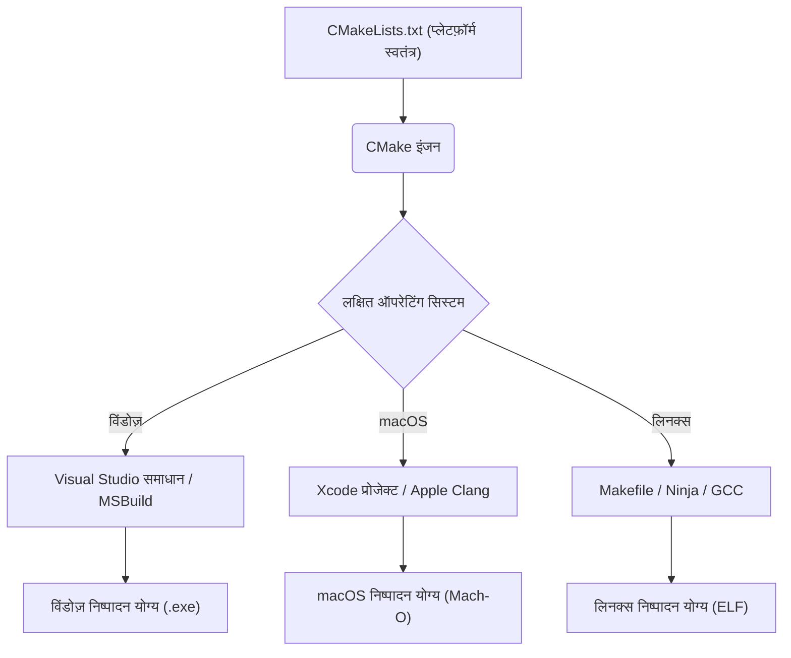
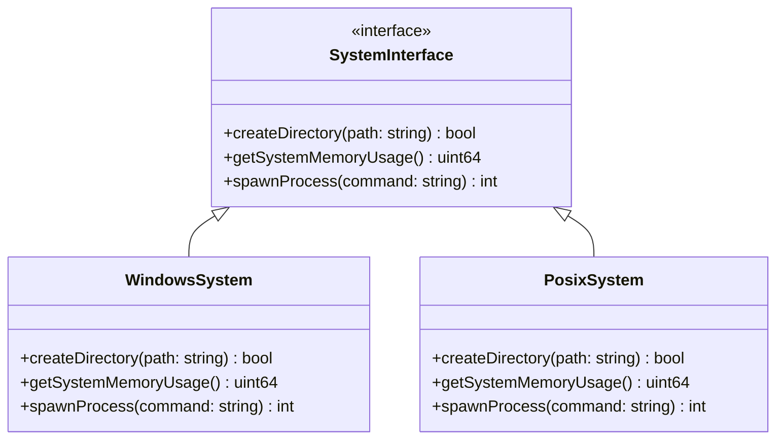
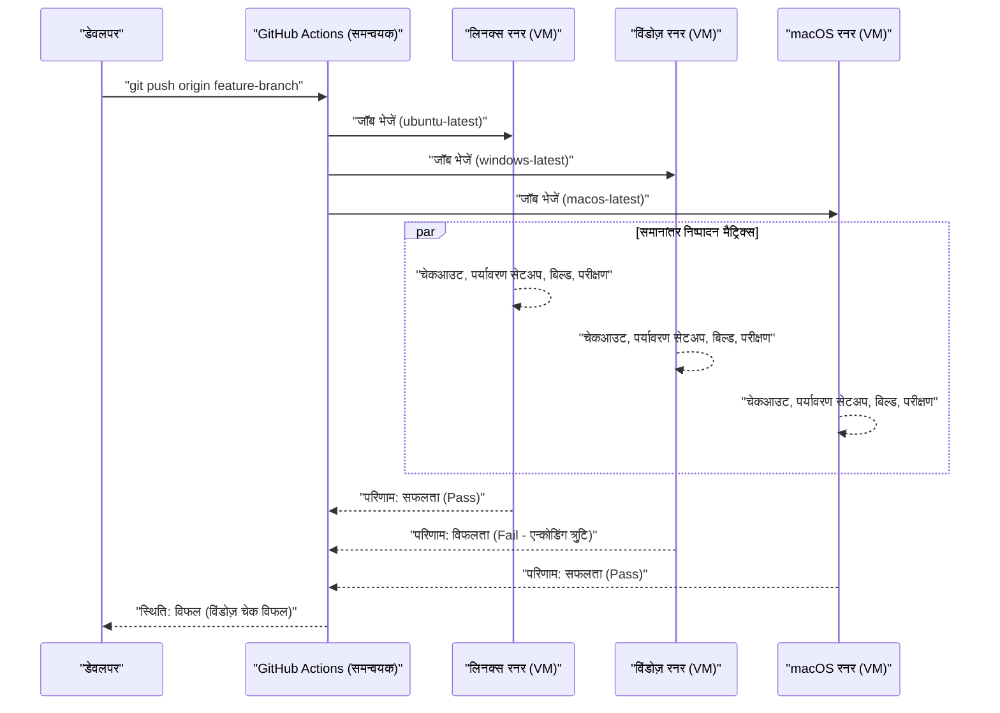

मैक (macOS) और विंडोज़, साथ ही लिनक्स (WSL सहित) जैसे कई ऑपरेटिंग सिस्टम (OS) में क्रॉस-प्लेटफ़ॉर्म विकास आधुनिक सॉफ़्टवेयर इंजीनियरिंग में अपरिहार्य है। वेब विकास, मोबाइल ऐप बैकएंड, या क्रॉस-प्लेटफ़ॉर्म डेस्कटॉप ऐप (Electron, Tauri, Qt, आदि) बनाते समय, यदि टीम में अलग-अलग OS का उपयोग किया जाता है, तो आपको कई "OS भिन्नताओं के कारण होने वाले बग" का सामना करना पड़ेगा।

प्रत्येक OS की अपनी ऐतिहासिक पृष्ठभूमि और डिज़ाइन दर्शन होते हैं। विंडोज़ का अपना अनूठा आर्किटेक्चर (Win32 API, NT कर्नेल) है जो MS-DOS से लिया गया है, जबकि macOS, UNIX (FreeBSD-आधारित Darwin) पर आधारित है, और लिनक्स POSIX मानक का अनुपालन करता है। यह मूलभूत अंतर "कमियों (pitfalls)" को जन्म देता है जो डेवलपर्स को फ़ाइल सिस्टम, नेटवर्क और प्रक्रिया प्रबंधन (process management) जैसे हर परिदृश्य में परेशान करते हैं।

इस लेख में, हम तकनीकी भिन्नताओं और सर्वोत्तम प्रथाओं (best practices) के बारे में बहुत विस्तृत और व्यावहारिक रूप से समझाएंगे, जिन्हें एक ऐसी विकास टीम में जानना आवश्यक है जहाँ मैक और विंडोज़ मिश्रित हैं, या जो दोनों OS को लक्षित करके एप्लिकेशन विकसित कर रही है।

---

## 1. लाइन ब्रेक (CRLF बनाम LF) की कमियां और Git की सख्त सेटिंग्स

सबसे लगातार और टीम विकास को बाधित करने वाले कारणों में से एक "लाइन ब्रेक (Line Endings)" की समस्या है। यह टाइपराइटर के युग से जुड़ी एक ऐतिहासिक समस्या है।

*   **विंडोज़**: कैरिज रिटर्न (CR, `\r`, `0x0D`) और लाइन फीड (LF, `\n`, `0x0A`) के संयोजन, **CRLF**, का उपयोग डिफ़ॉल्ट लाइन ब्रेक के रूप में करता है।
*   **macOS / लिनक्स**: केवल लाइन फीड, **LF**, का उपयोग डिफ़ॉल्ट लाइन ब्रेक के रूप में करता है। (※शुरुआती Mac OS 9 तक केवल CR था, लेकिन Mac OS X के बाद से यह UNIX पर आधारित हो गया और LF बन गया)

इस अंतर के कारण, जब Git रिपॉजिटरी में स्रोत कोड साझा किया जाता है, तो अंतर (diff) पूरी फ़ाइल को प्रभावित कर सकता है। लिनक्स वातावरण में चलने के लिए बनाए गए शेल स्क्रिप्ट (`.sh`) को विंडोज़ में संपादित किए जाने पर CRLF बन सकते हैं, जिससे निष्पादन के दौरान `\r` को एक अमान्य वर्ण के रूप में व्याख्यायित किया जाता है और `\r: command not found` जैसी त्रुटियां होती हैं।

### Git में समाधान: `.gitattributes` के माध्यम से प्रबंधन

Git में `core.autocrlf` सेटिंग होती है, लेकिन इस पर निर्भर रहना खतरनाक है। क्योंकि यह प्रत्येक डेवलपर के स्थानीय मशीन की वैश्विक सेटिंग पर निर्भर करता है, जब नए सदस्य टीम में शामिल होते हैं तो सेटिंग्स छूट जाने के कारण आसानी से समस्याएं उत्पन्न हो सकती हैं।

सबसे अच्छी प्रथा (Best practice) रिपॉजिटरी की रूट निर्देशिका (root directory) में `.gitattributes` फ़ाइल रखना है, ताकि रिपॉजिटरी स्तर पर स्पष्ट रूप से परिभाषित किया जा सके कि लाइन ब्रेक को कैसे संभाला जाए। यह सुनिश्चित करता है कि चाहे किस वातावरण में क्लोन किया जाए, व्यवहार सुसंगत रहेगा।

```gitattributes
# डिफ़ॉल्ट रूप से इसे टेक्स्ट फ़ाइल के रूप में मानें, और रिपॉजिटरी (Git डेटाबेस) में इसे LF में सामान्यीकृत करें
# चेकआउट करते समय इसे प्रत्येक OS के मानक लाइन ब्रेक में बदल दिया जाएगा
* text=auto

# हालांकि, स्रोत कोड जैसे विशिष्ट एक्सटेंशन OS की परवाह किए बिना हमेशा LF को लागू करेंगे
*.sh text eol=lf
*.py text eol=lf
*.cpp text eol=lf
*.hpp text eol=lf
*.js text eol=lf
*.json text eol=lf

# विंडोज़ के लिए विशेष बैच फ़ाइलें CRLF को लागू करेंगी
*.cmd text eol=crlf
*.bat text eol=crlf

# चित्र (images) और पूर्व-निर्मित बायनेरिज़ जैसी फ़ाइलों के लाइन ब्रेक नहीं बदले जाएंगे (भ्रष्टाचार को रोकने के लिए)
*.png binary
*.jpg binary
*.pdf binary
```

---

## 2. फ़ाइल सिस्टम में केस सेंसिटिविटी (अपरकेस/लोअरकेस का भेद)

फ़ाइल सिस्टम में अपरकेस और लोअरकेस अक्षरों (Case Sensitivity) के बीच भेद करना क्रॉस-प्लेटफ़ॉर्म विकास में सबसे बड़ी चुनौतियों में से एक है।

*   **macOS (APFS / HFS+)**: डिफ़ॉल्ट रूप से **अपरकेस और लोअरकेस में भेद नहीं करता (Case-Insensitive)**, लेकिन **स्थिति को सुरक्षित रखता है (Case-Preserving)**। यानी, यदि इसे `File.txt` के रूप में सहेजा जाता है, तो यह `File.txt` के रूप में प्रदर्शित होगा, लेकिन प्रोग्राम इसे `file.txt` के रूप में एक्सेस और पढ़ सकते हैं।
*   **विंडोज़ (NTFS)**: macOS की तरह, डिफ़ॉल्ट रूप से **अपरकेस और लोअरकेस में भेद नहीं करता (Case-Insensitive)**, और **स्थिति सुरक्षित रखता है (Case-Preserving)**।
*   **लिनक्स / WSL (ext4 आदि)**: **अपरकेस और लोअरकेस में पूरी तरह से भेद करता है (Case-Sensitive)**। `File.txt` और `file.txt` पूरी तरह से अलग फ़ाइलों के रूप में एक ही निर्देशिका (directory) में सह-अस्तित्व में रह सकते हैं।

### उत्पन्न होने वाले विशिष्ट बग

मैक या विंडोज़ पर विकास करते समय, यदि स्रोत कोड में `#include "myclass.h"` (या `import "./myclass"`) छोटे अक्षरों (lowercase) में निर्दिष्ट किया गया है, लेकिन वास्तविक फ़ाइल `MyClass.h` है, तो भी बिल्ड सफल हो जाएगा क्योंकि स्थानीय OS केस-इनसेंसिटिव है।

हालांकि, जब इस कोड को कमिट किया जाता है और CI/CD सर्वर (आमतौर पर Ubuntu जैसे लिनक्स) पर बिल्ड निष्पादित किया जाता है, तो लिनक्स का ext4 फ़ाइल सिस्टम केस-सेंसिटिव होने के कारण "फ़ाइल नहीं मिली" (File not found) संकलन त्रुटि (compile error) देगा।

### एल्गोरिदमिक दृष्टिकोण: फ़ाइल खोज जटिलता और सामान्यीकरण (Normalization)

आइए गणितीय रूप से विचार करें कि जब फ़ाइल सिस्टम फ़ाइल पथ (path) को हल करता है तो आंतरिक रूप से क्या प्रक्रिया होती है।

केस-सेंसिटिव ext4 के मामले में, निर्देशिका (directory) के भीतर प्रविष्टियों (entries) को हैश टेबल या B-Tree जैसी संरचनाओं में प्रबंधित किया जाता है। यदि निर्देशिका में फ़ाइलों की संख्या $N$ है और फ़ाइल नाम की लंबाई $L$ है, तो सरल बाइनरी सर्च या ट्री ट्रैवर्सल की गणना जटिलता (computational complexity) निम्न प्रकार होगी:

$$ T_{search}(N) = O(L \log N) $$

दूसरी ओर, NTFS और APFS जैसे केस-इनसेंसिटिव फ़ाइल सिस्टम के लिए, स्ट्रिंग्स की तुलना करने से पहले दोनों स्ट्रिंग्स को एक ही केस (अपरकेस या लोअरकेस) में सामान्यीकृत (Case Folding) करने की आवश्यकता होती है। यूनिकोड सामान्यीकरण या लोकेल-जागरूक केस रूपांतरण केवल सरल ASCII बिटवाइज़ संचालन (bitwise operations) द्वारा नहीं किया जा सकता, बल्कि इसके लिए टेबल लुकअप की आवश्यकता होती है।

मान लें कि रूपांतरण फ़ंक्शन (conversion function) की गणना लागत (computational cost) स्थिरांक (constant) $C_{fold}$ है, तो प्रत्येक स्ट्रिंग तुलना में अतिरिक्त ओवरहेड लगता है:

$$ T_{insensitive\_search}(N) = O( (L \times C_{fold}) \log N ) $$

हालांकि आधुनिक OS इसे अत्यधिक कैश (cache) करते हैं, लेकिन इस मूलभूत व्यवहार अंतर को केवल विकास स्तर के नियमों (conventions) से ही प्रबंधित किया जा सकता है। सबसे सुरक्षित दृष्टिकोण यह नियम स्थापित करना है: **"सभी फ़ाइल और निर्देशिका (directory) के नाम केवल छोटे अक्षरों और हाइफ़न (kebab-case) या अंडरस्कोर (snake_case) का उपयोग करके मानकीकृत होने चाहिए।"**

---

## 3. पथ विभाजक (Path Separators) और फ़ाइल पथ का अमूर्तीकरण (Abstraction)

निर्देशिका पदानुक्रम (directory hierarchy) को दर्शाने वाले विभाजक वर्णों (separator characters) को संभालने का तरीका OS के बीच मूलभूत अंतर को दर्शाता है।

*   **विंडोज़**: बैकस्लैश `\` का उपयोग करता है (जापानी वातावरण के कुछ फ़ॉन्ट में येन प्रतीक `¥` के रूप में प्रदर्शित होता है), और इसमें ड्राइव लेटर (जैसे: `C:\`) या UNC पथ (जैसे: `\\Server\Share`) की अवधारणा होती है।
*   **macOS / लिनक्स**: स्लैश `/` का उपयोग करता है, और सभी फ़ाइल सिस्टम में एक ही रूट `/` से शुरू होने वाला पदानुक्रम (Single Root Hierarchy) होता है।

विंडोज़ पर कई प्रोग्रामिंग भाषाएं स्वचालित रूप से `/` को फ़ाइल विभाजक के रूप में व्याख्यायित कर सकती हैं (क्योंकि Win32 API स्वयं भी कुछ हद तक `/` का समर्थन करता है)। हालांकि, जब कमांड-लाइन तर्कों (arguments) के रूप में पथ पास किए जाते हैं, सीधे सिस्टम कॉल को लागू किया जाता है, या स्ट्रिंग के रूप में पथों की तुलना या पार्सिंग की जाती है, तो यह घातक त्रुटियों का कारण बन सकता है।

### भाषा-विशिष्ट सर्वोत्तम प्रथाएँ (OS अमूर्तीकरण)

स्ट्रिंग संयोजन (String concatenation) (जैसे: `path + "\\" + filename`) का उपयोग करके फ़ाइल पथ बनाना **बिल्कुल टालना चाहिए**। प्रत्येक भाषा द्वारा प्रदान की गई पथ हेरफेर मानक लाइब्रेरी (Path manipulation standard library / OS Abstraction Layer) का उपयोग करें।

#### C++ का उदाहरण (`std::filesystem`)
C++17 के बाद से `<filesystem>` पेश किया गया, जिसने प्लेटफ़ॉर्म के बीच पथ के अंतर को अमूर्त (abstract) करना संभव बना दिया।

```cpp
#include <iostream>
#include <filesystem>

namespace fs = std::filesystem;

int main() {
    // OS-स्वतंत्र पथ का निर्माण (ऑपरेटर ओवरलोडिंग द्वारा अमूर्तीकरण)
    fs::path dir = "data";
    fs::path file = "config.json";
    fs::path full_path = dir / file; // विंडोज़ पर "data\config.json", मैक/लिनक्स पर "data/config.json" होगा

    std::cout << "Full path: " << full_path.string() << std::endl;
    return 0;
}
```

#### Python का उदाहरण (`pathlib`)
अतीत में, `os.path.join()` का उपयोग किया जाता था, लेकिन अब ऑब्जेक्ट-ओरिएंटेड `pathlib` मॉड्यूल का उपयोग करना मानक है।

```python
from pathlib import Path

# / ऑपरेटर को ओवरराइड किया गया है और यह OS के लिए उपयुक्त पथ ऑब्जेक्ट उत्पन्न करता है
base_dir = Path("user_data")
config_file = base_dir / "settings" / "app.ini"

# पथ को हल करना या फ़ाइलों को पढ़ना भी सुसंगत विधियों (methods) से संभव है
if config_file.exists():
    text = config_file.read_text(encoding="utf-8")
```

#### Node.js का उदाहरण (`path` मॉड्यूल)

```javascript
const path = require('path');

// path.join तर्क (arguments) लेता है और उन्हें वर्तमान OS के लिए उपयुक्त विभाजक के साथ जोड़ता है
const configPath = path.join('config', 'default.json');
console.log(configPath); 
// विंडोज़: "config\default.json"
// macOS/लिनक्स: "config/default.json"
```

---

## 4. कैरेक्टर एन्कोडिंग (UTF-8 बनाम CP932/Shift-JIS) और यूनिकोड की दीवार

विंडोज़ जापानी वातावरण में सबसे बड़ा सिरदर्द कैरेक्टर एन्कोडिंग है।
आधुनिक विकास में, macOS और लिनक्स पूरी तरह से सिस्टम, टर्मिनल और फ़ाइल एन्कोडिंग के लिए **UTF-8** पर मानकीकृत हैं। हालांकि, जापानी विंडोज़ की मानक एन्कोडिंग (सिस्टम लोकेल पर आधारित "ANSI कोड पेज") अभी भी कई स्थितियों में डिफ़ॉल्ट रूप से **CP932 (Shift-JIS का Microsoft एक्सटेंशन)** के रूप में कार्य करती है।
※आंतरिक Win32 API स्ट्रिंग प्रतिनिधित्व UTF-16LE (`wchar_t`) है।

Python आदि में फ़ाइलों को पढ़ते या लिखते समय, यदि आप स्पष्ट रूप से एन्कोडिंग निर्दिष्ट नहीं करते हैं, तो विंडोज़ पर यह `locale.getpreferredencoding()` के परिणाम (CP932) के अनुसार इसकी व्याख्या करने का प्रयास करेगा। इसके परिणामस्वरूप, UTF-8 में सहेजी गई फ़ाइल को पढ़ने का प्रयास करते समय `UnicodeDecodeError` हो सकता है, या टेक्स्ट दूषित हो सकता है (Mojibake)।

### कैरेक्टर कोड रूपांतरण का गणितीय मॉडल और ओवरहेड

जब किसी स्ट्रिंग को एक एन्कोडिंग (UTF-8) से दूसरे (UTF-16 या CP932) में परिवर्तित किया जाता है, तो सबसे खराब स्थिति में गणना जटिलता (worst-case time complexity) स्ट्रिंग की लंबाई के समानुपाती (proportional) होती है। यदि स्ट्रिंग की बाइट लंबाई $B$ है, तो रूपांतरण जटिलता $O(B)$ है। हालांकि, चर-लंबाई एन्कोडिंग (variable-length encoding) UTF-8 की पार्सिंग, सरोगेट पेयर (surrogate pairs) की गणना और रूपांतरण टेबल लुकअप (Lookup) के कारण काफी ओवरहेड होता है।

मान लें कि स्ट्रिंग की लंबाई $N$ है, मल्टीबाइट कैरेक्टर से यूनिकोड कोड पॉइंट का मैपिंग फ़ंक्शन $f_{decode}$ है, और कोड पॉइंट से लक्षित एन्कोडिंग का मैपिंग फ़ंक्शन $f_{encode}$ है, तो कुल रूपांतरण समय $T_{conv}$ को इस प्रकार अनुमानित किया जा सकता है:

$$ T_{conv} = \sum_{i=1}^{N} \Big( C_{decode} \cdot f_{decode}(x_i) + C_{encode} \cdot f_{encode}(y_i) \Big) \approx O(N) $$

क्रॉस-प्लेटफ़ॉर्म एप्लिकेशन में, यह ध्यान रखना आवश्यक है कि हर बार जब नेटिव OS API को बुलाया जाता है (I/O सीमा को पार करते हुए), तो यह रूपांतरण लागत आती है (विशेष रूप से C++ में विंडोज़ के लिए विकास करते समय, `MultiByteToWideChar` आदि का उपयोग करके UTF-16 में रूपांतरण अक्सर होता है)।

### एन्कोडिंग के लिए समाधान

सबसे विश्वसनीय समाधान है **"हर समय स्पष्ट रूप से UTF-8 निर्दिष्ट करना"**।

```python
# Python में अच्छा उदाहरण: हमेशा encoding="utf-8" निर्दिष्ट करें
with open("data.txt", "w", encoding="utf-8") as f:
    f.write("नमस्ते, दुनिया!")
```

इसके अतिरिक्त, विंडोज़ टर्मिनल (कमांड प्रॉम्प्ट या PowerShell) में UTF-8 आउटपुट को सही ढंग से प्रदर्शित करने के लिए, एप्लिकेशन शुरू करते समय पर्यावरण चर `PYTHONUTF8=1` सेट करना आवश्यक हो सकता है। Node.js के मामले में, आपको `chcp 65001` कमांड का उपयोग करके कंसोल कोड पेज को अस्थायी रूप से UTF-8 में बदलना पड़ सकता है।

---

## 5. पर्यावरण चर (Environment Variables) और शेल वातावरण में अंतर (bash/zsh बनाम PowerShell)

बिल्ड स्क्रिप्ट या डेवलपमेंट टूल्स निष्पादित करते समय शेल (कमांड-लाइन इंटरप्रेटर) का अंतर भी क्रॉस-प्लेटफ़ॉर्म में एक बड़ी बाधा है।

*   **macOS / लिनक्स**: मुख्य रूप से `bash` या `zsh`। वे टेक्स्ट-आधारित पाइपलाइन प्रसंस्करण (pipeline processing) करते हैं।
*   **विंडोज़**: कमांड प्रॉम्प्ट (`cmd.exe`) या `PowerShell`। PowerShell .NET-आधारित है और इसमें एक शक्तिशाली ऑब्जेक्ट-ओरिएंटेड पाइपलाइन है, लेकिन इसका सिंटैक्स POSIX शेल से पूरी तरह अलग है।

चूंकि पर्यावरण चर (environment variables) को संदर्भित करने (referencing) और सेट करने के तरीके भिन्न हैं, इसलिए यदि आप Node.js की `package.json` के `scripts` अनुभाग में OS-विशिष्ट कोड लिखते हैं, तो यह अन्य वातावरणों में काम नहीं करेगा।

```json
// ❌ बुरा उदाहरण: विंडोज़ पर, "NODE_ENV" को एक कमांड के रूप में पहचाना नहीं जाएगा और त्रुटि होगी
"scripts": {
  "build": "NODE_ENV=production webpack"
}
```

### समाधान: क्रॉस-प्लेटफ़ॉर्म टूल का लाभ उठाना

Node.js वातावरण में, पर्यावरण चर की सेटिंग को अमूर्त करने (abstract) के लिए `cross-env` जैसे पैकेजों का उपयोग करें।

```json
// ✅ अच्छा उदाहरण: cross-env OS के अंतर को अवशोषित करता है, पर्यावरण चर को ठीक से सेट करता है, और webpack को आरंभ करता है
"scripts": {
  "build": "cross-env NODE_ENV=production webpack",
  "clean": "rimraf dist/" // rm -rf के बजाय क्रॉस-प्लेटफ़ॉर्म रिमूवर का उपयोग करें
}
```

यदि बड़े पैमाने के प्रोजेक्ट में जटिल शेल स्क्रिप्ट की आवश्यकता होती है, तो वर्तमान में सबसे अच्छी प्रथा विंडोज़ डेवलपर्स के लिए भी WSL (Windows Subsystem for Linux) या Git Bash के उपयोग को मानकीकृत करना और सभी बैच प्रसंस्करण को `.sh` स्क्रिप्ट के रूप में प्रबंधित करना है।

---

## 6. क्रॉस-प्लेटफ़ॉर्म बिल्ड सिस्टम और कंपाइलर

C++ या Rust (भाषाएं जो सीधे मशीन कोड में संकलित होती हैं) जैसे नेटिव कोड से निपटते समय, आपको नल्पन केवल OS-विशिष्ट API बल्कि बिल्ड सिस्टम और कंपाइलरों के अंतर को भी दूर करने की आवश्यकता होती है।

*   **कंपाइलर (Compiler)**:
    *   विंडोज़: MSVC (Microsoft Visual C++), MinGW (GCC for Windows)
    *   macOS: Apple Clang
    *   लिनक्स: GCC, Clang
*   **बाइनरी प्रारूप (Binary Format)**:
    *   विंडोज़: PE (Portable Executable) `.exe` / `.dll`
    *   macOS: Mach-O
    *   लिनक्स: ELF (Executable and Linkable Format) `.so`

### CMake के साथ मेटा-बिल्ड सिस्टम का लाभ उठाना

C/C++ परियोजनाओं में क्रॉस-प्लेटफ़ॉर्म समर्थन प्राप्त करने के लिए **CMake** वैश्विक वास्तविक मानक (de facto standard) है। CMake स्रोत कोड को सीधे संकलित नहीं करता है, बल्कि एक "जनरेटर (Generator)" के रूप में कार्य करता है जो प्रत्येक वातावरण के अनुरूप नेटिव बिल्ड कॉन्फ़िगरेशन फ़ाइलें (विंडोज़ के लिए Visual Studio समाधान फ़ाइलें, लिनक्स/मैक के लिए Makefile या Ninja बिल्ड स्क्रिप्ट) बनाता है।



CMake का उपयोग करके, आप वातावरण के बीच के अंतर को छिपा सकते हैं और एक एकल कॉन्फ़िगरेशन फ़ाइल (`CMakeLists.txt`) से प्रत्येक OS के लिए इष्टतम बायनेरिज़ उत्पन्न कर सकते हैं। निर्भरता लाइब्रेरी को हल करना (resolving dependencies) (`find_package`) और OS-विशिष्ट लाइब्रेरी को लिंक करना भी सशर्त बयानों (conditional statements) के साथ आसानी से लिखा जा सकता है।

```cmake
# CMakeLists.txt का आंशिक उदाहरण
if(WIN32)
    # विंडोज़-विशिष्ट लाइब्रेरी (जैसे WS2_32.lib) को लिंक करें
    target_link_libraries(my_app PRIVATE ws2_32)
    add_compile_definitions(OS_WINDOWS)
elseif(APPLE)
    # macOS-विशिष्ट फ्रेमवर्क को लिंक करें
    target_link_libraries(my_app PRIVATE "-framework Foundation")
    add_compile_definitions(OS_MACOS)
elseif(UNIX AND NOT APPLE)
    # लिनक्स के लिए लिंकिंग (जैसे pthread)
    target_link_libraries(my_app PRIVATE pthread)
    add_compile_definitions(OS_LINUX)
endif()
```

---

## 7. आर्किटेक्चर पैटर्न का उपयोग: OS अमूर्तीकरण परत (OSAL)

क्रॉस-प्लेटफ़ॉर्म विकास की कुंजी सिस्टम-आश्रित कार्यों (जैसे फ़ाइल संचालन, प्रक्रिया/थ्रेड निर्माण, मेमोरी प्रबंधन और सॉकेट संचार) को एप्लिकेशन के कोर बिजनेस लॉजिक से पूरी तरह से अलग करना है।

इसे प्राप्त करने के लिए, हम **OS अमूर्तीकरण परत (OS Abstraction Layer, OSAL)** पैटर्न का उपयोग करते हैं।

नीचे एक क्लास डिज़ाइन का उदाहरण दिया गया है जो प्रत्येक OS-विशिष्ट API को लपेटता (wraps) है और एक सामान्य इंटरफ़ेस प्रदान करता है। कार्यान्वयन (implementation) को स्विच करने के लिए बहुरूपता (polymorphism) या संकलन-समय (compile-time) मैक्रो स्विच का उपयोग किया जाता है।



प्लेटफ़ॉर्म-विशिष्ट कोड को एक ही स्थान (आमतौर पर `src/platform/windows/` या `src/platform/posix/` जैसी निर्देशिका) में अलग करके, बाकी 95% कोड (GUI लॉजिक, डेटा प्रोसेसिंग, संचार प्रोटोकॉल पार्सिंग, आदि) को पूरी तरह से क्रॉस-प्लेटफ़ॉर्म और परीक्षण योग्य स्थिति में रखा जा सकता है।

---

## 8. CI/CD में क्रॉस-प्लेटफ़ॉर्म सत्यापन (मैट्रिक्स बिल्ड)

भले ही डेवलपर्स अपने स्थानीय वातावरण में कितनी भी सावधानी से कोड करें, क्रॉस-प्लेटफ़ॉर्म संगतता (compatibility) के लिए अंतिम बचाव पंक्ति **CI/CD (Continuous Integration / Continuous Deployment) पाइपलाइन** है। ऐसे कई मामले हैं जहां कोड स्थानीय वातावरण (जैसे मैक) में काम करता है, लेकिन अन्य OS (विंडोज़) पर संकलन त्रुटि (compile error) का कारण बनता है।

नवीनतम CI टूल जैसे GitHub Actions और GitLab CI का लाभ उठाएं, और एक मैट्रिक्स बिल्ड (Matrix Build) सेट करें जो हर बार पुल रिक्वेस्ट (Pull Request) बनाए जाने पर **विंडोज़, macOS, और लिनक्स के सभी वातावरणों में समानांतर में बिल्ड और परीक्षण निष्पादित करता है**।

```yaml
# GitHub Actions का उपयोग करके क्रॉस-प्लेटफ़ॉर्म CI कॉन्फ़िगरेशन का उदाहरण
name: Cross-Platform Build and Test

on: [push, pull_request]

jobs:
  build:
    runs-on: ${{ matrix.os }}
    strategy:
      fail-fast: false # यदि 1 OS विफल रहता है, तो अन्य OS का परीक्षण जारी रखें
      matrix:
        # विंडोज़, macOS और लिनक्स के 3 रनर निर्दिष्ट करें
        os: [ubuntu-latest, windows-latest, macos-latest]

    steps:
    - uses: actions/checkout@v3
    - name: Set up Python Environment
      uses: actions/setup-python@v4
      with:
        python-version: '3.11'
        cache: 'pip' # क्रॉस-प्लेटफ़ॉर्म निर्भरताओं को कैश (cache) करें
        
    - name: Install dependencies
      run: python -m pip install --upgrade pip && pip install -r requirements.txt
      
    - name: Run Test Suite
      run: pytest -v
```

इस CI/CD प्रवाह (flow) को विज़ुअलाइज़ करने पर यह इस प्रकार दिखता है:



प्रत्येक OS के परीक्षण परिणामों को स्वचालित रूप से एकत्र करके, और **केवल तभी main ब्रांच में मर्ज करने की अनुमति देकर जब सभी वातावरण हरे (सफल) हों** (ब्रांच प्रोटेक्शन नियम सेट करना), आप प्लेटफ़ॉर्म-निर्भर बग को उत्पादन (production) वातावरण या रिलीज़ बिल्ड में प्रवेश करने से रोक सकते हैं।

---

## निष्कर्ष

मैक और विंडोज़ क्रॉस-प्लेटफ़ॉर्म विकास में ऐतिहासिक पृष्ठभूमि में निहित कई चुनौतियां हैं।

1.  **लाइन ब्रेक (Line Endings)**: रिपॉजिटरी-स्तरीय सामान्यीकरण (normalization) (जैसे LF को लागू करना) को लागू करने के लिए `.gitattributes` का उपयोग करें।
2.  **अपरकेस और लोअरकेस (Case Sensitivity)**: macOS/विंडोज़ के "केस-इनसेंसिटिव" व्यवहार पर निर्भर न रहें; सख्त फ़ाइल नामकरण नियम (file naming conventions) स्थापित करें और सख्त केस-मैचिंग सुनिश्चित करें।
3.  **पथ विभाजक (Path Separators)**: OS के अंतर को अवशोषित करने के लिए भाषा के मानक पथ हेरफेर API (`std::filesystem`, `pathlib`, `path` मॉड्यूल) का उपयोग करें।
4.  **एन्कोडिंग (Encoding)**: हमेशा UTF-8 निर्दिष्ट करें और विंडोज़ के डिफ़ॉल्ट व्यवहार CP932 के प्रभाव को पूरी तरह से समाप्त करें।
5.  **पर्यावरण चर (Environment Variables) और शेल**: `cross-env` जैसे अमूर्तीकरण टूल का उपयोग करें, या निष्पादन वातावरण (execution environment) को WSL/Docker आदि में मानकीकृत करें।
6.  **बिल्ड सिस्टम (Build System)**: C/C++ के लिए, प्रत्येक OS के लिए इष्टतम नेटिव टूलचेन उत्पन्न करने के लिए CMake जैसे मेटा-बिल्ड सिस्टम का लाभ उठाएं।
7.  **OS-आश्रित कोड (OS-dependent code)**: OS अमूर्तीकरण परत (OSAL) को डिज़ाइन करें और प्लेटफ़ॉर्म-निर्भर लॉजिक को अलग और पृथक करें।
8.  **CI/CD**: मैट्रिक्स बिल्ड लागू करें, सभी लक्षित OS पर स्वच्छ बिल्ड और परीक्षण को स्वचालित करें, और मानवीय निर्भरता (manual dependency) को खत्म करें।

आज, Electron, Tauri, और .NET जैसे शक्तिशाली फ्रेमवर्क इनमें से कई अंतरों को छिपा देते हैं। फिर भी, अंतर्निहित (underlying) OS (फ़ाइल सिस्टम और एन्कोडिंग) के नेटिव व्यवहार का ज्ञान गंभीर प्रदर्शन समस्याओं और जटिल बग को हल करने में अभी भी आवश्यक है। परियोजना के शुरुआती चरणों से पूरी टीम के साथ इन सर्वोत्तम प्रथाओं को साझा करने और लागू करने से, आप OS के अंतर के कारण व्यर्थ डिबगिंग समय को काफी कम कर सकते हैं, और आवश्यक सॉफ़्टवेयर मूल्य बनाने पर ध्यान केंद्रित कर सकते हैं।
