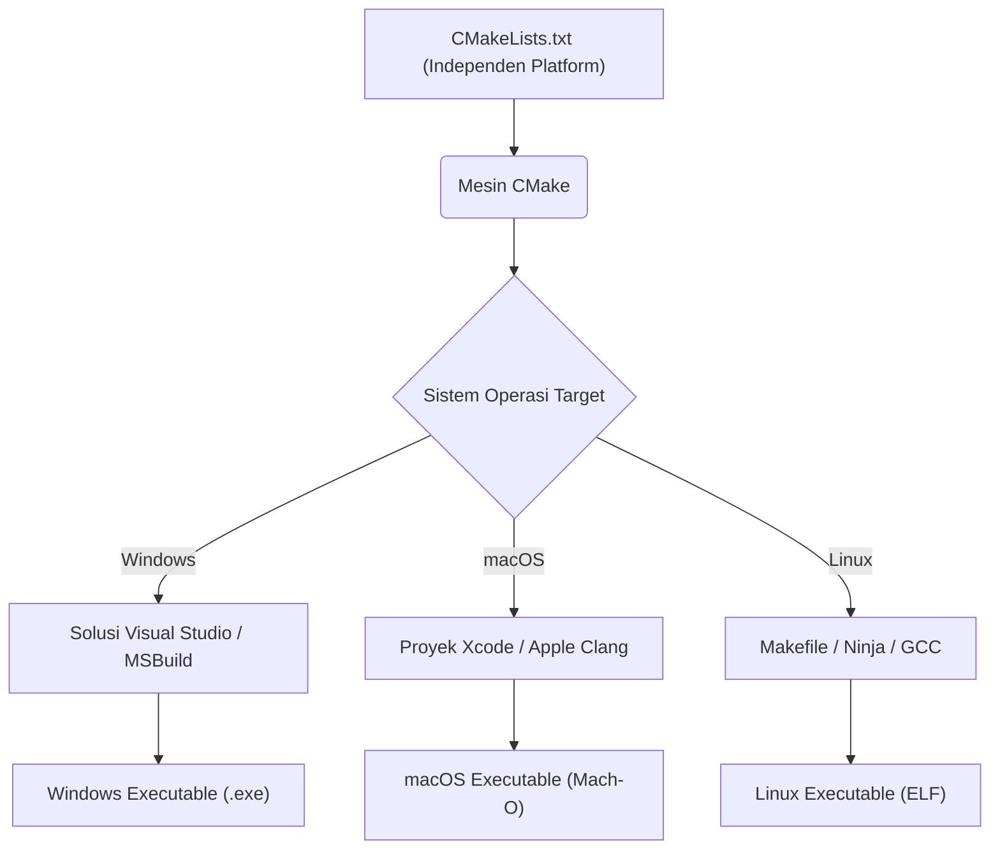
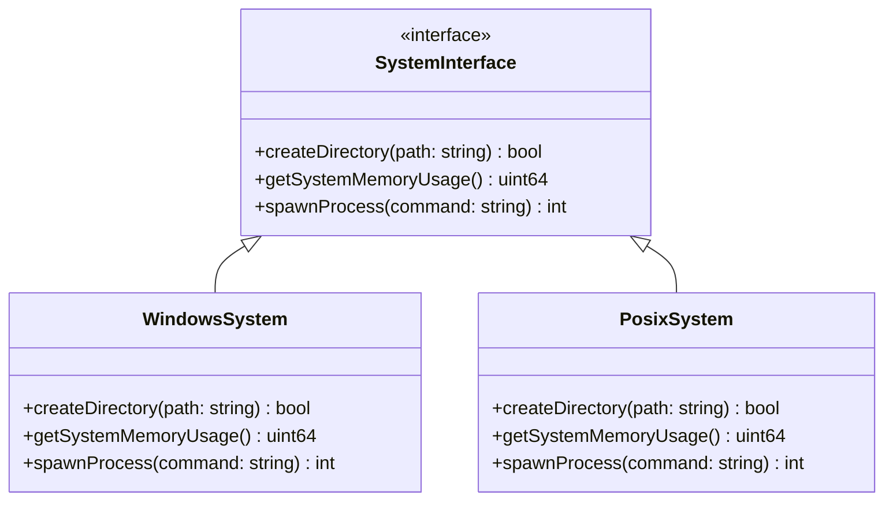
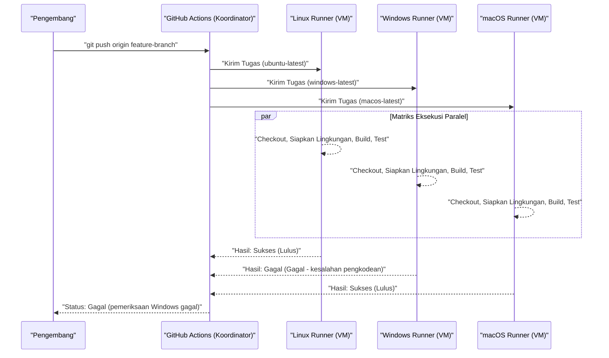

Pengembangan lintas platform (cross-platform) di berbagai sistem operasi (OS) seperti Mac (macOS), Windows, dan bahkan Linux (termasuk WSL) adalah jalur yang tidak dapat dihindari dalam rekayasa perangkat lunak modern. Saat membangun pengembangan web, backend aplikasi seluler, atau aplikasi desktop lintas platform (seperti Electron, Tauri, Qt, dll.), jika tim Anda menggunakan OS yang berbeda, Anda akan menemui banyak "bug yang disebabkan oleh perbedaan OS".

Setiap OS memiliki latar belakang sejarah dan filosofi desain yang berbeda. Windows memiliki arsitektur unik (Win32 API, kernel NT) yang diturunkan dari MS-DOS, sedangkan macOS didasarkan pada UNIX (Darwin berbasis FreeBSD), dan Linux mematuhi standar POSIX. Perbedaan mendasar ini menciptakan "perangkap" yang membuat pusing pengembang dalam berbagai situasi seperti penanganan sistem file, jaringan, dan proses.

Dalam artikel ini, kami akan menjelaskan secara sangat rinci dan praktis tentang perbedaan teknis dan praktik terbaik yang mutlak harus Anda ketahui untuk tim pengembangan yang menggabungkan Mac dan Windows, serta pengembangan aplikasi yang menargetkan kedua OS tersebut.

---

## 1. Perangkap Karakter Baris Baru (CRLF vs LF) dan Pengaturan Git yang Ketat

Salah satu penyebab masalah yang paling sering terjadi dan menyebabkan kekacauan dalam pengembangan tim adalah masalah "Karakter Baris Baru (Line Endings)". Ini adalah masalah historis yang berawal sejak era mesin tik.

*   **Windows**: Menggunakan **CRLF**, yang merupakan kombinasi dari Carriage Return (CR, `\r`, `0x0D`) dan Line Feed (LF, `\n`, `0x0A`), sebagai karakter baris baru standar.
*   **macOS / Linux**: Menggunakan **LF**, yang merupakan Line Feed tunggal, sebagai karakter baris baru standar. (*Hingga Mac OS 9 awal, ini hanya menggunakan CR, tetapi sejak Mac OS X, ia menjadi berbasis UNIX dan menggunakan LF*)

Karena perbedaan ini, saat berbagi kode sumber dalam repositori Git, perbedaan (diff) dapat mencakup keseluruhan file. Atau, skrip shell (`.sh`) yang seharusnya berjalan di lingkungan Linux mungkin diedit di Windows dan berubah menjadi CRLF, yang menyebabkan kesalahan seperti `\r: command not found` saat dieksekusi karena `\r` diinterpretasikan sebagai karakter yang tidak valid.

### Solusi di Git: Manajemen dengan `.gitattributes`

Git memiliki pengaturan yang disebut `core.autocrlf`, tetapi sangat berisiko untuk mengandalkannya. Ini karena pengaturan ini bergantung pada konfigurasi global dari mesin lokal individu pengembang, yang membuatnya rentan terhadap masalah karena pengaturan yang terlewat ketika anggota baru bergabung dengan tim.

Praktik terbaik adalah menempatkan file `.gitattributes` di direktori root repositori untuk mendefinisikan secara eksplisit bagaimana karakter baris baru ditangani di tingkat repositori. Hal ini memastikan perilaku yang konsisten tidak peduli di lingkungan mana repositori tersebut dikloning.

```gitattributes
# Secara default diperlakukan sebagai file teks dan dinormalisasi menjadi LF di dalam repositori (pada database Git)
# Dikonversi ke karakter baris baru standar masing-masing OS saat checkout
* text=auto

# Namun, ekstensi tertentu seperti kode sumber akan selalu dipaksa menjadi LF terlepas dari OS-nya
*.sh text eol=lf
*.py text eol=lf
*.cpp text eol=lf
*.hpp text eol=lf
*.js text eol=lf
*.json text eol=lf

# Memaksa CRLF untuk file batch khusus Windows, dll.
*.cmd text eol=crlf
*.bat text eol=crlf

# Jangan ubah karakter baris baru untuk file seperti gambar dan biner yang sudah dikompilasi (mencegah kerusakan)
*.png binary
*.jpg binary
*.pdf binary
```

---

## 2. Sensitivitas Huruf Besar/Kecil pada Sistem File (Case Sensitivity)

Sensitivitas huruf besar/kecil (Case Sensitivity) dalam sistem file juga merupakan salah satu rintangan terbesar dalam pengembangan lintas platform.

*   **macOS (APFS / HFS+)**: Secara default **tidak membedakan huruf besar/kecil (Case-Insensitive)** tetapi **menyimpan keadaan hurufnya (Case-Preserving)**. Artinya, jika Anda menyimpannya sebagai `File.txt`, maka akan ditampilkan sebagai `File.txt`, tetapi Anda masih dapat membaca dan mengaksesnya dari program sebagai `file.txt`.
*   **Windows (NTFS)**: Sama seperti macOS, secara default spesifikasinya adalah **tidak membedakan huruf besar/kecil (Case-Insensitive)** dan **menyimpan keadaan hurufnya (Case-Preserving)**.
*   **Linux / WSL (ext4, dll.)**: **Membedakan huruf besar/kecil sepenuhnya (Case-Sensitive)**. `File.txt` dan `file.txt` dapat hidup berdampingan di direktori yang sama sebagai dua file yang sama sekali berbeda.

### Bug Khas yang Sering Terjadi

Saat mengembangkan di Mac atau Windows, meskipun Anda menentukannya dengan huruf kecil di kode sumber seperti `#include "myclass.h"` (atau `import "./myclass"`), jika file sebenarnya adalah `MyClass.h`, proses build akan berhasil karena OS lingkungan lokal tersebut bersifat Case-Insensitive.

Namun, ketika Anda melakukan komit pada kode ini dan menjalankan build di server CI/CD (biasanya Linux seperti Ubuntu), itu akan menghasilkan kesalahan kompilasi "file tidak ditemukan" karena sistem file ext4 Linux bersifat Case-Sensitive.

### Perspektif Algoritmik: Kompleksitas Komputasi Pencarian File dan Normalisasi

Mari kita pikirkan secara matematis pemrosesan internal seperti apa yang terjadi saat sistem file menyelesaikan jalur file.

Dalam kasus ext4 yang membedakan huruf besar/kecil, entri-entri di dalam direktori dikelola menggunakan struktur seperti tabel hash atau B-Tree. Jika jumlah file dalam direktori adalah $N$ dan panjang nama file adalah $L$, kompleksitas komputasi untuk pencarian biner sederhana atau pencarian pohon adalah sebagai berikut:

$$ T_{search}(N) = O(L \log N) $$

Di sisi lain, dalam sistem file yang tidak membedakan huruf besar/kecil seperti NTFS atau APFS, diperlukan proses untuk menormalisasi (Case Folding) kedua string ke bentuk yang sama (huruf besar atau huruf kecil) sebelum membandingkannya. Konversi huruf besar/kecil yang mempertimbangkan normalisasi Unicode dan lokalitas (locale) tidak dapat dilakukan dengan operasi bit ASCII sederhana, dan memerlukan pencarian tabel (table lookup).

Jika biaya komputasi fungsi konversi tersebut adalah konstanta $C_{fold}$, maka ada overhead tambahan yang dikeluarkan untuk setiap perbandingan string:

$$ T_{insensitive\_search}(N) = O( (L \times C_{fold}) \log N ) $$

Meskipun OS modern melakukan caching pada tingkat lanjut untuk hal ini, perbedaan perilaku mendasar hanya dapat dibatasi oleh konvensi di tingkat pengembangan. Menetapkan konvensi proyek bahwa **"Semua nama file dan direktori diseragamkan dengan huruf kecil dan tanda hubung (kebab-case) atau garis bawah (snake-case)"** adalah pendekatan yang paling aman.

---

## 3. Karakter Pemisah Jalur (Path Separators) dan Abstraksi Jalur File

Penanganan karakter pemisah yang menunjukkan hierarki direktori mencerminkan perbedaan fundamental antar OS.

*   **Windows**: Menggunakan garis miring terbalik (backslash) `\` (ditampilkan sebagai tanda Yen `¥` di beberapa font lingkungan Jepang), dan juga memiliki konsep huruf drive (contoh: `C:\`) atau jalur UNC (contoh: `\\Server\Share`).
*   **macOS / Linux**: Menggunakan garis miring (slash) `/`, dan seluruh sistem file memiliki hierarki root tunggal (Single Root Hierarchy) yang dimulai dari satu root `/`.

Banyak bahasa pemrograman dengan baik hati akan menginterpretasikan `/` sebagai pemisah file bahkan di Windows (karena sebagian dari Win32 API itu sendiri mendukung `/`). Namun, jika Anda memberikan jalur sebagai argumen baris perintah, memanggil panggilan sistem (system call) secara langsung, atau saat membandingkan serta mengurai (parse) jalur sebagai string, hal ini dapat menyebabkan kesalahan fatal.

### Praktik Terbaik per Bahasa (Abstraksi OS)

**Hindari sepenuhnya** membangun jalur file dengan menggabungkan string (contoh: `path + "\\" + filename`). Gunakan pustaka standar untuk manipulasi jalur (OS Abstraction Layer) yang disediakan oleh masing-masing bahasa.

#### Contoh C++ (`std::filesystem`)
Sejak C++17, `<filesystem>` diperkenalkan, yang memungkinkan abstraksi perbedaan jalur antar platform.

```cpp
#include <iostream>
#include <filesystem>

namespace fs = std::filesystem;

int main() {
    // Membangun jalur yang tidak bergantung pada OS (abstraksi melalui overloading operator)
    fs::path dir = "data";
    fs::path file = "config.json";
    fs::path full_path = dir / file; // Di Windows menjadi "data\config.json", di Mac/Linux menjadi "data/config.json"

    std::cout << "Full path: " << full_path.string() << std::endl;
    return 0;
}
```

#### Contoh Python (`pathlib`)
Dulu `os.path.join()` sering digunakan, tetapi sekarang ini penggunaan standar adalah modul `pathlib` yang berorientasi objek.

```python
from pathlib import Path

# Operator / dioverride untuk menghasilkan objek jalur yang sesuai dengan OS
base_dir = Path("user_data")
config_file = base_dir / "settings" / "app.ini"

# Resolusi jalur dan pembacaan file juga dapat dilakukan dengan metode yang konsisten
if config_file.exists():
    text = config_file.read_text(encoding="utf-8")
```

#### Contoh Node.js (modul `path`)

```javascript
const path = require('path');

// path.join menerima argumen dan menggabungkannya dengan karakter pemisah yang sesuai untuk OS saat ini
const configPath = path.join('config', 'default.json');
console.log(configPath); 
// Windows: "config\default.json"
// macOS/Linux: "config/default.json"
```

---

## 4. Pengkodean Karakter (UTF-8 vs CP932/Shift-JIS) dan Dinding Unicode

Sumber sakit kepala terbesar di lingkungan bahasa Jepang pada Windows adalah pengkodean karakter.
Dalam pengembangan modern, macOS dan Linux sepenuhnya disatukan ke **UTF-8** untuk seluruh sistem, terminal, dan pengkodean file. Namun, pengkodean standar untuk Windows versi Jepang (berdasarkan lokal sistem "halaman kode ANSI" / ANSI code page) masih sangat sering berjalan dengan **CP932 (ekstensi Microsoft untuk Shift-JIS)** sebagai default-nya.
*Catatan: Representasi string Win32 API secara internal adalah UTF-16LE (`wchar_t`).*

Saat membaca dan menulis file dengan Python atau lainnya, jika pengkodean tidak ditentukan secara eksplisit, sistem di Windows akan mencoba menginterpretasikannya sesuai dengan hasil dari `locale.getpreferredencoding()` (CP932). Akibatnya, saat mencoba membaca file yang disimpan dalam UTF-8, `UnicodeDecodeError` dapat terjadi, atau dapat menyebabkan karakter menjadi berantakan (Mojibake).

### Model Matematis dan Overhead Konversi Kode Karakter

Saat mengubah string dari suatu pengkodean (UTF-8) ke pengkodean lainnya (UTF-16 atau CP932), kompleksitas komputasi terburuk sebanding dengan panjang string. Jika panjang byte dari string adalah $B$, kompleksitas komputasi konversinya adalah $O(B)$. Namun, karena penguraian (parsing) UTF-8 yang merupakan pengkodean panjang-variabel (variable-length encoding), perhitungan pasangan pengganti (surrogate pairs), dan pencarian tabel konversi (Lookup), hal ini menyebabkan overhead yang tidak dapat diabaikan.

Jika panjang string adalah $N$, fungsi pemetaan dari karakter multi-byte ke titik kode (code point) Unicode adalah $f_{decode}$, dan fungsi pemetaan dari titik kode ke pengkodean target adalah $f_{encode}$, maka total waktu konversi $T_{conv}$ dapat diperkirakan sebagai berikut:

$$ T_{conv} = \sum_{i=1}^{N} \Big( C_{decode} \cdot f_{decode}(x_i) + C_{encode} \cdot f_{encode}(y_i) \Big) \approx O(N) $$

Dalam aplikasi lintas platform, penting untuk disadari bahwa biaya konversi ini selalu terjadi setiap kali memanggil API bawaan (native) OS (melintasi batas I/O) (terutama saat mengembangkan dalam C++ untuk Windows, konversi ke UTF-16 menggunakan `MultiByteToWideChar` dll., akan sangat sering terjadi).

### Langkah-langkah Mengatasi Masalah Pengkodean

Langkah penanganan yang paling pasti adalah **"selalu menentukan UTF-8 secara eksplisit dalam segala situasi"**.

```python
# Contoh yang baik di Python: selalu menentukan encoding="utf-8"
with open("data.txt", "w", encoding="utf-8") as f:
    f.write("Halo, Dunia!")
```

Selain itu, agar output UTF-8 ditampilkan dengan benar di terminal Windows (Command Prompt atau PowerShell), mungkin diperlukan trik tambahan seperti mengatur variabel lingkungan `PYTHONUTF8=1` saat menjalankan aplikasi, atau untuk Node.js, mengubah halaman kode konsol sementara ke UTF-8 dengan perintah `chcp 65001`.

---

## 5. Variabel Lingkungan dan Perbedaan Lingkungan Shell (bash/zsh vs PowerShell)

Perbedaan dalam shell (interpreter baris perintah) saat mengeksekusi skrip build atau alat pengembangan juga merupakan dinding besar dalam pengembangan lintas platform.

*   **macOS / Linux**: Biasanya menggunakan `bash` atau `zsh`. Mereka melakukan pemrosesan pipeline berbasis teks.
*   **Windows**: Command Prompt (`cmd.exe`) atau `PowerShell`. PowerShell berbasis .NET dan memiliki pipeline berorientasi objek yang kuat, namun sintaksnya sama sekali berbeda dari POSIX shell.

Karena perbedaan cara merujuk atau mengatur variabel lingkungan, jika Anda menulis sesuatu yang bergantung pada OS di bagian `scripts` pada file `package.json` Node.js, itu tidak akan berfungsi di lingkungan lain.

```json
// ❌ Contoh buruk: Di Windows, ini akan menghasilkan kesalahan karena "NODE_ENV" tidak dikenali sebagai perintah
"scripts": {
  "build": "NODE_ENV=production webpack"
}
```

### Solusi: Memanfaatkan Alat Lintas Platform

Di lingkungan Node.js, gunakan paket seperti `cross-env` untuk mengabstraksi pengaturan variabel lingkungan.

```json
// ✅ Contoh baik: cross-env menyerap perbedaan OS dan menetapkan variabel lingkungan yang sesuai sebelum menjalankan webpack
"scripts": {
  "build": "cross-env NODE_ENV=production webpack",
  "clean": "rimraf dist/" // Gunakan penghapus lintas platform daripada menggunakan rm -rf
}
```

Jika diperlukan skrip shell yang kompleks dalam proyek berskala besar, praktik terbaik saat ini adalah mewajibkan pengembang Windows untuk juga menggunakan WSL (Windows Subsystem for Linux) atau Git Bash, dan mengelola semua proses batch secara terpadu sebagai skrip `.sh`.

---

## 6. Sistem Build Lintas Platform dan Kompiler

Saat berhadapan dengan kode asli (native code, yaitu bahasa yang dikompilasi langsung ke dalam kode mesin) seperti C++ atau Rust, Anda tidak hanya harus mengatasi perbedaan API khusus OS, tetapi juga perbedaan dalam sistem build dan kompiler.

*   **Kompiler**:
    *   Windows: MSVC (Microsoft Visual C++), MinGW (GCC untuk Windows)
    *   macOS: Apple Clang
    *   Linux: GCC, Clang
*   **Format Biner**:
    *   Windows: PE (Portable Executable) `.exe` / `.dll`
    *   macOS: Mach-O
    *   Linux: ELF (Executable and Linkable Format) `.so`

### Pemanfaatan Meta Build System dengan CMake

Dalam proyek C/C++, standar de facto global untuk mencapai lintas platform adalah **CMake**. CMake tidak secara langsung mengkompilasi kode sumber; melainkan berfungsi sebagai "Generator" (Pembuat) yang menghasilkan file konfigurasi build asli yang disesuaikan dengan setiap lingkungan (file solusi Visual Studio di Windows, atau skrip build Makefile dan Ninja di Linux/Mac).



Dengan menggunakan CMake, Anda dapat menyerap perbedaan antar lingkungan dan membuat biner (executable) yang paling optimal untuk masing-masing OS dari satu file konfigurasi (`CMakeLists.txt`). Anda juga dapat dengan mudah menulis percabangan kondisional untuk menyelesaikan pustaka dependensi (`find_package`) dan menautkan pustaka spesifik untuk masing-masing OS.

```cmake
# Contoh sebagian dari CMakeLists.txt
if(WIN32)
    # Tautkan pustaka khusus Windows (misal: WS2_32.lib)
    target_link_libraries(my_app PRIVATE ws2_32)
    add_compile_definitions(OS_WINDOWS)
elseif(APPLE)
    # Tautkan framework khusus macOS
    target_link_libraries(my_app PRIVATE "-framework Foundation")
    add_compile_definitions(OS_MACOS)
elseif(UNIX AND NOT APPLE)
    # Tautan untuk Linux (seperti pthread)
    target_link_libraries(my_app PRIVATE pthread)
    add_compile_definitions(OS_LINUX)
endif()
```

---

## 7. Pemanfaatan Pola Arsitektur: Lapisan Abstraksi OS (OSAL)

Memisahkan sepenuhnya proses yang bergantung pada sistem (seperti manipulasi file, pembuatan proses/utas (thread), manajemen memori, komunikasi soket, dll.) dari logika bisnis inti aplikasi adalah kunci keberhasilan pengembangan lintas platform.

Untuk mencapai hal ini, pola yang disebut **OS Abstraction Layer (OSAL, Lapisan Abstraksi OS)** digunakan.

Berikut ini adalah contoh desain kelas yang membungkus (wrap) API spesifik untuk masing-masing OS dan menyediakan antarmuka (interface) umum. Implementasi dapat dialihkan menggunakan polimorfisme (polymorphism) atau sakelar makro (macro switch) pada waktu kompilasi.



Dengan mengisolasi kode spesifik platform di satu tempat (biasanya di direktori seperti `src/platform/windows/` atau `src/platform/posix/`), 95% kode lainnya (logika GUI, pemrosesan data, parsing protokol komunikasi, dll.) dapat dipertahankan dalam keadaan yang sepenuhnya lintas platform dan dapat diuji (testable).

---

## 8. Verifikasi Lintas Platform di CI/CD (Matrix Build)

Tidak peduli seberapa hati-hati pengembang menulis kode di lingkungan lokal, benteng pertahanan terakhir untuk kompatibilitas lintas platform adalah **Pipeline CI/CD (Continuous Integration / Continuous Deployment)**. Kasus di mana sebuah kode dapat berjalan di lingkungan lokal (seperti Mac) tetapi gagal dikompilasi di OS lain (Windows) masih sangat sering terjadi.

Manfaatkan alat CI modern seperti GitHub Actions atau GitLab CI, dan aturlah Matrix Build (Build Matriks) yang akan **mengeksekusi proses build dan pengujian (test) secara paralel di semua lingkungan Windows, macOS, dan Linux** setiap kali sebuah Pull Request dibuat.

```yaml
# Contoh konfigurasi CI Lintas Platform menggunakan GitHub Actions
name: Cross-Platform Build and Test

on: [push, pull_request]

jobs:
  build:
    runs-on: ${{ matrix.os }}
    strategy:
      fail-fast: false # Jika gagal di salah satu OS, lanjutkan pengujian di OS lain
      matrix:
        # Tentukan 3 runner (pelari): Windows, macOS, dan Linux
        os: [ubuntu-latest, windows-latest, macos-latest]

    steps:
    - uses: actions/checkout@v3
    - name: Set up Python Environment
      uses: actions/setup-python@v4
      with:
        python-version: '3.11'
        cache: 'pip' # Cache dependensi lintas platform
        
    - name: Install dependencies
      run: python -m pip install --upgrade pip && pip install -r requirements.txt
      
    - name: Run Test Suite
      run: pytest -v
```

Visualisasi alur kerja CI/CD ini dapat dilihat di bawah ini.



Dengan mengumpulkan hasil pengujian dari setiap OS secara otomatis dan mengatur aturan perlindungan cabang (branch protection rule) sehingga **penggabungan (merge) ke cabang main hanya diizinkan jika semua lingkungan berwarna hijau (sukses)**, Anda dapat mencegah bug yang bergantung pada platform untuk masuk ke lingkungan produksi (production) atau build rilis (release build).

---

## Kesimpulan

Pengembangan lintas platform untuk Mac dan Windows menghadirkan berbagai macam tantangan yang berakar pada latar belakang sejarah sistem operasinya.

1.  **Karakter Baris Baru**: Wajibkan normalisasi di tingkat repositori (seperti menggunakan LF seragam) menggunakan `.gitattributes`.
2.  **Sensitivitas Huruf Besar/Kecil**: Jangan bergantung pada perilaku "tidak membedakan huruf besar/kecil" di macOS/Windows. Tetapkan konvensi penamaan file yang ketat, dan biasakan pencocokan huruf (case matching) yang ketat.
3.  **Karakter Pemisah Jalur**: Gunakan API manipulasi jalur standar bahasa (`std::filesystem`, `pathlib`, modul `path`) untuk menyerap perbedaan OS.
4.  **Pengkodean**: Selalu tentukan UTF-8, dan hilangkan sepenuhnya pengaruh CP932 yang merupakan perilaku default di Windows.
5.  **Variabel Lingkungan & Shell**: Gunakan alat abstraksi seperti `cross-env`, atau satukan lingkungan eksekusi ke WSL/Docker dll.
6.  **Sistem Build**: Untuk C/C++, gunakan meta build system seperti CMake untuk menghasilkan rantai alat pembangun asli (native toolchain) yang dioptimalkan untuk setiap OS.
7.  **Kode Spesifik OS**: Desain Lapisan Abstraksi OS (OSAL) untuk memisahkan dan mengisolasi logika yang bergantung pada platform.
8.  **CI/CD**: Terapkan Matrix Build, otomatiskan build yang bersih dan pengujian pada semua OS target, serta hilangkan ketergantungan pada individu.

Saat ini, framework (kerangka kerja) canggih seperti Electron, Tauri, dan .NET dapat mengatasi banyak perbedaan ini. Namun, pemahaman yang kuat tentang perilaku bawaan OS yang mendasarinya (seperti sistem file dan pengkodean) masih sangat diperlukan ketika menyelesaikan masalah kinerja yang serius atau bug yang rumit. Dengan membagikan dan menerapkan praktik-praktik terbaik ini secara menyeluruh ke seluruh tim sejak tahap awal proyek, Anda dapat secara drastis mengurangi waktu debugging (pencarian bug) yang sia-sia akibat perbedaan OS, dan fokus pada penciptaan nilai perangkat lunak yang sesungguhnya.
