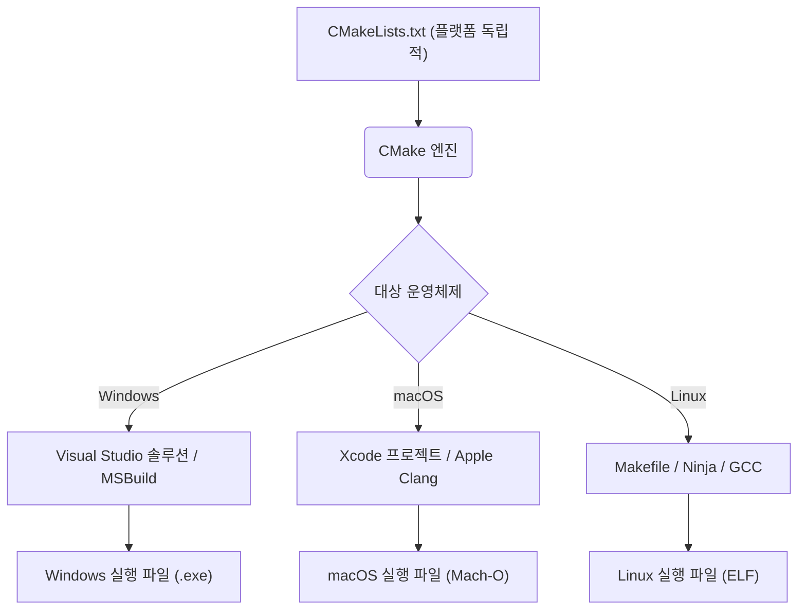
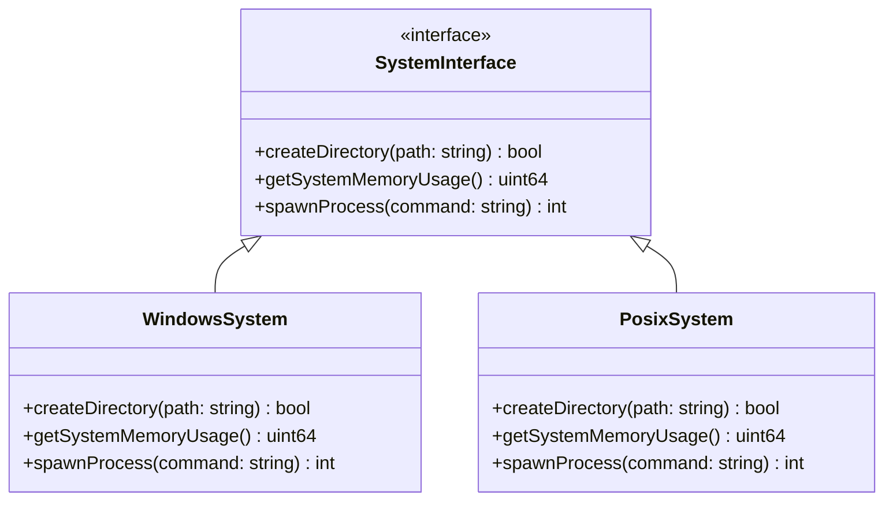
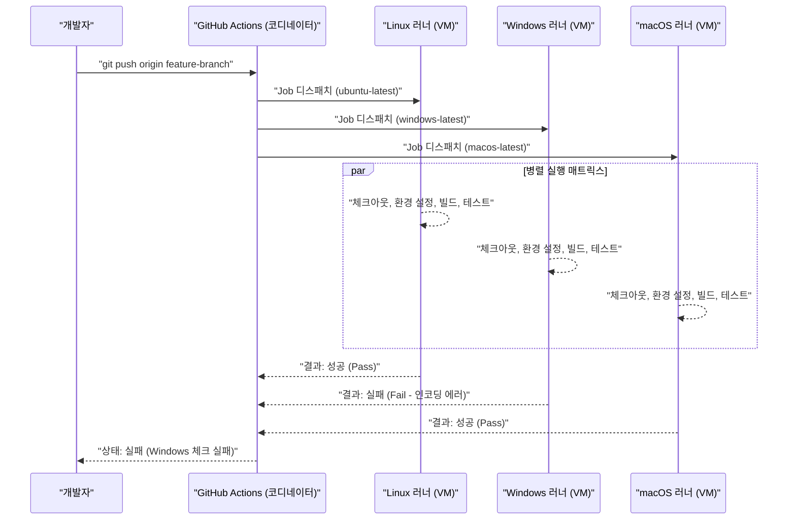

Mac(macOS)과 Windows, 나아가 Linux(WSL 포함)와 같은 여러 운영체제(OS)를 넘나드는 크로스 플랫폼 개발은 현대 소프트웨어 엔지니어링에서 피할 수 없는 길입니다. 웹 개발, 모바일 앱 백엔드, 또는 크로스 플랫폼 데스크톱 앱(Electron, Tauri, Qt 등)을 구축할 때, 팀 내에서 서로 다른 OS를 사용하고 있다면 수많은 "OS 차이로 인한 버그"와 마주치게 됩니다.

각 OS는 다른 역사적 배경과 설계 사상을 가지고 있습니다. Windows는 MS-DOS에서 파생된 독자적인 아키텍처(Win32 API, NT 커널)를 가지지만, macOS는 UNIX(FreeBSD 기반의 Darwin)를 기반으로 하며, Linux는 POSIX 표준을 준수합니다. 이러한 근본적인 차이가 파일 시스템, 네트워크, 프로세스 처리 등 모든 상황에서 개발자를 괴롭히는 "함정"을 만들어냅니다.

본 문서에서는 Mac과 Windows가 혼재하는 개발 팀이나 두 OS를 타겟으로 하는 애플리케이션 개발에 있어 반드시 알아두어야 할 기술적 차이와 모범 사례(Best Practice)를 매우 상세하고 실천적인 관점에서 해설합니다.

---

## 1. 개행 문자(줄바꿈 코드)의 함정 (CRLF vs LF)과 Git의 엄격한 설정

가장 빈번하게 발생하며 팀 개발을 혼란에 빠뜨리는 원인 중 하나가 '개행 문자(Line Endings)' 문제입니다. 이는 타자기 시대까지 거슬러 올라가는 역사적인 문제입니다.

*   **Windows**: 캐리지 리턴(CR, `\r`, `0x0D`)과 라인 피드(LF, `\n`, `0x0A`)의 조합인 **CRLF**를 표준 개행 문자로 사용합니다.
*   **macOS / Linux**: 라인 피드 단독인 **LF**를 표준 개행 문자로 사용합니다. (※초기 Mac OS 9까지는 CR 단독이었으나, Mac OS X 이후로는 UNIX 기반이 되어 LF로 변경되었습니다.)

이러한 차이로 인해, Git 리포지토리 내에서 소스 코드를 공유할 때 차이(diff)가 파일 전체에 걸쳐 발생해버리거나, Linux 환경에서 실행할 것을 전제로 한 쉘 스크립트(`.sh`)가 Windows에서 편집되어 CRLF로 바뀌면서 실행 시 `\r`을 잘못된 문자로 해석하여 `\r: command not found`와 같은 에러를 일으키기도 합니다.

### Git에서의 해결책: `.gitattributes`를 통한 관리

Git에는 `core.autocrlf`라는 설정이 있지만, 여기에 의존하는 것은 위험합니다. 개발자 개인의 로컬 머신 전역 설정에 의존하게 되어 새로운 멤버가 팀에 합류했을 때 설정 누락으로 인한 문제가 발생하기 쉽기 때문입니다.

모범 사례는 리포지토리의 루트 디렉토리에 `.gitattributes` 파일을 배치하여, 리포지토리 수준에서 개행 문자의 처리를 명시적으로 정의하는 것입니다. 이를 통해 어떤 환경에서 클론하더라도 일관된 동작이 보장됩니다.

```gitattributes
# 기본적으로 텍스트 파일로 취급하며, 리포지토리 내(Git의 데이터베이스 상)에서는 LF로 정규화한다
# 체크아웃 시에 각 OS의 표준 개행 문자로 변환된다
* text=auto

# 단, 소스 코드 등의 특정 확장자는 OS에 관계없이 항상 LF를 강제한다
*.sh text eol=lf
*.py text eol=lf
*.cpp text eol=lf
*.hpp text eol=lf
*.js text eol=lf
*.json text eol=lf

# Windows 전용 배치 파일 등은 CRLF를 강제한다
*.cmd text eol=crlf
*.bat text eol=crlf

# 이미지나 빌드된 바이너리 등의 파일은 개행 문자 변환을 수행하지 않는다 (손상 방지)
*.png binary
*.jpg binary
*.pdf binary
```

---

## 2. 파일 시스템의 대소문자 구분 (Case Sensitivity)

파일 시스템에서의 대소문자 구분(Case Sensitivity) 또한 크로스 플랫폼 개발에서 가장 큰 난관 중 하나입니다.

*   **macOS (APFS / HFS+)**: 기본적으로 **대소문자를 구분하지 않지만(Case-Insensitive)**, **상태는 보존(Case-Preserving)**됩니다. 즉, `File.txt`로 저장하면 `File.txt`로 표시되지만, 프로그램에서 `file.txt`로 접근해도 읽을 수 있습니다.
*   **Windows (NTFS)**: macOS와 마찬가지로 기본적으로 **대소문자를 구분하지 않으며(Case-Insensitive)**, **상태는 보존(Case-Preserving)**되는 사양입니다.
*   **Linux / WSL (ext4 등)**: **대소문자를 완벽하게 구분합니다(Case-Sensitive)**. `File.txt`와 `file.txt`는 완전히 다른 파일로서 동일한 디렉토리 내에 공존할 수 있습니다.

### 발생하는 전형적인 버그

Mac이나 Windows에서 개발할 때 소스 코드 내에서 `#include "myclass.h"` (또는 `import "./myclass"`)와 같이 소문자로 지정했더라도, 실제 파일이 `MyClass.h`인 경우 로컬 환경의 OS는 Case-Insensitive이기 때문에 빌드가 성공해버립니다.

하지만 이 코드를 커밋하고 CI/CD 서버(보통 Ubuntu 등의 Linux)에서 빌드를 실행하면, Linux의 ext4 파일 시스템은 Case-Sensitive이기 때문에 "파일을 찾을 수 없음"이라는 컴파일 에러가 발생합니다.

### 알고리즘적 관점: 파일 검색의 계산 복잡도와 정규화

파일 시스템이 파일 경로를 해석할 때 내부적으로 어떤 처리가 이루어지는지 수학적으로 생각해 봅시다.

대소문자를 구분하는 ext4의 경우, 디렉토리 내의 항목은 해시 테이블이나 B-Tree 등의 구조로 관리됩니다. 디렉토리 내 파일 수를 $N$, 파일 이름의 길이를 $L$이라고 할 때, 단순한 이진 탐색이나 트리 탐색의 경우 계산 복잡도는 다음과 같습니다.

$$ T_{search}(N) = O(L \log N) $$

반면 NTFS나 APFS처럼 대소문자를 구분하지 않는 파일 시스템에서는, 문자열을 비교하기 전에 양쪽의 문자열을 동일한 케이스(대문자 또는 소문자)로 정규화(Case Folding)하는 처리가 필요합니다. Unicode의 정규화나 로캘(locale)을 고려한 대소문자 변환은 단순한 ASCII 비트 연산으로 끝나지 않으며 테이블 룩업이 필요합니다.

변환 함수의 계산 비용을 상수 $C_{fold}$라고 하면, 1회의 문자열 비교마다 추가적인 오버헤드가 발생합니다.

$$ T_{insensitive\_search}(N) = O( (L \times C_{fold}) \log N ) $$

최근의 OS는 이를 고도로 캐싱하고 있지만, 근본적인 동작 방식의 차이는 개발 수준에서의 규칙으로 제한할 수밖에 없습니다. **"파일 이름과 디렉토리 이름은 모두 소문자와 하이픈(케밥 케이스) 또는 언더스코어(스네이크 케이스)로 통일한다"**는 프로젝트 규칙을 설정하는 것이 가장 안전한 접근법입니다.

---

## 3. 경로 구분자 (Path Separators)와 파일 경로의 추상화

디렉토리의 계층을 나타내는 구분자의 취급은 OS 간의 근본적인 차이를 반영합니다.

*   **Windows**: 백슬래시 `\` (환경에 따라 원 기호로 표시됨)를 사용하며, 추가로 드라이브 문자(예: `C:\`)나 UNC 경로(예: `\\Server\Share`)라는 개념이 존재합니다.
*   **macOS / Linux**: 슬래시 `/`를 사용하며, 모든 파일 시스템은 단일 루트 `/`에서 시작하는 계층 구조(Single Root Hierarchy)를 가집니다.

많은 프로그래밍 언어는 Windows 상에서도 `/`를 파일 구분자로 적절히 해석해 줍니다(Win32 API 자체가 `/`를 지원하는 부분이 있기 때문). 하지만 커맨드 라인 인자로 경로를 전달하는 경우, 시스템 콜을 직접 호출하는 경우, 또는 문자열로서 경로를 비교하거나 파싱하는 경우에는 치명적인 에러를 일으킵니다.

### 언어별 모범 사례 (OS의 추상화)

문자열 결합(예: `path + "\\" + filename`)으로 파일 경로를 구축하는 것은 **절대로 피해야 합니다**. 각 언어에 준비되어 있는 경로 조작 표준 라이브러리(OS Abstraction Layer)를 사용합니다.

#### C++ 예시 (`std::filesystem`)
C++17 이후부터는 `<filesystem>`이 도입되어 플랫폼 간 경로 차이를 추상화할 수 있게 되었습니다.

```cpp
#include <iostream>
#include <filesystem>

namespace fs = std::filesystem;

int main() {
    // OS에 의존하지 않는 경로 구축 (연산자 오버로딩을 통한 추상화)
    fs::path dir = "data";
    fs::path file = "config.json";
    fs::path full_path = dir / file; // Windows에서는 "data\config.json", Mac/Linux에서는 "data/config.json"이 됨

    std::cout << "Full path: " << full_path.string() << std::endl;
    return 0;
}
```

#### Python 예시 (`pathlib`)
과거에는 `os.path.join()`이 사용되었지만, 현재는 객체 지향적인 `pathlib` 모듈을 사용하는 것이 표준적입니다.

```python
from pathlib import Path

# / 연산자가 오버라이드되어 있어 OS에 맞는 경로 객체를 생성한다
base_dir = Path("user_data")
config_file = base_dir / "settings" / "app.ini"

# 경로 해결이나 파일 읽기도 일관된 메서드로 가능
if config_file.exists():
    text = config_file.read_text(encoding="utf-8")
```

#### Node.js 예시 (`path` 모듈)

```javascript
const path = require('path');

// path.join은 인자를 받아 현재 OS에 적절한 구분자로 결합한다
const configPath = path.join('config', 'default.json');
console.log(configPath); 
// Windows: "config\default.json"
// macOS/Linux: "config/default.json"
```

---

## 4. 문자 인코딩 (UTF-8 vs CP932/Shift-JIS)과 Unicode의 장벽

Windows의 일본어/한국어 환경 등에서의 가장 큰 골칫거리가 문자 인코딩입니다.
현대 개발에 있어 macOS나 Linux는 시스템 전체, 터미널, 파일 인코딩에 이르기까지 **UTF-8**로 완전히 통일되어 있습니다. 그러나 일본어판 Windows의 표준 인코딩(시스템 로캘에 기반한 'ANSI 코드 페이지')은 여전히 **CP932 (Shift-JIS의 마이크로소프트 확장)**가 기본값으로 동작하는 경우가 많습니다.
※ 내부적인 Win32 API의 문자열 표현은 UTF-16LE(`wchar_t`)입니다.

Python 등에서 파일 읽기/쓰기를 수행할 때 인코딩을 명시하지 않으면, Windows 상에서는 `locale.getpreferredencoding()`의 결과(예: CP932)에 따라 해석하려고 시도합니다. 이로 인해 UTF-8로 저장된 파일을 읽으려다 `UnicodeDecodeError`가 발생하거나, 글자 깨짐(Mojibake)이 발생하게 됩니다.

### 문자 코드 변환의 수학적 모델과 오버헤드

문자열을 특정 인코딩(UTF-8)에서 다른 인코딩(UTF-16이나 CP932)으로 변환할 경우, 최악의 계산 복잡도는 문자열의 길이에 비례합니다. 문자열의 바이트 길이를 $B$라고 하면, 변환의 계산 복잡도는 $O(B)$입니다. 그러나 가변 길이 인코딩인 UTF-8의 파싱, 서로게이트 페어(Surrogate Pair) 계산, 그리고 변환 테이블 룩업(Lookup)으로 인해 무시할 수 없는 오버헤드가 발생합니다.

문자열의 길이를 $N$, 멀티바이트 문자에서 Unicode 코드 포인트로의 매핑 함수를 $f_{decode}$, 코드 포인트에서 대상 인코딩으로의 매핑 함수를 $f_{encode}$라고 할 때, 총 변환 시간 $T_{conv}$는 다음과 같이 근사할 수 있습니다.

$$ T_{conv} = \sum_{i=1}^{N} \Big( C_{decode} \cdot f_{decode}(x_i) + C_{encode} \cdot f_{encode}(y_i) \Big) \approx O(N) $$

크로스 플랫폼 애플리케이션에서는 OS의 네이티브 API를 호출할 때마다(I/O 경계를 넘을 때마다) 이 변환 비용이 발생한다는 것을 의식해야 합니다. (특히 Windows용으로 C++에서 개발할 때 `MultiByteToWideChar` 등을 통한 UTF-16으로의 변환이 빈번하게 발생합니다.)

### 인코딩 관련 대책

가장 확실한 대책은 **"언제나 명시적으로 UTF-8을 지정하는 것"**입니다.

```python
# Python에서의 좋은 예: 항상 encoding="utf-8"을 지정한다
with open("data.txt", "w", encoding="utf-8") as f:
    f.write("안녕하세요, 세상!")
```

또한 Windows 터미널(명령 프롬프트나 PowerShell)에서 UTF-8 출력을 올바르게 표시하기 위해 애플리케이션 시작 시 환경 변수 `PYTHONUTF8=1`을 설정하거나, Node.js라면 콘솔의 코드 페이지를 `chcp 65001` 명령으로 일시적으로 UTF-8로 변경하는 등의 조치가 필요할 수 있습니다.

---

## 5. 환경 변수와 쉘 환경의 차이 (bash/zsh vs PowerShell)

빌드 스크립트나 개발용 도구를 실행할 때 쉘(커맨드 라인 인터프리터)의 차이도 크로스 플랫폼에서의 큰 장벽입니다.

*   **macOS / Linux**: `bash` 또는 `zsh`가 주류입니다. 텍스트 기반의 파이프라인 처리를 수행합니다.
*   **Windows**: 명령 프롬프트(`cmd.exe`) 또는 `PowerShell`. PowerShell은 .NET 기반이며 강력한 객체 지향 파이프라인을 가지지만, 문법이 POSIX 쉘과 완전히 다릅니다.

환경 변수의 참조 방법이나 설정 방법이 다르기 때문에, Node.js의 `package.json`의 `scripts` 영역 등에서 OS에 종속적인 작성 방식을 사용하면 다른 환경에서 작동하지 않게 됩니다.

```json
// ❌ 나쁜 예: Windows에서는 'NODE_ENV'라는 명령어로 인식되지 않아 에러가 발생함
"scripts": {
  "build": "NODE_ENV=production webpack"
}
```

### 해결책: 크로스 플랫폼용 도구의 활용

Node.js 환경이라면 `cross-env` 등의 패키지를 사용하여 환경 변수 설정을 추상화합니다.

```json
// ✅ 좋은 예: cross-env가 OS 차이를 흡수하고, 적절히 환경 변수를 설정하여 webpack을 시작함
"scripts": {
  "build": "cross-env NODE_ENV=production webpack",
  "clean": "rimraf dist/" // rm -rf 대신 크로스 플랫폼을 지원하는 리무버를 사용함
}
```

대규모 프로젝트에서 복잡한 쉘 스크립트가 필요한 경우에는, Windows 환경의 개발자에게도 WSL (Windows Subsystem for Linux)이나 Git Bash 사용을 표준으로 삼고, 모든 배치 처리를 `.sh` 스크립트로 통일하여 관리하는 것이 현재의 모범 사례입니다.

---

## 6. 크로스 플랫폼의 빌드 시스템과 컴파일러

C++나 Rust 등의 네이티브 코드(머신 코드로 직접 컴파일되는 언어)를 다룰 경우, OS 고유의 API뿐만 아니라 빌드 시스템과 컴파일러의 차이도 극복해야 합니다.

*   **컴파일러**:
    *   Windows: MSVC (Microsoft Visual C++), MinGW (GCC for Windows)
    *   macOS: Apple Clang
    *   Linux: GCC, Clang
*   **바이너리 포맷**:
    *   Windows: PE (Portable Executable) `.exe` / `.dll`
    *   macOS: Mach-O
    *   Linux: ELF (Executable and Linkable Format) `.so`

### CMake를 통한 메타 빌드 시스템의 활용

C/C++ 프로젝트에서 크로스 플랫폼을 실현하기 위한 세계적인 사실상 표준(De facto standard)이 **CMake**입니다. CMake는 직접 소스 코드를 컴파일하는 것이 아니라, 각 환경에 맞춘 네이티브 빌드 설정 파일(Windows라면 Visual Studio의 솔루션 파일, Linux/Mac이라면 Makefile이나 Ninja의 빌드 스크립트)을 생성하는 '제너레이터(Generator)' 역할을 합니다.



CMake를 사용함으로써 환경 간의 차이를 흡수하고, 단일 설정 파일(`CMakeLists.txt`)에서 각 OS에 최적화된 바이너리를 생성할 수 있습니다. 의존성 라이브러리 해결(`find_package`)이나, OS별 특정 라이브러리의 링크도 조건 분기로 간단하게 작성할 수 있습니다.

```cmake
# CMakeLists.txt의 일부 예
if(WIN32)
    # Windows 고유의 라이브러리 (WS2_32.lib 등) 링크
    target_link_libraries(my_app PRIVATE ws2_32)
    add_compile_definitions(OS_WINDOWS)
elseif(APPLE)
    # macOS 고유의 프레임워크 링크
    target_link_libraries(my_app PRIVATE "-framework Foundation")
    add_compile_definitions(OS_MACOS)
elseif(UNIX AND NOT APPLE)
    # Linux용 링크 (pthread 등)
    target_link_libraries(my_app PRIVATE pthread)
    add_compile_definitions(OS_LINUX)
endif()
```

---

## 7. 아키텍처 패턴의 활용: OS 추상화 계층 (OSAL)

시스템에 의존하는 처리(파일 조작, 프로세스/스레드 생성, 메모리 관리, 소켓 통신 등)를 애플리케이션의 핵심이 되는 비즈니스 로직으로부터 완전히 분리하는 것이 크로스 플랫폼 개발의 핵심입니다.

이를 실현하기 위해 **OS 추상화 계층 (OS Abstraction Layer, OSAL)**이라는 패턴을 사용합니다.

아래는 OS별 고유 API를 래핑(wrapping)하여 공통 인터페이스를 제공하는 클래스 설계의 예입니다. 다형성(Polymorphism)을 이용하거나, 컴파일 시의 매크로 스위치를 이용하여 구현을 전환합니다.



이와 같이 플랫폼 고유의 코드를 한 곳(보통 `src/platform/windows/`나 `src/platform/posix/` 등의 디렉토리)에 격리함으로써, 그 외의 95%의 코드(GUI 로직, 데이터 처리, 통신 프로토콜 파싱 등)를 완전히 크로스 플랫폼이고 테스트 가능한 상태로 유지할 수 있습니다.

---

## 8. CI/CD에서의 크로스 플랫폼 검증 (매트릭스 빌드)

개발자가 로컬 환경에서 아무리 주의 깊게 코딩하더라도, 크로스 플랫폼 대응의 최종 관문이 되는 것은 **CI/CD (Continuous Integration / Continuous Deployment) 파이프라인**입니다. 로컬 환경(예: Mac)에서는 동작하더라도, 다른 OS(Windows)에서는 컴파일 에러가 되는 경우가 끊임없이 발생합니다.

GitHub Actions나 GitLab CI 등 최신 CI 도구를 활용하여, Pull Request가 생성될 때마다 **Windows, macOS, Linux의 모든 환경에서 병렬로 빌드와 테스트를 실행하는** 매트릭스 빌드(Matrix Build)를 설정합시다.

```yaml
# GitHub Actions를 통한 크로스 플랫폼 CI 설정 예시
name: Cross-Platform Build and Test

on: [push, pull_request]

jobs:
  build:
    runs-on: ${{ matrix.os }}
    strategy:
      fail-fast: false # 하나의 OS에서 실패해도 다른 OS의 테스트를 계속 진행함
      matrix:
        # Windows, macOS, Linux 3개의 러너를 지정
        os: [ubuntu-latest, windows-latest, macos-latest]

    steps:
    - uses: actions/checkout@v3
    - name: Set up Python Environment
      uses: actions/setup-python@v4
      with:
        python-version: '3.11'
        cache: 'pip' # 크로스 플랫폼에서도 의존성을 캐싱
        
    - name: Install dependencies
      run: python -m pip install --upgrade pip && pip install -r requirements.txt
      
    - name: Run Test Suite
      run: pytest -v
```

이 CI/CD 플로우를 시각화하면 다음과 같습니다.



각 OS에서의 테스트 결과를 자동으로 수집하고, **모든 환경에서 그린(성공)이 된 경우에만 main 브랜치로의 병합을 허용하도록** 브랜치 보호 규칙(Branch Protection Rule)을 설정함으로써 플랫폼 종속적인 버그가 프로덕션 환경이나 릴리스 빌드에 혼입되는 것을 미연에 방지합니다.

---

## 요약

Mac과 Windows의 크로스 플랫폼 개발에는 역사적 배경에 뿌리를 둔 다방면의 과제가 존재합니다.

1.  **개행 문자**: `.gitattributes`로 리포지토리 수준의 정규화(LF 통일 등)를 강제합니다.
2.  **대소문자 구분**: macOS/Windows의 "구분하지 않는" 동작에 안주하지 말고, 파일 명명 규칙을 엄격하게 정하고 철저한 케이스 매칭을 명심합니다.
3.  **경로 구분자**: 언어 표준의 경로 조작 API(`std::filesystem`, `pathlib`, `path` 모듈)를 이용하여 OS 차이를 흡수합니다.
4.  **인코딩**: 항상 UTF-8을 지정하고, Windows의 기본 동작인 CP932의 영향을 철저히 배제합니다.
5.  **환경 변수 및 쉘**: `cross-env` 등의 추상화 도구를 사용하거나 실행 환경을 WSL/Docker 등으로 통일합니다.
6.  **빌드 시스템**: C/C++의 경우 CMake 등의 메타 빌드 시스템을 활용하여 OS별로 최적화된 네이티브 툴체인을 생성합니다.
7.  **OS 종속 코드**: OS 추상화 계층(OSAL)을 설계하여 플랫폼에 종속된 로직을 분리 및 격리합니다.
8.  **CI/CD**: 매트릭스 빌드를 도입하여 모든 대상 OS에서의 깨끗한 빌드와 테스트를 자동화하고, 사람에 의존하는 작업을 배제합니다.

현재는 Electron, Tauri, .NET 등의 강력한 프레임워크가 이러한 차이의 대부분을 흡수해주지만, 기반이 되는 OS의 네이티브 동작(파일 시스템이나 인코딩)에 대한 지식은 심각한 성능 문제나 난해한 버그를 해결할 때 여전히 필수적입니다. 이러한 모범 사례를 프로젝트의 초기 단계부터 팀 전체가 공유하고 철저히 준수함으로써, OS 차이로 인한 불필요한 디버깅 시간을 대폭 줄이고 본질적인 소프트웨어 가치 창출에 집중할 수 있을 것입니다.
