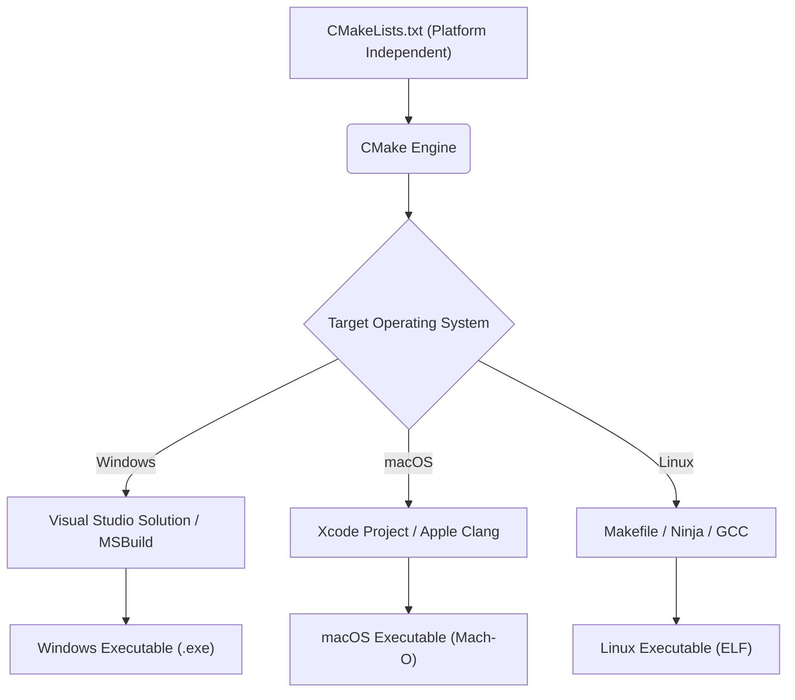
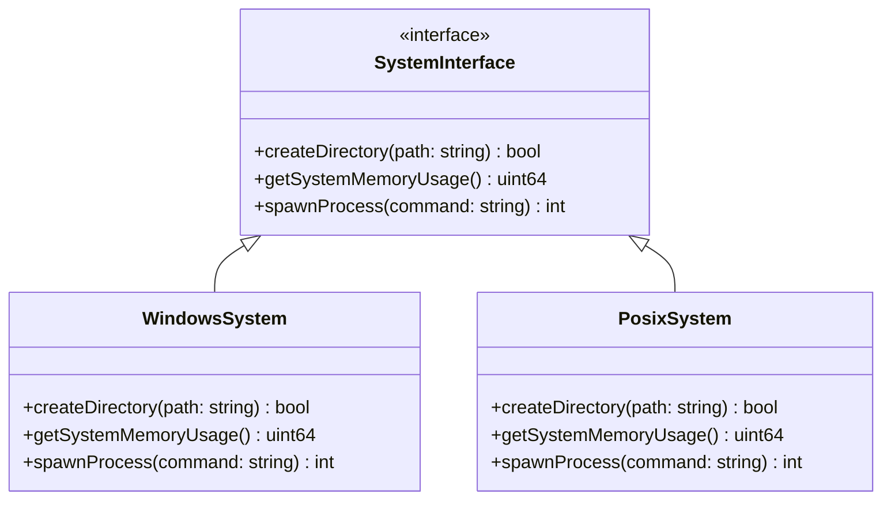
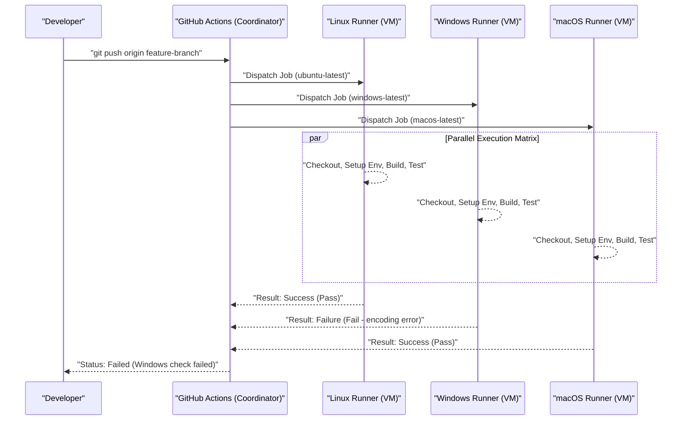

Mac（macOS）とWindows、さらにはLinux（WSLを含む）といった複数のオペレーティングシステム（OS）にまたがるクロスプラットフォーム開発は、現代のソフトウェアエンジニアリングにおいて避けては通れない道です。ウェブ開発、モバイルアプリのバックエンド、あるいはクロスプラットフォームのデスクトップアプリ（Electron、Tauri、Qtなど）を構築する際、チーム内で異なるOSを使用していると、数多くの「OSの差異に起因するバグ」に遭遇します。

それぞれのOSは異なる歴史的背景と設計思想を持っています。WindowsはMS-DOSから派生した独自のアーキテクチャ（Win32 API、NTカーネル）を持ちますが、macOSはUNIX（FreeBSDベースのDarwin）を基盤とし、LinuxはPOSIX標準に準拠しています。この根本的な違いが、ファイルシステム、ネットワーク、プロセスの扱いなどあらゆる場面で開発者を悩ませる「落とし穴」を生み出します。

本記事では、MacとWindowsが混在する開発チームや、両OSをターゲットとしたアプリケーション開発において、絶対に知っておくべき技術的差異とベストプラクティスを、極めて詳細かつ実践的に解説します。

---

## 1. 改行コードの落とし穴 (CRLF vs LF) と Git の厳密な設定

最も頻繁に発生し、かつチーム開発を混乱に陥れる原因の一つが「改行コード（Line Endings）」の問題です。これはタイプライターの時代にまで遡る歴史的な問題です。

*   **Windows**: キャリッジリターン（CR, `\r`, `0x0D`）とラインフィード（LF, `\n`, `0x0A`）の組み合わせである **CRLF** を標準の改行コードとして使用します。
*   **macOS / Linux**: ラインフィード単体である **LF** を標準の改行コードとして使用します。（※初期のMac OS 9まではCR単体でしたが、Mac OS X以降はUNIXベースとなりLFになりました）

この違いにより、Gitリポジトリ内でソースコードを共有する際、差分（diff）がファイル全体に及んでしまったり、Linux環境で実行する前提のシェルスクリプト（`.sh`）がWindowsで編集されたことによってCRLFとなり、実行時に `\r` が不正な文字として解釈され `\r: command not found` といったエラーを引き起こしたりします。

### Git における解決策: `.gitattributes` による管理

Gitには `core.autocrlf` という設定がありますが、これに依存するのは危険です。なぜなら、開発者個人のローカルマシンのグローバル設定に依存してしまうため、新しいメンバーがチームに加わった際に設定漏れによるトラブルが起きやすいからです。

ベストプラクティスは、リポジトリのルートディレクトリに `.gitattributes` ファイルを配置し、リポジトリレベルで改行コードの扱いを明示的に定義することです。これにより、どの環境でクローンされても一貫した挙動が保証されます。

```gitattributes
# デフォルトはテキストファイルとして扱い、リポジトリ内（Gitのデータベース上）ではLFに正規化する
# チェックアウト時に各OSの標準改行コードに変換される
* text=auto

# ただし、ソースコードなどの特定の拡張子は、OSに関わらず常にLFを強制する
*.sh text eol=lf
*.py text eol=lf
*.cpp text eol=lf
*.hpp text eol=lf
*.js text eol=lf
*.json text eol=lf

# Windows専用のバッチファイルなどはCRLFを強制する
*.cmd text eol=crlf
*.bat text eol=crlf

# 画像やビルド済みバイナリなどのファイルは改行コードの変換を行わない（破損を防ぐ）
*.png binary
*.jpg binary
*.pdf binary
```

---

## 2. ファイルシステムの大文字・小文字の区別 (Case Sensitivity)

ファイルシステムにおける大文字・小文字の区別（Case Sensitivity）も、クロスプラットフォーム開発における最大の鬼門の一つです。

*   **macOS (APFS / HFS+)**: デフォルトで **大文字・小文字を区別しない（Case-Insensitive）** が、**状態は保存される（Case-Preserving）**。つまり、`File.txt` として保存すると `File.txt` と表示されますが、プログラムから `file.txt` としてアクセスしても読み込むことができます。
*   **Windows (NTFS)**: macOSと同様に、デフォルトで **大文字・小文字を区別しない（Case-Insensitive）**、**状態は保存される（Case-Preserving）** 仕様です。
*   **Linux / WSL (ext4など)**: **大文字・小文字を完全に区別する（Case-Sensitive）**。`File.txt` と `file.txt` は全く別のファイルとして同一ディレクトリ内に共存できます。

### 発生する典型的なバグ

MacやWindowsで開発している際、ソースコード内で `#include "myclass.h"` （または `import "./myclass"`）と小文字で指定していても、実際のファイルが `MyClass.h` である場合、ローカル環境のOSはCase-Insensitiveであるためビルドが成功してしまいます。

しかし、このコードをコミットし、CI/CDサーバー（通常はUbuntuなどのLinux）でビルドを実行すると、Linuxのext4ファイルシステムはCase-Sensitiveであるため「ファイルが見つからない」というコンパイルエラーになります。

### アルゴリズム的視点: ファイル検索の計算量と正規化

ファイルシステムがファイルのパスを解決する際、内部でどのような処理が行われているか数学的に考えてみましょう。

大文字・小文字を区別する ext4 の場合、ディレクトリ内のエントリはハッシュテーブルやB-Treeなどの構造で管理されています。ディレクトリ内のファイル数を $N$、ファイル名の長さを $L$ とすると、単純なバイナリサーチやツリー探索の場合の計算量は以下のようになります。

$$ T_{search}(N) = O(L \log N) $$

一方、NTFSやAPFSなどの大文字・小文字を区別しないファイルシステムでは、文字列を比較する前に双方の文字列を同一のケース（大文字または小文字）に正規化（Case Folding）する処理が必要です。Unicodeの正規化やロケールを考慮した大文字・小文字変換は単純なASCIIのビット演算では済まず、テーブルルックアップが必要となります。

変換関数の計算コストを定数 $C_{fold}$ とすると、1回の文字列比較ごとに余分なオーバーヘッドがかかります。

$$ T_{insensitive\_search}(N) = O( (L \times C_{fold}) \log N ) $$

最近のOSはこれを高度にキャッシュしていますが、根本的な挙動の違いは開発レベルでの規約で縛るしかありません。**「ファイル名とディレクトリ名はすべて小文字とハイフン（ケバブケース）またはアンダースコア（スネークケース）で統一する」** というプロジェクト規約を設けるのが最も安全なアプローチです。

---

## 3. パス区切り文字 (Path Separators) とファイルパスの抽象化

ディレクトリの階層を示す区切り文字の扱いは、OS間の根本的な違いを反映しています。

*   **Windows**: バックスラッシュ `\` （日本語環境のフォントによっては円記号 `¥` として表示される）を使用し、さらにドライブレター（例：`C:\`）やUNCパス（例：`\\Server\Share`）という概念が存在します。
*   **macOS / Linux**: スラッシュ `/` を使用し、すべてのファイルシステムは単一のルート `/` から始まる階層構造（Single Root Hierarchy）を持ちます。

多くのプログラミング言語は、Windows上でも `/` をファイル区切りとしてよしなに解釈してくれます（Win32 API自体が `/` をサポートしている部分もあるため）。しかし、コマンドライン引数としてパスを渡す場合や、システムコールを直接叩く場合、文字列としてパスを比較・パースする場合には致命的なエラーを引き起こします。

### 言語ごとのベストプラクティス（OSの抽象化）

文字列の結合（例：`path + "\\" + filename`）でファイルパスを構築することは**絶対に避けてください**。各言語に用意されているパス操作の標準ライブラリ（OS Abstraction Layer）を使用します。

#### C++の例 (`std::filesystem`)
C++17以降では `<filesystem>` が導入され、プラットフォーム間のパスの違いを抽象化できるようになりました。

```cpp
#include <iostream>
#include <filesystem>

namespace fs = std::filesystem;

int main() {
    // OSに依存しないパスの構築 (演算子オーバーロードによる抽象化)
    fs::path dir = "data";
    fs::path file = "config.json";
    fs::path full_path = dir / file; // Windowsでは "data\config.json", Mac/Linuxでは "data/config.json" になる

    std::cout << "Full path: " << full_path.string() << std::endl;
    return 0;
}
```

#### Pythonの例 (`pathlib`)
古くは `os.path.join()` が使われていましたが、現在ではオブジェクト指向の `pathlib` モジュールを使用するのが標準的です。

```python
from pathlib import Path

# / 演算子がオーバーライドされており、OSに合わせたパスオブジェクトを生成する
base_dir = Path("user_data")
config_file = base_dir / "settings" / "app.ini"

# パスの解決やファイルの読み込みも一貫したメソッドで可能
if config_file.exists():
    text = config_file.read_text(encoding="utf-8")
```

#### Node.jsの例 (`path` モジュール)

```javascript
const path = require('path');

// path.join は引数を受け取り、現在のOSに適した区切り文字で結合する
const configPath = path.join('config', 'default.json');
console.log(configPath); 
// Windows: "config\default.json"
// macOS/Linux: "config/default.json"
```

---

## 4. 文字エンコーディング (UTF-8 vs CP932/Shift-JIS) と Unicode の壁

Windowsの日本語環境における最大の悩みの種が文字エンコーディングです。
現代の開発において、macOSやLinuxはシステム全体、ターミナル、ファイルエンコーディングに至るまで **UTF-8** で完全に統一されています。しかし、日本語版Windowsの標準エンコーディング（システムロケールに基づく「ANSIコードページ」）は依然として **CP932 (Shift-JISのマイクロソフト拡張)** がデフォルトとして動作する場面が多くあります。
※内部的なWin32 APIの文字列表現はUTF-16LE（`wchar_t`）です。

Pythonなどでファイルの読み書きを行う際、エンコーディングを明示しないと、Windows上では `locale.getpreferredencoding()` の結果（CP932）に従って解釈しようとします。これにより、UTF-8で保存されたファイルを読み込もうとして `UnicodeDecodeError` が発生したり、文字化け（Mojibake）が起きたりします。

### 文字コード変換の数学的モデルとオーバーヘッド

文字列をあるエンコーディング（UTF-8）から別のエンコーディング（UTF-16やCP932）へ変換する場合、最悪計算量は文字列の長さに比例します。文字列のバイト長を $B$ とすると、変換の計算量は $O(B)$ です。しかし、可変長エンコーディングであるUTF-8のパース、サロゲートペアの計算、および変換テーブルのルックアップ（Lookup）により、無視できないオーバーヘッドが生じます。

文字列の長さを $N$、マルチバイト文字からUnicodeコードポイントへのマッピング関数を $f_{decode}$、コードポイントから目的のエンコーディングへのマッピング関数を $f_{encode}$ とすると、総変換時間 $T_{conv}$ は次のように近似されます。

$$ T_{conv} = \sum_{i=1}^{N} \Big( C_{decode} \cdot f_{decode}(x_i) + C_{encode} \cdot f_{encode}(y_i) \Big) \approx O(N) $$

クロスプラットフォームのアプリケーションでは、OSのネイティブAPIを呼び出す（I/O境界を越える）たびにこの変換コストが発生することを意識する必要があります（特にWindows向けにC++で開発する場合、`MultiByteToWideChar` 等によるUTF-16への変換が頻繁に発生します）。

### エンコーディングに関する対策

最も確実な対策は**「いかなる時も明示的にUTF-8を指定する」**ことです。

```python
# Pythonでの良い例：常に encoding="utf-8" を指定する
with open("data.txt", "w", encoding="utf-8") as f:
    f.write("こんにちは、世界！")
```

また、Windowsのターミナル（コマンドプロンプトやPowerShell）でUTF-8の出力を正しく表示させるために、アプリケーション起動時に環境変数 `PYTHONUTF8=1` を設定するか、Node.jsであればコンソールのコードページを `chcp 65001` コマンドで一時的にUTF-8に変更するなどの工夫が必要になる場合があります。

---

## 5. 環境変数とシェル環境の違い (bash/zsh vs PowerShell)

ビルドスクリプトや開発用ツールを実行する際のシェル（コマンドラインインタプリタ）の違いも、クロスプラットフォームにおける大きな壁です。

*   **macOS / Linux**: `bash` または `zsh` が主流。テキストベースのパイプライン処理を行います。
*   **Windows**: コマンドプロンプト (`cmd.exe`) または `PowerShell`。PowerShellは.NETベースであり、強力なオブジェクト指向パイプラインを持ちますが、文法がPOSIXシェルと全く異なります。

環境変数の参照方法や設定方法が異なるため、Node.jsの `package.json` の `scripts` 領域などでOS依存の書き方をすると、他の環境で動かなくなります。

```json
// ❌ 悪い例: Windowsでは「NODE_ENV」というコマンドとして認識されずエラーになる
"scripts": {
  "build": "NODE_ENV=production webpack"
}
```

### 解決策: クロスプラットフォーム向けツールの活用

Node.js環境であれば、`cross-env` などのパッケージを使用して環境変数の設定を抽象化します。

```json
// ✅ 良い例: cross-env がOSの違いを吸収し、適切に環境変数をセットして webpack を起動する
"scripts": {
  "build": "cross-env NODE_ENV=production webpack",
  "clean": "rimraf dist/" // rm -rf の代わりにクロスプラットフォームなリムーバーを使う
}
```

大規模なプロジェクトで複雑なシェルスクリプトが必要な場合は、Windows環境の開発者にも WSL (Windows Subsystem for Linux) や Git Bash の利用を標準とし、すべてのバッチ処理を `.sh` スクリプトとして統一管理するのが現在のベストプラクティスです。

---

## 6. クロスプラットフォームのビルドシステムとコンパイラ

C++ や Rust などのネイティブコード（マシンコードに直接コンパイルされる言語）を扱う場合、OS固有のAPIだけでなく、ビルドシステムとコンパイラの違いも克服する必要があります。

*   **コンパイラ**:
    *   Windows: MSVC (Microsoft Visual C++), MinGW (GCC for Windows)
    *   macOS: Apple Clang
    *   Linux: GCC, Clang
*   **バイナリフォーマット**:
    *   Windows: PE (Portable Executable) `.exe` / `.dll`
    *   macOS: Mach-O
    *   Linux: ELF (Executable and Linkable Format) `.so`

### CMakeによるメタビルドシステムの活用

C/C++プロジェクトにおいて、クロスプラットフォームを実現するための世界的なデファクトスタンダードが **CMake** です。CMakeは直接ソースコードをコンパイルするのではなく、各環境に合わせたネイティブのビルド設定ファイル（WindowsならVisual Studioのソリューションファイル、Linux/MacならMakefileやNinjaのビルドスクリプト）を生成する「ジェネレータ（Generator）」として機能します。



CMakeを使用することで、環境間の違いを吸収し、単一の設定ファイル（`CMakeLists.txt`）から各OSに最適なバイナリを生成できます。依存ライブラリの解決（`find_package`）や、OSごとの特定ライブラリのリンクも条件分岐で簡単に記述できます。

```cmake
# CMakeLists.txt の一部例
if(WIN32)
    # Windows固有のライブラリ（WS2_32.libなど）をリンク
    target_link_libraries(my_app PRIVATE ws2_32)
    add_compile_definitions(OS_WINDOWS)
elseif(APPLE)
    # macOS固有のフレームワークをリンク
    target_link_libraries(my_app PRIVATE "-framework Foundation")
    add_compile_definitions(OS_MACOS)
elseif(UNIX AND NOT APPLE)
    # Linux向けのリンク（pthreadなど）
    target_link_libraries(my_app PRIVATE pthread)
    add_compile_definitions(OS_LINUX)
endif()
```

---

## 7. アーキテクチャパターンの活用：OS抽象化層 (OSAL)

システムに依存する処理（ファイル操作、プロセス/スレッドの生成、メモリ管理、ソケット通信など）をアプリケーションのコアとなるビジネスロジックから完全に分離することが、クロスプラットフォーム開発の要です。

これを実現するために **OS抽象化層 (OS Abstraction Layer, OSAL)** というパターンを使用します。

以下は、OSごとの固有APIをラップし、共通のインターフェースを提供するクラス設計の例です。ポリモーフィズムを利用するか、コンパイル時のマクロスイッチを利用して実装を切り替えます。



このようにプラットフォーム固有のコードを一箇所（通常は `src/platform/windows/` や `src/platform/posix/` などのディレクトリ）に隔離することで、それ以外の95%のコード（GUIのロジック、データ処理、通信プロトコルのパースなど）を完全にクロスプラットフォームかつテスト可能な状態に保つことができます。

---

## 8. CI/CDでのクロスプラットフォーム検証 (マトリックスビルド)

開発者がローカル環境でどれだけ注意深くコーディングしても、クロスプラットフォーム対応の最終的な砦となるのは **CI/CD (Continuous Integration / Continuous Deployment) パイプライン** です。ローカル環境（例えばMac）では動いても、他のOS（Windows）ではコンパイルエラーになるケースは後を絶ちません。

GitHub ActionsやGitLab CIなどの最新のCIツールを活用し、Pull Requestが作成されるたびに **Windows, macOS, Linuxの全環境で並列してビルドとテストを実行する** マトリックスビルド（Matrix Build）を設定しましょう。

```yaml
# GitHub Actions によるクロスプラットフォームCIの設定例
name: Cross-Platform Build and Test

on: [push, pull_request]

jobs:
  build:
    runs-on: ${{ matrix.os }}
    strategy:
      fail-fast: false # 1つのOSで失敗しても他のOSのテストを続行する
      matrix:
        # Windows, macOS, Linux の3つのランナーを指定
        os: [ubuntu-latest, windows-latest, macos-latest]

    steps:
    - uses: actions/checkout@v3
    - name: Set up Python Environment
      uses: actions/setup-python@v4
      with:
        python-version: '3.11'
        cache: 'pip' # クロスプラットフォームでも依存関係をキャッシュ
        
    - name: Install dependencies
      run: python -m pip install --upgrade pip && pip install -r requirements.txt
      
    - name: Run Test Suite
      run: pytest -v
```

このCI/CDのフローを視覚化すると以下のようになります。



各OSでのテスト結果を自動で収集し、**すべての環境でグリーン（成功）になった場合のみ main ブランチへのマージを許可する**ようにブランチプロテクションルールを設定することで、プラットフォーム依存のバグが本番環境やリリースビルドに混入するのを未然に防ぎます。

---

## まとめ

MacとWindowsのクロスプラットフォーム開発には、歴史的背景に根ざした多岐にわたる課題が存在します。

1.  **改行コード**: `.gitattributes` でリポジトリレベルの正規化（LF統一など）を強制する。
2.  **大文字・小文字**: macOS/Windowsの「区別しない」挙動に甘えず、ファイル命名規則を厳格に定め、厳密なケースマッチングを心がける。
3.  **パス区切り**: 言語標準のパス操作API（`std::filesystem`, `pathlib`, `path`モジュール）を利用し、OSの違いを吸収する。
4.  **エンコーディング**: 常に UTF-8 を指定し、Windowsのデフォルト動作であるCP932の影響を徹底的に排除する。
5.  **環境変数・シェル**: `cross-env` などの抽象化ツールを使うか、実行環境をWSL/Docker等に統一する。
6.  **ビルドシステム**: C/C++の場合は CMake 等のメタビルドシステムを活用し、OSごとに最適なネイティブツールチェーンを生成する。
7.  **OS依存コード**: OS抽象化層 (OSAL) を設計し、プラットフォーム依存のロジックを分離・隔離する。
8.  **CI/CD**: マトリックスビルドを導入し、全対象OSでのクリーンなビルドとテストを自動化し、属人性を排除する。

現在では Electron, Tauri, .NET などの強力なフレームワークがこれらの差異の多くを吸収してくれますが、基盤となるOSのネイティブな挙動（ファイルシステムやエンコーディング）の知識は、深刻なパフォーマンス問題や難解なバグを解決する際に依然として不可欠です。これらのベストプラクティスをプロジェクトの初期段階からチーム全体で共有・徹底することで、OSの違いによる不毛なデバッグ時間を大幅に削減し、本質的なソフトウェアの価値創造に集中することができるでしょう。
