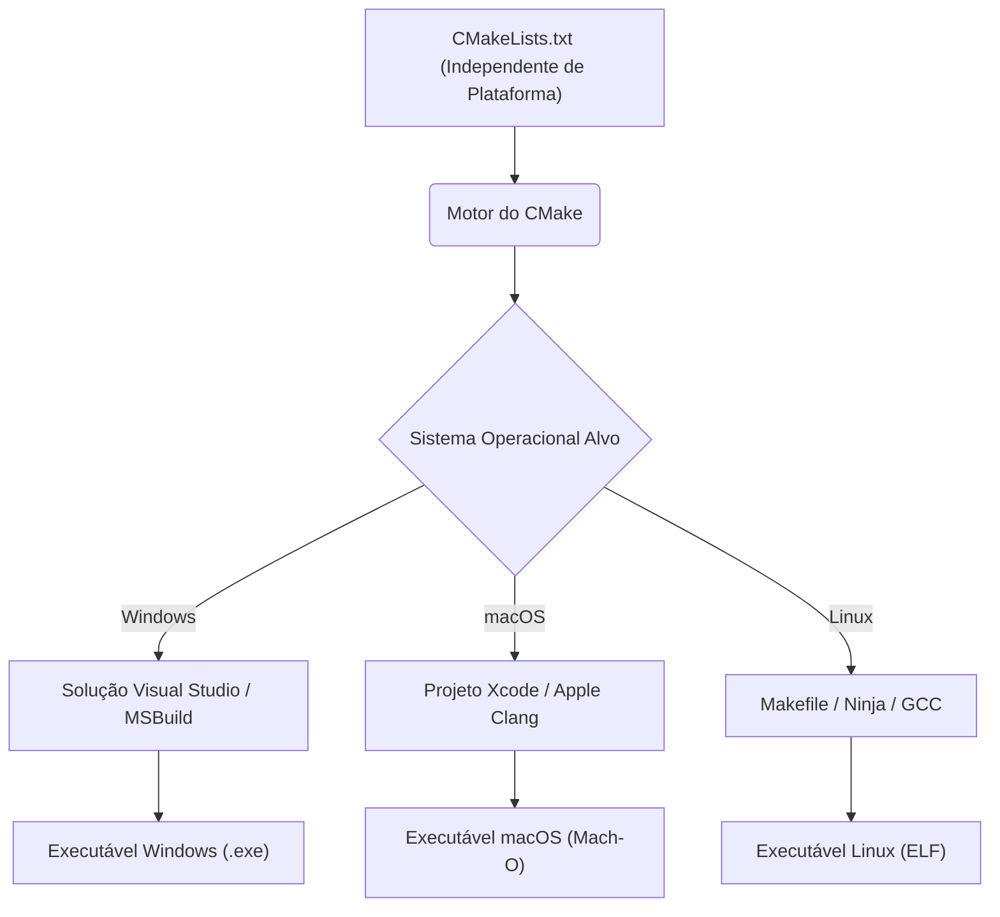
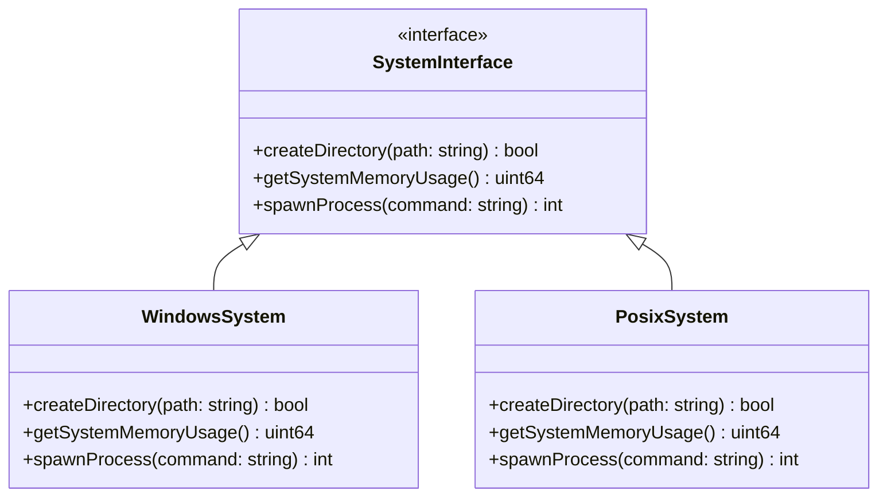
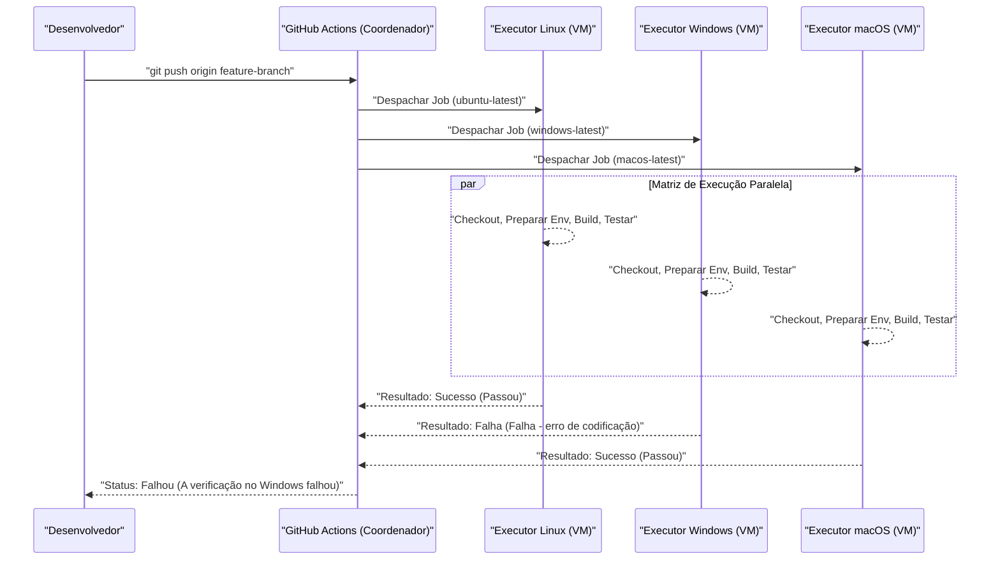

O desenvolvimento multiplataforma abrangendo vários sistemas operacionais (SO), como Mac (macOS) e Windows, e até mesmo Linux (incluindo WSL), é um caminho inevitável na engenharia de software moderna. Ao construir desenvolvimento web, back-ends de aplicativos móveis ou aplicativos de desktop multiplataforma (Electron, Tauri, Qt, etc.), se a equipe usa sistemas operacionais diferentes, você encontrará inúmeros "bugs causados por diferenças entre SOs".

Cada SO tem um contexto histórico e uma filosofia de design diferentes. Enquanto o Windows possui sua própria arquitetura (Win32 API, kernel NT) derivada do MS-DOS, o macOS é baseado no UNIX (Darwin, baseado no FreeBSD) e o Linux segue o padrão POSIX. Essa diferença fundamental cria "armadilhas" que atormentam os desenvolvedores em todos os aspectos, como no tratamento de sistemas de arquivos, redes e processos.

Neste artigo, explicaremos de forma extremamente detalhada e prática as diferenças técnicas e as melhores práticas que você deve conhecer em equipes de desenvolvimento que misturam Mac e Windows, e no desenvolvimento de aplicativos direcionados a ambos os SOs.

---

## 1. A armadilha das quebras de linha (CRLF vs LF) e a configuração rigorosa do Git

Um dos problemas mais frequentes e que causa confusão no desenvolvimento em equipe é o problema das "quebras de linha (Line Endings)". Este é um problema histórico que remonta à era das máquinas de escrever.

*   **Windows**: Usa **CRLF**, uma combinação de Carriage Return (CR, `\r`, `0x0D`) e Line Feed (LF, `\n`, `0x0A`), como o código padrão de quebra de linha.
*   **macOS / Linux**: Usa apenas Line Feed, **LF**, como o código padrão de quebra de linha. (*Até o antigo Mac OS 9, era usado apenas CR, mas do Mac OS X em diante, tornou-se baseado no UNIX e adotou o LF.)

Devido a essa diferença, ao compartilhar o código-fonte em um repositório Git, as diferenças (diffs) podem afetar o arquivo inteiro. Ou, se um script shell (`.sh`) feito para rodar em ambiente Linux for editado no Windows, tornando-se CRLF, o `\r` pode ser interpretado como um caractere inválido durante a execução, causando erros como `\r: command not found`.

### A solução no Git: Gerenciamento via `.gitattributes`

O Git tem uma configuração chamada `core.autocrlf`, mas depender dela é perigoso. Como isso depende da configuração global na máquina local de cada desenvolvedor, problemas devido a configurações faltantes ocorrem facilmente quando um novo membro se junta à equipe.

A melhor prática é colocar um arquivo `.gitattributes` no diretório raiz do repositório e definir explicitamente o tratamento de quebras de linha em nível de repositório. Isso garante um comportamento consistente, independentemente do ambiente onde é clonado.

```gitattributes
# Por padrão trata como arquivo de texto e normaliza para LF no repositório (banco de dados do Git)
# É convertido para o código de quebra de linha padrão de cada SO no checkout
* text=auto

# No entanto, para extensões específicas, como código-fonte, sempre força LF, independentemente do SO
*.sh text eol=lf
*.py text eol=lf
*.cpp text eol=lf
*.hpp text eol=lf
*.js text eol=lf
*.json text eol=lf

# Força CRLF para arquivos em lote (batch) exclusivos do Windows, etc.
*.cmd text eol=crlf
*.bat text eol=crlf

# Não converte quebras de linha de arquivos como imagens e binários pré-compilados (para evitar corrupção)
*.png binary
*.jpg binary
*.pdf binary
```

---

## 2. Distinção entre maiúsculas e minúsculas no sistema de arquivos (Case Sensitivity)

A distinção entre maiúsculas e minúsculas (Case Sensitivity) no sistema de arquivos também é um dos maiores obstáculos no desenvolvimento multiplataforma.

*   **macOS (APFS / HFS+)**: Por padrão, **não diferencia maiúsculas de minúsculas (Case-Insensitive)**, mas **preserva o estado (Case-Preserving)**. Ou seja, se for salvo como `File.txt`, será exibido como `File.txt`, mas ainda pode ser lido e acessado pelo programa como `file.txt`.
*   **Windows (NTFS)**: Semelhante ao macOS, sua especificação padrão é **não diferenciar maiúsculas de minúsculas (Case-Insensitive)** e **preservar o estado (Case-Preserving)**.
*   **Linux / WSL (como ext4)**: **Diferencia completamente maiúsculas de minúsculas (Case-Sensitive)**. `File.txt` e `file.txt` podem coexistir no mesmo diretório como arquivos totalmente diferentes.

### Bugs típicos que ocorrem

Durante o desenvolvimento no Mac ou Windows, se você especificar o código-fonte em letras minúsculas com `#include "myclass.h"` (ou `import "./myclass"`), mas o arquivo real for `MyClass.h`, a compilação será bem-sucedida porque o SO do ambiente local é Case-Insensitive.

No entanto, se você submeter este código e executar uma compilação em um servidor CI/CD (geralmente Linux, como o Ubuntu), o sistema de arquivos ext4 do Linux é Case-Sensitive, o que resultará em um erro de compilação de "arquivo não encontrado".

### Perspectiva algorítmica: Complexidade computacional e normalização da pesquisa de arquivos

Vamos pensar matematicamente sobre o processamento interno que ocorre quando o sistema de arquivos resolve o caminho de um arquivo.

No caso do ext4, que diferencia maiúsculas de minúsculas, as entradas no diretório são gerenciadas por estruturas como tabelas de hash ou B-Trees. Se o número de arquivos no diretório for $N$ e o comprimento do nome do arquivo for $L$, a complexidade computacional no caso de uma simples busca binária ou pesquisa em árvore é a seguinte:

$$ T_{search}(N) = O(L \log N) $$

Por outro lado, em sistemas de arquivos Case-Insensitive, como NTFS e APFS, é necessário um processo de normalização (Case Folding) que converte ambas as strings para a mesma caixa (maiúscula ou minúscula) antes de compará-las. A conversão de maiúsculas/minúsculas considerando a normalização Unicode e a localidade (locale) não pode ser resolvida por operações bit a bit simples em ASCII, e requer pesquisa em tabela (table lookup).

Se o custo computacional da função de conversão for uma constante $C_{fold}$, haverá uma sobrecarga extra a cada comparação de strings.

$$ T_{insensitive\_search}(N) = O( (L \times C_{fold}) \log N ) $$

Embora os SOs recentes façam um cache altamente avançado disso, a diferença de comportamento fundamental só pode ser limitada por convenções em nível de desenvolvimento. A abordagem mais segura é estabelecer uma convenção de projeto: **"Todos os nomes de arquivos e diretórios devem ser unificados com letras minúsculas e hifens (kebab-case) ou sublinhados (snake_case)"**.

---

## 3. Separadores de caminho (Path Separators) e abstração de caminho de arquivo

O tratamento do caractere separador que indica a hierarquia de diretórios reflete a diferença fundamental entre os sistemas operacionais.

*   **Windows**: Usa a barra invertida (backslash) `\` (exibida como o símbolo do Iene `¥` dependendo da fonte em ambientes japoneses), e há conceitos de letras de unidade (ex: `C:\`) e caminhos UNC (ex: `\\Server\Share`).
*   **macOS / Linux**: Usa a barra (slash) `/`, e todos os sistemas de arquivos têm uma estrutura hierárquica (Single Root Hierarchy) que começa a partir de uma única raiz `/`.

Muitas linguagens de programação interpretam razoavelmente o `/` como separador de arquivo, mesmo no Windows (pois a própria API Win32 suporta parcialmente o `/`). Porém, causa erros fatais quando você passa caminhos como argumentos de linha de comando, invoca chamadas de sistema (system calls) diretamente, ou compara e analisa o caminho como uma string.

### Melhores práticas por linguagem (Abstração do SO)

**Evite a todo custo** construir o caminho do arquivo através de concatenação de strings (ex: `path + "\\" + filename`). Use a biblioteca padrão de manipulação de caminhos (OS Abstraction Layer) fornecida em cada linguagem.

#### Exemplo em C++ (`std::filesystem`)

A partir do C++17, o `<filesystem>` foi introduzido para permitir a abstração das diferenças de caminho entre as plataformas.

```cpp
#include <iostream>
#include <filesystem>

namespace fs = std::filesystem;

int main() {
    // Construção de caminho independente do SO (abstração por sobrecarga de operador)
    fs::path dir = "data";
    fs::path file = "config.json";
    fs::path full_path = dir / file; // Torna-se "data\config.json" no Windows, e "data/config.json" no Mac/Linux

    std::cout << "Full path: " << full_path.string() << std::endl;
    return 0;
}
```

#### Exemplo em Python (`pathlib`)

Antigamente usava-se `os.path.join()`, mas atualmente o uso do módulo orientado a objetos `pathlib` é o padrão.

```python
from pathlib import Path

# O operador / foi sobrescrito para gerar objetos de caminho adaptados ao SO
base_dir = Path("user_data")
config_file = base_dir / "settings" / "app.ini"

# Resolução do caminho e leitura de arquivos também são possíveis por métodos consistentes
if config_file.exists():
    text = config_file.read_text(encoding="utf-8")
```

#### Exemplo em Node.js (módulo `path`)

```javascript
const path = require('path');

// path.join recebe os argumentos e os junta com o separador apropriado para o SO atual
const configPath = path.join('config', 'default.json');
console.log(configPath); 
// Windows: "config\default.json"
// macOS/Linux: "config/default.json"
```

---

## 4. Codificação de caracteres (UTF-8 vs CP932/Shift-JIS) e a barreira do Unicode

A maior fonte de dores de cabeça no ambiente Windows japonês é a codificação de caracteres.
No desenvolvimento moderno, o macOS e o Linux são totalmente unificados em **UTF-8**, cobrindo o sistema inteiro, terminal e codificações de arquivos. No entanto, a codificação padrão no Windows japonês ("ANSI code page" baseado no sistema local) continua operando em muitos cenários com **CP932 (extensão Microsoft para Shift-JIS)** como padrão.
※A representação interna de string da API Win32 é UTF-16LE (`wchar_t`).

Ao realizar leitura e escrita de arquivos em linguagens como o Python, se você não especificar a codificação, o sistema Windows tentará interpretar seguindo o resultado de `locale.getpreferredencoding()` (CP932). Isso fará com que, ao tentar ler um arquivo salvo em UTF-8, ocorra um `UnicodeDecodeError` ou aconteçam textos truncados/corrompidos (Mojibake).

### Modelo matemático e sobrecarga na conversão do código de caracteres

Ao converter uma string de uma codificação (UTF-8) para outra (UTF-16 ou CP932), o pior caso de complexidade computacional é proporcional ao tamanho da string. Se o tamanho em bytes for $B$, a complexidade de conversão é $O(B)$. Mas, devido à análise do UTF-8, que tem codificação de comprimento variável, cálculos de par substituto (surrogate pair) e pesquisa na tabela de conversão (Lookup), há uma sobrecarga que não pode ser ignorada.

Seja $N$ o comprimento da string, $f_{decode}$ a função de mapeamento de caracteres multibyte para o ponto de código (code point) Unicode, e $f_{encode}$ a função de mapeamento de pontos de código para a codificação desejada, o tempo total de conversão $T_{conv}$ é aproximado da seguinte maneira:

$$ T_{conv} = \sum_{i=1}^{N} \Big( C_{decode} \cdot f_{decode}(x_i) + C_{encode} \cdot f_{encode}(y_i) \Big) \approx O(N) $$

Em aplicativos multiplataforma, deve-se estar ciente de que esse custo de conversão ocorre toda vez que as APIs nativas do SO são chamadas (atravessando o limite de I/O) (especialmente ao desenvolver em C++ para Windows, conversões para UTF-16 usando `MultiByteToWideChar` etc., ocorrem frequentemente).

### Contramedidas relacionadas à codificação

A contramedida mais confiável é **"especificar explicitamente UTF-8 em todos os momentos"**.

```python
# Bom exemplo em Python: sempre especificar encoding="utf-8"
with open("data.txt", "w", encoding="utf-8") as f:
    f.write("Olá, mundo!")
```

Além disso, para exibir corretamente a saída em UTF-8 no terminal do Windows (Prompt de Comando ou PowerShell), pode ser necessário usar truques como definir a variável de ambiente `PYTHONUTF8=1` ao inicializar a aplicação, ou, no Node.js, mudar temporariamente a página de código (code page) do console para UTF-8 com o comando `chcp 65001`.

---

## 5. Diferenças de variáveis de ambiente e ambientes Shell (bash/zsh vs PowerShell)

A diferença nos shells (interpretadores de linha de comando) ao executar scripts de build e ferramentas de desenvolvimento também é uma grande barreira nas múltiplas plataformas.

*   **macOS / Linux**: A maioria usa `bash` ou `zsh`. Eles processam pipelines baseados em texto.
*   **Windows**: Prompt de Comando (`cmd.exe`) ou `PowerShell`. O PowerShell é baseado em .NET e tem um poderoso pipeline orientado a objetos, mas a sintaxe é totalmente diferente do shell POSIX.

Os métodos para definir e referenciar as variáveis de ambiente diferem, então, se você usar uma forma dependente do SO, como na seção `scripts` do `package.json` do Node.js, ela não funcionará em outros ambientes.

```json
// ❌ Mau exemplo: O Windows não o reconhece como um comando "NODE_ENV" e resulta em erro
"scripts": {
  "build": "NODE_ENV=production webpack"
}
```

### Solução: Utilizando ferramentas para desenvolvimento multiplataforma

Em um ambiente Node.js, os pacotes como `cross-env` abstraem a definição de variáveis de ambiente.

```json
// ✅ Bom exemplo: O cross-env absorve a diferença dos SOs, define as variáveis apropriadamente e inicia o webpack
"scripts": {
  "build": "cross-env NODE_ENV=production webpack",
  "clean": "rimraf dist/" // Usa um removedor multiplataforma em vez de rm -rf
}
```

Se for necessário um script de shell complexo em um projeto em larga escala, a melhor prática atual é adotar como padrão que desenvolvedores em ambiente Windows também utilizem WSL (Windows Subsystem for Linux) ou Git Bash e padronizem todo o processamento em lote sob o formato de scripts `.sh`.

---

## 6. Sistemas de build e compiladores multiplataforma

Ao lidar com código nativo (linguagens diretamente compiladas em código de máquina) como C++ e Rust, você precisará superar as diferenças nos compiladores e sistemas de build, e não apenas nas APIs específicas do SO.

*   **Compiladores**:
    *   Windows: MSVC (Microsoft Visual C++), MinGW (GCC para Windows)
    *   macOS: Apple Clang
    *   Linux: GCC, Clang
*   **Formatos Binários**:
    *   Windows: PE (Portable Executable) `.exe` / `.dll`
    *   macOS: Mach-O
    *   Linux: ELF (Executable and Linkable Format) `.so`

### Utilização de um sistema de meta build com CMake

Nos projetos em C/C++, o padrão de fato global para se conseguir ser multiplataforma é o **CMake**. O CMake não compila o código-fonte diretamente, mas atua como um "gerador (Generator)" que cria o arquivo de configuração de build nativo para cada ambiente (como um arquivo de solução do Visual Studio no Windows, ou scripts de build Makefile ou Ninja no Linux/Mac).



Ao usar o CMake, ele absorve as diferenças de ambientes, permitindo gerar binários otimizados para cada SO a partir de um único arquivo de configuração (`CMakeLists.txt`). A resolução de bibliotecas dependentes (`find_package`) ou ligações (links) de bibliotecas específicas de cada SO podem ser facilmente escritas por meio de ramificações condicionais.

```cmake
# Exemplo de uma parte de um CMakeLists.txt
if(WIN32)
    # Ligar bibliotecas específicas do Windows (como WS2_32.lib)
    target_link_libraries(my_app PRIVATE ws2_32)
    add_compile_definitions(OS_WINDOWS)
elseif(APPLE)
    # Ligar frameworks específicos do macOS
    target_link_libraries(my_app PRIVATE "-framework Foundation")
    add_compile_definitions(OS_MACOS)
elseif(UNIX AND NOT APPLE)
    # Ligar pacotes voltados ao Linux (como pthread)
    target_link_libraries(my_app PRIVATE pthread)
    add_compile_definitions(OS_LINUX)
endif()
```

---

## 7. Aplicação de padrões de arquitetura: Camada de Abstração do SO (OSAL)

A chave para o desenvolvimento multiplataforma é isolar totalmente o processamento dependente do sistema (manipulação de arquivos, criação de processos/threads, gerenciamento de memória, comunicação de soquetes, etc.) da lógica de negócios central do aplicativo.

Para realizar isso, usa-se o padrão conhecido como **Camada de Abstração do SO (OS Abstraction Layer, OSAL)**.

Abaixo temos um exemplo de design de classe para fornecer uma interface comum envelopando as APIs específicas para cada SO. A implementação é alternada utilizando-se polimorfismo ou por meio de chaves de macros em tempo de compilação.



Ao isolar o código específico da plataforma num único local desta forma (normalmente diretórios como `src/platform/windows/` ou `src/platform/posix/`), o restante de 95% do código (lógica GUI, processamento de dados, análise de protocolo de comunicação, etc.) pode ser mantido num estado que é 100% testável e multiplataforma.

---

## 8. Validação multiplataforma no CI/CD (Matrix Build)

A última linha de defesa para a compatibilidade multiplataforma é o **pipeline de CI/CD (Integração Contínua / Implantação Contínua)**, por mais que os desenvolvedores codifiquem cuidadosamente em seus ambientes locais. Mesmo funcionando no ambiente local (por exemplo, Mac), as falhas de compilação no SO oposto (Windows) são intermináveis.

Usando ferramentas modernas de CI, como GitHub Actions ou GitLab CI, configure o Matrix Build para **executar compilação e teste em todos os ambientes do Windows, macOS, e Linux em paralelo** toda vez que um Pull Request for criado.

```yaml
# Exemplo de configuração de CI multiplataforma pelo GitHub Actions
name: Cross-Platform Build and Test

on: [push, pull_request]

jobs:
  build:
    runs-on: ${{ matrix.os }}
    strategy:
      fail-fast: false # Continua a testar outros SOs mesmo que falhe em um SO
      matrix:
        # Especifica os três executores para Windows, macOS e Linux
        os: [ubuntu-latest, windows-latest, macos-latest]

    steps:
    - uses: actions/checkout@v3
    - name: Set up Python Environment
      uses: actions/setup-python@v4
      with:
        python-version: '3.11'
        cache: 'pip' # Faz cache de dependências mesmo em ambientes multiplataforma
        
    - name: Install dependencies
      run: python -m pip install --upgrade pip && pip install -r requirements.txt
      
    - name: Run Test Suite
      run: pytest -v
```

Isso visualiza o fluxo de CI/CD abaixo.



Configurando as regras de proteção de branch para coletar os resultados de testes em cada SO automaticamente e **permitir mesclagem na branch main apenas se todos os ambientes ficarem verdes (bem sucedidos)**, você pode evitar proativamente que bugs dependentes da plataforma entrem no ambiente de produção ou builds de lançamento.

---

## Conclusão

O desenvolvimento multiplataforma entre Mac e Windows possui muitos desafios enraizados no contexto histórico.

1.  **Quebras de linha**: Forçar uma normalização ao nível de repositório (unificando para LF etc.) no `.gitattributes`.
2.  **Maiúsculas/Minúsculas**: Não depender do comportamento de "não distinguir" do macOS/Windows. Estabelecer convenções de nomenclatura de arquivos bem estritas e garantir correspondência exata das caixas.
3.  **Separadores de Caminho**: Fazer uso das APIs padrão de operação de caminhos da linguagem (módulos `std::filesystem`, `pathlib`, `path`) para absorver as diferenças nos SOs.
4.  **Codificação**: Sempre especificar o UTF-8 e excluir completamente os impactos do comportamento padrão CP932 no Windows.
5.  **Variáveis de Ambiente / Shell**: Usar ferramentas de abstração como `cross-env` ou padronizar o ambiente de execução em ferramentas como WSL/Docker.
6.  **Sistemas de Build**: Para C/C++, utilizar um sistema de meta-build, como CMake, de modo a gerar a toolchain nativa ideal para cada SO.
7.  **Código Dependente do SO**: Projetar uma Camada de Abstração do SO (OSAL) e isolar/separar lógicas que dependem de plataforma.
8.  **CI/CD**: Inserir o Matrix Build, automatizando testes e compilações limpas de todos os SOs em uso e remover dependências centradas no indivíduo (pessoais).

Atualmente, frameworks de peso como o Electron, Tauri, .NET absorvem a maior parte destas disparidades, mas o domínio do comportamento nativo do SO da base (como sistemas de arquivos e codificações) ainda é essencial para desvendar bugs obscuros e solucionar falhas de performance complexas. Compartilhando e aplicando firmemente as melhores práticas por toda a equipe, desde a fase embrionária do projeto, é possível abater os períodos ociosos decorrentes do debug entre SOs e concentrar os esforços na essencial geração de valor do software.
