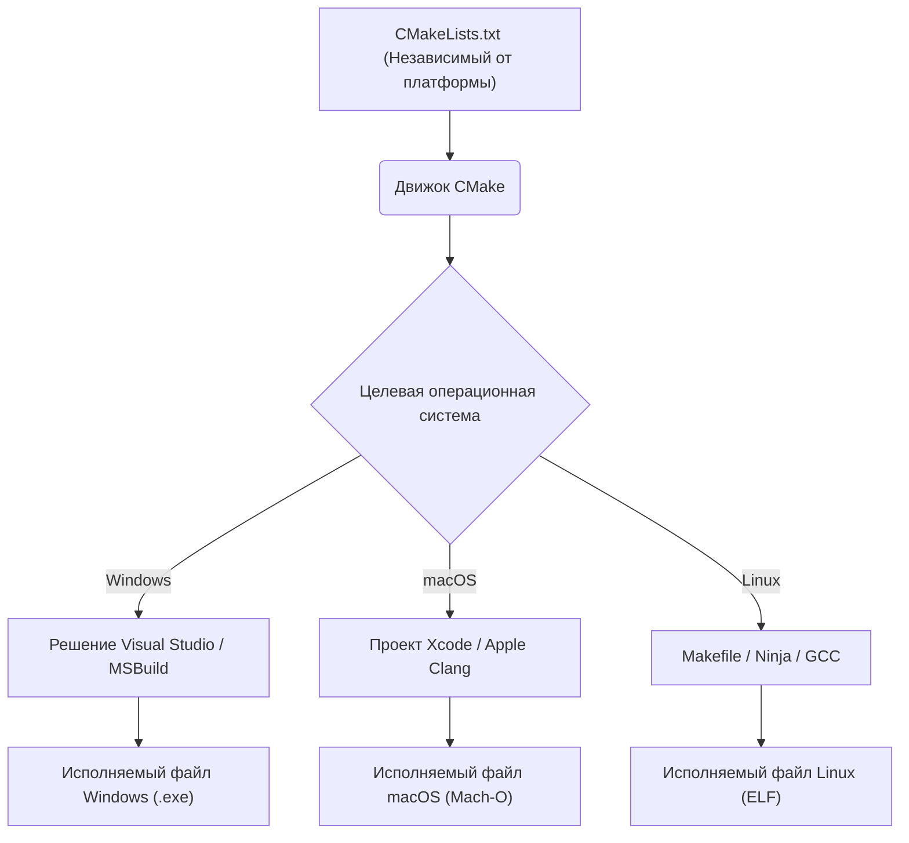
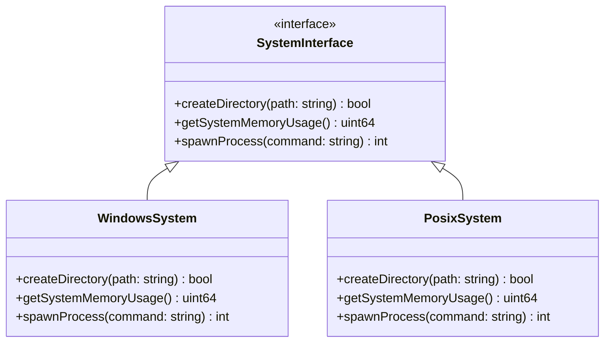
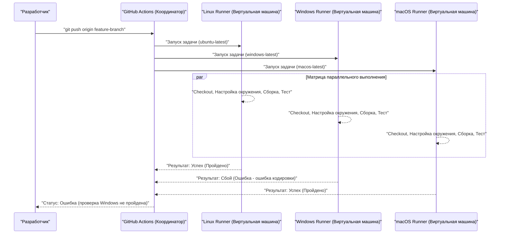

Кроссплатформенная разработка, охватывающая несколько операционных систем (ОС), таких как Mac (macOS) и Windows, а также Linux (включая WSL), является неизбежным путем в современной программной инженерии. При создании веб-приложений, бэкенда для мобильных приложений или кроссплатформенных десктопных приложений (Electron, Tauri, Qt и др.), если в команде используются разные ОС, вы столкнетесь со множеством «багов, вызванных различиями ОС».

Каждая ОС имеет разный исторический фон и философию проектирования. Windows обладает собственной архитектурой (Win32 API, ядро NT), происходящей от MS-DOS, в то время как macOS базируется на UNIX (Darwin на основе FreeBSD), а Linux соответствует стандарту POSIX. Эти фундаментальные различия создают «подводные камни», которые доставляют неприятности разработчикам в любых ситуациях: от файловой системы до работы с сетью и процессами.

В этой статье мы подробно и с практической точки зрения разберем технические различия и лучшие практики, которые необходимо знать командам разработчиков, использующим как Mac, так и Windows, а также при разработке приложений, нацеленных на обе эти ОС.

---

## 1. Подводные камни символов перевода строки (CRLF против LF) и строгие настройки Git

Одной из наиболее частых проблем, вносящих хаос в командную разработку, является проблема «символов перевода строки (Line Endings)». Это историческая проблема, восходящая к эпохе пишущих машинок.

*   **Windows**: В качестве стандартного перевода строки использует **CRLF**, комбинацию возврата каретки (CR, `\r`, `0x0D`) и перевода строки (LF, `\n`, `0x0A`).
*   **macOS / Linux**: Использует **LF** (только перевод строки) в качестве стандартного. (Примечание: в ранних версиях Mac OS до версии 9 использовался только CR, но начиная с Mac OS X, основанной на UNIX, стал использоваться LF).

Из-за этой разницы при совместном использовании исходного кода в репозитории Git разница (diff) может затронуть весь файл. Или же шелл-скрипт (`.sh`), предназначенный для запуска в среде Linux, после редактирования в Windows получает переносы CRLF. При выполнении `\r` интерпретируется как недопустимый символ, что вызывает ошибки вроде `\r: command not found`.

### Решение в Git: управление через `.gitattributes`

В Git есть настройка `core.autocrlf`, но полагаться на нее опасно. Поскольку она зависит от глобальных настроек на локальной машине каждого отдельного разработчика, могут легко возникнуть проблемы из-за того, что новый участник команды забудет ее настроить.

Лучшая практика — разместить файл `.gitattributes` в корневом каталоге репозитория и явно определить обработку символов перевода строки на уровне репозитория. Это гарантирует согласованное поведение независимо от того, в какой среде выполняется клонирование.

```gitattributes
# По умолчанию обрабатывать как текстовые файлы и нормализовать в LF внутри репозитория (в базе данных Git)
# При чекауте конвертируется в стандартный символ перевода строки для каждой ОС
* text=auto

# Однако для определенных расширений, таких как исходный код, всегда принудительно использовать LF независимо от ОС
*.sh text eol=lf
*.py text eol=lf
*.cpp text eol=lf
*.hpp text eol=lf
*.js text eol=lf
*.json text eol=lf

# Для пакетных файлов только для Windows принудительно использовать CRLF
*.cmd text eol=crlf
*.bat text eol=crlf

# Для таких файлов, как изображения и скомпилированные бинарники, преобразование перевода строки не выполняется (для предотвращения повреждения)
*.png binary
*.jpg binary
*.pdf binary
```

---

## 2. Чувствительность к регистру в файловой системе (Case Sensitivity)

Чувствительность к регистру (Case Sensitivity) в файловой системе также является одним из главных препятствий в кроссплатформенной разработке.

*   **macOS (APFS / HFS+)**: По умолчанию **нечувствительна к регистру (Case-Insensitive)**, но **сохраняет регистр (Case-Preserving)**. Это означает, что если вы сохраните файл как `File.txt`, он будет отображаться как `File.txt`, но вы сможете прочитать его из программы, обратившись к нему как к `file.txt`.
*   **Windows (NTFS)**: Так же, как и macOS, по умолчанию спецификация **нечувствительна к регистру (Case-Insensitive)** и **сохраняет регистр (Case-Preserving)**.
*   **Linux / WSL (ext4 и т.д.)**: **Полностью чувствительна к регистру (Case-Sensitive)**. `File.txt` и `file.txt` могут сосуществовать в одном каталоге как совершенно разные файлы.

### Типичные возникающие баги

При разработке на Mac или Windows, даже если вы указываете имя файла строчными буквами в исходном коде как `#include "myclass.h"` (или `import "./myclass"`), а фактический файл называется `MyClass.h`, сборка пройдет успешно, поскольку локальная ОС нечувствительна к регистру.

Однако, если вы закоммитите этот код и запустите сборку на сервере CI/CD (обычно это Linux, например Ubuntu), вы получите ошибку компиляции «файл не найден», так как файловая система ext4 в Linux чувствительна к регистру.

### Алгоритмическая перспектива: вычислительная сложность поиска файлов и нормализация

Давайте математически рассмотрим, какие процессы происходят внутри, когда файловая система разрешает путь к файлу.

В случае чувствительной к регистру ext4 записи в каталоге управляются с помощью структур, таких как хеш-таблицы или B-деревья. Если количество файлов в каталоге равно $N$, а длина имени файла $L$, вычислительная сложность простого бинарного поиска или поиска по дереву будет следующей:

$$ T_{search}(N) = O(L \log N) $$

С другой стороны, в нечувствительных к регистру файловых системах, таких как NTFS и APFS, перед сравнением строк необходимо выполнить нормализацию (Case Folding) обеих строк к одному регистру (верхнему или нижнему). Преобразование регистра с учетом нормализации Unicode и локали не обходится простыми битовыми операциями ASCII и требует поиска по таблицам (table lookup).

Если обозначить вычислительные затраты функции преобразования как константу $C_{fold}$, то на каждое сравнение строк накладываются дополнительные накладные расходы:

$$ T_{insensitive\_search}(N) = O( (L \times C_{fold}) \log N ) $$

Современные ОС используют продвинутое кэширование для этого, но принципиальные различия в поведении можно обуздать только правилами на уровне разработки. Самый безопасный подход — установить правило проекта: **«Все имена файлов и каталогов должны быть в нижнем регистре с использованием дефисов (kebab-case) или подчеркиваний (snake_case)»**.

---

## 3. Разделители пути (Path Separators) и абстракция путей файлов

Обработка разделителей, указывающих на иерархию каталогов, отражает фундаментальные различия между ОС.

*   **Windows**: Использует обратную косую черту `\` (может отображаться как символ иены `¥` в японских шрифтах), а также поддерживает концепции букв дисков (например, `C:\`) и UNC-путей (например, `\\Server\Share`).
*   **macOS / Linux**: Использует прямую косую черту `/`, и все файловые системы имеют иерархическую структуру, начинающуюся с единого корня `/` (Single Root Hierarchy).

Многие языки программирования автоматически интерпретируют `/` как разделитель файлов даже в Windows (поскольку Win32 API частично поддерживает `/`). Однако это может привести к фатальным ошибкам при передаче путей в качестве аргументов командной строки, прямом вызове системных функций или при сравнении и парсинге путей как строк.

### Лучшие практики по языкам (абстракция ОС)

**Категорически избегайте** конструирования путей файлов путем конкатенации строк (например, `path + "\\" + filename`). Используйте стандартные библиотеки манипулирования путями (Слой абстракции ОС - OS Abstraction Layer), предоставляемые каждым языком.

#### Пример на C++ (`std::filesystem`)
Начиная с C++17 была внедрена библиотека `<filesystem>`, позволяющая абстрагироваться от различий путей на разных платформах.

```cpp
#include <iostream>
#include <filesystem>

namespace fs = std::filesystem;

int main() {
    // Конструирование пути, независимого от ОС (абстракция через перегрузку операторов)
    fs::path dir = "data";
    fs::path file = "config.json";
    fs::path full_path = dir / file; // В Windows станет "data\config.json", в Mac/Linux - "data/config.json"

    std::cout << "Full path: " << full_path.string() << std::endl;
    return 0;
}
```

#### Пример на Python (`pathlib`)
В прошлом использовался `os.path.join()`, но сейчас стандартом является использование объектно-ориентированного модуля `pathlib`.

```python
from pathlib import Path

# Оператор / переопределен, создает объект пути, соответствующий ОС
base_dir = Path("user_data")
config_file = base_dir / "settings" / "app.ini"

# Разрешение путей и чтение файлов также возможно согласованными методами
if config_file.exists():
    text = config_file.read_text(encoding="utf-8")
```

#### Пример на Node.js (модуль `path`)

```javascript
const path = require('path');

// path.join принимает аргументы и объединяет их разделителем, подходящим для текущей ОС
const configPath = path.join('config', 'default.json');
console.log(configPath); 
// Windows: "config\default.json"
// macOS/Linux: "config/default.json"
```

---

## 4. Кодировка символов (UTF-8 против CP932/Shift-JIS) и барьер Unicode

Главной головной болью в японской среде Windows является кодировка символов.
В современной разработке macOS и Linux полностью унифицированы на **UTF-8** — от системы в целом до терминала и кодировки файлов. Однако стандартной кодировкой японских версий Windows (на основе системной локали, «кодовая страница ANSI») во многих случаях по-прежнему выступает **CP932 (расширение Shift-JIS от Microsoft)** по умолчанию.
*Внутреннее представление строк в Win32 API — UTF-16LE (`wchar_t`).

При чтении или записи файлов, например в Python, если кодировка не указана явно, в Windows будет предпринята попытка интерпретировать файл в соответствии с результатом `locale.getpreferredencoding()` (CP932). Это приводит к ошибкам `UnicodeDecodeError` при попытке прочитать файл, сохраненный в UTF-8, или к появлению кракозябр (Mojibake).

### Математическая модель преобразования кодировки символов и накладные расходы

При преобразовании строки из одной кодировки (UTF-8) в другую (UTF-16 или CP932) в худшем случае вычислительная сложность пропорциональна длине строки. Если длина строки в байтах равна $B$, сложность преобразования составляет $O(B)$. Однако парсинг UTF-8 (кодировки с переменной длиной), вычисление суррогатных пар и поиск по таблицам преобразования (Lookup) создают значительные накладные расходы, которые нельзя игнорировать.

Пусть длина строки равна $N$, функция отображения многобайтового символа в кодовую точку Unicode — $f_{decode}$, а функция отображения кодовой точки в целевую кодировку — $f_{encode}$. Тогда общее время преобразования $T_{conv}$ можно аппроксимировать следующим образом:

$$ T_{conv} = \sum_{i=1}^{N} \Big( C_{decode} \cdot f_{decode}(x_i) + C_{encode} \cdot f_{encode}(y_i) \Big) \approx O(N) $$

В кроссплатформенных приложениях важно помнить, что эти затраты на преобразование возникают каждый раз при вызове нативных API ОС (пересечении границы ввода-вывода). Особенно при разработке на C++ для Windows часто происходит преобразование в UTF-16 с помощью `MultiByteToWideChar` и других функций.

### Меры по работе с кодировкой

Самая надежная мера — **«всегда явно указывать UTF-8 в любой ситуации»**.

```python
# Хороший пример на Python: всегда указывать encoding="utf-8"
with open("data.txt", "w", encoding="utf-8") as f:
    f.write("Привет, мир!")
```

Кроме того, для правильного отображения вывода в UTF-8 в терминалах Windows (Командная строка или PowerShell) может потребоваться установить переменную окружения `PYTHONUTF8=1` при запуске приложения или временно изменить кодовую страницу консоли на UTF-8 с помощью команды `chcp 65001` (например, для Node.js).

---

## 5. Различия в переменных окружения и оболочках (bash/zsh против PowerShell)

Разница в оболочках (интерпретаторах командной строки) при запуске скриптов сборки или инструментов разработки также является серьезным препятствием для кроссплатформенности.

*   **macOS / Linux**: Преобладают `bash` или `zsh`. Выполняют текстовую конвейерную обработку (pipeline).
*   **Windows**: Командная строка (`cmd.exe`) или `PowerShell`. PowerShell основан на .NET и имеет мощный объектно-ориентированный конвейер, но его синтаксис полностью отличается от оболочек POSIX.

Поскольку способы ссылки на переменные окружения и их настройки различаются, зависимое от ОС написание (например, в секции `scripts` файла `package.json` в Node.js) приведет к неработоспособности в других средах.

```json
// ❌ Плохой пример: в Windows "NODE_ENV" не распознается как команда, что приведет к ошибке
"scripts": {
  "build": "NODE_ENV=production webpack"
}
```

### Решение: использование кроссплатформенных инструментов

В среде Node.js можно использовать пакеты типа `cross-env` для абстрагирования настройки переменных окружения.

```json
// ✅ Хороший пример: cross-env сглаживает различия ОС и корректно устанавливает переменные окружения для запуска webpack
"scripts": {
  "build": "cross-env NODE_ENV=production webpack",
  "clean": "rimraf dist/" // вместо rm -rf используется кроссплатформенный инструмент удаления
}
```

Если в крупном проекте требуются сложные шелл-скрипты, лучшей современной практикой является стандартизация использования WSL (Windows Subsystem for Linux) или Git Bash для разработчиков на Windows и унифицированное управление всей пакетной обработкой в виде `.sh` скриптов.

---

## 6. Кроссплатформенные системы сборки и компиляторы

При работе с нативным кодом (языками, компилируемыми непосредственно в машинный код), такими как C++ или Rust, необходимо преодолевать не только специфичные для ОС API, но и различия в системах сборки и компиляторах.

*   **Компиляторы**:
    *   Windows: MSVC (Microsoft Visual C++), MinGW (GCC for Windows)
    *   macOS: Apple Clang
    *   Linux: GCC, Clang
*   **Бинарные форматы**:
    *   Windows: PE (Portable Executable) `.exe` / `.dll`
    *   macOS: Mach-O
    *   Linux: ELF (Executable and Linkable Format) `.so`

### Использование метасистемы сборки с помощью CMake

В проектах C/C++ глобальным стандартом де-факто для обеспечения кроссплатформенности является **CMake**. CMake не компилирует исходный код напрямую, а выступает в качестве «генератора (Generator)», который создает нативные файлы конфигурации сборки, подходящие для каждой среды (файлы решений Visual Studio для Windows, сценарии сборки Makefile или Ninja для Linux/Mac).



Используя CMake, вы можете сгладить различия между средами и генерировать оптимальные бинарные файлы для каждой ОС из одного файла конфигурации (`CMakeLists.txt`). Разрешение зависимостей (`find_package`) и привязка к определенным библиотекам для конкретной ОС также легко описываются с помощью условных ветвлений.

```cmake
# Пример части CMakeLists.txt
if(WIN32)
    # Линковка специфичных для Windows библиотек (например, WS2_32.lib)
    target_link_libraries(my_app PRIVATE ws2_32)
    add_compile_definitions(OS_WINDOWS)
elseif(APPLE)
    # Линковка специфичных для macOS фреймворков
    target_link_libraries(my_app PRIVATE "-framework Foundation")
    add_compile_definitions(OS_MACOS)
elseif(UNIX AND NOT APPLE)
    # Линковка для Linux (например, pthread)
    target_link_libraries(my_app PRIVATE pthread)
    add_compile_definitions(OS_LINUX)
endif()
```

---

## 7. Использование архитектурных паттернов: Слой абстракции ОС (OSAL)

Полное отделение системно-зависимой обработки (операции с файлами, создание процессов/потоков, управление памятью, сокет-коммуникации и т.д.) от ключевой бизнес-логики приложения является краеугольным камнем кроссплатформенной разработки.

Для реализации этого используется паттерн **Слой абстракции ОС (OS Abstraction Layer, OSAL)**.

Ниже приведен пример проектирования классов, который оборачивает специфичные для ОС API и предоставляет общий интерфейс. Переключение реализаций осуществляется либо с помощью полиморфизма, либо с помощью переключателей макросов во время компиляции.



Изолировав платформозависимый код в одном месте (обычно в каталогах типа `src/platform/windows/` или `src/platform/posix/`), вы можете сохранить остальные 95% кода (логику GUI, обработку данных, парсинг протоколов связи и т.д.) полностью кроссплатформенными и пригодными для тестирования.

---

## 8. Кроссплатформенная проверка в CI/CD (матричная сборка)

Независимо от того, насколько тщательно разработчики пишут код в своей локальной среде, последним рубежом для обеспечения кроссплатформенности является конвейер **CI/CD (Непрерывная интеграция / Непрерывное развертывание)**. Случаи, когда код работает локально (например, на Mac), но выдает ошибки компиляции на другой ОС (Windows), происходят постоянно.

Используйте современные инструменты CI, такие как GitHub Actions или GitLab CI, и настройте матричную сборку (Matrix Build) для **параллельного запуска сборок и тестов во всех средах (Windows, macOS, Linux)** при каждом создании Pull Request.

```yaml
# Пример настройки кроссплатформенного CI с помощью GitHub Actions
name: Cross-Platform Build and Test

on: [push, pull_request]

jobs:
  build:
    runs-on: ${{ matrix.os }}
    strategy:
      fail-fast: false # Если один тест ОС завершается с ошибкой, продолжаем тесты остальных ОС
      matrix:
        # Указание 3 раннеров: Windows, macOS, Linux
        os: [ubuntu-latest, windows-latest, macos-latest]

    steps:
    - uses: actions/checkout@v3
    - name: Set up Python Environment
      uses: actions/setup-python@v4
      with:
        python-version: '3.11'
        cache: 'pip' # Кэширование зависимостей даже при кроссплатформенности
        
    - name: Install dependencies
      run: python -m pip install --upgrade pip && pip install -r requirements.txt
      
    - name: Run Test Suite
      run: pytest -v
```

Визуализация этого процесса CI/CD выглядит следующим образом:



Автоматически собирая результаты тестирования на каждой ОС и настраивая правила защиты ветки так, чтобы **разрешать слияние с веткой main только тогда, когда все среды будут зелеными (успешно)**, вы предотвратите попадание платформозависимых ошибок в рабочую среду или в релизные сборки.

---

## Заключение

Кроссплатформенная разработка для Mac и Windows сопряжена с множеством проблем, уходящих корнями в исторический контекст.

1.  **Символы перевода строки**: Принудительно используйте нормализацию на уровне репозитория (например, унификацию LF) с помощью `.gitattributes`.
2.  **Чувствительность к регистру**: Не полагайтесь на поведение macOS/Windows, "не различающих регистр"; строго определите правила именования файлов и стремитесь к точному совпадению регистра.
3.  **Разделители пути**: Используйте стандартные API языка для работы с путями (`std::filesystem`, `pathlib`, модуль `path`), чтобы сгладить различия ОС.
4.  **Кодировка**: Всегда указывайте UTF-8 и полностью исключайте влияние поведения Windows по умолчанию (CP932).
5.  **Переменные окружения и оболочка**: Используйте инструменты абстракции, такие как `cross-env`, или унифицируйте среду выполнения, например, с помощью WSL/Docker.
6.  **Система сборки**: В случае C/C++ используйте метасистемы сборки, такие как CMake, для генерации оптимальных нативных наборов инструментов (toolchains) для каждой ОС.
7.  **Платформозависимый код**: Спроектируйте Слой абстракции ОС (OSAL) для разделения и изоляции платформозависимой логики.
8.  **CI/CD**: Внедрите матричные сборки, чтобы автоматизировать чистые сборки и тестирование во всех целевых ОС и исключить человеческий фактор.

В настоящее время мощные фреймворки, такие как Electron, Tauri и .NET, сглаживают многие из этих различий, но знания о нативном поведении базовой ОС (файловая система и кодировки) по-прежнему необходимы при решении серьезных проблем с производительностью и сложных багов. Разделяя и строго соблюдая эти лучшие практики всей командой с начальных этапов проекта, вы сможете значительно сократить бесполезное время на отладку, вызванное различиями в ОС, и сосредоточиться на главном — создании ценности программного обеспечения.
