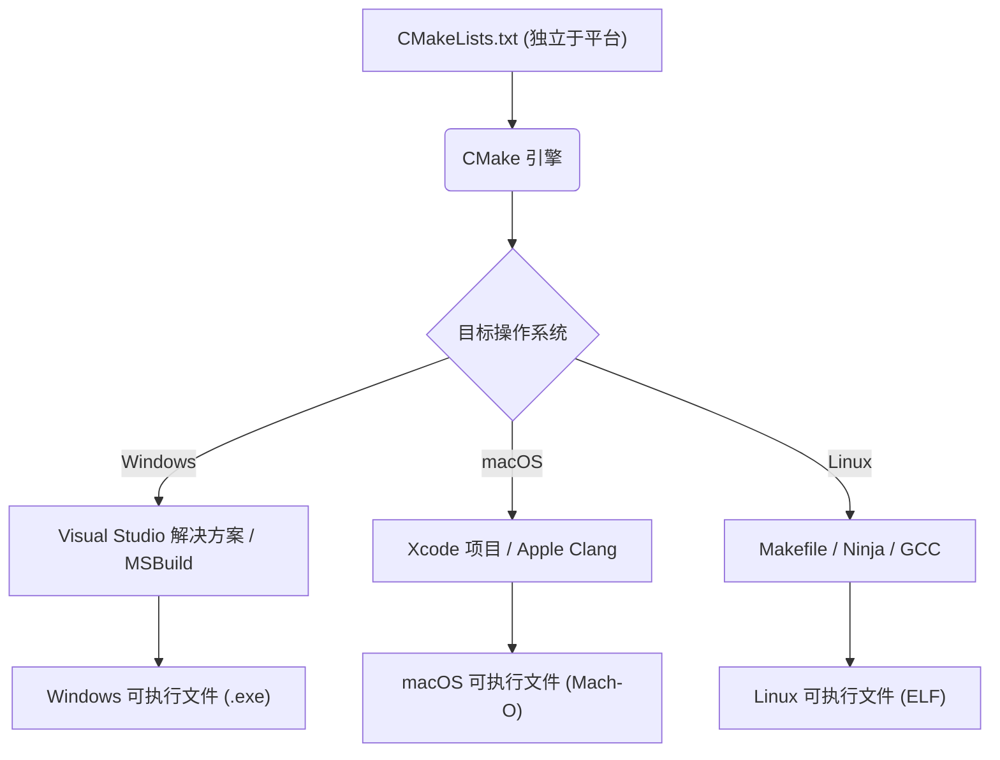
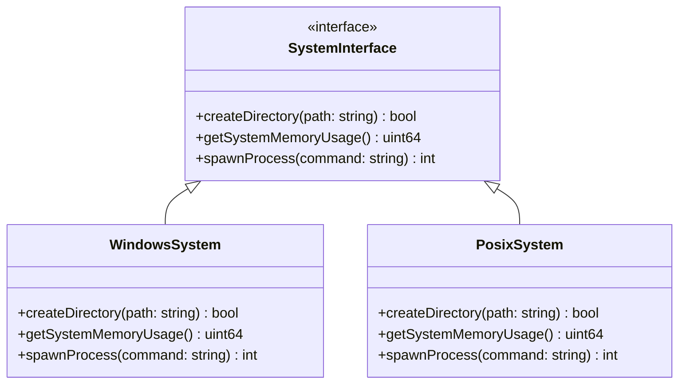
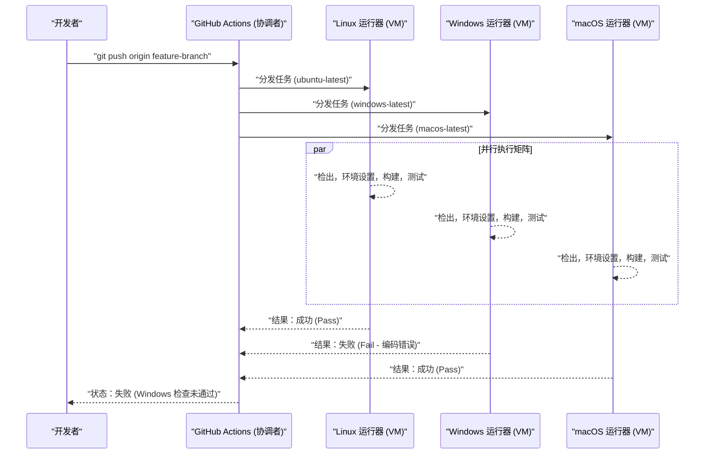

Mac（macOS）与Windows，乃至包含Linux（包括WSL）在内的跨多个操作系统（OS）的跨平台开发，是现代软件工程中不可避免的道路。在构建Web开发、移动应用后端或跨平台桌面应用（如Electron、Tauri、Qt等）时，如果团队内部使用不同的操作系统，就会遇到许多“由操作系统差异引起的Bug”。

各个操作系统都有不同的历史背景和设计理念。Windows拥有源自MS-DOS的独特架构（Win32 API、NT内核），而macOS基于UNIX（基于FreeBSD的Darwin），Linux则遵循POSIX标准。这些根本性的差异在文件系统、网络、进程处理等各个方面产生了令开发者头疼的“陷阱”。

本文将针对Mac与Windows混合的开发团队，以及以这两个操作系统为目标的应用开发，极其详细且实用地解说绝对需要了解的技术差异和最佳实践。

---

## 1. 换行符的陷阱 (CRLF vs LF) 与 Git 的严格设置

最常发生且最容易导致团队开发陷入混乱的原因之一就是“换行符（Line Endings）”问题。这是一个可以追溯到打字机时代的历史问题。

*   **Windows**：使用回车（CR, `\r`, `0x0D`）和换行（LF, `\n`, `0x0A`）的组合 **CRLF** 作为标准的换行符。
*   **macOS / Linux**：使用单独的换行 **LF** 作为标准的换行符。（※直到早期的Mac OS 9，使用的都是单独的CR，但Mac OS X之后变成了基于UNIX的系统，因此改为了LF）

由于这种差异，在Git仓库中共享源代码时，差异（diff）可能会波及整个文件。或者，原本要在Linux环境下运行的Shell脚本（`.sh`），因为在Windows中被编辑而变成了CRLF，在执行时 `\r` 会被解析为非法字符，从而引发 `\r: command not found` 等错误。

### Git 中的解决方案：通过 `.gitattributes` 进行管理

Git中有一个名为 `core.autocrlf` 的设置，但依赖它是危险的。因为这会依赖于开发者个人本地机器的全局设置，当新成员加入团队时，很容易因为忘记设置而引发麻烦。

最佳实践是在仓库的根目录下放置 `.gitattributes` 文件，并在仓库级别显式定义换行符的处理方式。这样，无论在哪个环境下克隆，都能保证行为的一致性。

```gitattributes
# 默认作为文本文件处理，并在仓库内（Git的数据库中）标准化为LF
# 在检出（checkout）时会被转换为各操作系统的标准换行符
* text=auto

# 但是，对于源代码等特定扩展名，无论操作系统如何，都强制使用LF
*.sh text eol=lf
*.py text eol=lf
*.cpp text eol=lf
*.hpp text eol=lf
*.js text eol=lf
*.json text eol=lf

# 针对Windows专用的批处理文件等，强制使用CRLF
*.cmd text eol=crlf
*.bat text eol=crlf

# 图像或编译好的二进制等文件不进行换行符转换（防止损坏）
*.png binary
*.jpg binary
*.pdf binary
```

---

## 2. 文件系统的大小写区分 (Case Sensitivity)

文件系统中对大小写的区分（Case Sensitivity）也是跨平台开发中最大的鬼门关之一。

*   **macOS (APFS / HFS+)**：默认情况下 **不区分大小写（Case-Insensitive）**，但**会保留状态（Case-Preserving）**。也就是说，如果保存为 `File.txt`，显示时就是 `File.txt`，但即使程序中以 `file.txt` 访问也能读取到。
*   **Windows (NTFS)**：与macOS一样，默认规范是 **不区分大小写（Case-Insensitive）** 且 **保留状态（Case-Preserving）**。
*   **Linux / WSL (ext4等)**：**完全区分大小写（Case-Sensitive）**。`File.txt` 和 `file.txt` 可以作为完全不同的文件共存于同一个目录中。

### 经常发生的典型Bug

在Mac或Windows上开发时，如果源代码中写的是小写字母的 `#include "myclass.h"`（或 `import "./myclass"`），而实际文件是 `MyClass.h`，由于本地环境的操作系统是Case-Insensitive的，编译依然会成功。

然而，将这段代码提交并在CI/CD服务器（通常是Ubuntu等Linux系统）上执行编译时，由于Linux的ext4文件系统是Case-Sensitive的，就会出现“找不到文件”的编译错误。

### 算法视角：文件搜索的时间复杂度与规范化

让我们从数学的角度来思考文件系统在解析文件路径时，内部进行了怎样的处理。

对于区分大小写的 ext4，目录内的条目是通过哈希表或 B-Tree 等结构管理的。假设目录内的文件数为 $N$，文件名的长度为 $L$，则在简单的二分查找或树搜索情况下的时间复杂度如下：

$$ T_{search}(N) = O(L \log N) $$

另一方面，在 NTFS 或 APFS 等不区分大小写的文件系统中，在比较字符串之前，需要先进行一项处理，将两方的字符串规范化（Case Folding）为相同的大小写形态（全大写或全小写）。考虑到 Unicode 的规范化以及区域设置（Locale）的大小写转换，不能简单地依靠 ASCII 的位运算解决，而是需要查表（Table Lookup）。

假设转换函数的计算成本为常数 $C_{fold}$，则每次字符串比较都会产生额外的开销。

$$ T_{insensitive\_search}(N) = O( (L \times C_{fold}) \log N ) $$

最近的操作系统对此进行了高度的缓存优化，但底层行为的差异只能通过开发层面的规范来约束。**“所有的文件名和目录名统一使用小写字母加连字符（kebab-case）或下划线（snake_case）”** 是最安全的项目规范。

---

## 3. 路径分隔符 (Path Separators) 与文件路径的抽象化

表示目录层级的路径分隔符的处理方式，反映了操作系统之间根本性的差异。

*   **Windows**：使用反斜杠 `\`（在日语环境的某些字体下会显示为日元符号 `¥`），并且存在盘符（如：`C:\`）和UNC路径（如：`\\Server\Share`）的概念。
*   **macOS / Linux**：使用正斜杠 `/`，所有的文件系统都拥有一个从单一根目录 `/` 开始的层级结构（Single Root Hierarchy）。

许多编程语言在Windows上也能将 `/` 很好地解析为文件分隔符（因为 Win32 API 本身在某些部分支持 `/`）。但是，在作为命令行参数传递路径、直接调用系统调用、或者作为字符串比较和解析路径时，仍会导致致命错误。

### 各语言的最佳实践（操作系统的抽象化）

请**绝对避免**通过字符串拼接（如：`path + "\\" + filename`）来构建文件路径。应当使用各语言提供的路径操作标准库（OS Abstraction Layer）。

#### C++ 的例子 (`std::filesystem`)
C++17 之后引入了 `<filesystem>`，从而能够抽象化跨平台的路径差异。

```cpp
#include <iostream>
#include <filesystem>

namespace fs = std::filesystem;

int main() {
    // 构建不依赖于操作系统的路径 (通过运算符重载进行抽象)
    fs::path dir = "data";
    fs::path file = "config.json";
    fs::path full_path = dir / file; // 在Windows中变为 "data\config.json", 在Mac/Linux中变为 "data/config.json"

    std::cout << "Full path: " << full_path.string() << std::endl;
    return 0;
}
```

#### Python 的例子 (`pathlib`)
以前经常使用 `os.path.join()`，但现在使用面向对象的 `pathlib` 模块已成为标准。

```python
from pathlib import Path

# / 运算符被重载了，会生成符合操作系统的路径对象
base_dir = Path("user_data")
config_file = base_dir / "settings" / "app.ini"

# 路径的解析和文件的读取也可以使用一致的方法
if config_file.exists():
    text = config_file.read_text(encoding="utf-8")
```

#### Node.js 的例子 (`path` 模块)

```javascript
const path = require('path');

// path.join 接收参数，并用适合当前操作系统的分隔符进行拼接
const configPath = path.join('config', 'default.json');
console.log(configPath); 
// Windows: "config\default.json"
// macOS/Linux: "config/default.json"
```

---

## 4. 字符编码 (UTF-8 vs CP932/Shift-JIS) 与 Unicode 的壁垒

在 Windows 日语环境下，最大的烦恼就是字符编码。
在现代开发中，macOS 和 Linux 从整个系统、终端到文件编码都完全统一为 **UTF-8**。然而，日语版 Windows 的标准编码（基于系统区域设置的“ANSI代码页”）在很多场景下依然默认作为 **CP932（微软扩展的 Shift-JIS）** 运行。
※内部 Win32 API 的字符串表示是 UTF-16LE（`wchar_t`）。

在 Python 等语言中进行文件读写时，如果不显式指定编码，在 Windows 上就会试图按照 `locale.getpreferredencoding()` 的结果（CP932）来解析。这就导致在尝试读取以 UTF-8 保存的文件时，会出现 `UnicodeDecodeError` 或者发生乱码（Mojibake）。

### 字符编码转换的数学模型与开销

将字符串从某种编码（如 UTF-8）转换为另一种编码（如 UTF-16 或 CP932）时，最坏情况的时间复杂度与字符串的长度成正比。假设字符串的字节长度为 $B$，则转换的复杂度为 $O(B)$。但是，由于 UTF-8 是可变长编码，其解析、代理对（Surrogate Pair）的计算，以及转换表查找（Lookup）会产生不可忽视的开销。

假设字符串长度为 $N$，多字节字符到 Unicode 码点的映射函数为 $f_{decode}$，码点到目标编码的映射函数为 $f_{encode}$，那么总的转换时间 $T_{conv}$ 近似如下：

$$ T_{conv} = \sum_{i=1}^{N} \Big( C_{decode} \cdot f_{decode}(x_i) + C_{encode} \cdot f_{encode}(y_i) \Big) \approx O(N) $$

在跨平台应用程序中，我们需要意识到每次调用操作系统原生 API（跨越 I/O 边界）时都会产生这个转换成本（特别是当用 C++ 为 Windows 进行开发时，会频繁发生由 `MultiByteToWideChar` 等执行的向 UTF-16 的转换）。

### 字符编码相关的对策

最可靠的对策是**“无论何时都显式指定 UTF-8”**。

```python
# Python 中的好习惯：总是指定 encoding="utf-8"
with open("data.txt", "w", encoding="utf-8") as f:
    f.write("你好，世界！")
```

此外，为了在 Windows 终端（命令提示符或 PowerShell）中正确显示 UTF-8 的输出，可能需要一些额外设置，比如在应用程序启动时设置环境变量 `PYTHONUTF8=1`，或者在 Node.js 中通过 `chcp 65001` 命令将控制台的代码页临时更改为 UTF-8。

---

## 5. 环境变量与 Shell 环境的差异 (bash/zsh vs PowerShell)

在执行构建脚本或开发工具时，Shell（命令行解释器）的差异也是跨平台开发中的一大障碍。

*   **macOS / Linux**：主流是 `bash` 或 `zsh`。它们执行基于文本的管道处理。
*   **Windows**：命令提示符 (`cmd.exe`) 或 `PowerShell`。PowerShell 基于 .NET，拥有强大的面向对象管道，但语法与 POSIX Shell 完全不同。

由于引用和设置环境变量的方法不同，如果在 Node.js 的 `package.json` 的 `scripts` 区域中编写了依赖操作系统的代码，在其他环境中就无法运行。

```json
// ❌ 错误示例：在Windows中，“NODE_ENV”无法被识别为命令，从而导致错误
"scripts": {
  "build": "NODE_ENV=production webpack"
}
```

### 解决方案：活用跨平台工具

如果是 Node.js 环境，可以使用 `cross-env` 等包来抽象化环境变量的设置。

```json
// ✅ 良好示例：cross-env 会消除操作系统的差异，正确地设置环境变量并启动 webpack
"scripts": {
  "build": "cross-env NODE_ENV=production webpack",
  "clean": "rimraf dist/" // 使用跨平台删除工具代替 rm -rf
}
```

在需要复杂 Shell 脚本的大型项目中，目前的最佳实践是要求 Windows 环境的开发者也默认使用 WSL (Windows Subsystem for Linux) 或 Git Bash，并将所有的批处理统一管理为 `.sh` 脚本。

---

## 6. 跨平台的构建系统与编译器

当处理 C++ 或 Rust 等原生代码（直接编译为机器码的语言）时，不仅需要克服操作系统专属 API 的差异，还需要克服构建系统和编译器的不同。

*   **编译器**：
    *   Windows：MSVC (Microsoft Visual C++), MinGW (GCC for Windows)
    *   macOS：Apple Clang
    *   Linux：GCC, Clang
*   **二进制格式**：
    *   Windows：PE (Portable Executable) `.exe` / `.dll`
    *   macOS：Mach-O
    *   Linux：ELF (Executable and Linkable Format) `.so`

### 活用 CMake 作为元构建系统

在 C/C++ 项目中，实现跨平台的世界级事实标准是 **CMake**。CMake 本身不直接编译源代码，而是作为一个“生成器（Generator）”，生成适应各环境的原生构建配置文件（例如，Windows 下的 Visual Studio 解决方案文件，Linux/Mac 下的 Makefile 或 Ninja 构建脚本）。



通过使用 CMake，可以消除环境之间的差异，从单一的配置文件（`CMakeLists.txt`）生成最适合各操作系统的二进制文件。无论是解析依赖库（`find_package`），还是链接各操作系统的特定库，都可以通过条件分支轻松实现。

```cmake
# CMakeLists.txt 的部分示例
if(WIN32)
    # 链接 Windows 专属库（如 WS2_32.lib）
    target_link_libraries(my_app PRIVATE ws2_32)
    add_compile_definitions(OS_WINDOWS)
elseif(APPLE)
    # 链接 macOS 专属框架
    target_link_libraries(my_app PRIVATE "-framework Foundation")
    add_compile_definitions(OS_MACOS)
elseif(UNIX AND NOT APPLE)
    # 针对 Linux 的链接（如 pthread）
    target_link_libraries(my_app PRIVATE pthread)
    add_compile_definitions(OS_LINUX)
endif()
```

---

## 7. 活用架构模式：操作系统抽象层 (OSAL)

将依赖于系统的处理（文件操作、进程/线程的创建、内存管理、Socket 通信等）与作为应用核心的业务逻辑完全分离，是跨平台开发的关键。

为了实现这一点，我们使用称为 **操作系统抽象层 (OS Abstraction Layer, OSAL)** 的模式。

下面是包装各个操作系统的专有 API 并提供公共接口的类设计示例。可以使用多态性或编译时的宏开关来切换实现。



通过像这样将平台相关的代码隔离在同一个地方（通常是 `src/platform/windows/` 或 `src/platform/posix/` 等目录），可以使其他95%的代码（GUI逻辑、数据处理、通信协议的解析等）保持完全跨平台且可测试的状态。

---

## 8. 在 CI/CD 中进行跨平台验证 (矩阵构建)

无论开发者在本地环境中编码多么谨慎，跨平台兼容性的最终防线都是 **CI/CD (Continuous Integration / Continuous Deployment) 流水线**。在本地环境（例如 Mac）中能够运行，但在其他操作系统（Windows）下出现编译错误的情况层出不穷。

我们应该活用 GitHub Actions 或 GitLab CI 等现代 CI 工具，并在每次创建 Pull Request 时，设置能够 **在 Windows、macOS、Linux 等所有环境中并行执行构建和测试** 的矩阵构建（Matrix Build）。

```yaml
# GitHub Actions 中的跨平台 CI 设置示例
name: Cross-Platform Build and Test

on: [push, pull_request]

jobs:
  build:
    runs-on: ${{ matrix.os }}
    strategy:
      fail-fast: false # 即使在一个OS上失败，也继续测试其他OS
      matrix:
        # 指定 Windows, macOS, Linux 这三个运行器
        os: [ubuntu-latest, windows-latest, macos-latest]

    steps:
    - uses: actions/checkout@v3
    - name: Set up Python Environment
      uses: actions/setup-python@v4
      with:
        python-version: '3.11'
        cache: 'pip' # 在跨平台下也缓存依赖关系
        
    - name: Install dependencies
      run: python -m pip install --upgrade pip && pip install -r requirements.txt
      
    - name: Run Test Suite
      run: pytest -v
```

如果将这个 CI/CD 的流程可视化，如下所示。



通过配置分支保护规则，使各操作系统下的测试结果自动汇总，**并且仅在所有环境都变为绿色（成功）时才允许合并到 main 分支**，以此防患于未然，避免与平台相关的 Bug 混入生产环境或发布构建中。

---

## 总结

在 Mac 和 Windows 的跨平台开发中，存在着许多根源于历史背景的挑战。

1.  **换行符**：通过 `.gitattributes` 在仓库级别强制进行规范化（如统一使用 LF）。
2.  **大小写区分**：不要依赖 macOS/Windows “不区分大小写” 的行为，应当严格规定文件命名规则，时刻注意严格的大小写匹配。
3.  **路径分隔符**：利用语言标准中的路径操作 API（如 `std::filesystem`、`pathlib`、`path` 模块）来消除操作系统的差异。
4.  **字符编码**：永远指定 UTF-8，彻底消除 Windows 默认行为 CP932 所带来的影响。
5.  **环境变量与 Shell**：使用 `cross-env` 等抽象工具，或者将执行环境统一为 WSL/Docker 等。
6.  **构建系统**：对于 C/C++，活用 CMake 等元构建系统，为各个操作系统生成最佳的原生工具链。
7.  **平台相关代码**：设计操作系统抽象层 (OSAL)，将依赖于平台的逻辑分离并隔离起来。
8.  **CI/CD**：引入矩阵构建，对所有目标操作系统的洁净构建和测试进行自动化，从而消除人为的不可靠性。

如今，Electron、Tauri、.NET 等强大的框架已经为我们屏蔽了其中的许多差异，但对于底层操作系统原生行为（如文件系统和编码）的了解，在解决严重的性能问题和棘手的 Bug 时依然不可或缺。通过在项目的初始阶段将这些最佳实践在整个团队中共享并贯彻执行，就能大幅减少由于操作系统差异导致的毫无意义的调试时间，从而集中精力进行实质性的软件价值创造。
