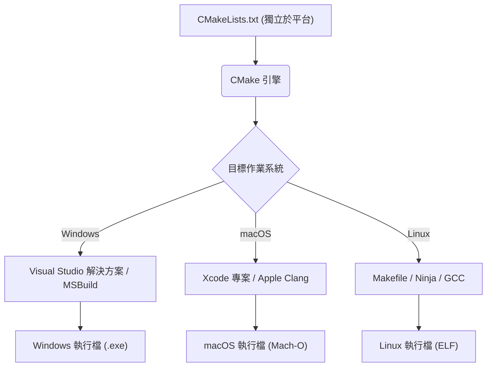
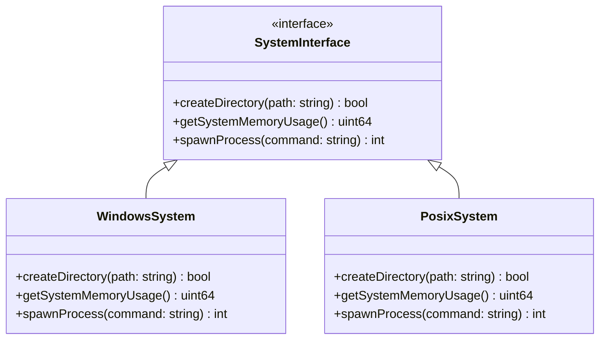
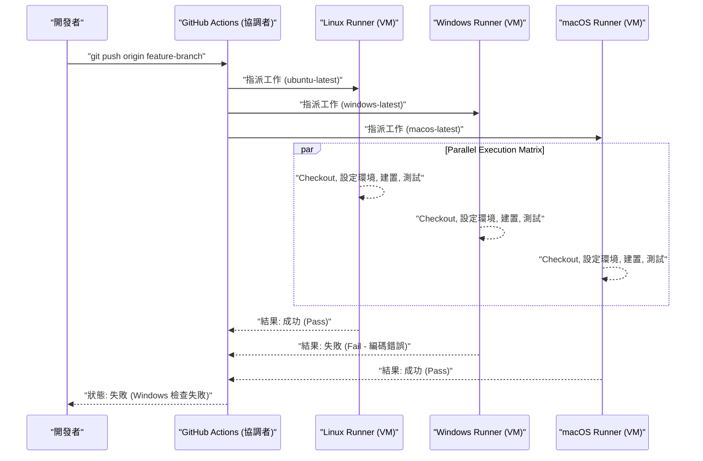

跨越 Mac（macOS）與 Windows，甚至 Linux（包含 WSL）等多個作業系統（OS）的跨平台開發，是現代軟體工程中不可避免的課題。在建構網頁開發、行動應用程式後端，或跨平台桌面應用程式（如 Electron、Tauri、Qt 等）時，如果團隊內使用不同的 OS，就會遭遇許多「起因於 OS 差異的 Bug」。

各個 OS 擁有不同的歷史背景與設計理念。Windows 擁有源自 MS-DOS 的獨特架構（Win32 API、NT 核心）；macOS 則以 UNIX（基於 FreeBSD 的 Darwin）為基礎；而 Linux 則遵循 POSIX 標準。這個根本上的差異，在檔案系統、網路、程序處理等各種場合，都會產生讓開發者困擾的「陷阱」。

本篇文章將針對混合使用 Mac 與 Windows 的開發團隊，或是以雙 OS 為目標的應用程式開發，極為詳細且實用地解說絕對必須知道的技術差異與最佳實踐。

---

## 1. 換行字元的陷阱 (CRLF vs LF) 與 Git 的嚴格設定

最頻繁發生且容易讓團隊開發陷入混亂的原因之一，就是「換行字元（Line Endings）」的問題。這是可以追溯至打字機時代的歷史問題。

*   **Windows**：使用歸位字元（Carriage Return, CR, `\r`, `0x0D`）與換行字元（Line Feed, LF, `\n`, `0x0A`）組合而成的 **CRLF** 作為標準換行字元。
*   **macOS / Linux**：僅使用單一換行字元 **LF** 作為標準換行字元。（※早期的 Mac OS 9 之前僅使用 CR，但 Mac OS X 之後因為變成基於 UNIX 系統，所以改為 LF）

因為這個差異，在 Git 儲存庫內共享原始碼時，差異（diff）可能會擴及整個檔案；或者原本預期在 Linux 環境執行的 Shell Script（`.sh`），因為在 Windows 上被編輯而變成 CRLF，導致執行時 `\r` 被視為無效字元，引發如 `\r: command not found` 之類的錯誤。

### Git 中的解決方案：利用 `.gitattributes` 進行管理

雖然 Git 有一個名為 `core.autocrlf` 的設定，但依賴它是危險的。因為這會依賴開發者個人本機機器的全域設定，當新成員加入團隊時，很容易因為忘記設定而引發問題。

最佳實踐是在儲存庫的根目錄配置 `.gitattributes` 檔案，在儲存庫層級明確定義換行字元的處理方式。這樣一來，無論在什麼環境下被 Clone，都能保證一致的行為。

```gitattributes
# 預設視為文字檔，並在儲存庫內（Git 的資料庫中）正規化為 LF
# Checkout 時會被轉換為各 OS 的標準換行字元
* text=auto

# 不過，原始碼等特定副檔名，無論在哪個 OS 都一律強制使用 LF
*.sh text eol=lf
*.py text eol=lf
*.cpp text eol=lf
*.hpp text eol=lf
*.js text eol=lf
*.json text eol=lf

# Windows 專用的批次檔等強制使用 CRLF
*.cmd text eol=crlf
*.bat text eol=crlf

# 圖片或已編譯的二進位檔等檔案不進行換行字元轉換（防止檔案損壞）
*.png binary
*.jpg binary
*.pdf binary
```

---

## 2. 檔案系統的大小寫區分 (Case Sensitivity)

檔案系統中是否區分大小寫（Case Sensitivity），也是跨平台開發中最大的難關之一。

*   **macOS (APFS / HFS+)**：預設為 **不區分大小寫（Case-Insensitive）**，但 **會保留狀態（Case-Preserving）**。也就是說，如果存成 `File.txt` 就會顯示為 `File.txt`，但程式中以 `file.txt` 去存取也能成功讀取。
*   **Windows (NTFS)**：與 macOS 相同，預設規格為 **不區分大小寫（Case-Insensitive）** 且 **保留狀態（Case-Preserving）**。
*   **Linux / WSL (ext4 等)**：**完全區分大小寫（Case-Sensitive）**。`File.txt` 與 `file.txt` 可以作為完全不同的檔案共存於同一個目錄中。

### 經常發生的典型 Bug

在 Mac 或 Windows 上開發時，如果在原始碼中以小寫指定 `#include "myclass.h"`（或 `import "./myclass"`），而實際的檔案是 `MyClass.h`，由於本機環境的 OS 是不區分大小寫的，所以建置（Build）會成功。

然而，當把這段程式碼 Commit 上去，並在 CI/CD 伺服器（通常是 Ubuntu 等 Linux）執行建置時，因為 Linux 的 ext4 檔案系統區分大小寫，就會導致「找不到檔案」的編譯錯誤。

### 從演算法角度看待：檔案搜尋的時間複雜度與正規化

讓我們以數學的角度來思考一下，當檔案系統在解析檔案路徑時，內部進行了什麼處理。

在區分大小寫的 ext4 中，目錄內的項目（Entry）是以雜湊表（Hash Table）或 B-Tree 等結構來管理的。假設目錄內的檔案數為 $N$，檔名的長度為 $L$，在單純的二元搜尋或樹狀搜尋下，時間複雜度如下：

$$ T_{search}(N) = O(L \log N) $$

另一方面，在 NTFS 或 APFS 等不區分大小寫的檔案系統中，在比較字串前，必須將雙方的字串轉換為相同的大小寫（全大寫或全小寫），這個過程稱為正規化（Case Folding）。考量到 Unicode 的正規化及地區設定（Locale）的大小寫轉換，這並非單純的 ASCII 位元運算可以解決，而是需要查表（Table Lookup）。

假設轉換函式的運算成本為常數 $C_{fold}$，那麼每一次的字串比較都會產生額外的負擔（Overhead）。

$$ T_{insensitive\_search}(N) = O( (L \times C_{fold}) \log N ) $$

雖然近代的 OS 對此有高度的快取（Cache），但根本上的行為差異只能靠開發層級的規範來約束。**「檔案名稱與目錄名稱全部統一使用小寫與連字號（Kebab-case）或底線（Snake-case）」** 是最安全的專案規範。

---

## 3. 路徑分隔符號 (Path Separators) 與檔案路徑的抽象化

表示目錄階層的分隔符號處理方式，反映了 OS 之間最根本的差異。

*   **Windows**：使用反斜線 `\`（在日文環境下的部分字體會顯示為日圓符號 `¥`），並且存在磁碟機代號（例如：`C:\`）與 UNC 路徑（例如：`\\Server\Share`）的概念。
*   **macOS / Linux**：使用斜線 `/`，且所有的檔案系統都具有從單一根目錄 `/` 開始的階層結構（Single Root Hierarchy）。

許多程式語言在 Windows 上也能自動將 `/` 解析為檔案分隔符（因為 Win32 API 本身在某些部分也支援 `/`）。但是，如果作為命令列參數傳遞路徑、直接呼叫系統呼叫（System Call），或是將路徑作為字串進行比較或解析時，就會引發致命的錯誤。

### 各語言的最佳實踐（OS 的抽象化）

**絕對要避免**使用字串連接（例如：`path + "\\" + filename`）來建構檔案路徑。請使用各個語言所提供的標準路徑操作函式庫（OS 抽象層）。

#### C++ 的例子 (`std::filesystem`)
在 C++17 之後引入了 `<filesystem>`，可以抽象化平台間路徑的差異。

```cpp
#include <iostream>
#include <filesystem>

namespace fs = std::filesystem;

int main() {
    // 建立與 OS無關的路徑 (透過運算子多載進行抽象化)
    fs::path dir = "data";
    fs::path file = "config.json";
    fs::path full_path = dir / file; // 在 Windows 上會變成 "data\config.json", 在 Mac/Linux 上會變成 "data/config.json"

    std::cout << "Full path: " << full_path.string() << std::endl;
    return 0;
}
```

#### Python 的例子 (`pathlib`)
以前經常使用 `os.path.join()`，但現在標準做法是使用物件導向的 `pathlib` 模組。

```python
from pathlib import Path

# 覆寫了 / 運算子，會生成適合當前 OS 的路徑物件
base_dir = Path("user_data")
config_file = base_dir / "settings" / "app.ini"

# 解析路徑或讀取檔案也能使用一致的方法
if config_file.exists():
    text = config_file.read_text(encoding="utf-8")
```

#### Node.js 的例子 (`path` 模組)

```javascript
const path = require('path');

// path.join 接收參數，並以適合當前 OS 的分隔符號進行組合
const configPath = path.join('config', 'default.json');
console.log(configPath); 
// Windows: "config\default.json"
// macOS/Linux: "config/default.json"
```

---

## 4. 字元編碼 (UTF-8 vs CP932/Shift-JIS) 與 Unicode 之壁

在 Windows 的日文環境中，最大的困擾就是字元編碼。
在現代的開發中，macOS 與 Linux 無論是系統整體、終端機到檔案編碼，已經完全統一為 **UTF-8**。然而，日文版 Windows 的標準編碼（基於系統地區設定的「ANSI Code Page」）在許多場合仍然預設以 **CP932（微軟擴展的 Shift-JIS）** 運作。
※ Win32 API 內部的字串表示方式為 UTF-16LE (`wchar_t`)。

在 Python 等語言中讀寫檔案時，若未明確指定編碼，在 Windows 上就會試圖按照 `locale.getpreferredencoding()` 的結果（CP932）來解析。這會導致在嘗試讀取儲存為 UTF-8 的檔案時，發生 `UnicodeDecodeError`，或是出現亂碼（Mojibake）。

### 字元編碼轉換的數學模型與負擔 (Overhead)

將字串從某種編碼（UTF-8）轉換為另一種編碼（UTF-16 或是 CP932）時，最糟的時間複雜度會與字串長度成正比。假設字串的位元組長度為 $B$，轉換的時間複雜度為 $O(B)$。但是，變動長度編碼的 UTF-8 的解析、代理對（Surrogate Pair）的計算，以及轉換表的查詢（Lookup），都會產生無法忽略的負擔。

假設字串長度為 $N$，從多位元組字元對應到 Unicode 碼位（Code Point）的函式為 $f_{decode}$，從碼位對應到目標編碼的函式為 $f_{encode}$，那麼總轉換時間 $T_{conv}$ 可以近似為：

$$ T_{conv} = \sum_{i=1}^{N} \Big( C_{decode} \cdot f_{decode}(x_i) + C_{encode} \cdot f_{encode}(y_i) \Big) \approx O(N) $$

在跨平台應用程式中，我們必須意識到，每次呼叫 OS 的原生 API（跨越 I/O 邊界）時，都會產生這種轉換成本（特別是在為 Windows 開發 C++ 程式碼時，經常會頻繁地使用 `MultiByteToWideChar` 等轉換為 UTF-16）。

### 針對編碼的對策

最保險的對策是**「無論何時都明確指定 UTF-8」**。

```python
# Python 的優良範例：隨時指定 encoding="utf-8"
with open("data.txt", "w", encoding="utf-8") as f:
    f.write("你好，世界！")
```

此外，為了在 Windows 的終端機（命令提示字元或 PowerShell）正確顯示 UTF-8 輸出，有時必須在啟動應用程式時設定環境變數 `PYTHONUTF8=1`，或者若是 Node.js，則需利用 `chcp 65001` 指令暫時將主控台的 Code Page 變更為 UTF-8。

---

## 5. 環境變數與 Shell 環境的差異 (bash/zsh vs PowerShell)

執行建置腳本或開發用工具時，Shell（命令列直譯器）的差異也是跨平台的一大障礙。

*   **macOS / Linux**：以 `bash` 或 `zsh` 為主流。執行基於文字的管線（Pipeline）處理。
*   **Windows**：命令提示字元 (`cmd.exe`) 或 `PowerShell`。PowerShell 建立於 .NET 之上，擁有強大的物件導向管線，但語法與 POSIX Shell 完全不同。

由於參照和設定環境變數的方法不同，如果在 Node.js 的 `package.json` 中的 `scripts` 區域寫出依賴 OS 的寫法，在其他環境下就會無法運作。

```json
// ❌ 不良範例：在 Windows 中「NODE_ENV」不會被視為指令而報錯
"scripts": {
  "build": "NODE_ENV=production webpack"
}
```

### 解決方案：活用跨平台專用工具

若是 Node.js 環境，可使用 `cross-env` 等套件來抽象化環境變數的設定。

```json
// ✅ 優良範例：cross-env 會吸收 OS 的差異，正確地設定環境變數並啟動 webpack
"scripts": {
  "build": "cross-env NODE_ENV=production webpack",
  "clean": "rimraf dist/" // 不使用 rm -rf，改用跨平台的移除工具
}
```

如果在大型專案中需要複雜的 Shell Script，目前的最佳實踐是讓 Windows 環境的開發者也標準備配 WSL (Windows Subsystem for Linux) 或 Git Bash，並將所有的批次處理統一為 `.sh` 腳本來管理。

---

## 6. 跨平台的建置系統與編譯器

在處理 C++ 或 Rust 等原生程式碼（直接編譯為機器碼的語言）時，除了 OS 特有的 API，我們還需要克服建置系統與編譯器的差異。

*   **編譯器**：
    *   Windows: MSVC (Microsoft Visual C++), MinGW (GCC for Windows)
    *   macOS: Apple Clang
    *   Linux: GCC, Clang
*   **二進位格式**：
    *   Windows: PE (Portable Executable) `.exe` / `.dll`
    *   macOS: Mach-O
    *   Linux: ELF (Executable and Linkable Format) `.so`

### 利用 CMake 作為元建置系統 (Meta-build System)

在 C/C++ 專案中，實現跨平台的世界級業界標準是 **CMake**。CMake 不直接編譯原始碼，而是作為一個「生成器（Generator）」，用來產生符合各環境的原生建置設定檔（Windows 就是 Visual Studio 的 Solution 檔，Linux/Mac 則是 Makefile 或 Ninja 的建置腳本）。



透過使用 CMake，能夠吸收環境間的差異，並由單一的設定檔（`CMakeLists.txt`）為每個 OS 生成最佳的二進位檔。依賴函式庫的解析（`find_package`），或是連結各 OS 特有的函式庫，也可以透過條件分支輕鬆撰寫。

```cmake
# CMakeLists.txt 的部分範例
if(WIN32)
    # 連結 Windows 特有函式庫（如 WS2_32.lib 等）
    target_link_libraries(my_app PRIVATE ws2_32)
    add_compile_definitions(OS_WINDOWS)
elseif(APPLE)
    # 連結 macOS 特有的 Framework
    target_link_libraries(my_app PRIVATE "-framework Foundation")
    add_compile_definitions(OS_MACOS)
elseif(UNIX AND NOT APPLE)
    # 針對 Linux 的連結（如 pthread 等）
    target_link_libraries(my_app PRIVATE pthread)
    add_compile_definitions(OS_LINUX)
endif()
```

---

## 7. 活用架構模式：OS 抽象層 (OSAL)

將依賴於系統的處理（檔案操作、建立程序 / 執行緒、記憶體管理、Socket 通訊等）與應用程式核心的業務邏輯完全分離，是跨平台開發的要點。

為了實現這一點，我們可以使用 **OS 抽象層 (OS Abstraction Layer, OSAL)** 模式。

以下是封裝各 OS 專屬 API 並提供通用介面的類別設計範例。我們可以利用多型（Polymorphism），或者編譯時的巨集切換來切換實作。



透過將平台專屬程式碼隔離在同一個地方（通常是 `src/platform/windows/` 或 `src/platform/posix/` 等目錄），可以確保其餘 95% 的程式碼（GUI 邏輯、資料處理、通訊協定的解析等）完全跨平台，並保持可測試的狀態。

---

## 8. 在 CI/CD 中的跨平台驗證 (矩陣建置)

無論開發者在本機環境多麼謹慎地編寫程式碼，跨平台支援的最後一道防線仍是 **CI/CD (Continuous Integration / Continuous Deployment) 管線**。在本機環境（例如 Mac）可以順利運作，但在其他 OS（Windows）上出現編譯錯誤的情況層出不窮。

活用 GitHub Actions 或 GitLab CI 等最新的 CI 工具，在每次建立 Pull Request 時設定**同時在 Windows, macOS, Linux 的所有環境下並行執行建置與測試**的矩陣建置（Matrix Build）吧。

```yaml
# GitHub Actions 的跨平台 CI 設定範例
name: Cross-Platform Build and Test

on: [push, pull_request]

jobs:
  build:
    runs-on: ${{ matrix.os }}
    strategy:
      fail-fast: false # 就算其中一個 OS 失敗，也繼續執行其他 OS 的測試
      matrix:
        # 指定 Windows, macOS, Linux 這 3 個 Runner
        os: [ubuntu-latest, windows-latest, macos-latest]

    steps:
    - uses: actions/checkout@v3
    - name: Set up Python Environment
      uses: actions/setup-python@v4
      with:
        python-version: '3.11'
        cache: 'pip' # 在跨平台中也快取相依套件
        
    - name: Install dependencies
      run: python -m pip install --upgrade pip && pip install -r requirements.txt
      
    - name: Run Test Suite
      run: pytest -v
```

將此 CI/CD 的流程視覺化後如下圖所示。



自動收集各 OS 的測試結果，並設定分支保護規則，**只有在所有環境都顯示綠燈（成功）時才允許合併（Merge）至 main 分支**，藉此防範依賴平台的 Bug 混入正式環境或發布版本中。

---

## 總結

Mac 與 Windows 的跨平台開發，存在許多根植於歷史背景的廣泛課題。

1.  **換行字元**：利用 `.gitattributes` 強制進行儲存庫層級的正規化（如統一 LF 等）。
2.  **大小寫區分**：不要依賴 macOS/Windows「不區分大小寫」的行為，應嚴格制定檔案命名規則，並致力於嚴謹的大小寫配對。
3.  **路徑分隔符號**：利用語言標準的路徑操作 API（`std::filesystem`, `pathlib`, `path` 模組）來吸收 OS 差異。
4.  **編碼**：永遠指定 UTF-8，徹底排除 Windows 預設行為 CP932 的影響。
5.  **環境變數與 Shell**：使用 `cross-env` 等抽象化工具，或將執行環境統一為 WSL/Docker 等。
6.  **建置系統**：若為 C/C++ 則活用 CMake 等元建置系統，為每個 OS 產生最佳的原生工具鏈。
7.  **OS 依賴程式碼**：設計 OS 抽象層 (OSAL)，分離並隔離依賴平台的邏輯。
8.  **CI/CD**：導入矩陣建置，自動化所有目標 OS 上的乾淨建置與測試，排除依賴個人的狀況。

現今雖然有 Electron, Tauri, .NET 等強大的框架能吸收許多差異，但基底 OS 原生行為（檔案系統與編碼）的知識，在解決嚴重的效能問題或艱深的 Bug 時，仍然是不可或缺的。從專案初期階段就讓整個團隊共享並徹底落實這些最佳實踐，將能大幅減少因 OS 差異所導致且毫無意義的除錯時間，讓我們能集中精力創造軟體的本質價值。
