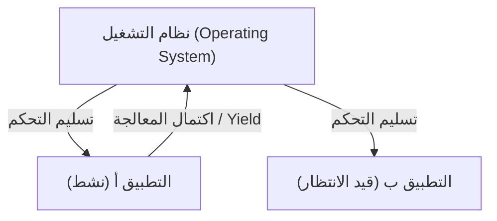

# ما هو نظام macOS: الانتقال الملحمي من Classic Mac OS إلى Mac OS X

يحظى نظام التشغيل macOS لأجهزة سطح المكتب من Apple بإعجاب مئات الملايين من المستخدمين حول العالم. ومع ذلك، وراء نظام macOS الأنيق الحالي تكمن إحدى أكثر عمليات الانتقال دراماتيكية وتحديًا تقنيًا في تاريخ أنظمة التشغيل.

في هذا المقال، سنتعمق في عملية الانتقال الملحمية من Classic Mac OS (حتى Mac OS 9) إلى Mac OS X (نظام macOS الحالي) والتقنيات الأساسية التي دعمتها.

## قيود Classic Mac OS: المهام المتعددة التعاونية

قدم نظام Mac OS، الذي ظهر مع أول جهاز Macintosh في عام 1984، واجهة مستخدم رسومية (GUI) مبتكرة في ذلك الوقت. ومع ذلك، مع مرور الوقت، بدأت قيود بنيته الأساسية في الظهور.

السببان الرئيسيان لذلك هما **المهام المتعددة التعاونية (Cooperative Multitasking)** و **الافتقار إلى حماية الذاكرة (Memory Protection)**.

### ما هي المهام المتعددة التعاونية؟

في نظام المهام المتعددة التعاونية، تقوم التطبيقات نفسها، وليس نظام التشغيل، بإدارة التحكم في وحدة المعالجة المركزية (CPU). أثناء قيام التطبيق A بالمعالجة، يجب أن ينتظر التطبيق B حتى يقوم التطبيق A "بإعادة وحدة المعالجة المركزية إلى نظام التشغيل (Yield)" طواعية.

إذا تعطل التطبيق A أو دخل في حلقة لا نهائية (infinite loop) ولم يُرجع التحكم، سيتجمد نظام التشغيل بأكمله. كان المستخدمون يُجبرون على إعادة التشغيل قسريًا، وتُفقد البيانات غير المحفوظة. بالنسبة لمستخدمي Mac في ذلك الوقت، كانت أخطاء النظام المصحوبة برمز القنبلة حدثًا يوميًا.

## ولادة Mac OS X: قوة UNIX والمهام المتعددة الاستباقية

عند تطوير نظام التشغيل من الجيل التالي، وبعد فشل مشروع التطوير الداخلي (Copland)، اتخذت Apple القرار التاريخي بالاستحواذ على شركة NeXT، التي أسسها ستيف جوبز. أصبح "NeXTSTEP"، المنتج الرئيسي لشركة NeXT، الأساس لنظام Mac OS X.

احتوى Mac OS X (الذي أصبح لاحقًا macOS) على نظام تشغيل من عائلة UNIX يسمى **Darwin** (مبني على FreeBSD ونواة Mach الصغيرة). وبفضل هذا، تم حل نقاط ضعف Classic Mac OS من الجذور.

### الاستقرار بفضل المهام المتعددة الاستباقية

واحدة من أكبر الفوائد التي جلبها OS X هي **المهام المتعددة الاستباقية (Preemptive Multitasking)**.

في نظام المهام المتعددة الاستباقية، تمتلك نواة نظام التشغيل (Kernel) سلطة مطلقة وتخصص وقت وحدة المعالجة المركزية (CPU) لكل تطبيق بالمللي ثانية. حتى لو تجمد أحد التطبيقات، يمكن للنواة انتزاع التحكم في وحدة المعالجة المركزية قسريًا وتخصيصه لتطبيقات أخرى.

علاوة على ذلك، مع إدخال **حماية الذاكرة (Memory Protection)**، أصبح لكل تطبيق مساحة ذاكرة مستقلة عن غيره. إذا تعطل أحد التطبيقات، فإنه لا يؤثر على التطبيقات الأخرى أو على نظام التشغيل ككل.

## إرث NeXTSTEP: صعود واجهة برمجة تطبيقات Cocoa

كان الانتقال إلى Mac OS X بمثابة تحول نموذجي كبير للمطورين أيضًا. قدمت Apple خيارين رئيسيين للمطورين كواجهات برمجة تطبيقات (API) لإنشاء تطبيقات لنظام التشغيل الجديد. هما **Carbon** و **Cocoa**.

1. **Carbon**: نسخة معدلة من واجهة برمجة تطبيقات Classic Mac OS مبنية على لغة C لتتوافق مع OS X. كان بمثابة جسر لتسهيل توافق التطبيقات الحالية (مثل Photoshop و Microsoft Office) مع OS X.
2. **Cocoa**: واجهة برمجة تطبيقات كائنية التوجه (Object-oriented) بحتة مبنية على لغة Objective-C، موروثة من NeXTSTEP.

ورثت Cocoa إطارات العمل (مثل Foundation و AppKit) من عصر NeXTSTEP كما هي. حتى يومنا هذا، فإن العديد من الفئات (Classes) المستخدمة في تطوير macOS تحمل البادئة `NS` (اختصار لـ NeXTSTEP) كبقايا من ذلك العصر (مثال: `NSString`، `NSArray`). في النهاية، قامت Apple بإهمال Carbon وجعلت Cocoa (ولاحقًا SwiftUI) مركزًا لتطوير macOS.

## السحر الذي دعم تطور البنية: Rosetta

ما يلفت النظر في تاريخ macOS ليس فقط الانتقال في بنية البرمجيات، بل النجاح في الانتقال ببنية الأجهزة (وحدة المعالجة المركزية) عدة مرات.

- **Motorola 68k → PowerPC** (في التسعينيات)
- **PowerPC → Intel x86** (عام 2006)
- **Intel x86 → Apple Silicon (ARM)** (عام 2020)

ما جعل هذه التحولات سلسة هي تقنية الترجمة الثنائية الديناميكية (Dynamic Binary Translation) المعروفة باسم **Rosetta**.

### Rosetta (من PowerPC إلى Intel)

في عام 2006، نقلت Apple معالجات Mac من PowerPC إلى Intel. في ذلك الوقت، كان أول إصدار من "Rosetta" عبارة عن محاكي لتشغيل تطبيقات PowerPC الحالية كما هي على أجهزة Mac بمعالجات Intel. نظرًا لأن نظام التشغيل كان يترجم التعليمات في الوقت الفعلي في الخلفية، تمكن المستخدمون من استخدام التطبيقات دون الحاجة إلى معرفة البنية التي صُممت من أجلها.

### Rosetta 2 (من Intel إلى Apple Silicon)

كان إصدار "Rosetta 2"، الذي ظهر أثناء الانتقال إلى Apple Silicon (شريحة M1) في عام 2020، أكثر تطورًا. بالإضافة إلى الترجمة في الوقت الفعلي أثناء التشغيل (JIT Compilation)، نجح في الحد من انخفاض الأداء إلى أقصى حد من خلال إجراء تجميع مسبق (AOT Compilation) وقت التثبيت (أو عند التشغيل الأول). وبفضل ذلك، حتى التطبيقات الثقيلة المكتوبة لمعمارية x86 تعمل بسرعة مذهلة على معالجات ARM الأصلية.

## خاتمة

الانتقال من Classic Mac OS إلى Mac OS X لم يكن مجرد تحديث برمجي، بل يمكن اعتباره "عملية زرع قلب" الأكثر نجاحًا في تاريخ علوم الحاسوب.

من المهام المتعددة التعاونية والانهيارات المتكررة، إلى الاستقرار القوي المبني على UNIX وواجهة المستخدم الرسومية الأنيقة. ومن بيئة التطوير التي ورثت إرث NeXTSTEP، إلى التحولات المتعددة في بنية وحدة المعالجة المركزية. إن الأداء الساحق وتجربة المستخدم التي يوفرها نظام macOS الحالي مبنية على هذه التحديات التقنية الملحمية والتطور المستمر.
