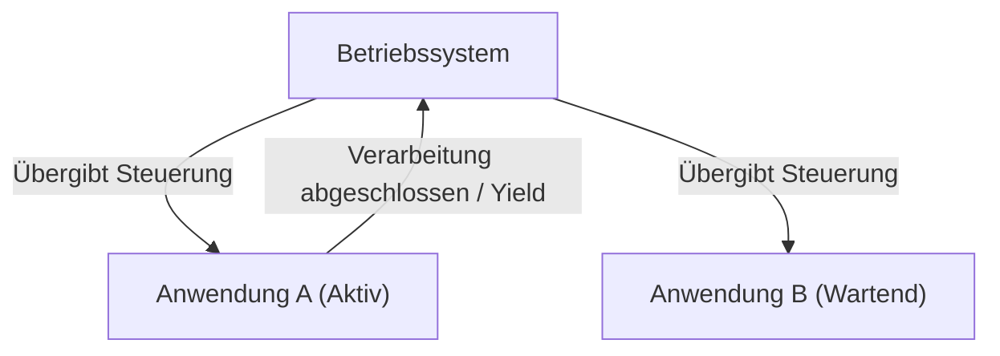
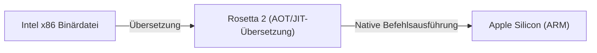

# Was ist macOS: Der epische Übergang von Classic Mac OS zu Mac OS X

Das Desktop-Betriebssystem von Apple, macOS, wird von Hunderten Millionen Benutzern weltweit geschätzt. Hinter dem heutigen, raffinierten macOS verbirgt sich jedoch einer der dramatischsten und technisch anspruchsvollsten Übergänge in der Geschichte der Betriebssysteme.

In diesem Artikel werden wir uns eingehend mit dem epischen Übergangsprozess von Classic Mac OS (bis Mac OS 9) zu Mac OS X (dem heutigen macOS) und den Kerntechnologien befassen, die ihn ermöglicht haben.

## Die Grenzen von Classic Mac OS: Kooperatives Multitasking

Mac OS, das 1984 zusammen mit dem ersten Macintosh eingeführt wurde, bot eine für die damalige Zeit revolutionäre grafische Benutzeroberfläche (GUI). Im Laufe der Zeit begannen sich jedoch die Grenzen seiner zugrunde liegenden Architektur abzuzeichnen.

Die Hauptgründe dafür waren **kooperatives Multitasking (Cooperative Multitasking)** und das **Fehlen von Speicherschutz**.

### Was ist kooperatives Multitasking?

Beim kooperativen Multitasking verwaltet nicht das Betriebssystem, sondern die Anwendung selbst die CPU-Steuerung. Während Anwendung A die Verarbeitung durchführt, muss Anwendung B warten, bis A freiwillig 'die CPU an das Betriebssystem zurückgibt (Yield)'.

Wenn Anwendung A abstürzte oder in eine Endlosschleife geriet und die Steuerung nicht zurückgab, fror das gesamte Betriebssystem ein. Die Benutzer waren zu einem erzwungenen Neustart gezwungen, und ungespeicherte Daten gingen verloren. Für damalige Mac-Benutzer waren Systemfehler mit dem Bomben-Symbol an der Tagesordnung.

## Die Geburt von Mac OS X: Die Leistung von UNIX und präemptives Multitasking

Bei der Entwicklung des Betriebssystems der nächsten Generation traf Apple nach dem Scheitern des internen Entwicklungsprojekts (Copland) die historische Entscheidung, das von Steve Jobs gegründete Unternehmen NeXT zu übernehmen. Das Hauptprodukt von NeXT, 'NeXTSTEP', sollte die Grundlage für Mac OS X bilden.

Mac OS X (später macOS) enthielt im Kern ein UNIX-basiertes Betriebssystem (basierend auf FreeBSD und dem Mach-Mikrokernel) namens **Darwin**. Dadurch wurden die Schwachstellen von Classic Mac OS grundlegend behoben.

### Stabilität durch präemptives Multitasking

Einer der größten Vorteile von OS X ist das **präemptive Multitasking (Preemptive Multitasking)**.

Beim präemptiven Multitasking hat der Kernel des Betriebssystems absolute Autorität und weist jeder Anwendung CPU-Zeit im Millisekundenbereich zu. Selbst wenn eine Anwendung einfriert, kann der Kernel gewaltsam die Kontrolle über die CPU übernehmen und sie anderen Anwendungen zuweisen.

Darüber hinaus führte die Einführung des **Speicherschutzes (Memory Protection)** dazu, dass jede Anwendung über einen eigenen, unabhängigen Speicherplatz verfügte. Wenn eine App abstürzte, wirkte sich dies nicht auf andere Apps oder das gesamte Betriebssystem aus.

## Das Erbe von NeXTSTEP: Der Aufstieg der Cocoa-API

Der Übergang zu Mac OS X war auch für Entwickler ein großer Paradigmenwechsel. Apple bot Entwicklern zwei Hauptoptionen als APIs zur Erstellung von Anwendungen für das neue Betriebssystem an: **Carbon** und **Cocoa**.

1. **Carbon**: Eine C-basierte Portierung und Anpassung der Classic Mac OS-API für OS X. Es diente als Brücke, um bestehenden Anwendungen (wie Photoshop und Microsoft Office) die relativ einfache Unterstützung von OS X zu ermöglichen.
2. **Cocoa**: Eine reine, objektorientierte API basierend auf Objective-C, die aus NeXTSTEP übernommen wurde.

Cocoa hat die Frameworks aus der NeXTSTEP-Ära (Foundation und AppKit) direkt übernommen. Die Tatsache, dass viele der heute noch in der macOS-Entwicklung verwendeten Klassen das Präfix `NS` (Abkürzung für NeXTSTEP) tragen, ist ein Relikt aus dieser Zeit (z. B. `NSString`, `NSArray`). Letztendlich hat Apple Carbon als veraltet markiert und Cocoa (und später SwiftUI) in den Mittelpunkt der macOS-Entwicklung gestellt.

## Die Magie, die den Architekturwandel unterstützte: Rosetta

Ein bemerkenswerter Aspekt in der Geschichte von macOS ist die Tatsache, dass nicht nur die Softwarearchitektur, sondern auch die Hardwarearchitektur (CPU) mehrfach erfolgreich umgestellt wurde.

- **Motorola 68k → PowerPC** (1990er Jahre)
- **PowerPC → Intel x86** (2006)
- **Intel x86 → Apple Silicon (ARM)** (2020)

Diese Übergänge wurden durch **Rosetta**, eine Technologie zur dynamischen Binärübersetzung, nahtlos realisiert.

### Rosetta (Von PowerPC zu Intel)

Im Jahr 2006 stellte Apple die Mac-Prozessoren von PowerPC auf Intel um. Zu dieser Zeit war das erste 'Rosetta' ein Emulator, der es ermöglichte, vorhandene PowerPC-Anwendungen direkt auf Intel-Macs auszuführen. Da das Betriebssystem Anweisungen im Hintergrund in Echtzeit übersetzte, konnten Benutzer Anwendungen nutzen, ohne sich Gedanken darüber machen zu müssen, für welche Architektur sie entwickelt wurden.

### Rosetta 2 (Von Intel zu Apple Silicon)

'Rosetta 2', das beim Übergang zu Apple Silicon (M1-Chip) im Jahr 2020 eingeführt wurde, war noch weiterentwickelt. Neben der Echtzeitübersetzung zur Laufzeit (JIT-Kompilierung) wurde durch Vorkompilierung (AOT-Kompilierung) bei der Installation (oder beim ersten Start) der Leistungsabfall auf ein absolutes Minimum reduziert. Dadurch laufen selbst rechenintensive, für x86 geschriebene Anwendungen mit erstaunlicher Geschwindigkeit nativ auf dem ARM-Prozessor.

## Fazit

Der Übergang von Classic Mac OS zu Mac OS X war nicht nur ein einfaches Software-Update, sondern kann als die erfolgreichste 'Herztransplantation' in der Geschichte der Informatik bezeichnet werden.

Von kooperativem Multitasking und häufigen Abstürzen hin zu der robusten Stabilität einer UNIX-Basis und einer raffinierten GUI. Und dann die Entwicklungsumgebung, die das Erbe von NeXTSTEP übernahm, sowie die mehrfachen Übergänge der CPU-Architektur. Die überwältigende Leistung und das Benutzererlebnis, das das heutige macOS bietet, beruhen auf diesen epischen technischen Herausforderungen und Entwicklungen.
