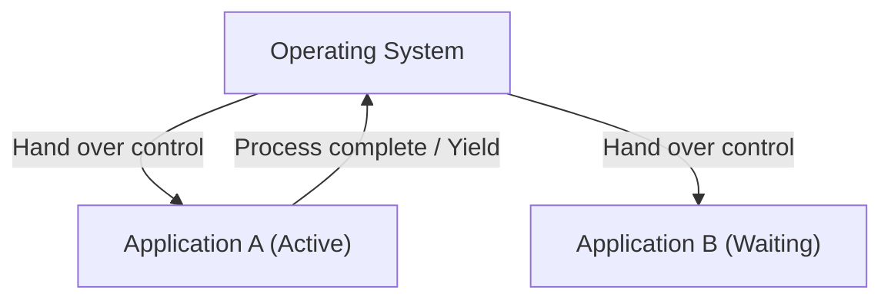
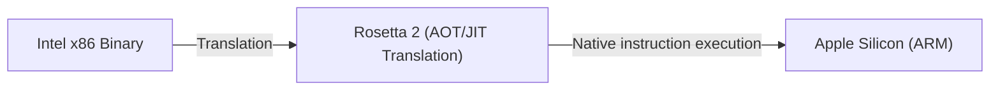

# What is macOS: The Epic Transition from Classic Mac OS to Mac OS X

Apple's desktop operating system, macOS, is beloved by hundreds of millions of users worldwide. However, behind the refined macOS of today lies one of the most dramatic and technically challenging transition stories in the history of operating systems.

In this article, we delve deep into the epic transition process from Classic Mac OS (up to Mac OS 9) to Mac OS X (the current macOS), and the core technologies that supported it.

## The Limitations of Classic Mac OS: Cooperative Multitasking

Introduced alongside the original Macintosh in 1984, Mac OS provided what was, at the time, an innovative graphical user interface (GUI). However, as time passed, the limitations of its underlying architecture began to show.

The biggest factors were **Cooperative Multitasking** and **the lack of memory protection**.

### What is Cooperative Multitasking?

In cooperative multitasking, the applications themselves, rather than the OS, manage CPU control. While Application A is processing, Application B must wait until A voluntarily "yields" the CPU back to the OS.

If Application A crashes or falls into an infinite loop and fails to return control, the entire OS freezes. Users were forced to perform hard reboots, and unsaved data was lost. For Mac users at the time, the bomb icon signifying a system error was an everyday occurrence.

## The Birth of Mac OS X: UNIX Power and Preemptive Multitasking

In developing their next-generation OS, following the failure of their in-house project (Copland), Apple made the historic decision to acquire NeXT, a company founded by Steve Jobs. NeXT's flagship product, "NeXTSTEP," became the foundation of Mac OS X.

Mac OS X (later macOS) was built on a UNIX-like operating system called **Darwin** (based on FreeBSD and the Mach microkernel). This fundamentally resolved the weaknesses of Classic Mac OS.

### Stability Through Preemptive Multitasking

One of the greatest benefits brought by OS X was **Preemptive Multitasking**.

In preemptive multitasking, the OS kernel has absolute authority, allocating CPU time to each application in milliseconds. Even if an application freezes, the kernel can forcibly seize control of the CPU and allocate it to other applications.

Furthermore, with the introduction of **Memory Protection**, each application was given its own isolated memory space. If one app crashes, it does not take down other apps or the entire OS with it.

## The Legacy of NeXTSTEP: The Rise of the Cocoa API

The transition to Mac OS X was also a massive paradigm shift for developers. Apple primarily provided two API options for developers to build applications for the new OS: **Carbon** and **Cocoa**.

1. **Carbon**: An adaptation and port of the Classic Mac OS API for OS X, based in C. It served as a bridge to relatively easily bring existing applications (like Photoshop and Microsoft Office) to OS X.
2. **Cocoa**: A pure object-oriented API based on Objective-C, inherited directly from NeXTSTEP.

Cocoa directly carries forward the frameworks from the NeXTSTEP era (Foundation and AppKit). This is why many classes still used in macOS development today carry the `NS` prefix (standing for NeXTSTEP) (e.g., `NSString`, `NSArray`). Ultimately, Apple deprecated Carbon, positioning Cocoa (and later SwiftUI) at the center of macOS development.

## The Magic Behind Architectural Transitions: Rosetta

A particularly notable aspect of macOS history is its successful execution of not just software architecture transitions, but multiple hardware (CPU) architecture transitions as well.

- **Motorola 68k → PowerPC** (1990s)
- **PowerPC → Intel x86** (2006)
- **Intel x86 → Apple Silicon (ARM)** (2020)

What seamlessly enabled these transitions was **Rosetta**, a dynamic binary translation technology.

### Rosetta (PowerPC to Intel)

In 2006, Apple transitioned Mac processors from PowerPC to Intel. The original "Rosetta" was an emulator that allowed existing PowerPC apps to run unchanged on Intel Macs. Because the OS translated instructions in real-time in the background, users could use apps without worrying about which architecture they were built for.

### Rosetta 2 (Intel to Apple Silicon)

"Rosetta 2," introduced during the 2020 transition to Apple Silicon (the M1 chip), was even more advanced. In addition to real-time translation during execution (JIT compilation), it successfully minimized performance degradation by performing ahead-of-time (AOT) compilation upon installation (or at first launch). This allowed even heavy applications written for x86 to run at astonishing speeds on native ARM processors.

## Conclusion

The transition from Classic Mac OS to Mac OS X was not merely a software update, but arguably the most successful "heart transplant" in computer science history.

From cooperative multitasking and frequent crashes to the robust stability of a UNIX base and a refined GUI. This was followed by a development environment inherited from NeXTSTEP and multiple CPU architecture transitions. The overwhelming performance and user experience of today's macOS are built upon these epic technical challenges and evolutions.
