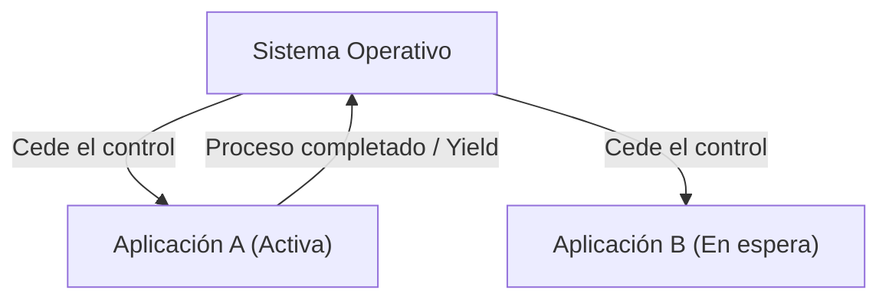

# ¿Qué es macOS?: La épica transición de Classic Mac OS a Mac OS X

macOS, el sistema operativo de escritorio de Apple, es utilizado por cientos de millones de usuarios en todo el mundo. Sin embargo, detrás de la elegante existencia del macOS actual, se esconde uno de los procesos de transición más dramáticos y técnicamente desafiantes en la historia de los sistemas operativos.

En este artículo, profundizaremos en el épico proceso de transición desde Classic Mac OS (hasta Mac OS 9) a Mac OS X (el macOS actual) y las tecnologías centrales que lo sustentaron.

## Las limitaciones de Classic Mac OS: Multitarea cooperativa

Mac OS, que debutó con la primera Macintosh en 1984, ofrecía una interfaz gráfica de usuario (GUI) revolucionaria para su época. Sin embargo, con el paso del tiempo, las limitaciones de su arquitectura base comenzaron a hacerse evidentes.

Los factores principales fueron la **multitarea cooperativa (Cooperative Multitasking)** y la **falta de protección de memoria**.

### ¿Qué es la multitarea cooperativa?

En la multitarea cooperativa, no es el SO sino la propia aplicación la que gestiona el control de la CPU. Mientras la aplicación A está procesando, la aplicación B debe esperar hasta que la aplicación A decida voluntariamente "devolver el control de la CPU al SO (Yield)".

Si la aplicación A fallaba o entraba en un bucle infinito y no devolvía el control, todo el sistema operativo se congelaba. Los usuarios se veían obligados a forzar un reinicio, perdiendo los datos no guardados. Para los usuarios de Mac de esa época, el error del sistema con el icono de la bomba era algo cotidiano.

## El nacimiento de Mac OS X: El poder de UNIX y la multitarea preventiva

En el desarrollo de su sistema operativo de próxima generación, y tras el fracaso de su proyecto interno (Copland), Apple tomó la histórica decisión de adquirir NeXT, la empresa fundada por Steve Jobs. El producto principal de NeXT, "NeXTSTEP", se convertiría en la base de Mac OS X.

Mac OS X (posteriormente macOS) incluía en su interior un sistema operativo tipo UNIX llamado **Darwin** (basado en FreeBSD y el microkernel Mach). Esto solucionó de raíz las debilidades de Classic Mac OS.

### Estabilidad gracias a la multitarea preventiva

Uno de los mayores beneficios que trajo OS X fue la **multitarea preventiva (Preemptive Multitasking)**.

En la multitarea preventiva, el kernel del SO tiene la autoridad absoluta y asigna tiempo de CPU a cada aplicación en milisegundos. Incluso si una aplicación se congela, el kernel puede arrebatarle el control de la CPU a la fuerza y asignarlo a otra aplicación.

Además, con la introducción de la **protección de memoria (Memory Protection)**, cada aplicación pasó a tener un espacio de memoria independiente. Si una aplicación falla, no afecta a las demás ni al sistema operativo en su conjunto.

## El legado de NeXTSTEP: El auge de la API Cocoa

La transición a Mac OS X también supuso un gran cambio de paradigma para los desarrolladores. Apple ofreció principalmente dos opciones de API para que los desarrolladores crearan aplicaciones para el nuevo SO: **Carbon** y **Cocoa**.

1. **Carbon**: Una adaptación de la API de Classic Mac OS, basada en C, para OS X. Sirvió como un puente para adaptar relativamente fácil las aplicaciones existentes (como Photoshop o Microsoft Office) a OS X.
2. **Cocoa**: Una API puramente orientada a objetos basada en Objective-C, heredada de NeXTSTEP.

Cocoa heredó los frameworks de la era NeXTSTEP (Foundation y AppKit) tal cual. El hecho de que muchas clases utilizadas en el desarrollo actual de macOS tengan el prefijo `NS` (abreviatura de NeXTSTEP) es un remanente de esto (ej. `NSString`, `NSArray`). Finalmente, Apple desaprobó Carbon y posicionó a Cocoa (y su sucesor SwiftUI) en el centro del desarrollo de macOS.

## La magia detrás de la evolución de la arquitectura: Rosetta

Lo más destacable de la historia de macOS es que ha logrado con éxito no solo transiciones en la arquitectura de software, sino también en la de hardware (CPU) en múltiples ocasiones.

- **Motorola 68k → PowerPC** (década de 1990)
- **PowerPC → Intel x86** (2006)
- **Intel x86 → Apple Silicon (ARM)** (2020)

Lo que hizo posibles estas transiciones de forma fluida fue **Rosetta**, una tecnología de traducción dinámica de binarios.

### Rosetta (De PowerPC a Intel)

En 2006, Apple hizo la transición de los procesadores de Mac de PowerPC a Intel. En ese momento, la primera versión de "Rosetta" fue el emulador que permitía ejecutar aplicaciones diseñadas para PowerPC directamente en los Mac con Intel. Dado que el SO traducía las instrucciones en tiempo real en segundo plano, los usuarios podían utilizar las aplicaciones sin siquiera notar para qué arquitectura estaban diseñadas.

### Rosetta 2 (De Intel a Apple Silicon)

"Rosetta 2", que apareció durante la transición a Apple Silicon (chip M1) en 2020, había evolucionado aún más. Además de la traducción en tiempo real durante la ejecución (compilación JIT), logró minimizar la pérdida de rendimiento al realizar una compilación previa (compilación AOT) durante la instalación (o en el primer inicio). Gracias a esto, incluso las aplicaciones pesadas escritas para x86 funcionan a velocidades asombrosas de forma nativa en los procesadores ARM.

## Conclusión

La transición de Classic Mac OS a Mac OS X no fue una simple actualización de software, sino que se podría considerar como el "trasplante de corazón" más exitoso en la historia de la informática.

La evolución desde la multitarea cooperativa y los constantes bloqueos, hacia la sólida estabilidad basada en UNIX y una GUI refinada. Todo esto, junto al entorno de desarrollo heredado de NeXTSTEP y las múltiples transiciones de arquitectura de CPU. El rendimiento abrumador y la experiencia de usuario que posee el macOS actual se sustentan sobre estos épicos desafíos y evoluciones tecnológicas.
