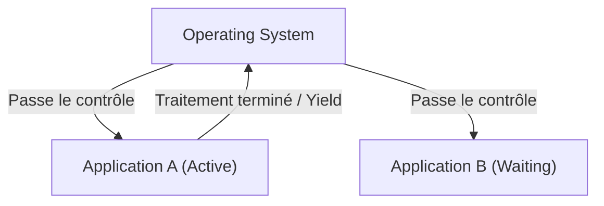

# Qu'est-ce que macOS : la transition épique de Classic Mac OS à Mac OS X

Le système d'exploitation de bureau d'Apple, macOS, est utilisé par des centaines de millions d'utilisateurs à travers le monde. Cependant, derrière l'actuel et élégant macOS se cache la transition la plus spectaculaire et techniquement difficile de l'histoire des systèmes d'exploitation.

Dans cet article, nous plongerons au cœur de la transition épique de Classic Mac OS (jusqu'à Mac OS 9) à Mac OS X (le macOS actuel) et des technologies de base qui l'ont soutenue.

## Les limites de Classic Mac OS : le multitâche coopératif

Mac OS, apparu avec le premier Macintosh en 1984, offrait une interface utilisateur graphique (GUI) innovante pour l'époque. Cependant, au fil du temps, les limites de son architecture sous-jacente ont commencé à apparaître.

Les facteurs principaux de ces limites étaient le **multitâche coopératif (Cooperative Multitasking)** et l'**absence de protection de la mémoire**.

### Qu'est-ce que le multitâche coopératif ?

Dans le multitâche coopératif, ce sont les applications elles-mêmes, et non l'OS, qui gèrent le contrôle du CPU. Pendant que l'application A effectue un traitement, l'application B doit attendre que l'application A « rende le CPU à l'OS (Yield) » de son plein gré.

Si l'application A plante ou entre dans une boucle infinie sans rendre le contrôle, tout l'OS se fige. Les utilisateurs étaient alors contraints de forcer le redémarrage, perdant ainsi leurs données non sauvegardées. À l'époque, l'icône de la bombe signalant une erreur système était monnaie courante pour les utilisateurs Mac.

## La naissance de Mac OS X : la puissance d'UNIX et le multitâche préemptif

Lors du développement de son OS de nouvelle génération, après l'échec de son projet interne (Copland), Apple a pris la décision historique de racheter NeXT, la société fondée par Steve Jobs. C'est le produit phare de NeXT, « NeXTSTEP », qui servira de base à Mac OS X.

Mac OS X (plus tard macOS) intégrait en son cœur un système d'exploitation de type UNIX appelé **Darwin** (basé sur FreeBSD et le micro-noyau Mach). Cela a permis de résoudre à la racine les points faibles de Classic Mac OS.

### La stabilité grâce au multitâche préemptif

L'un des plus grands avantages apportés par OS X est le **multitâche préemptif (Preemptive Multitasking)**.

Dans le multitâche préemptif, le noyau de l'OS dispose d'une autorité absolue et alloue du temps CPU à chaque application à la milliseconde près. Même si une application plante, le noyau peut forcer la récupération du contrôle du CPU pour l'allouer à d'autres applications.

De plus, grâce à l'introduction de la **protection de la mémoire (Memory Protection)**, chaque application dispose désormais de son propre espace mémoire indépendant. Le plantage d'une application n'entraîne plus avec elle d'autres applications ni l'ensemble de l'OS.

## L'héritage de NeXTSTEP : l'essor de l'API Cocoa

La transition vers Mac OS X a également été un changement de paradigme majeur pour les développeurs. Apple a proposé deux grands choix d'API pour permettre aux développeurs de créer des applications pour le nouvel OS : **Carbon** et **Cocoa**.

1. **Carbon** : L'API de Classic Mac OS, basée sur le langage C, portée et adaptée pour OS X. Elle servait de passerelle pour permettre de rendre les applications existantes (comme Photoshop ou Microsoft Office) relativement facilement compatibles avec OS X.
2. **Cocoa** : L'API héritée de NeXTSTEP, purement orientée objet et basée sur Objective-C.

Cocoa conserve en grande partie les frameworks de l'ère NeXTSTEP (Foundation et AppKit). Le fait que de nombreuses classes encore utilisées aujourd'hui dans le développement macOS portent le préfixe `NS` (pour NeXTSTEP) en est le vestige (par exemple, `NSString`, `NSArray`). Apple a finalement rendu Carbon obsolète, plaçant Cocoa (et plus tard SwiftUI) au cœur du développement macOS.

## La magie derrière l'évolution de l'architecture : Rosetta

Ce qui est remarquable dans l'histoire de macOS, ce n'est pas seulement l'architecture logicielle, mais le fait d'avoir réussi à plusieurs reprises la transition de l'architecture matérielle (CPU).

- **Motorola 68k → PowerPC** (années 1990)
- **PowerPC → Intel x86** (2006)
- **Intel x86 → Apple Silicon (ARM)** (2020)

Ce qui a rendu ces transitions transparentes, c'est **Rosetta**, une technologie de traduction binaire dynamique.

### Rosetta (de PowerPC vers Intel)

En 2006, Apple a migré les processeurs de ses Mac du PowerPC vers Intel. La première version de « Rosetta » était l'émulateur permettant d'exécuter telles quelles les applications PowerPC existantes sur les Mac Intel. Puisque l'OS traduisait les instructions en temps réel en arrière-plan, les utilisateurs pouvaient utiliser leurs applications sans se soucier de l'architecture pour laquelle elles avaient été conçues.

### Rosetta 2 (d'Intel vers Apple Silicon)

Lancée en 2020 lors de la transition vers Apple Silicon (la puce M1), « Rosetta 2 » a évolué de manière significative. En plus de la traduction en temps réel lors de l'exécution (compilation JIT), la précompilation (compilation AOT) effectuée lors de l'installation (ou du premier démarrage) a permis de limiter au maximum la baisse de performances. Ainsi, même les applications lourdes écrites pour l'architecture x86 s'exécutent à une vitesse impressionnante sur les processeurs ARM natifs.

## Conclusion

La transition de Classic Mac OS à Mac OS X n'était pas une simple mise à jour logicielle, mais peut être considérée comme la « transplantation cardiaque » la plus réussie de l'histoire de l'informatique.

Du multitâche coopératif et de ses fréquents plantages, à la solide stabilité de la base UNIX et à une interface utilisateur graphique raffinée. Puis, de l'environnement de développement hérité de NeXTSTEP à la transition de l'architecture du CPU à de multiples reprises. Les performances exceptionnelles et l'expérience utilisateur offertes par le macOS actuel reposent sur d'immenses défis et évolutions technologiques.
