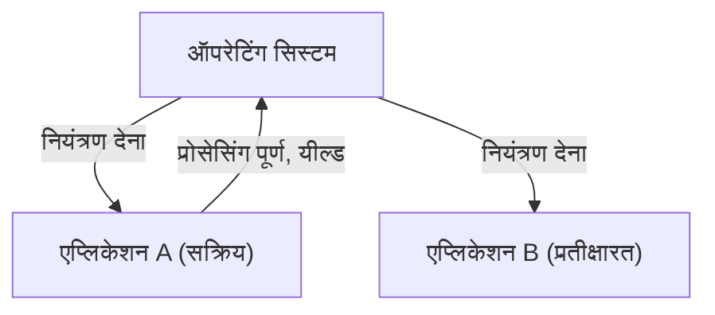
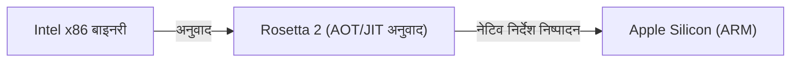

# macOS क्या है: क्लासिक Mac OS से Mac OS X तक का शानदार सफर

Apple का डेस्कटॉप ऑपरेटिंग सिस्टम, macOS, दुनिया भर के करोड़ों उपयोगकर्ताओं द्वारा पसंद किया जाता है। हालाँकि, आज के परिष्कृत macOS के पीछे, ऑपरेटिंग सिस्टम के इतिहास में सबसे नाटकीय और तकनीकी रूप से चुनौतीपूर्ण बदलावों में से एक है।

इस लेख में, हम क्लासिक Mac OS (Mac OS 9 तक) से Mac OS X (वर्तमान macOS) तक के शानदार संक्रमण प्रक्रिया और इसके पीछे की मुख्य तकनीकों पर गहराई से चर्चा करेंगे।

## क्लासिक Mac OS की सीमाएँ: कोऑपरेटिव मल्टीटास्किंग

1984 में पहले Macintosh के साथ पेश किया गया, Mac OS उस समय के लिए एक क्रांतिकारी ग्राफिकल यूजर इंटरफेस (GUI) प्रदान करता था। हालाँकि, जैसे-जैसे समय बीता, इसके अंतर्निहित आर्किटेक्चर की सीमाएँ स्पष्ट होने लगीं।

इसका सबसे बड़ा कारण **कोऑपरेटिव मल्टीटास्किंग (Cooperative Multitasking)** और **मेमोरी प्रोटेक्शन (Memory Protection) की कमी** थी।

### कोऑपरेटिव मल्टीटास्किंग क्या है?

कोऑपरेटिव मल्टीटास्किंग में, OS के बजाय एप्लिकेशन स्वयं CPU के नियंत्रण का प्रबंधन करते हैं। जब एप्लिकेशन A प्रोसेसिंग कर रहा होता है, तो एप्लिकेशन B को तब तक प्रतीक्षा करनी पड़ती है जब तक कि एप्लिकेशन A स्वेच्छा से "CPU को OS को वापस (Yield)" नहीं कर देता।

अगर एप्लिकेशन A क्रैश हो जाता है, या अनंत लूप में फंस जाता है और नियंत्रण वापस नहीं करता है, तो पूरा OS फ्रीज हो जाता है। उपयोगकर्ताओं को फोर्स रिबूट (force reboot) करने के लिए मजबूर होना पड़ता था, और बिना सेव किया गया डेटा खो जाता था। उस समय के मैक उपयोगकर्ताओं के लिए, बम (bomb) चिह्न वाली सिस्टम त्रुटियां रोजमर्रा की बात थीं।

## Mac OS X का जन्म: UNIX की शक्ति और प्रिएम्प्टिव मल्टीटास्किंग

अगली पीढ़ी के OS के विकास में, अपने इन-हाउस प्रोजेक्ट (Copland) की विफलता के बाद, Apple ने एक ऐतिहासिक निर्णय लिया और स्टीव जॉब्स (Steve Jobs) द्वारा स्थापित कंपनी NeXT का अधिग्रहण किया। NeXT का प्रमुख उत्पाद "NeXTSTEP" Mac OS X की नींव बना।

Mac OS X (बाद में macOS) अपने कोर में **Darwin** नामक एक UNIX-आधारित ऑपरेटिंग सिस्टम (FreeBSD और Mach माइक्रोकर्नेल पर आधारित) से सुसज्जित था। इससे क्लासिक Mac OS की कमजोरियां पूरी तरह से हल हो गईं।

### प्रिएम्प्टिव मल्टीटास्किंग के माध्यम से स्थिरता

OS X द्वारा लाए गए सबसे बड़े लाभों में से एक **प्रिएम्प्टिव मल्टीटास्किंग (Preemptive Multitasking)** है।

प्रिएम्प्टिव मल्टीटास्किंग में, OS के कर्नेल के पास पूर्ण अधिकार होता है और यह प्रत्येक एप्लिकेशन को मिलीसेकंड में CPU समय आवंटित करता है। भले ही कोई एप्लिकेशन फ्रीज हो जाए, कर्नेल बलपूर्वक CPU का नियंत्रण छीन सकता है और इसे अन्य एप्लिकेशनों को आवंटित कर सकता है।

इसके अलावा, **मेमोरी प्रोटेक्शन (Memory Protection)** की शुरुआत के साथ, प्रत्येक एप्लिकेशन की अपनी स्वतंत्र मेमोरी स्पेस हो गई। यदि कोई एक ऐप क्रैश हो जाता है, तो यह अन्य ऐप्स या पूरे OS को प्रभावित नहीं करता है।

## NeXTSTEP की विरासत: Cocoa API का उदय

Mac OS X में परिवर्तन डेवलपर्स के लिए भी एक बड़ा पैराडाइम शिफ्ट (paradigm shift) था। Apple ने डेवलपर्स को नए OS के लिए एप्लिकेशन बनाने के लिए API के रूप में मुख्य रूप से दो विकल्प प्रदान किए: **Carbon** और **Cocoa**।

1. **Carbon**: क्लासिक Mac OS API का C-आधारित संस्करण जिसे OS X के लिए पोर्ट और अनुकूलित किया गया था। यह मौजूदा एप्लिकेशन (जैसे Photoshop और Microsoft Office) को OS X के अनुकूल बनाने के लिए एक पुल (bridge) था।
2. **Cocoa**: NeXTSTEP से विरासत में मिला, यह Objective-C पर आधारित एक शुद्ध ऑब्जेक्ट-ओरिएंटेड API है।

Cocoa ने NeXTSTEP युग के फ्रेमवर्क (Foundation और AppKit) को वैसे ही अपना लिया। यही कारण है कि आज भी macOS विकास में उपयोग की जाने वाली कई क्लास में `NS` (NeXTSTEP का संक्षिप्त रूप) उपसर्ग (prefix) होता है (उदाहरण: `NSString`, `NSArray`)। अंततः, Apple ने Carbon को हटा दिया और Cocoa (और बाद में SwiftUI) को macOS विकास के केंद्र में रखा।

## आर्किटेक्चर के विकास का समर्थन करने वाला जादू: Rosetta

macOS के इतिहास में जो बात उल्लेखनीय है वह केवल सॉफ्टवेयर आर्किटेक्चर ही नहीं, बल्कि हार्डवेयर (CPU) आर्किटेक्चर के संक्रमण को कई बार सफलतापूर्वक अंजाम देना है।

- **Motorola 68k → PowerPC** (1990 का दशक)
- **PowerPC → Intel x86** (2006)
- **Intel x86 → Apple Silicon (ARM)** (2020)

जिस तकनीक ने इन संक्रमणों को निर्बाध (seamless) रूप से संभव बनाया, वह **Rosetta** है, जो एक डायनेमिक बाइनरी ट्रांसलेशन तकनीक है।

### Rosetta (PowerPC से Intel तक)

2006 में, Apple ने मैक प्रोसेसर को PowerPC से Intel में बदल दिया। उस समय, मौजूदा PowerPC ऐप्स को सीधे Intel Mac पर चलाने के लिए जो एमुलेटर इस्तेमाल किया गया था, वह पहला "Rosetta" था। चूंकि OS पृष्ठभूमि में वास्तविक समय में (real-time) निर्देशों का अनुवाद करता था, उपयोगकर्ता इस बात की परवाह किए बिना ऐप्स का उपयोग कर सकते थे कि ऐप किस आर्किटेक्चर के लिए बनाया गया था।

### Rosetta 2 (Intel से Apple Silicon तक)

2020 में Apple Silicon (M1 चिप) में संक्रमण के दौरान पेश किया गया "Rosetta 2" और भी उन्नत था। रनटाइम पर रीयल-टाइम अनुवाद (JIT संकलन) के अलावा, यह स्थापना (या पहले लॉन्च) के दौरान पूर्व-संकलन (AOT संकलन) करता है, जिससे प्रदर्शन में होने वाली गिरावट को कम से कम किया जा सके। इसके परिणामस्वरूप, x86 के लिए लिखे गए भारी एप्लिकेशन भी नेटिव ARM प्रोसेसर पर आश्चर्यजनक गति से चलते हैं।

## निष्कर्ष

क्लासिक Mac OS से Mac OS X में परिवर्तन केवल एक सॉफ्टवेयर अपडेट नहीं था, बल्कि इसे कंप्यूटर विज्ञान के इतिहास में सबसे सफल "हृदय प्रत्यारोपण (heart transplant)" कहा जा सकता है।

कोऑपरेटिव मल्टीटास्किंग और लगातार क्रैश होने से लेकर UNIX-आधारित मजबूत स्थिरता और परिष्कृत GUI में विकास। और विकास का माहौल जिसने NeXTSTEP की विरासत को अपनाया, और कई CPU आर्किटेक्चर संक्रमण। वर्तमान macOS का शानदार प्रदर्शन और उपयोगकर्ता अनुभव इन भव्य तकनीकी चुनौतियों और विकास पर आधारित है।
