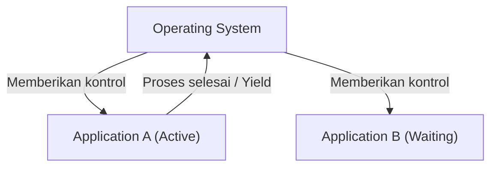
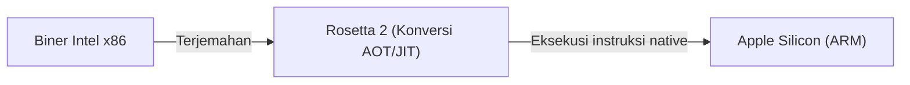

# Apa itu macOS: Transisi Epik dari Classic Mac OS ke Mac OS X

Sistem operasi desktop Apple, macOS, disukai oleh ratusan juta pengguna di seluruh dunia. Namun, di balik keberadaan macOS yang elegan saat ini, terdapat drama transisi yang paling dramatis dan menantang secara teknis dalam sejarah sistem operasi.

Pada artikel ini, kita akan menggali lebih dalam proses transisi epik dari Classic Mac OS (hingga Mac OS 9) ke Mac OS X (macOS saat ini), dan teknologi inti yang mendukungnya.

## Keterbatasan Classic Mac OS: Multitasking Kooperatif

Mac OS, yang diperkenalkan bersama Macintosh pertama pada tahun 1984, menawarkan antarmuka pengguna grafis (GUI) yang revolusioner pada masanya. Namun, seiring berjalannya waktu, keterbatasan arsitektur dasarnya mulai terlihat.

Faktor terbesarnya adalah **Multitasking Kooperatif (Cooperative Multitasking)** dan **kurangnya proteksi memori**.

### Apa itu Multitasking Kooperatif?

Dalam multitasking kooperatif, aplikasi itu sendiri, bukan OS, yang mengelola hak kontrol CPU. Sementara Aplikasi A sedang memproses, Aplikasi B harus menunggu hingga A secara sukarela 'mengembalikan CPU ke OS (Yield)'.

Jika Aplikasi A crash atau jatuh ke dalam loop tak terbatas dan tidak mengembalikan kontrol, seluruh OS akan freeze (membeku). Pengguna terpaksa melakukan restart paksa, dan data yang belum disimpan akan hilang. Bagi pengguna Mac saat itu, error sistem dengan ikon bom adalah kejadian sehari-hari.

## Lahirnya Mac OS X: Kekuatan UNIX dan Multitasking Preemptive

Dalam pengembangan OS generasi berikutnya, setelah kegagalan proyek internal (Copland), Apple membuat keputusan bersejarah untuk mengakuisisi NeXT, perusahaan yang didirikan oleh Steve Jobs. Produk andalan NeXT, 'NeXTSTEP', menjadi fondasi Mac OS X.

Mac OS X (kemudian menjadi macOS) secara internal dilengkapi dengan sistem operasi berbasis UNIX yang disebut **Darwin** (berbasis FreeBSD dan mikrokernel Mach). Hal ini secara fundamental menyelesaikan kelemahan Classic Mac OS.

### Stabilitas berkat Multitasking Preemptive

Salah satu manfaat terbesar yang dibawa oleh OS X adalah **Multitasking Preemptive (Preemptive Multitasking)**.

Dalam multitasking preemptive, kernel OS memiliki otoritas mutlak dan mengalokasikan waktu CPU ke setiap aplikasi dalam hitungan milidetik. Bahkan jika sebuah aplikasi membeku, kernel dapat secara paksa mengambil kontrol CPU dan mengalokasikannya ke aplikasi lain.

Selain itu, dengan pengenalan **Proteksi Memori (Memory Protection)**, setiap aplikasi kini memiliki ruang memorinya sendiri yang independen. Jika satu aplikasi crash, itu tidak akan memengaruhi aplikasi lain atau keseluruhan OS.

## Warisan NeXTSTEP: Kebangkitan API Cocoa

Transisi ke Mac OS X juga merupakan pergeseran paradigma yang besar bagi para pengembang. Apple menyediakan dua pilihan utama API bagi pengembang untuk membangun aplikasi pada OS baru: **Carbon** dan **Cocoa**.

1. **Carbon**: Adaptasi dan porting API Classic Mac OS berbasis bahasa C untuk OS X. Ini adalah jembatan untuk membuat aplikasi yang ada (seperti Photoshop dan Microsoft Office) kompatibel dengan OS X dengan relatif mudah.
2. **Cocoa**: API berorientasi objek murni berbasis Objective-C, diwarisi dari NeXTSTEP.

Cocoa mewarisi framework dari era NeXTSTEP (Foundation dan AppKit) apa adanya. Banyak kelas yang digunakan dalam pengembangan macOS saat ini masih memiliki awalan `NS` (singkatan dari NeXTSTEP), yang merupakan peninggalan dari masa ini (contoh: `NSString`, `NSArray`). Pada akhirnya, Apple menghentikan dukungan (deprecated) Carbon dan menjadikan Cocoa (dan kemudian SwiftUI) sebagai pusat pengembangan macOS.

## Keajaiban di Balik Evolusi Arsitektur: Rosetta

Hal yang patut dicatat dalam sejarah macOS adalah bahwa Apple telah berhasil melakukan transisi tidak hanya pada arsitektur perangkat lunak, tetapi juga pada arsitektur perangkat keras (CPU) berkali-kali.

- **Motorola 68k → PowerPC** (tahun 1990-an)
- **PowerPC → Intel x86** (2006)
- **Intel x86 → Apple Silicon (ARM)** (2020)

Teknologi terjemahan biner dinamis yang memungkinkan transisi mulus ini adalah **Rosetta**.

### Rosetta (Dari PowerPC ke Intel)

Pada tahun 2006, Apple mengalihkan prosesor Mac dari PowerPC ke Intel. Pada saat ini, emulator yang memungkinkan aplikasi PowerPC yang ada berjalan sebagaimana adanya di Intel Mac adalah 'Rosetta' generasi pertama. Karena OS menerjemahkan instruksi secara real-time di latar belakang, pengguna dapat menggunakan aplikasi tanpa menyadari arsitektur apa yang dituju oleh aplikasi tersebut.

### Rosetta 2 (Dari Intel ke Apple Silicon)

'Rosetta 2', yang diperkenalkan pada saat transisi ke Apple Silicon (chip M1) pada tahun 2020, telah berevolusi lebih jauh. Selain terjemahan real-time saat eksekusi (kompilasi JIT), Rosetta 2 berhasil menekan penurunan performa hingga batas maksimal dengan melakukan praprakompilasi (kompilasi AOT) pada saat instalasi (atau saat pertama kali dijalankan). Akibatnya, bahkan aplikasi berat yang ditulis untuk x86 dapat berjalan dengan kecepatan luar biasa pada prosesor ARM native.

## Kesimpulan

Transisi dari Classic Mac OS ke Mac OS X bukan sekadar pembaruan perangkat lunak, tetapi bisa dikatakan sebagai 'transplantasi jantung' paling sukses dalam sejarah ilmu komputer.

Evolusi dari multitasking kooperatif dan crash yang sering terjadi, menuju stabilitas UNIX yang kuat dan GUI yang elegan. Kemudian, lingkungan pengembangan yang mewarisi warisan NeXTSTEP, dan drama transisi arsitektur CPU yang terjadi berkali-kali. Performa luar biasa dan pengalaman pengguna yang dimiliki macOS saat ini dibangun di atas tantangan dan evolusi teknis yang epik ini.
