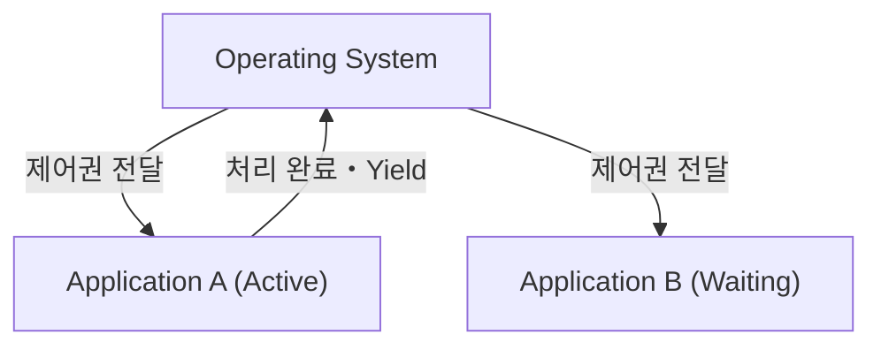
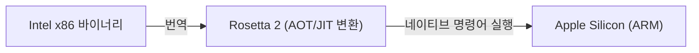

# macOS란: Classic Mac OS에서 Mac OS X로의 장대한 여정

Apple의 데스크탑 운영 체제인 macOS는 전 세계 수억 명의 사용자들에게 사랑받고 있습니다. 하지만 현재의 세련된 macOS가 존재하기까지, 운영 체제 역사상 가장 극적이고 기술적으로 어려웠던 전환의 과정이 있었습니다.

이 글에서는 Classic Mac OS(Mac OS 9까지)에서 Mac OS X(현재의 macOS)로의 장대한 전환 과정과 이를 뒷받침한 핵심 기술에 대해 깊이 파헤쳐 봅니다.

## Classic Mac OS의 한계: 협동형 멀티태스킹

1984년 초대 Macintosh와 함께 등장한 Mac OS는 당시로서는 혁신적인 그래픽 사용자 인터페이스(GUI)를 제공했습니다. 하지만 시대가 흐르면서 그 기반 아키텍처의 한계가 드러나기 시작했습니다.

그 가장 큰 요인은 **협동형 멀티태스킹(Cooperative Multitasking)**과 **메모리 보호의 부재**였습니다.

### 협동형 멀티태스킹이란 무엇인가?

협동형 멀티태스킹에서는 OS가 아닌 애플리케이션 자신이 CPU 제어권을 관리합니다. 애플리케이션 A가 처리를 수행하는 동안, 애플리케이션 B는 A가 자발적으로 "CPU를 OS에 반환(Yield)"할 때까지 기다려야 합니다.

만약 애플리케이션 A가 크래시되거나 무한 루프에 빠져 제어권을 반환하지 않으면, OS 전체가 프리즈(멈춤) 상태가 됩니다. 사용자는 강제 재부팅을 해야만 했고, 저장하지 않은 데이터는 손실되었습니다. 당시 Mac 사용자들에게 폭탄 모양의 시스템 에러는 일상다반사였습니다.

## Mac OS X의 탄생: UNIX의 파워와 선점형 멀티태스킹

Apple은 차세대 OS 개발에 있어, 자체 개발 프로젝트(Copland)의 실패를 겪은 후 스티브 잡스가 설립한 NeXT사를 인수한다는 역사적인 결단을 내렸습니다. NeXT의 주력 제품이었던 'NeXTSTEP'이야말로 Mac OS X의 기반이 됩니다.

Mac OS X(이후 macOS)는 내부에 **Darwin**이라 불리는 UNIX 계열 운영 체제(FreeBSD 및 Mach 마이크로커널 기반)를 탑재하고 있었습니다. 이로써 Classic Mac OS의 약점은 근본적으로 해결되었습니다.

### 선점형 멀티태스킹을 통한 안정성

OS X가 가져다준 가장 큰 혜택 중 하나는 **선점형 멀티태스킹(Preemptive Multitasking)**입니다.

선점형 멀티태스킹에서는 OS의 커널이 절대적인 권한을 가지며, 각 애플리케이션에 밀리초 단위로 CPU 시간을 할당합니다. 애플리케이션이 멈추더라도 커널은 강제로 CPU 제어권을 빼앗아 다른 애플리케이션에 할당할 수 있습니다.

더욱이 **메모리 보호(Memory Protection)**의 도입으로 각 애플리케이션은 서로 독립된 메모리 공간을 갖게 되었습니다. 하나의 앱이 크래시되더라도 다른 앱이나 OS 전체에 영향을 미치지 않습니다.

## NeXTSTEP의 유산: Cocoa API의 대두

Mac OS X로의 전환은 개발자들에게도 큰 패러다임 전환이었습니다. Apple은 개발자가 새로운 OS용 애플리케이션을 구축하기 위한 API로 크게 두 가지 선택지를 제공했습니다. 그것이 **Carbon**과 **Cocoa**입니다.

1. **Carbon**: Classic Mac OS의 API를 C 언어 기반으로 OS X용으로 이식 및 적응시킨 것. 기존 애플리케이션(Photoshop이나 Microsoft Office 등)을 비교적 쉽게 OS X에 대응시키기 위한 가교 역할을 했습니다.
2. **Cocoa**: NeXTSTEP에서 계승된 Objective-C 기반의 순수 객체 지향 API.

Cocoa는 NeXTSTEP 시절의 프레임워크(Foundation이나 AppKit)를 그대로 물려받았습니다. 현재에도 macOS 개발에 사용되는 클래스 다수가 `NS`(NeXTSTEP의 약자)라는 접두사를 가지고 있는 것은 이 흔적입니다(예: `NSString`, `NSArray`). 최종적으로 Apple은 Carbon을 사용 중단 처리하고, Cocoa(그리고 이후의 SwiftUI)를 macOS 개발의 중심으로 자리 잡게 합니다.

## 아키텍처의 변천을 뒷받침한 마법: Rosetta

macOS의 역사에서 특기할 만한 점은 소프트웨어 아키텍처뿐만 아니라, 하드웨어(CPU) 아키텍처의 전환을 여러 번 성공시켰다는 것입니다.

- **Motorola 68k → PowerPC** (1990년대)
- **PowerPC → Intel x86** (2006년)
- **Intel x86 → Apple Silicon (ARM)** (2020년)

이러한 전환을 매끄럽게 실현한 것이 동적 바이너리 변환 기술인 **Rosetta(로제타)**입니다.

### Rosetta (PowerPC에서 Intel로)

2006년, Apple은 Mac의 프로세서를 PowerPC에서 Intel 제품으로 전환했습니다. 이때 기존의 PowerPC용 앱을 Intel Mac에서 그대로 실행하기 위한 에뮬레이터가 1세대 'Rosetta'입니다. OS가 백그라운드에서 명령어를 실시간으로 번역하기 때문에, 사용자는 앱이 어느 아키텍처용인지 의식하지 않고 사용할 수 있었습니다.

### Rosetta 2 (Intel에서 Apple Silicon으로)

2020년 Apple Silicon(M1 칩)으로 전환할 때 등장한 'Rosetta 2'는 더욱 진화해 있었습니다. 실행 시의 실시간 번역(JIT 컴파일)에 더해, 설치 시(또는 최초 실행 시)에 사전 컴파일(AOT 컴파일)을 수행함으로써 성능 저하를 극한으로 억제하는 데 성공했습니다. 이로 인해 x86용으로 작성된 무거운 애플리케이션이라도 네이티브 ARM 프로세서 위에서 경이적인 속도로 동작합니다.

## 맺음말

Classic Mac OS에서 Mac OS X로의 전환은 단순한 소프트웨어 업데이트가 아니라, 컴퓨터 과학 역사상 가장 성공적인 '심장 이식'이라고 할 수 있는 사건입니다.

협동형 멀티태스킹과 빈번한 크래시에서, UNIX 기반의 강력한 안정성과 세련된 GUI로의 진화. 그리고 NeXTSTEP의 유산을 이어받은 개발 환경과 여러 번에 걸친 CPU 아키텍처의 전환 과정. 현재의 macOS가 가진 압도적인 성능과 사용자 경험은 이러한 장대한 기술적 도전과 진화 위에 성립되어 있는 것입니다.
