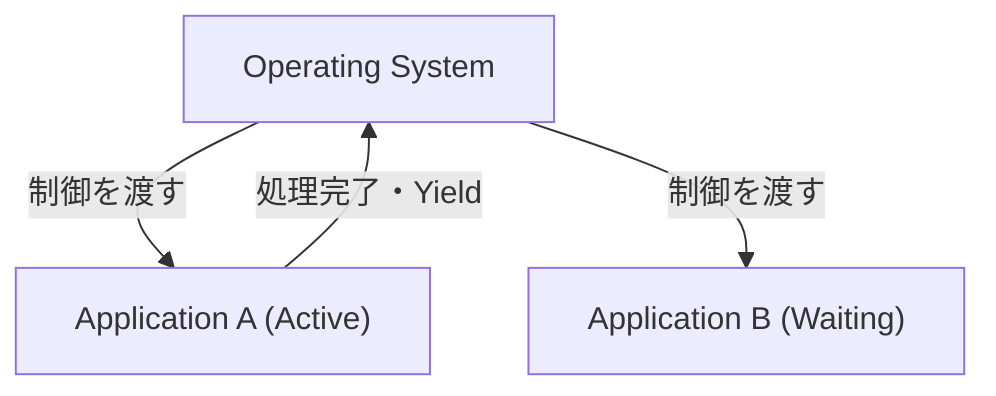
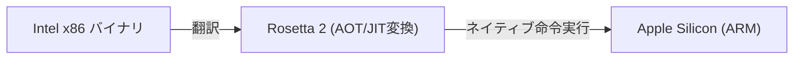

# macOSとは：Classic Mac OSからMac OS Xへの壮大な移行

AppleのデスクトップオペレーティングシステムであるmacOSは、世界中で何億人ものユーザーに愛用されています。しかし、現在の洗練されたmacOSが存在する背後には、オペレーティングシステムの歴史における最も劇的で、技術的に困難な移行劇がありました。

本記事では、Classic Mac OS（Mac OS 9まで）からMac OS X（現在のmacOS）への壮大な移行プロセスと、それを支えた中核技術について深く掘り下げます。

## Classic Mac OSの限界：協調的マルチタスク

1984年に初代Macintoshと共に登場したMac OSは、当時としては革新的なグラフィカルユーザーインターフェース（GUI）を提供していました。しかし、時代が下るにつれて、その基盤アーキテクチャの限界が露呈し始めます。

その最大の要因が**協調的マルチタスク（Cooperative Multitasking）**と**メモリ保護の欠如**でした。

### 協調的マルチタスクとは何か？

協調的マルチタスクでは、OSではなくアプリケーション自身がCPUの制御権を管理します。アプリケーションAが処理を行っている間、アプリケーションBはAが自発的に「CPUをOSに返還する（Yield）」まで待たなければなりません。

もしアプリケーションAがクラッシュしたり、無限ループに陥って制御を返さなかったりした場合、OS全体がフリーズしてしまいます。ユーザーは強制再起動を余儀なくされ、保存していないデータは失われていました。当時のMacユーザーにとって、爆弾マークのシステムエラーは日常茶飯事だったのです。

## Mac OS Xの誕生：UNIXのパワーとプリエンプティブ・マルチタスク

Appleは次世代OSの開発において、自社開発プロジェクト（Copland）の失敗を経て、スティーブ・ジョブズが設立したNeXT社を買収するという歴史的な決断を下しました。NeXTの主力製品であった「NeXTSTEP」こそが、Mac OS Xの基盤となります。

Mac OS X（後のmacOS）は、内部に**Darwin**と呼ばれるUNIX系オペレーティングシステム（FreeBSDおよびMachマイクロカーネルベース）を搭載していました。これにより、Classic Mac OSの弱点は根本から解決されました。

### プリエンプティブ・マルチタスクによる安定性

OS Xがもたらした最大の恩恵の一つが、**プリエンプティブ・マルチタスク（Preemptive Multitasking）**です。

プリエンプティブ・マルチタスクでは、OSのカーネルが絶対的な権限を持ち、各アプリケーションにミリ秒単位でCPU時間を割り当てます。アプリケーションがフリーズしても、カーネルは強制的にCPUの制御を奪い、他のアプリケーションに割り当てることができます。

さらに、**メモリ保護（Memory Protection）**の導入により、各アプリケーションは互いに独立したメモリ空間を持つようになりました。一つのアプリがクラッシュしても、他のアプリやOS全体を巻き込むことはありません。

## NeXTSTEPの遺産：Cocoa APIの台頭

Mac OS Xへの移行は、開発者にとっても大きなパラダイムシフトでした。Appleは、開発者が新しいOS向けにアプリケーションを構築するためのAPIとして、大きく分けて2つの選択肢を提供しました。それが**Carbon**と**Cocoa**です。

1. **Carbon**: Classic Mac OSのAPIをC言語ベースでOS X向けに移植・適応させたもの。既存のアプリケーション（PhotoshopやMicrosoft Officeなど）を比較的容易にOS X対応させるための架け橋でした。
2. **Cocoa**: NeXTSTEPから継承された、Objective-Cベースの純粋なオブジェクト指向API。

Cocoaは、NeXTSTEP時代のフレームワーク（FoundationやAppKit）をそのまま受け継いでいます。現在でもmacOS開発で使われるクラスの多くが `NS`（NeXTSTEPの略）というプレフィックスを持っているのは、この名残です（例：`NSString`, `NSArray`）。最終的にAppleはCarbonを非推奨とし、Cocoa（およびその後のSwiftUI）をmacOS開発の中心に据えることになります。

## アーキテクチャの変遷を支えた魔法：Rosetta

macOSの歴史において特筆すべきは、ソフトウェアアーキテクチャだけでなく、ハードウェア（CPU）のアーキテクチャ移行を何度も成功させている点です。

- **Motorola 68k → PowerPC** (1990年代)
- **PowerPC → Intel x86** (2006年)
- **Intel x86 → Apple Silicon (ARM)** (2020年)

これらの移行をシームレスに実現したのが、動的バイナリトランスレーション技術である**Rosetta（ロゼッタ）**です。

### Rosetta (PowerPCからIntelへ)

2006年、AppleはMacのプロセッサをPowerPCからIntel製へ移行しました。この時、既存のPowerPC向けアプリをIntel Mac上でそのまま動かすためのエミュレータが初代「Rosetta」です。OSがバックグラウンドで命令をリアルタイムに翻訳するため、ユーザーはアプリがどちらのアーキテクチャ向けかを意識することなく利用できました。

### Rosetta 2 (IntelからApple Siliconへ)

2020年のApple Silicon（M1チップ）への移行時に登場した「Rosetta 2」は、さらに進化していました。実行時のリアルタイム翻訳（JITコンパイル）に加え、インストール時（または初回起動時）に事前コンパイル（AOTコンパイル）を行うことで、パフォーマンスの低下を極限まで抑えることに成功しました。これにより、x86向けに書かれた重いアプリケーションであっても、ネイティブのARMプロセッサ上で驚異的な速度で動作します。

## 結び

Classic Mac OSからMac OS Xへの移行は、単なるソフトウェアのアップデートではなく、コンピュータサイエンスの歴史において最も成功した「心臓移植」とも言える出来事です。

協調的マルチタスクと頻繁なクラッシュから、UNIXベースの強固な安定性と洗練されたGUIへの進化。そして、NeXTSTEPの遺産を引き継いだ開発環境と、複数回にわたるCPUアーキテクチャの移行劇。現在のmacOSが持つ圧倒的なパフォーマンスとユーザー体験は、このような壮大な技術的挑戦と進化の上に成り立っているのです。
