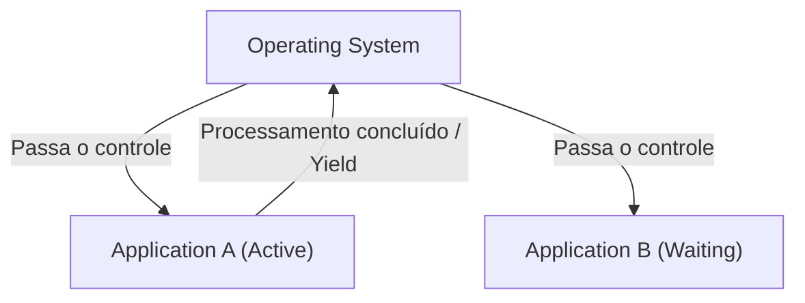
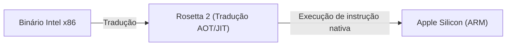

# O que é o macOS: A Épica Transição do Classic Mac OS para o Mac OS X

O macOS, sistema operacional de desktop da Apple, é amado por centenas de milhões de usuários em todo o mundo. No entanto, por trás da existência do elegante macOS atual, houve o drama de transição mais dramático e tecnicamente desafiador da história dos sistemas operacionais.

Neste artigo, vamos nos aprofundar no épico processo de transição do Classic Mac OS (até o Mac OS 9) para o Mac OS X (atual macOS) e nas tecnologias centrais que o sustentaram.

## As Limitações do Classic Mac OS: Multitarefa Cooperativa

O Mac OS, lançado com o primeiro Macintosh em 1984, oferecia uma interface gráfica de usuário (GUI) revolucionária para a época. No entanto, com o passar do tempo, as limitações da sua arquitetura base começaram a ser expostas.

O maior fator foi a **multitarefa cooperativa (Cooperative Multitasking)** e a **falta de proteção de memória**.

### O que é Multitarefa Cooperativa?

Na multitarefa cooperativa, o próprio aplicativo gerencia o controle da CPU, em vez do sistema operacional. Enquanto o Aplicativo A está processando, o Aplicativo B deve esperar até que o A voluntariamente "devolva a CPU ao SO (Yield)".

Se o Aplicativo A travasse ou entrasse em um loop infinito e não retornasse o controle, todo o sistema operacional congelaria. Os usuários eram forçados a realizar uma reinicialização forçada, e os dados não salvos eram perdidos. Para os usuários de Mac daquela época, o erro de sistema com o ícone de bomba era uma ocorrência diária.

## O Nascimento do Mac OS X: O Poder do UNIX e a Multitarefa Preemptiva

No desenvolvimento de seu sistema operacional de próxima geração, a Apple tomou a decisão histórica de adquirir a NeXT, empresa fundada por Steve Jobs, após o fracasso de seu próprio projeto de desenvolvimento (Copland). O principal produto da NeXT, o "NeXTSTEP", tornaria-se a base do Mac OS X.

O Mac OS X (mais tarde macOS) foi construído sobre um sistema operacional do tipo UNIX chamado **Darwin** (baseado no FreeBSD e no microkernel Mach). Com isso, os pontos fracos do Classic Mac OS foram fundamentalmente resolvidos.

### Estabilidade através da Multitarefa Preemptiva

Um dos maiores benefícios trazidos pelo OS X foi a **multitarefa preemptiva (Preemptive Multitasking)**.

Na multitarefa preemptiva, o kernel do SO tem autoridade absoluta e aloca tempo de CPU para cada aplicativo em milissegundos. Mesmo se um aplicativo travar, o kernel pode forçar a tomada de controle da CPU e alocá-lo a outros aplicativos.

Além disso, com a introdução da **proteção de memória (Memory Protection)**, cada aplicativo passou a ter um espaço de memória independente. Mesmo que um aplicativo travasse, ele não afetaria outros aplicativos ou o sistema operacional como um todo.

## O Legado do NeXTSTEP: A Ascensão da API Cocoa

A transição para o Mac OS X também foi uma grande mudança de paradigma para os desenvolvedores. A Apple ofereceu duas opções principais de APIs para os desenvolvedores criarem aplicativos para o novo SO: **Carbon** e **Cocoa**.

1. **Carbon**: Uma adaptação da API do Classic Mac OS, baseada em C, portada para o OS X. Era uma ponte para tornar aplicativos existentes (como o Photoshop e o Microsoft Office) compatíveis com o OS X com relativa facilidade.
2. **Cocoa**: Uma API orientada a objetos pura baseada em Objective-C, herdada do NeXTSTEP.

A Cocoa herdou as estruturas (como Foundation e AppKit) da era NeXTSTEP como estavam. É um vestígio disso que muitas das classes usadas no desenvolvimento do macOS ainda hoje tenham o prefixo `NS` (abreviação de NeXTSTEP) (ex: `NSString`, `NSArray`). Por fim, a Apple descontinuou a Carbon e colocou a Cocoa (e, posteriormente, o SwiftUI) no centro do desenvolvimento do macOS.

## A Magia por Trás da Evolução da Arquitetura: Rosetta

O que é notável na história do macOS não é apenas a arquitetura de software, mas também o fato de que eles conseguiram realizar transições de arquitetura de hardware (CPU) várias vezes com sucesso.

- **Motorola 68k → PowerPC** (anos 1990)
- **PowerPC → Intel x86** (2006)
- **Intel x86 → Apple Silicon (ARM)** (2020)

O que tornou essas transições perfeitas possíveis foi o **Rosetta**, uma tecnologia de tradução binária dinâmica.

### Rosetta (Do PowerPC para o Intel)

Em 2006, a Apple mudou os processadores do Mac do PowerPC para os da Intel. Naquela época, o "Rosetta" original era um emulador para executar aplicativos PowerPC existentes como estavam em Macs Intel. Como o SO traduzia as instruções em tempo real em segundo plano, os usuários podiam usar os aplicativos sem ter que se preocupar com a arquitetura para a qual foram construídos.

### Rosetta 2 (Do Intel para o Apple Silicon)

O "Rosetta 2", que apareceu durante a transição para o Apple Silicon (chip M1) em 2020, era ainda mais avançado. Além da tradução em tempo real na execução (compilação JIT), ele conseguiu minimizar a degradação de desempenho realizando a compilação antecipada (compilação AOT) no momento da instalação (ou na primeira inicialização). Graças a isso, mesmo aplicativos pesados escritos para x86 operam em velocidades incríveis no processador ARM nativo.

## Conclusão

A transição do Classic Mac OS para o Mac OS X não foi apenas uma simples atualização de software, mas sim um evento que poderia ser considerado o "transplante de coração" mais bem-sucedido da história da ciência da computação.

Evoluindo da multitarefa cooperativa e travamentos frequentes para a forte estabilidade e GUI elegante baseada em UNIX. Além disso, o ambiente de desenvolvimento herdou o legado do NeXTSTEP e as transições de arquitetura de CPU ao longo de várias ocasiões. O desempenho esmagador e a experiência do usuário que o macOS atual possui são construídos sobre esses desafios tecnológicos épicos e evolução.
