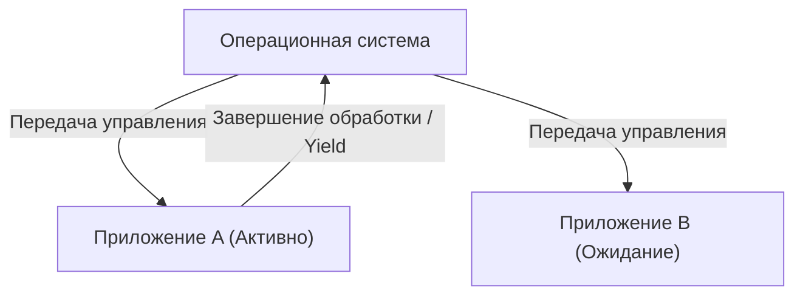

# Что такое macOS: Грандиозный переход от Classic Mac OS к Mac OS X

macOS, настольная операционная система Apple, любима сотнями миллионов пользователей по всему миру. Однако за нынешней утонченной macOS стоит один из самых драматичных и технически сложных переходов в истории операционных систем.

В этой статье мы подробно рассмотрим процесс грандиозного перехода от Classic Mac OS (до Mac OS 9) к Mac OS X (нынешней macOS) и основные технологии, которые его поддерживали.

## Ограничения Classic Mac OS: Кооперативная многозадачность

Mac OS, появившаяся вместе с первым Macintosh в 1984 году, предлагала инновационный для своего времени графический интерфейс пользователя (GUI). Однако с течением времени начали проявляться ограничения ее базовой архитектуры.

Главной причиной этого была **кооперативная многозадачность (Cooperative Multitasking)** и **отсутствие защиты памяти**.

### Что такое кооперативная многозадачность?

При кооперативной многозадачности не операционная система, а само приложение управляет контролем над процессором. Пока Приложение А выполняет обработку, Приложение Б должно ждать, пока А добровольно не "вернет процессор ОС (Yield)".

Если Приложение А дает сбой или попадает в бесконечный цикл и не возвращает управление, зависает вся ОС целиком. Пользователи были вынуждены делать принудительную перезагрузку, а несохраненные данные терялись. Для пользователей Mac того времени системные ошибки с символом бомбы были обычным делом.

## Рождение Mac OS X: Мощь UNIX и вытесняющая многозадачность

При разработке ОС следующего поколения, после неудачи собственного проекта (Copland), Apple приняла историческое решение купить компанию NeXT, основанную Стивом Джобсом. Именно «NeXTSTEP», флагманский продукт NeXT, стал основой Mac OS X.

Mac OS X (позже macOS) включала в себя UNIX-подобную операционную систему под названием **Darwin** (основанную на FreeBSD и микроядре Mach). Это в корне решило слабые места Classic Mac OS.

### Стабильность благодаря вытесняющей многозадачности

Одним из самых больших преимуществ, которые принесла OS X, стала **вытесняющая многозадачность (Preemptive Multitasking)**.

При вытесняющей многозадачности ядро ОС обладает абсолютными полномочиями и выделяет процессорное время каждому приложению в миллисекундах. Даже если приложение зависает, ядро может принудительно забрать контроль над процессором и передать его другому приложению.

Кроме того, благодаря внедрению **защиты памяти (Memory Protection)**, каждое приложение получило собственное независимое пространство памяти. Сбой одного приложения больше не затрагивал другие приложения или всю ОС.

## Наследие NeXTSTEP: Появление API Cocoa

Переход на Mac OS X стал значительным сдвигом парадигмы и для разработчиков. Apple предложила разработчикам два основных варианта API для создания приложений под новую ОС. Это **Carbon** и **Cocoa**.

1. **Carbon**: Адаптация и портирование API Classic Mac OS для OS X на базе языка C. Это был мост для относительно легкой адаптации существующих приложений (таких как Photoshop или Microsoft Office) к OS X.
2. **Cocoa**: Чистый объектно-ориентированный API на базе Objective-C, унаследованный от NeXTSTEP.

Cocoa унаследовала фреймворки времен NeXTSTEP (Foundation и AppKit) в их первозданном виде. Тот факт, что многие классы, используемые сегодня в разработке для macOS, имеют префикс `NS` (сокращение от NeXTSTEP), является отголоском этого (например, `NSString`, `NSArray`). В конечном итоге Apple объявила Carbon устаревшим, сделав Cocoa (и впоследствии SwiftUI) центром разработки для macOS.

## Магия, поддержавшая архитектурную эволюцию: Rosetta

Особого внимания в истории macOS заслуживает не только архитектура программного обеспечения, но и тот факт, что она неоднократно и успешно проходила через переходы архитектуры аппаратного обеспечения (CPU).

- **Motorola 68k → PowerPC** (1990-е)
- **PowerPC → Intel x86** (2006 год)
- **Intel x86 → Apple Silicon (ARM)** (2020 год)

Бесшовность этих переходов была обеспечена технологией динамической двоичной трансляции под названием **Rosetta**.

### Rosetta (от PowerPC к Intel)

В 2006 году Apple перевела процессоры Mac с PowerPC на Intel. В это время был выпущен первый эмулятор «Rosetta», позволявший запускать существующие приложения для PowerPC на Intel Mac без изменений. Поскольку ОС переводила инструкции в фоновом режиме в реальном времени, пользователи могли работать с приложениями, даже не задумываясь о том, для какой архитектуры они предназначены.

### Rosetta 2 (от Intel к Apple Silicon)

Появившаяся при переходе на Apple Silicon (чип M1) в 2020 году, «Rosetta 2» была еще более продвинутой. В дополнение к трансляции в реальном времени во время выполнения (JIT-компиляция), ей удалось минимизировать потерю производительности за счет предварительной компиляции (AOT-компиляции) во время установки (или при первом запуске). Благодаря этому даже тяжелые приложения, написанные для x86, работают с поразительной скоростью на нативных процессорах ARM.

## Заключение

Переход от Classic Mac OS к Mac OS X был не просто обновлением программного обеспечения; это событие можно назвать самой успешной «пересадкой сердца» в истории компьютерных наук.

Эволюция от кооперативной многозадачности и частых сбоев к надежной стабильности на базе UNIX и утонченному графическому интерфейсу. А также среда разработки, унаследовавшая наследие NeXTSTEP, и многократные переходы архитектуры процессоров. Потрясающая производительность и пользовательский опыт нынешней macOS построены на этих грандиозных технологических вызовах и эволюции.
