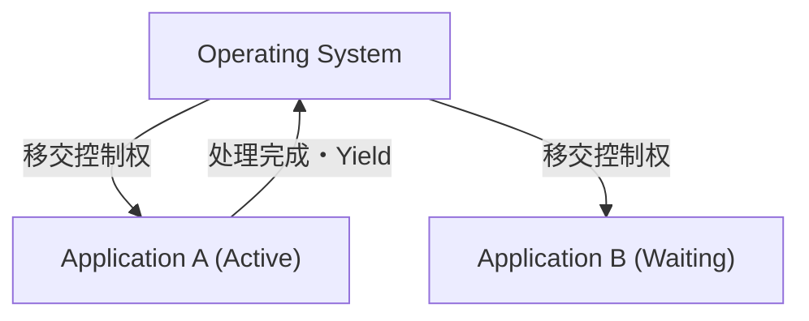

# 什么是 macOS：从 Classic Mac OS 到 Mac OS X 的宏大过渡

作为 Apple 的桌面操作系统，macOS 受到全球数亿用户的喜爱。然而，在目前精致的 macOS 背后，有着操作系统历史上最具戏剧性且技术上最为困难的过渡期。

在本文中，我们将深入探讨从 Classic Mac OS（至 Mac OS 9）到 Mac OS X（现在的 macOS）的宏大过渡过程，以及支撑它的核心技术。

## Classic Mac OS 的局限性：协作式多任务处理

1984 年与初代 Macintosh 一同登场的 Mac OS，在当时提供了革命性的图形用户界面（GUI）。然而，随着时代的推移，其底层架构的局限性开始暴露无遗。

其最大的原因就是**协作式多任务处理（Cooperative Multitasking）**以及**缺乏内存保护**。

### 什么是协作式多任务处理？

在协作式多任务处理中，由应用程序自身而不是 OS 来管理 CPU 的控制权。当应用程序 A 正在处理时，应用程序 B 必须等待，直到 A 自发地将“CPU 归还给 OS（Yield）”。

如果应用程序 A 崩溃，或者陷入无限循环而不返还控制权，整个 OS 都会冻结。用户被迫强制重启，未保存的数据也会丢失。对于当时的 Mac 用户来说，带有炸弹图标的系统错误可谓家常便饭。

## Mac OS X 的诞生：UNIX 的力量与抢占式多任务处理

在下一代 OS 的开发中，Apple 经历了自主开发项目（Copland）的失败，随后做出了历史性的决定——收购史蒂夫·乔布斯创立的 NeXT 公司。NeXT 的核心产品“NeXTSTEP”正是后来 Mac OS X 的基础。

Mac OS X（后来的 macOS）内部搭载了一个名为 **Darwin** 的类 UNIX 操作系统（基于 FreeBSD 和 Mach 微内核）。这从根本上解决了 Classic Mac OS 的弱点。

### 抢占式多任务处理带来的稳定性

OS X 带来的最大恩惠之一，就是**抢占式多任务处理（Preemptive Multitasking）**。

在抢占式多任务处理中，OS 内核拥有绝对的权限，以毫秒为单位向各个应用程序分配 CPU 时间。即使应用程序冻结，内核也能强行剥夺 CPU 的控制权，并将其分配给其他应用程序。

此外，由于引入了**内存保护（Memory Protection）**，每个应用程序都拥有彼此独立的内存空间。即使一个应用崩溃，也不会牵连其他应用或整个 OS。

## NeXTSTEP 的遗产：Cocoa API 的崛起

向 Mac OS X 的过渡，对开发者而言也是一次巨大的范式转变。Apple 为开发者提供了两个主要的 API 选择，用于构建面向新 OS 的应用程序。它们就是 **Carbon** 和 **Cocoa**。

1. **Carbon**: 将 Classic Mac OS 的 API 基于 C 语言移植并适配到 OS X 的产物。它主要是为了让现有的应用程序（如 Photoshop 或 Microsoft Office 等）能相对容易地兼容 OS X 而搭建的桥梁。
2. **Cocoa**: 继承自 NeXTSTEP 的基于 Objective-C 的纯面向对象 API。

Cocoa 完整地保留了 NeXTSTEP 时代的框架（Foundation 和 AppKit）。至今，在 macOS 开发中使用的许多类都带有 `NS`（NeXTSTEP 的缩写）前缀，这就是当时的遗迹（例如：`NSString`, `NSArray`）。最终，Apple 弃用了 Carbon，将 Cocoa（以及后来的 SwiftUI）置于 macOS 开发的核心地位。

## 支撑架构变迁的魔法：Rosetta

在 macOS 的历史中值得特书一笔的是，它不仅成功实现了软件架构的过渡，还多次成功地进行了硬件（CPU）架构的迁移。

- **Motorola 68k → PowerPC** (20世纪90年代)
- **PowerPC → Intel x86** (2006年)
- **Intel x86 → Apple Silicon (ARM)** (2020年)

而无缝实现这些过渡的，正是动态二进制翻译技术——**Rosetta**。

### Rosetta (从 PowerPC 到 Intel)

2006 年，Apple 将 Mac 的处理器从 PowerPC 迁移到了 Intel。当时，为了让现有的面向 PowerPC 的应用程序直接在 Intel Mac 上运行，初代“Rosetta”模拟器应运而生。因为 OS 在后台实时翻译指令，用户可以在不意识到应用是面向哪种架构的情况下使用它们。

### Rosetta 2 (从 Intel 到 Apple Silicon)

2020 年，在向 Apple Silicon（M1 芯片）迁移时登场的“Rosetta 2”则进化得更为强大。除了运行时的实时翻译（JIT 编译）外，它还在安装时（或首次启动时）进行提前编译（AOT 编译），成功地将性能下降抑制到了极限。因此，即使是面向 x86 编写的繁重应用程序，也能在原生的 ARM 处理器上以惊人的速度运行。

## 结语

从 Classic Mac OS 到 Mac OS X 的过渡，不仅仅是一次单纯的软件更新，更可以说是计算机科学史上最成功的“心脏移植”事件。

从协作式多任务处理和频繁崩溃，进化为基于 UNIX 的坚如磐石的稳定性和精致的 GUI。再加上继承了 NeXTSTEP 遗产的开发环境，以及多次的 CPU 架构变迁大戏。现在的 macOS 所拥有的压倒性性能和用户体验，正是建立在这样宏大的技术挑战与进化之上的。
