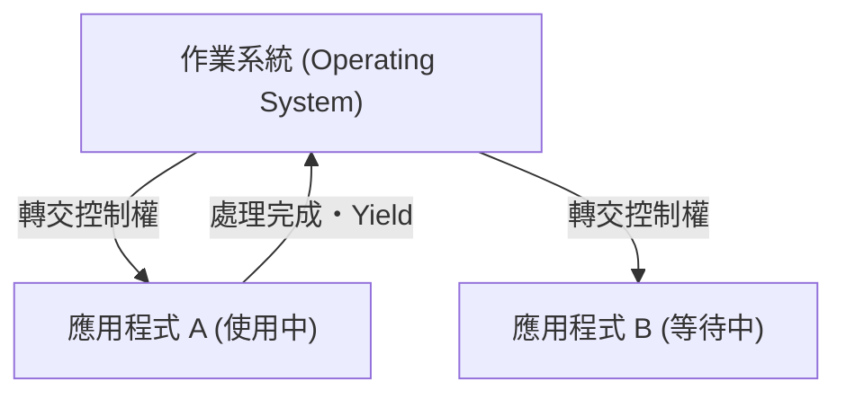
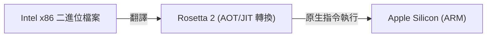

# 什麼是 macOS：從 Classic Mac OS 到 Mac OS X 的史詩級過渡

Apple 的桌上型作業系統 macOS 受到全球數億使用者的喜愛。然而，在如今精緻的 macOS 背後，隱藏著作業系統歷史上最引人注目且技術上充滿挑戰的過渡期。

本文將深入探討從 Classic Mac OS（直到 Mac OS 9）到 Mac OS X（現在的 macOS）的史詩級過渡過程，以及支撐它的核心技術。

## Classic Mac OS 的極限：協同式多工 (Cooperative Multitasking)

1984 年與第一代 Macintosh 一同登場的 Mac OS，提供了當時革命性的圖形使用者介面 (GUI)。然而，隨著時代的推移，其底層架構的極限開始顯露。

最大的原因在於**協同式多工 (Cooperative Multitasking)** 和**缺乏記憶體保護 (Memory Protection)**。

### 什麼是協同式多工？

在協同式多工中，是由應用程式本身而非 OS 來管理 CPU 的控制權。當應用程式 A 正在處理時，應用程式 B 必須等待 A 自願「將 CPU 交還給 OS (Yield)」為止。

如果應用程式 A 當機或陷入無限迴圈而未交還控制權，整個 OS 就會凍結。使用者不得不強制重新啟動，未儲存的資料也會跟著遺失。對於當時的 Mac 使用者來說，帶有炸彈圖示的系統錯誤是家常便飯。

## Mac OS X 的誕生：UNIX 的威力與搶占式多工 (Preemptive Multitasking)

Apple 在開發次世代 OS 時，經歷了內部開發專案 (Copland) 的失敗，隨後做出了收購由 Steve Jobs 創立的 NeXT 公司的歷史性決定。NeXT 的主力產品「NeXTSTEP」正是 Mac OS X 的基礎。

Mac OS X（後來的 macOS）內部搭載了稱為 **Darwin** 的類 UNIX 作業系統（基於 FreeBSD 和 Mach 微核心）。這從根本上解決了 Classic Mac OS 的弱點。

### 搶占式多工帶來的穩定性

OS X 帶來的最大好處之一就是**搶占式多工 (Preemptive Multitasking)**。

在搶占式多工中，OS 的核心 (Kernel) 擁有絕對的權限，會以毫秒為單位將 CPU 時間分配給每個應用程式。即使應用程式凍結，核心也能強制奪取 CPU 的控制權，並將其分配給其他應用程式。

此外，透過導入**記憶體保護 (Memory Protection)**，每個應用程式都擁有了獨立的記憶體空間。即使一個應用程式當機，也不會牽連其他應用程式或整個 OS。

## NeXTSTEP 的遺產：Cocoa API 的崛起

向 Mac OS X 的過渡對開發者來說也是一次重大的典範轉移。Apple 為了讓開發者能為新 OS 構建應用程式，提供了兩個主要的 API 選擇。這就是 **Carbon** 和 **Cocoa**。

1. **Carbon**：將 Classic Mac OS 的 API 移植並調整為 OS X 適用的 C 語言基礎 API。這是為了讓現有應用程式（如 Photoshop 和 Microsoft Office）相對容易地支援 OS X 的橋樑。
2. **Cocoa**：繼承自 NeXTSTEP，基於 Objective-C 的純物件導向 API。

Cocoa 原封不動地繼承了 NeXTSTEP 時代的框架 (Foundation 和 AppKit)。直到現在，許多在 macOS 開發中使用的類別仍帶有 `NS` (NeXTSTEP 的縮寫) 的前綴，這正是當時的遺跡（例如：`NSString`、`NSArray`）。最終，Apple 廢棄了 Carbon，並將 Cocoa（以及後來的 SwiftUI）置於 macOS 開發的核心。

## 支撐架構演進的魔法：Rosetta

在 macOS 的歷史中，值得一提的不僅是軟體架構，還成功地進行了多次硬體 (CPU) 架構的過渡：

- **Motorola 68k → PowerPC** (1990 年代)
- **PowerPC → Intel x86** (2006 年)
- **Intel x86 → Apple Silicon (ARM)** (2020 年)

無縫實現這些過渡的，正是動態二進位翻譯技術 **Rosetta**。

### Rosetta (從 PowerPC 到 Intel)

2006 年，Apple 將 Mac 的處理器從 PowerPC 轉換為 Intel 製。當時，為了讓現有的 PowerPC 應用程式能直接在 Intel Mac 上執行，初代「Rosetta」模擬器應運而生。因為 OS 會在背景即時翻譯指令，所以使用者在不需意識到應用程式是針對哪種架構開發的情況下，就能直接使用。

### Rosetta 2 (從 Intel 到 Apple Silicon)

2020 年轉換到 Apple Silicon (M1 晶片) 時登場的「Rosetta 2」又進一步進化了。除了執行時的即時翻譯 (JIT 編譯) 之外，在安裝時（或首次啟動時）也會進行事前編譯 (AOT 編譯)，成功地將效能的降低抑制到極限。這使得即使是為 x86 撰寫的重型應用程式，也能在原生的 ARM 處理器上以驚人的速度運行。

## 結語

從 Classic Mac OS 到 Mac OS X 的過渡，不僅僅是單純的軟體更新，更可以說是電腦科學史上最成功的「心臟移植」事件。

從協同式多工和頻繁的當機，進化到基於 UNIX 的強大穩定性和精緻的 GUI。接著，繼承了 NeXTSTEP 遺產的開發環境，以及多次的 CPU 架構過渡。現在的 macOS 所擁有的壓倒性效能與使用者體驗，正是建立在這些史詩般的技術挑戰與進化之上的。
