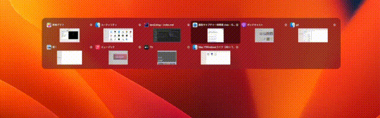

# Introduction

I will introduce how to switch applications on a Mac in a Windows-like manner (using Alt+Tab).

Since this is difficult to achieve by changing standard settings, this method involves installing an application.

# In action

# How to setup (macOS Ventura)

1. Open [https://alt-tab-macos.netlify.app](https://alt-tab-macos.netlify.app)
2. Click `Download the latest release`
3. Open the downloaded application
4. Follow the instructions to install

Now, you can switch applications using Alt+Tab just like on Windows.

That's all.
