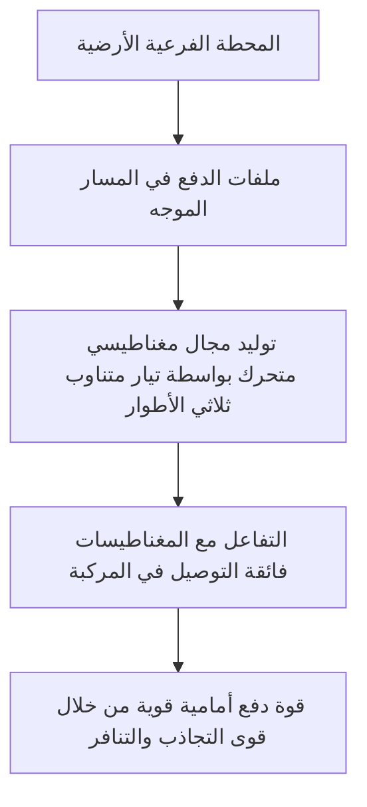
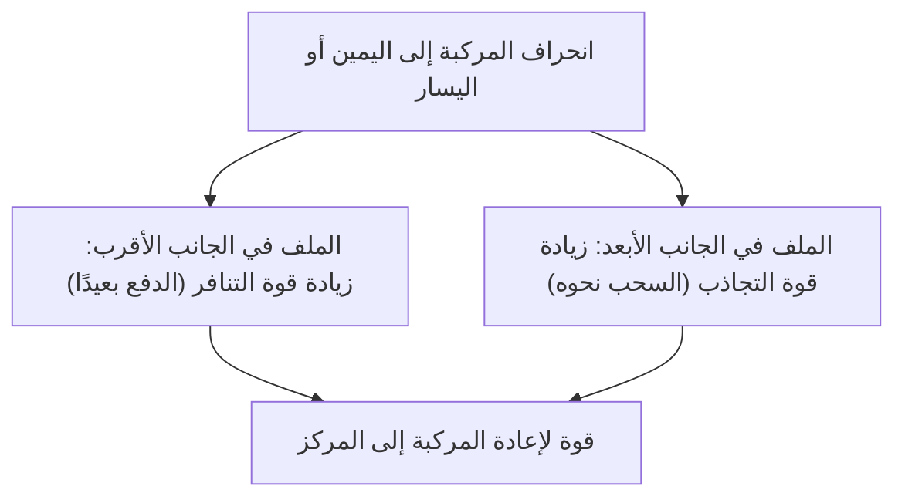

## مقدمة: نحو عالم سرعة 500 كم/ساعة

يعد القطار المغناطيسي المعلق (Maglev) نظام نقل من الجيل القادم، يختلف جذريًا عن تقنية السكك الحديدية التقليدية التي تعتمد على الاحتكاك بين العجلات والقضبان. يُعرف في اليابان باسم "الماجليف فائق التوصيل"، وينطلق على الأرض بسرعة مذهلة تتجاوز 500 كم/ساعة. قد يكون من الأدق وصف هذه السرعة بأنها "طيران على ارتفاع منخفض" بدلاً من "ركض".

في هذا المقال، سنشرح بأكبر قدر ممكن من العمق والتفصيل الآلية التي تقف وراء رفع هذه المركبة المبتكرة وكيفية انطلاقها بسرعة هائلة، مجمعين بين أفضل ما في الفيزياء والهندسة.

## الموصلية الفائقة وتأثير مايسنر: مصدر القوة المغناطيسية السحرية

في قلب القطار المغناطيسي المعلق توجد "مغناطيسات فائقة التوصيل". الموصلية الفائقة هي ظاهرة تنعدم فيها المقاومة الكهربائية تمامًا عند تبريد معادن أو سبائك معينة إلى درجات حرارة منخفضة للغاية (على سبيل المثال، 269 درجة مئوية تحت الصفر باستخدام الهيليوم السائل).

انعدام المقاومة الكهربائية يعني أنه بمجرد تمرير تيار كهربائي، فإنه سيستمر في التدفق إلى الأبد دون الحاجة إلى تزويده بالطاقة من الخارج، وهو ما يُعرف بحالة "التيار الدائم". يتيح هذا توليد مجال مغناطيسي أقوى بكثير من المغناطيسات الكهربائية التقليدية دون فقدان للطاقة بسبب حرارة جول.

علاوة على ذلك، من الخصائص المهمة الأخرى لحالة التوصيل الفائق "تأثير مايسنر" (Meissner effect). وهي ظاهرة تُطرد فيها خطوط المجال المغناطيسي تمامًا من داخل الموصل الفائق، مما يخلق قوة تنافر قوية ضد المغناطيس. لرفع القطار المغناطيسي، توجد طريقتان: إما استخدام تأثير مايسنر نفسه (مثل تأثير التثبيت)، أو استخدام قوة التنافر الحثية التي تتولد بين المغناطيسات الكهرومغناطيسية فائقة التوصيل القوية وملفات الأرض (نظام الماجليف الياباني). في النظام الياباني، تلعب المغناطيسات فائقة التوصيل ذات الكثافة المغناطيسية الهائلة دورًا حيويًا في كل من رفع، وتوجيه، ودفع المركبة.

## آلية الدفع: المحرك الخطي المتزامن (LSM)

تأتي تسمية آلية الدفع في القطار المغناطيسي المعلق من "المحرك الخطي" (Linear Motor). في حين أن المحرك التقليدي يولد حركة دورانية، فإن المحرك الخطي له هيكل يبدو وكأنه محرك تم شقه وتمديده في خط مستقيم، مما يولد حركة خطية مباشرة (قوة دفع).

في الماجليف فائق التوصيل، يُستخدم نظام يسمى "المحرك الخطي المتزامن" (Linear Synchronous Motor: LSM).

على الجدران الجانبية للمسار الأرضي (المسار الموجه)، يتم ترتيب "ملفات الدفع" في صفوف. عند تمرير تيار متناوب ثلاثي الأطوار من محطة فرعية أرضية إلى هذه الملفات، يتولد "مجال مغناطيسي متحرك" تتحرك فيه الأقطاب الشمالية والجنوبية باستمرار.

من ناحية أخرى، تم تجهيز المركبة بمغناطيسات فائقة التوصيل قوية (تحتوي دائمًا على قطب شمالي وجنوبي ثابتين). ينجذب القطب الشمالي للمركبة إلى القطب الجنوبي للمجال المغناطيسي المتحرك على الأرض، وفي نفس الوقت يتنافر مع القطب الشمالي أمامه. من خلال التحكم في سرعة حركة المجال المغناطيسي الأرضي، يتم سحب المركبة بشكل متزامن لركوب موجة هذا المجال المغناطيسي، مما يوفر قوة الدفع للمضي قدمًا.

الميزة الكبرى لهذا النظام هي أن الجزء المقابل لـ "الجزء الثابت" (Stator) في المحرك يقع على الأرض، بينما تحمل المركبة فقط مغناطيسات قوية تمثل "الدوار" (Rotor). يتيح ذلك تقليل وزن المركبة بشكل كبير، مما يحسن من كفاءة الطاقة وأداء التسارع بشكل هائل عند القيادة بسرعات عالية.

## الرفع والتوجيه: التنافر الحثي و"الملفات على شكل رقم 8"

لكي يسير القطار المغناطيسي المعلق بسرعة 500 كم/ساعة، يجب رفع العجلات التي تسبب احتكاكًا كبيرًا. في نظام الماجليف فائق التوصيل الياباني، يتم استخدام "نظام الرفع الكهروديناميكي" (EDS: Electrodynamic Suspension) الذي يستفيد من قوانين الحث الكهرومغناطيسي (قانون فاراداي وقانون لينز).

بالإضافة إلى ملفات الدفع، يتم تثبيت ملفات فريدة على شكل "رقم 8" تسمى "ملفات الرفع والتوجيه" على الجدران الجانبية للمسار الموجه. تعمل المركبة على إطارات مطاطية بسرعات منخفضة، ولكن مع زيادة السرعة، تمر المغناطيسات فائقة التوصيل في المركبة بسرعة كبيرة بجوار الملفات على شكل رقم 8.

عندما يقترب المغناطيس من الملف ويمر عبره، يتغير التدفق المغناطيسي الذي يخترق الملف بشكل حاد. وبسبب الحث الكهرومغناطيسي، يتدفق تيار حثي في الملف في اتجاه يعارض التغير في التدفق المغناطيسي (قانون لينز). ينتج هذا التيار الحثي مجالاً مغناطيسيًا يتنافر مع المغناطيسات فائقة التوصيل في المركبة، مما يولد "قوة الرفع". عندما تصل السرعة إلى حوالي 150 كم/ساعة، تتجاوز قوة التنافر هذه وزن المركبة، لترتفع تمامًا تاركة فجوة تبلغ حوالي 10 سم.

### سبب عدم الاصطدام بجدار المسار الموجه (مبدأ التوجيه)

هناك سبب مهم يجعل ملفات الرفع والتوجيه على شكل "رقم 8". وذلك لتوليد "قوة توجيه" (Guidance Force) تبقي المركبة دائمًا في وسط المسار الموجه.

في الملف على شكل رقم 8، يتم تقاطع وتوصيل الحلقة العلوية والحلقة السفلية. عندما تسير المركبة في منتصف المسار الموجه تمامًا (الوضع المثالي عموديًا وأفقيًا)، يكون مقدار التدفق المغناطيسي الذي يمر عبر الجزأين العلوي والسفلي من الملف متساويًا، ويلغي التيار الحثي بعضه البعض ليصبح صفرًا (حالة التدفق الصفري).

ومع ذلك، إذا انحرفت المركبة إلى اليسار أو اليمين، تتغير المسافة من الملفات الموجودة على الجدران الجانبية، مما يخل بتوازن التيار الحثي. تؤثر قوة تنافر (قوة دفع بعيدًا) على الملف الموجود على الجانب الأقرب، وتؤثر قوة تجاذب (قوة سحب نحوه) على الملف الموجود على الجانب الأبعد. بفضل قوة الاستعادة القوية هذه، لن يصطدم القطار المغناطيسي المعلق أبدًا بالجدران الجانبية، ويمكنه دائمًا "الطيران" بثبات في وسط المسار.

## فوائد "الاحتكاك الصفري" الناتجة عن عدم وجود عجلات

إن عدم وجود عجلات وقضبان في القطار المغناطيسي المعلق يجلب العديد من المزايا المبتكرة التي تتجاوز مجرد زيادة السرعة.

1. **أداء عالي السرعة لا مثيل له**: في السكك الحديدية التقليدية، يعتمد التسارع والتباطؤ على قوة الالتصاق (الاحتكاك) بين العجلات والقضبان. يُطلق على هذا اسم "حد الالتصاق"، ويُعتبر حوالي 300 إلى 350 كم/ساعة هو الحد المادي. نظرًا لأن القطار المغناطيسي المعلق متحرر تمامًا من هذا القيد، فيمكنه بسهولة الوصول إلى سرعات تتجاوز 500 كم/ساعة.
2. **راحة الركوب وتقليل الضوضاء والاهتزازات**: نظرًا لعدم وجود اتصال بالقضبان، لا توجد اهتزازات مادية أو ضوضاء دحرجة للعجلات أثناء السفر (على الرغم من وجود مقاومة الهواء وضوضاء الرياح بسبب القيادة عالية السرعة). علاوة على ذلك، لا يوجد اهتزاز بسبب المطبات الدقيقة في القضبان، مما يوفر قيادة سلسة تشبه الطائرة.
3. **القدرة على التعامل مع المنحدرات الحادة**: نظرًا لأن قوة الدفع لا تعتمد على الاحتكاك، فإن قدرة التسلق عالية للغاية، ومن الممكن تصميم مسارات بمنحدرات حادة مستحيلة في السكك الحديدية التقليدية. وهذا يجعل من الممكن إنشاء طرق أنفاق تخترق المناطق الجبلية في خط مستقيم.
4. **تقليل هائل في الصيانة**: لا توجد أجزاء قابلة للتآكل مثل القضبان والعجلات والبانتوجراف والأسلاك العلوية. وبما أنه لا يوجد تآكل ميكانيكي، يتم تقليل وتيرة استبدال الأجزاء وأعمال فحص صيانة البنية التحتية بشكل كبير، مما يوفر مزايا من حيث تكاليف التشغيل طويلة الأجل.

## العوائق الفنية أمام التسويق التجاري والتحديات المستقبلية

ومع ذلك، لا تزال هناك العديد من العقبات التكنولوجية والاقتصادية التي يجب التغلب عليها قبل تسويق القطار المغناطيسي المعلق ونشره على نطاق واسع.

* **الحفاظ على التبريد شديد البرودة**: عند استخدام مواد فائقة التوصيل مثل سبائك النيوبيوم-تيتانيوم، يجب أن تستمر في التبريد دائمًا إلى حوالي -269 درجة مئوية، ويجب أن تكون المركبة مجهزة بهيليوم سائل باهظ الثمن وثلاجة متقدمة. في السنوات الأخيرة، تقدمت الأبحاث حول تطبيق المواد فائقة التوصيل عالية الحرارة التي تصبح فائقة التوصيل عند درجة حرارة النيتروجين السائل (-196 درجة مئوية)، ولكن لا يزال إدخالها في أنظمة واسعة النطاق وعملية قيد التطوير.
* **تكاليف ضخمة لبناء البنية التحتية**: على عكس المركبات خفيفة الوزن، يتطلب المسار الموجه الأرضي وضع عدد لا يحصى من ملفات الدفع وملفات الرفع والتوجيه بدقة على طول الخط بأكمله. بالإضافة إلى ذلك، هناك حاجة إلى معدات محطات فرعية للتحكم في المجال المغناطيسي القوي على فترات قصيرة، ويقال إن تكلفة بناء البنية التحتية الأولية تصل إلى عدة أضعاف تكلفة السكك الحديدية عالية السرعة التقليدية.
* **استهلاك الطاقة ومقاومة الهواء**: في نطاق السرعة الفائقة التي تبلغ 500 كم/ساعة، تزداد مقاومة الهواء بشكل حاد بما يتناسب مع مربع السرعة. مهما كان الاحتكاك صفريًا، فإن استهلاك الطاقة لاختراق جدار الهواء والمضي قدمًا هائل، وتقليل العبء البيئي وتحسين كفاءة الطاقة يمثلان تحديين كبيرين.
* **تدابير ضد تسرب المجال المغناطيسي**: نظرًا لاستخدام مغناطيسات فائقة التوصيل قوية، فإن التكنولوجيا التي تحمي بشكل صارم من تسرب المجال المغناطيسي إلى داخل المركبة والبيئة المحيطة بها ضرورية. لمنع التأثيرات على سلامة الركاب والأجهزة الطبية، تم تجهيز المركبة بدرع مغناطيسي صارم.

## الخلاصة: الشكل النهائي للتنقل في الجيل القادم

يعد القطار المغناطيسي المعلق إنجازًا هندسيًا ضخمًا للبشرية يطبق ظاهرة ميكانيكا الكم للموصلية الفائقة على البنية التحتية للنقل العياني. إن آليته البسيطة والنهائية المتمثلة في "الطفو بالمغناطيسية والتحرك بالمغناطيسية" تكسر حدود الاحتكاك المادي وتقدم لنا بُعدًا جديدًا تمامًا للتنقل.

العقبات التي تحول دون التسويق التجاري، مثل تكاليف البناء وقضايا الطاقة، ليست منخفضة بأي حال من الأحوال. ومع ذلك، فإن سرعتها وإمكاناتها الهائلة لديها القدرة على إحداث ثورة في كيفية تواصل البلدان والمدن. إلى جانب تطور تكنولوجيا التوصيل الفائق، يتخذ القطار المغناطيسي المعلق خطوة مؤكدة للأمام من مجرد مركبة أحلام ليصبح وسيلة نقل يومية في المستقبل.
