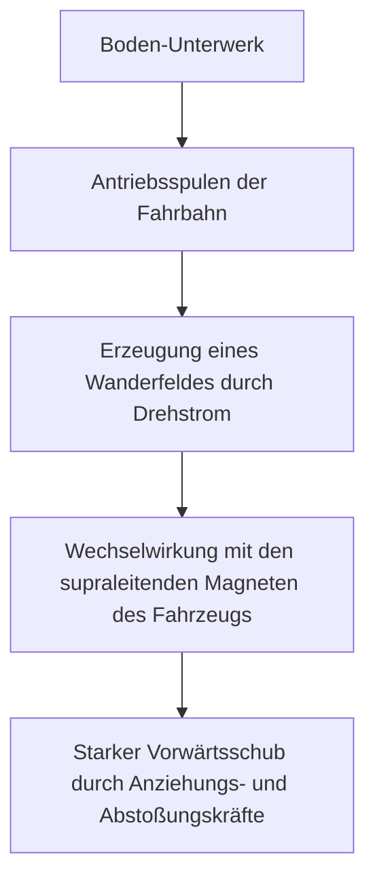
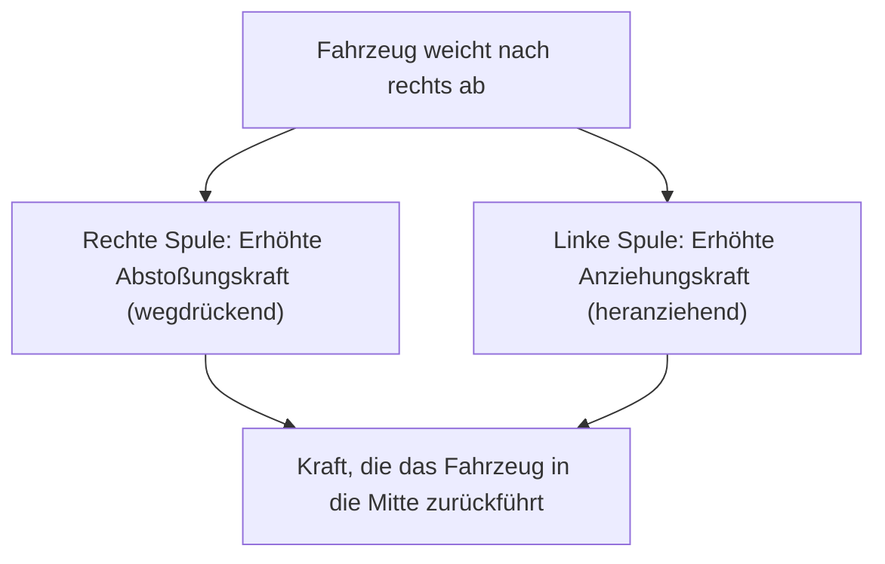

## Einführung: In eine Welt mit 500 km/h

Die Magnetschwebebahn (Maglev) ist ein Verkehrssystem der nächsten Generation, das sich grundlegend von herkömmlichen Eisenbahntechnologien unterscheidet, die auf der Reibung zwischen Rad und Schiene beruhen. In Japan ist sie als „Supraleitender Maglev“ (SCMaglev) bekannt und rast mit der unglaublichen Höchstgeschwindigkeit von über 500 km/h über den Boden. Diese Geschwindigkeit lässt sich vielleicht treffender als „Tieffliegen“ statt als „Fahren“ beschreiben.

In diesem Artikel werden wir die Physik und den technischen Mechanismus hinter diesem innovativen Fahrzeug so tief und detailliert wie möglich erklären: Wie es abhebt und wie es sich mit rasanter Geschwindigkeit fortbewegt.

## Supraleitung und Meißner-Effekt: Die Quelle der magischen Magnetkraft

Das Herzstück der Magnetschwebebahn ist der „Supraleitende Magnet“ (Superconducting Magnet). Supraleitung ist ein Phänomen, bei dem der elektrische Widerstand bestimmter Metalle und Legierungen vollständig auf Null sinkt, wenn sie auf extrem niedrige Temperaturen abgekühlt werden (z. B. auf minus 269 Grad Celsius unter Verwendung von flüssigem Helium).

Dass der elektrische Widerstand Null wird, bedeutet, dass einmal eingeleiteter Strom für immer als „Dauerstrom“ (Permanentstrom) fließt, ohne dass von außen Energie zugeführt werden muss. Dadurch lässt sich ein Magnetfeld erzeugen, das unvergleichlich stärker ist als das herkömmlicher Elektromagnete, und zwar ohne Energieverluste durch Joulesche Wärme.

Eine weitere wichtige Eigenschaft des supraleitenden Zustands ist der „Meißner-Effekt“ (Meissner effect). Dies ist ein Phänomen, bei dem magnetische Feldlinien vollständig aus dem Inneren eines Supraleiters verdrängt werden, wodurch der Supraleiter eine starke Abstoßungskraft gegen Magnete erzeugt. Für das Schweben von Magnetschwebebahnen gibt es Systeme, die den Meißner-Effekt selbst nutzen (wie z.B. den Flux-Pinning-Effekt), und Systeme, die die induzierte Abstoßungskraft zwischen starken supraleitenden Elektromagneten und Bodenspulen nutzen (wie das japanische SCMaglev-System). Beim japanischen System spielen supraleitende Magnete mit ihrer überwältigenden magnetischen Flussdichte eine äußerst wichtige Rolle beim Schweben, Führen und Antreiben des Fahrzeugs.

## Antriebsmechanismus: Linear-Synchronmotor (LSM)

Die Art und Weise, wie sich die Magnetschwebebahn vorwärts bewegt, leitet sich von dem Namen „Linearmotor“ ab. Während herkömmliche Motoren eine Drehbewegung erzeugen, ist ein Linearmotor wie ein der Länge nach aufgeschnittener und flach abgewickelter Motor aufgebaut, der direkt eine geradlinige Bewegung (Schub) erzeugt.

Beim supraleitenden Maglev wird das System des „Linear-Synchronmotors“ (LSM) verwendet.

An den Seitenwänden der Fahrbahn (Guideway) sind „Antriebsspulen“ aneinandergereiht. Wenn Drehstrom aus Unterwerken am Boden durch diese Spulen geleitet wird, entsteht ein „Wanderfeld“, in dem sich Nord- und Südpole kontinuierlich bewegen.

Andererseits ist das Fahrzeug mit starken supraleitenden Magneten ausgestattet (die immer konstante Nord- und Südpole haben). Der Nordpol des Fahrzeugs wird vom Südpol des wandernden Magnetfeldes am Boden angezogen und gleichzeitig vom vorderen Nordpol abgestoßen. Durch die Steuerung der Bewegungsgeschwindigkeit des Magnetfeldes am Boden wird das Fahrzeug synchron gezogen, als würde es auf der Welle dieses Magnetfeldes reiten, wodurch es Schubkraft erhält und sich vorwärts bewegt.

Der größte Vorteil dieses Systems besteht darin, dass sich der dem „Stator“ (feststehenden Teil) des Motors entsprechende Teil am Boden befindet und das Fahrzeug nur starke Magnete hat, die dem „Rotor“ (sich drehenden Teil) entsprechen. Dies ermöglicht eine extreme Gewichtsreduzierung des Fahrzeugs, was die Energieeffizienz und Beschleunigungsleistung bei hohen Geschwindigkeiten drastisch verbessert.

## Schweben und Führen: Induktionsabstoßung und die "Achter-Spule"

Damit eine Magnetschwebebahn mit 500 km/h fahren kann, müssen die Räder, die eine Hauptursache für Reibung sind, angehoben werden. Der japanische SCMaglev nutzt die „Elektrodynamische Schwebetechnik“ (EDS), die auf den Gesetzen der elektromagnetischen Induktion (Faradaysches Gesetz und Lenzsche Regel) basiert.

An den Seitenwänden der Fahrbahn sind neben den Antriebsspulen spezielle „Schweb- und Führspulen“ installiert, die eine einzigartige „Achter-Form“ (eine Figur-8) haben. Bei niedrigen Geschwindigkeiten fährt das Fahrzeug auf Gummireifen, aber wenn die Geschwindigkeit steigt, rasen die supraleitenden Magnete des Fahrzeugs mit hoher Geschwindigkeit an diesen Achter-Spulen vorbei.

Wenn sich der Magnet der Spule nähert und sie passiert, ändert sich der magnetische Fluss durch die Spule schnell. Durch elektromagnetische Induktion fließt ein Induktionsstrom in der Spule in eine Richtung, die dieser Änderung des magnetischen Flusses entgegenwirkt (Lenzsche Regel). Dieser Induktionsstrom erzeugt ein Magnetfeld, das sich von dem supraleitenden Magneten des Fahrzeugs abstößt, wodurch eine „Schwebekraft“ (Auftrieb) entsteht. Wenn die Geschwindigkeit etwa 150 km/h erreicht, übersteigt diese Abstoßungskraft das Gewicht des Fahrzeugs, und es schwebt mit einem Spalt von etwa 10 cm vollständig.

### Warum das Fahrzeug nicht mit der Wand der Fahrbahn kollidiert (Führungsprinzip)

Es gibt einen wichtigen Grund, warum die Schweb- und Führspulen die Form einer „8“ haben. Sie dienen dazu, eine „Führungskraft“ zu erzeugen, die das Fahrzeug immer in der Mitte der Fahrbahn hält.

Bei der Achter-Spule sind die obere und die untere Schleife überkreuzt miteinander verbunden. Wenn das Fahrzeug genau in der Mitte der Fahrbahn fährt (die ideale Position vertikal und horizontal), ist die Menge des magnetischen Flusses, der durch den oberen und unteren Teil der Achter-Spule geht, gleich, und die Induktionsströme heben sich auf und werden Null (Nullfluss-Zustand).

Wenn das Fahrzeug jedoch nach links oder rechts abweicht, ändert sich der Abstand zu den Spulen an den linken und rechten Seitenwänden, und das Gleichgewicht der Induktionsströme wird gestört. An der Spule auf der Seite, der sich das Fahrzeug nähert, wirkt eine Abstoßungskraft (wegdrückend), und an der Spule auf der Seite, von der es sich entfernt, wirkt eine Anziehungskraft (heranziehend). Durch diese starke Rückstellkraft kollidiert die Magnetschwebebahn niemals mit den Seitenwänden und kann stets stabil in der Mitte der Fahrbahn „fliegen“.

## Die Vorteile von „Null Reibung“ durch das Fehlen von Rädern

Dass die Magnetschwebebahn weder Räder noch Schienen hat, bringt viele innovative Vorteile mit sich, die über eine bloße Geschwindigkeitssteigerung hinausgehen.

1.  **Überwältigende Hochgeschwindigkeitsleistung**: Herkömmliche Züge sind beim Beschleunigen und Bremsen auf die Adhäsionskraft (Reibung) zwischen Rädern und Schienen angewiesen. Dies wird als „Adhäsionsgrenze“ bezeichnet, und man geht davon aus, dass die physikalische Grenze bei etwa 300 bis 350 km/h liegt. Da die Magnetschwebebahn von dieser Einschränkung völlig befreit ist, kann sie problemlos Geschwindigkeitsbereiche von über 500 km/h erreichen.
2.  **Fahrkomfort und Reduzierung von Lärm/Vibrationen**: Da es keinen Kontakt mit Schienen gibt, entstehen keine physikalischen Vibrationen beim Fahren und keine Rollgeräusche der Räder (allerdings gibt es bei hohen Geschwindigkeiten Luftwiderstand und Windgeräusche). Es gibt auch kein Schütteln durch winzige Unebenheiten der Schienen, was ein sanftes Fahrgefühl wie in einem Flugzeug ermöglicht.
3.  **Fähigkeit, steile Steigungen zu bewältigen**: Da die Antriebskraft nicht auf Reibung beruht, ist die Steigfähigkeit extrem hoch, und es sind Streckenführungen mit steilen Steigungen möglich, die für herkömmliche Bahnen undenkbar wären. Dadurch lassen sich beispielsweise Tunnelstrecken realisieren, die geradewegs durch Bergregionen führen.
4.  **Dramatische Reduzierung der Wartung**: Verschleißteile wie Schienen, Räder, Stromabnehmer und Oberleitungen gibt es nicht. Da kein mechanischer Verschleiß auftritt, verringert sich die Häufigkeit des Teileaustauschs sowie der Inspektions- und Wartungsarbeiten an der Infrastruktur erheblich, was Vorteile bei den langfristigen Betriebskosten bietet.

## Technische Hürden für den praktischen Einsatz und Herausforderungen für die Zukunft

Trotz allem gibt es noch viele technische und wirtschaftliche Hürden zu überwinden, bevor die Magnetschwebebahn flächendeckend praktisch eingesetzt werden kann.

*   **Aufrechterhaltung der extremen Tiefkühlung**: Bei der Verwendung von supraleitenden Materialien wie Niob-Titan-Legierungen müssen diese kontinuierlich auf nahe minus 269 Grad gekühlt werden, weshalb die Fahrzeuge mit teurem flüssigen Helium und hochentwickelten Kältemaschinen ausgestattet sein müssen. In den letzten Jahren hat auch die Forschung zur Anwendung von Hochtemperatur-Supraleitern, die bereits bei flüssiger Stickstofftemperatur (minus 196 Grad) supraleitend werden, Fortschritte gemacht, aber die Einführung in praktische, groß angelegte Systeme ist noch im Gange.
*   **Enorme Kosten für den Bau der Infrastruktur**: Im Gegensatz zum geringen Gewicht der Fahrzeuge müssen auf der Bodenseite unzählige Antriebs- sowie Schweb- und Führspulen präzise entlang der gesamten Strecke installiert werden. Darüber hinaus sind in kurzen Abständen Unterwerke zur Steuerung der starken Magnetfelder erforderlich. Es wird geschätzt, dass die anfänglichen Baukosten für die Infrastruktur ein Vielfaches derer herkömmlicher Hochgeschwindigkeitszüge betragen.
*   **Energieverbrauch und Luftwiderstand**: Im extrem hohen Geschwindigkeitsbereich von 500 km/h nimmt der Luftwiderstand proportional zum Quadrat der Geschwindigkeit drasant zu. Selbst bei Null Reibung ist der Energieverbrauch, um die Luftwand zu durchbrechen, enorm, weshalb die Reduzierung der Umweltbelastung und die Verbesserung der Energieeffizienz große Herausforderungen darstellen.
*   **Maßnahmen gegen magnetische Streufelder**: Wegen der Verwendung starker supraleitender Magnete ist eine Technologie zur strikten Abschirmung von magnetischen Streufeldern (Leckagen des Magnetfelds) in den Fahrgastraum und die Umgebung unerlässlich. Um die Sicherheit der Fahrgäste zu gewährleisten und Auswirkungen auf medizinische Geräte zu verhindern, sind die Fahrzeuge mit starken magnetischen Abschirmungen versehen.

## Fazit: Die ultimative Form der Mobilität der nächsten Generation

Die Magnetschwebebahn ist ein Meisterwerk menschlicher Ingenieurskunst, das ein quantenmechanisches Phänomen – die Supraleitung – auf makroskopische Verkehrsinfrastrukturen anwendet. Ihr einfacher, aber ultimativer Mechanismus des „Schwebens und Fahrens durch Magnetkraft“ durchbricht die Grenzen der physikalischen Reibung und bietet uns eine völlig neue Dimension der Fortbewegung.

Die Hürden für die praktische Umsetzung, wie Baukosten und Energiefragen, sind keineswegs gering. Dennoch haben ihre überwältigende Geschwindigkeit und ihr Potenzial die Kraft, die Art und Weise, wie Länder und Städte miteinander verbunden sind, grundlegend zu verändern. Mit der Weiterentwicklung der Supraleitungstechnologie macht die Magnetschwebebahn einen sicheren Schritt vom bloßen Traumfahrzeug zum alltäglichen Transportmittel der Zukunft.
