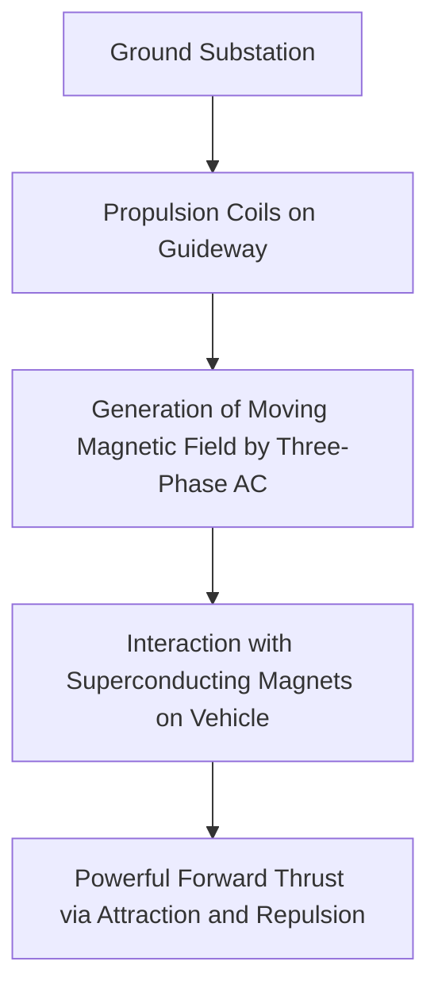
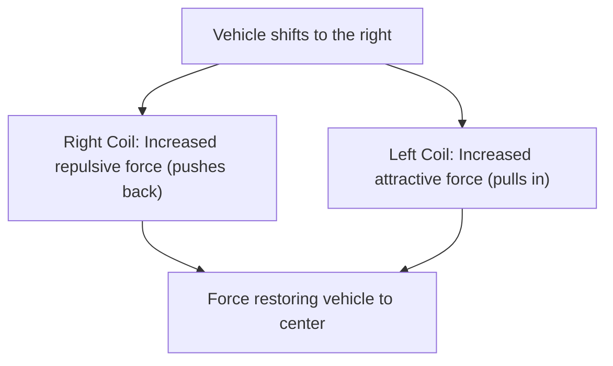

## Introduction: Into a 500 km/h World

The maglev (magnetic levitation) train is a next-generation transportation system that fundamentally differs from conventional railway technology, which relies on friction between wheels and rails. Known in Japan as the "Superconducting Maglev," it races across the ground at astonishing speeds exceeding 500 km/h. At this speed, it might be more accurate to say it is "flying at low altitude" rather than "running."

In this article, we will delve as deeply and in as much detail as possible into the mechanisms behind how this innovative vehicle levitates and travels at breakneck speeds, exploring the pinnacle of physics and engineering that makes it possible.

## Superconductivity and the Meissner Effect: The Source of Magical Magnetic Force

At the heart of the maglev train is the "Superconducting Magnet." Superconductivity is a phenomenon where the electrical resistance of certain metals or alloys drops to absolute zero when cooled to extremely low temperatures (for example, minus 269 degrees Celsius using liquid helium).

Zero electrical resistance means that once a current is applied, it enters a "persistent current" state, where the current continues to flow indefinitely without external energy supply. This makes it possible to generate magnetic fields that are incomparably stronger than conventional electromagnets, without any energy loss due to Joule heating.

Furthermore, another crucial property of the superconducting state is the "Meissner effect." This is a phenomenon where magnetic field lines are completely expelled from within the superconductor, causing it to generate a powerful repulsive force against magnets. For the levitation of maglev trains, there are methods that directly utilize this Meissner effect (such as the pinning effect) and methods that utilize the inductive repulsive force generated between powerful superconducting electromagnets and ground coils (the Japanese Superconducting Maglev system). In the Japanese system, superconducting magnets with overwhelming magnetic flux density play a vital role in all aspects: levitation, guidance, and propulsion of the vehicle.

## Propulsion Mechanism: Linear Synchronous Motor (LSM)

The mechanism by which the maglev train moves forward gives it its name, "linear motor." While conventional motors produce rotational motion, a linear motor has a structure akin to a motor that has been cut open and rolled out flat, directly generating linear motion (thrust).

The Superconducting Maglev utilizes a system known as the "Linear Synchronous Motor (LSM)."

Along the sidewalls of the ground track (guideway), "propulsion coils" are lined up. When a three-phase alternating current is supplied to these coils from a ground substation, a "moving magnetic field" is generated, where the North and South poles continuously shift.

Meanwhile, the vehicle is equipped with powerful superconducting magnets (maintaining constant North and South poles). The North pole of the vehicle is attracted to the South pole of the moving magnetic field on the ground, while simultaneously being repelled by the North pole ahead of it. By controlling the speed of the moving magnetic field on the ground, the vehicle is synchronously pulled along, riding the wave of that magnetic field to gain thrust and propel forward.

The greatest advantage of this system is that the part corresponding to the "stator" of a motor is on the ground, and the vehicle only carries the powerful magnets corresponding to the "rotor." This allows the vehicle to be made extremely lightweight, dramatically improving energy efficiency and acceleration performance during high-speed travel.

## Levitation and Guidance: Inductive Repulsion and the "Figure-8 Coil"

For a maglev train to travel at 500 km/h, it must lift its wheels, which are a major source of friction. The Japanese Superconducting Maglev employs the "Electrodynamic Suspension (EDS)" system, which utilizes the laws of electromagnetic induction (Faraday's law and Lenz's law).

In addition to the propulsion coils, uniquely shaped "figure-8" coils, called "levitation and guidance coils," are installed on the sidewalls of the guideway. While the vehicle travels on rubber tires at low speeds, as the speed increases, the superconducting magnets on the vehicle pass by the figure-8 coils at tremendous speeds.

As the magnet approaches and passes the coil, the magnetic flux penetrating the coil changes rapidly. Due to electromagnetic induction, an induced current flows in the coil in a direction that opposes this change in magnetic flux (Lenz's law). This induced current creates a magnetic field that repels the superconducting magnets on the vehicle, generating "levitation force." When the speed reaches about 150 km/h, this repulsive force exceeds the weight of the vehicle, lifting it entirely with a gap of about 10 cm.

### Why It Doesn't Collide with the Guideway Walls (Guidance Principle)

There is a crucial reason why the levitation and guidance coils are shaped like a "figure-8." It is to generate a "guidance force" that constantly keeps the vehicle in the center of the guideway.

The figure-8 coil has its upper and lower loops crossed and wired together. When the vehicle is running exactly in the middle of the guideway (the ideal vertical and horizontal position), the amount of magnetic flux penetrating the upper and lower parts of the figure-8 coil is equal, and the induced currents cancel each other out, becoming zero (null flux state).

However, if the vehicle shifts to either the left or the right, the distance to the coils on the left and right sidewalls changes, disrupting the balance of the induced currents. A repulsive force (pushing back) acts on the closer coil, while an attractive force (pulling in) acts on the further coil. Thanks to this powerful restoring force, the maglev train can consistently and stably "fly" in the center of the track without ever colliding with the sidewalls.

## The Advantages of "Zero Friction" Without Wheels

The fact that maglev trains have no wheels or rails brings many innovative advantages beyond simply speeding up.

1.  **Overwhelming High-Speed Performance**: Conventional railways rely on the adhesive force (friction) between the wheels and rails to accelerate and decelerate. This is called the "adhesion limit," and speeds around 300 to 350 km/h are considered the physical limit. Since maglev trains are completely freed from this constraint, they can easily reach speeds exceeding 500 km/h.
2.  **Improved Ride Comfort and Reduced Noise/Vibration**: Because there is no contact with rails, physical vibrations and rolling noise from wheels do not occur during travel (though aerodynamic drag and wind noise from high-speed travel still exist). Additionally, there is no swaying caused by minor irregularities in the rails, achieving a smooth ride akin to that of an airplane.
3.  **Capability to Handle Steep Gradients**: With a propulsion force that does not rely on friction, its climbing ability is extremely high, allowing for steep route designs that are impossible for conventional railways. This makes it possible to construct tunnel routes that cut straight through mountainous areas.
4.  **Drastic Reduction in Maintenance**: There are no wear-and-tear parts like rails, wheels, pantographs, or overhead lines. Without mechanical wear, the frequency of part replacements and infrastructure maintenance is significantly reduced, offering long-term operational cost benefits.

## Technical Barriers to Practical Use and Future Challenges

However, there are still many technical and economic barriers to overcome for the practical application and widespread adoption of maglev trains.

*   **Maintaining Ultra-Low Temperature Cooling**: When using superconducting materials like niobium-titanium alloys, they must be constantly cooled to around minus 269 degrees Celsius, requiring the vehicle to carry expensive liquid helium and sophisticated cryocoolers. In recent years, research has progressed on the application of high-temperature superconducting materials that reach a superconducting state at liquid nitrogen temperatures (minus 196 degrees Celsius), but their introduction into practical, large-scale systems is still underway.
*   **Enormous Infrastructure Construction Costs**: In contrast to the lightweight vehicles, countless propulsion coils and levitation/guidance coils must be precisely laid along the entire length of the ground guideway. Furthermore, substation equipment to control the powerful magnetic fields is needed at short intervals, and the initial infrastructure construction cost is said to be several times that of conventional high-speed rail.
*   **Energy Consumption and Aerodynamic Drag**: In the ultra-high-speed domain of 500 km/h, aerodynamic drag increases rapidly in proportion to the square of the speed. Despite having zero friction, the energy consumption required to slice through the wall of air is enormous, making the reduction of environmental impact and the improvement of energy efficiency a major challenge.
*   **Measures Against Magnetic Field Leakage**: Because powerful superconducting magnets are used, technology to strictly shield magnetic field leakage into the interior of the train and the surrounding environment is indispensable. To ensure passenger safety and prevent interference with medical devices, the vehicles are equipped with rigorous magnetic shielding.

## Conclusion: The Ultimate Form of Next-Generation Mobility

The maglev train is a monumental achievement of human engineering, applying the quantum mechanical phenomenon of superconductivity to macroscopic transportation infrastructure. Its simple yet ultimate mechanism of "floating and moving by magnetic force" breaks through the limits of physical friction, presenting us with an entirely new dimension of travel.

The hurdles to practical application, such as construction costs and energy challenges, are by no means low. However, its overwhelming speed and potential have the power to fundamentally alter how countries and cities are connected. With the evolution of superconducting technology, the maglev train is steadily taking steps from being just a dream vehicle to becoming a daily mode of transportation in the future.
