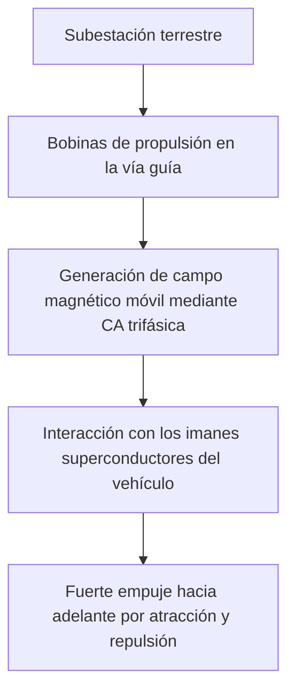
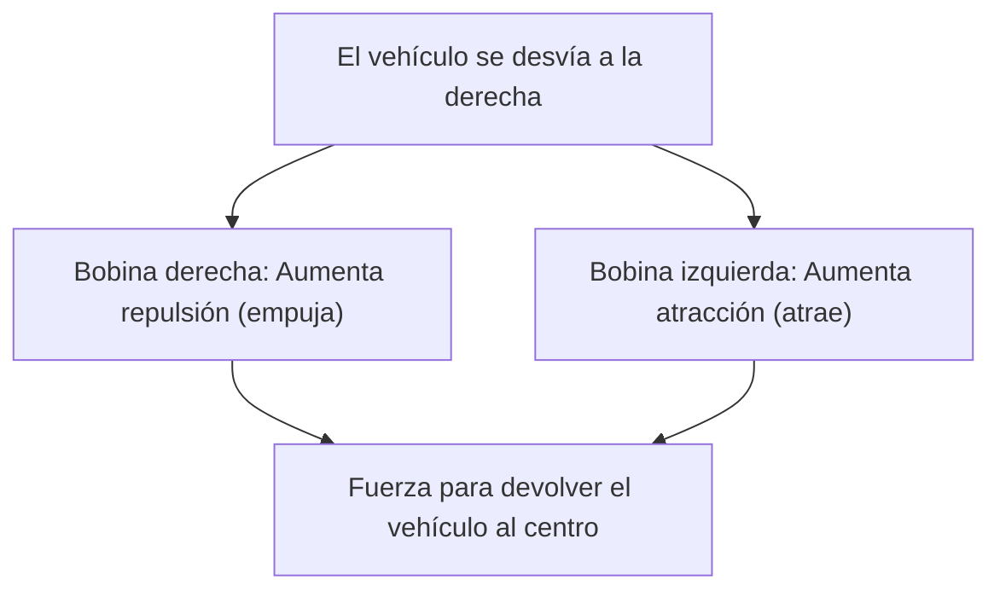

## Introducción: hacia un mundo a 500 km/h

El tren maglev (tren de levitación magnética) es un sistema de transporte de próxima generación que difiere radicalmente de la tecnología ferroviaria tradicional que depende de la fricción entre ruedas y rieles. Conocido en Japón como "Maglev superconductor" (Chōdendō Linear), se desplaza sobre el suelo a la asombrosa velocidad máxima de más de 500 km/h. Con esta velocidad, tal vez sea más exacto decir que "vuela a baja altitud" en lugar de que "corre".

En este artículo, explicaremos lo más profunda y detalladamente posible el mecanismo que reúne lo mejor de la física y la ingeniería detrás de cómo este innovador vehículo levita y avanza a velocidades vertiginosas.

## Superconductividad y efecto Meissner: la fuente de una fuerza magnética casi mágica

En el corazón del tren maglev se encuentra un "imán superconductor" (Superconducting Magnet). La superconductividad es un fenómeno en el que la resistencia eléctrica de ciertos metales o aleaciones se vuelve completamente nula al enfriarse a temperaturas criogénicas (por ejemplo, a -269 grados Celsius usando helio líquido).

Que la resistencia eléctrica sea cero significa que, una vez que la corriente fluye, entra en un estado de "corriente persistente" en el que la corriente continúa fluyendo permanentemente sin necesidad de energía externa. Esto permite generar campos magnéticos increíblemente más fuertes que los electroimanes convencionales, sin ninguna pérdida de energía por calor de Joule.

Además, otra propiedad importante del estado superconductor es el "efecto Meissner". Este es un fenómeno en el que las líneas de campo magnético son expulsadas completamente del interior del superconductor, lo que hace que el superconductor genere una fuerte fuerza de repulsión hacia un imán. Para la levitación del tren maglev, existen sistemas que utilizan el efecto Meissner en sí mismo (como el efecto de anclaje) y sistemas que aprovechan la fuerza de repulsión inductiva generada entre potentes electroimanes superconductores y las bobinas en tierra (el sistema maglev superconductor de Japón). En el sistema japonés, los imanes superconductores con una densidad de flujo magnético abrumadora desempeñan un papel crucial en todas las fases: levitación, guía y propulsión del vehículo.

## Mecanismo de propulsión: motor lineal síncrono (LSM)

El mecanismo por el cual el tren maglev avanza proviene de su nombre, "motor lineal". Mientras que los motores convencionales producen movimiento rotativo, un motor lineal tiene una estructura similar a la de un motor cortado y desplegado en línea recta, generando movimiento lineal directo (empuje).

En el maglev superconductor se utiliza un sistema llamado "motor lineal síncrono" (Linear Synchronous Motor: LSM).

En las paredes laterales del lado de tierra (la vía guía), hay "bobinas de propulsión" alineadas continuamente. Cuando se hace pasar corriente alterna trifásica desde las subestaciones terrestres a estas bobinas, se genera un "campo magnético móvil" donde los polos norte y sur se desplazan continuamente.

Por otro lado, en el lado del vehículo, se instalan potentes imanes superconductores (con polos norte y sur siempre constantes). El polo norte del vehículo es atraído por el polo sur del campo magnético móvil en tierra y, al mismo tiempo, es repelido por el polo norte situado delante. Al controlar la velocidad de movimiento del campo magnético en tierra, el vehículo es arrastrado sincrónicamente como si montara la ola de ese campo magnético, ganando empuje para avanzar.

La mayor ventaja de este sistema es que la parte correspondiente al "estator" del motor se encuentra en tierra, y el vehículo solo cuenta con potentes imanes equivalentes al "rotor". Esto permite reducir drásticamente el peso del vehículo, mejorando de manera exponencial la eficiencia energética y la capacidad de aceleración a altas velocidades.

## Levitación y guía: repulsión inductiva y "bobinas en forma de 8"

Para que el tren maglev viaje a 500 km/h, debe elevar sus ruedas, que son la principal causa de fricción. El maglev superconductor japonés emplea el "sistema de levitación electrodinámica (EDS: Electrodynamic Suspension)", que utiliza las leyes de la inducción electromagnética (ley de Faraday y ley de Lenz).

En las paredes laterales de la vía guía se instalan unas bobinas con una distintiva "forma de 8", llamadas "bobinas de levitación y guía", separadas de las bobinas de propulsión. Cuando el vehículo va a baja velocidad, se desplaza sobre neumáticos de goma, pero a medida que aumenta la velocidad, los imanes superconductores del vehículo pasan rápidamente junto a las bobinas en forma de 8.

Al acercarse y pasar el imán por la bobina, el flujo magnético que atraviesa la bobina cambia bruscamente. Por inducción electromagnética, fluye en la bobina una corriente inducida en dirección opuesta al cambio de flujo magnético (ley de Lenz). Esta corriente inducida crea un campo magnético que, al repelerse con el imán superconductor del vehículo, genera una "fuerza de levitación". Cuando la velocidad alcanza aproximadamente los 150 km/h, esta fuerza de repulsión supera el peso del vehículo, elevándolo por completo dejando una separación de unos 10 cm.

### Por qué no choca contra las paredes de la vía guía (principio de guía)

Hay una razón importante por la que las bobinas de levitación y guía tienen "forma de 8". Sirve para generar una "fuerza de guía (fuerza de conducción)" que mantiene constantemente al vehículo en el centro de la vía guía.

Las bobinas en forma de 8 tienen su bucle superior e inferior cruzados y conectados. Cuando el vehículo circula por el centro exacto de la vía (la posición ideal arriba, abajo, izquierda y derecha), la cantidad de flujo magnético que atraviesa las partes superior e inferior de la bobina en forma de 8 es igual, por lo que la corriente inducida se anula y es cero (estado de flujo nulo).

Sin embargo, si el vehículo se desplaza hacia la izquierda o la derecha, la distancia a las bobinas de las paredes laterales cambiará, alterando el equilibrio de la corriente inducida. La bobina del lado al que se acerca ejerce una fuerza de repulsión (lo empuja), mientras que la del lado del que se aleja ejerce una fuerza de atracción (lo atrae). Gracias a esta potente fuerza restauradora, el tren maglev nunca choca contra las paredes laterales y puede "volar" de forma estable y constante en el centro de la pista.

## Las ventajas de "fricción cero" al no tener ruedas

El hecho de que el tren maglev no tenga ruedas ni rieles aporta muchas ventajas innovadoras más allá del simple aumento de velocidad.

1.  **Rendimiento excepcional de alta velocidad**: En los trenes convencionales, la aceleración y desaceleración dependen de la fuerza de adherencia (fricción) entre las ruedas y los rieles. A esto se le llama "límite de adherencia", siendo el límite físico alrededor de los 300-350 km/h. Como el tren maglev está completamente liberado de esta restricción, puede alcanzar fácilmente el rango de los 500 km/h o más.
2.  **Mejora en la comodidad de marcha y reducción de ruido y vibración**: Al no haber contacto con los rieles, no se producen vibraciones físicas durante la marcha ni ruidos de rodadura de las ruedas (aunque sí existen la resistencia aerodinámica y el ruido del viento debidos a la alta velocidad). Además, tampoco hay sacudidas causadas por pequeñas irregularidades de las vías, logrando un viaje tan suave como el de un avión.
3.  **Capacidad de adaptación a pendientes pronunciadas**: Dado que su fuerza propulsora no depende de la fricción, su capacidad de ascenso es extremadamente alta, lo que hace posible diseñar rutas con pendientes pronunciadas que serían imposibles para los ferrocarriles convencionales. Esto permite trazar rutas que atraviesen túneles en línea recta por regiones montañosas.
4.  **Reducción drástica del mantenimiento**: No hay piezas sujetas a desgaste, como rieles, ruedas, pantógrafos o catenarias. Al no existir desgaste mecánico, la frecuencia de reemplazo de piezas y el trabajo de mantenimiento e inspección de la infraestructura se reducen considerablemente, lo que ofrece grandes ventajas en los costos operativos a largo plazo.

## Barreras técnicas para la comercialización y retos para el futuro

Sin embargo, todavía existen muchas barreras técnicas y económicas que deben superarse para la aplicación práctica y la adopción generalizada de los trenes maglev.

*   **Mantenimiento de la refrigeración criogénica**: Cuando se utilizan materiales superconductores como la aleación de niobio-titanio, es necesario mantener una refrigeración constante cerca de los -269 grados Celsius, por lo que el vehículo debe estar equipado con helio líquido caro y refrigeradores sofisticados. En los últimos años, ha avanzado la investigación sobre la aplicación de materiales superconductores de alta temperatura que alcanzan la superconductividad a la temperatura del nitrógeno líquido (-196 grados Celsius), pero su implementación en sistemas prácticos a gran escala aún está en desarrollo.
*   **Enormes costes de construcción de infraestructura**: A pesar de la ligereza de los vehículos, la vía guía en el suelo requiere la instalación precisa de innumerables bobinas de propulsión y bobinas de levitación y guía a lo largo de toda la ruta. Además, se necesitan subestaciones eléctricas a intervalos cortos para controlar los potentes campos magnéticos; se dice que el coste inicial de construcción de infraestructura asciende a varias veces el de los trenes de alta velocidad convencionales.
*   **Consumo de energía y resistencia aerodinámica**: En el rango de velocidades ultrarrápidas de 500 km/h, la resistencia aerodinámica aumenta exponencialmente en proporción al cuadrado de la velocidad. Por mucho que la fricción sea nula, el consumo de energía para cortar el muro de aire y avanzar es enorme; reducir el impacto ambiental y mejorar la eficiencia energética es un reto importante.
*   **Medidas contra fugas del campo magnético**: Puesto que se utilizan potentes imanes superconductores, es indispensable contar con tecnología que blinde rigurosamente cualquier fuga del campo magnético (escape magnético) hacia el interior del tren o el entorno circundante. Para garantizar la seguridad de los pasajeros y evitar afectaciones en dispositivos médicos, el vehículo cuenta con un estricto blindaje magnético.

## Conclusión: la forma definitiva de la movilidad de próxima generación

El tren maglev es un hito monumental de la ingeniería humana que aplica el fenómeno de la mecánica cuántica de la superconductividad a infraestructuras de transporte macroscópicas. Su mecanismo supremo y sencillo de "flotar por magnetismo y avanzar por magnetismo" rompe los límites de la fricción física, presentándonos una dimensión de movilidad completamente nueva.

Los obstáculos hacia su implementación práctica, como los costos de construcción y los desafíos energéticos, no son en absoluto bajos. Sin embargo, su abrumadora velocidad y potencial tienen el poder de transformar radicalmente la forma en que se conectan los países y las ciudades. Con la evolución de la tecnología superconductora, el tren maglev está dando pasos firmes para dejar de ser solo un vehículo de ensueño y convertirse en el medio de transporte cotidiano del futuro.
