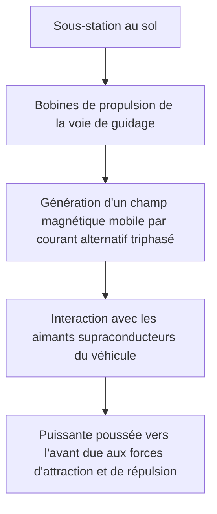
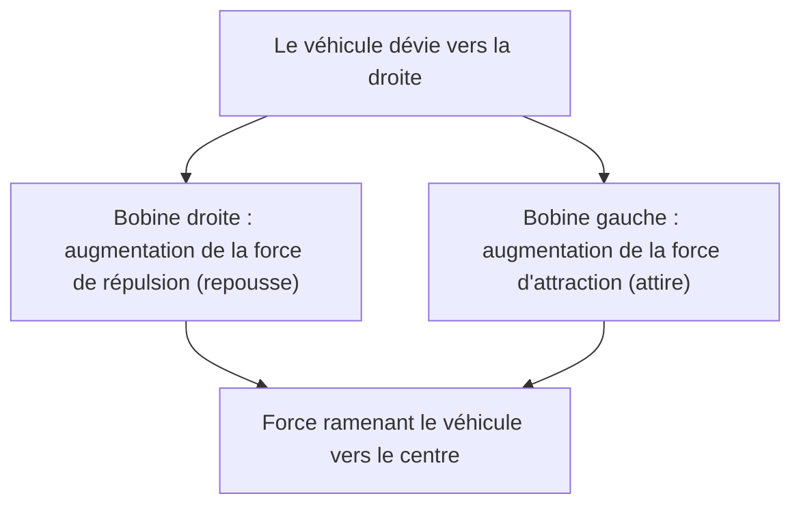

## Introduction : Vers un monde à 500 km/h

Le train à sustentation magnétique (Maglev, ou Linear Motor Car au Japon) est un système de transport de nouvelle génération qui diffère fondamentalement de la technologie ferroviaire traditionnelle reposant sur la friction entre les roues et les rails. Connu au Japon sous le nom de "Maglev supraconducteur" (Superconducting Maglev), il traverse les terres à des vitesses stupéfiantes dépassant les 500 km/h. À une telle vitesse, il serait plus exact de dire qu'il "vole à basse altitude" plutôt qu'il ne "roule".

Cet article explique aussi profondément et en détail que possible les mécanismes réunissant le meilleur de la physique et de l'ingénierie qui permettent à ce véhicule révolutionnaire de léviter et de se propulser à des vitesses vertigineuses.

## Supraconductivité et effet Meissner : la source magique de la force magnétique

Au cœur du Maglev se trouve un "aimant supraconducteur" (Superconducting Magnet). La supraconductivité est un phénomène par lequel la résistance électrique de certains métaux ou alliages devient absolument nulle lorsqu'ils sont refroidis à des températures cryogéniques (par exemple, à -269 degrés Celsius en utilisant de l'hélium liquide).

Une résistance électrique nulle signifie qu'une fois qu'un courant est appliqué, il entre dans un état de "courant permanent" où il continue de circuler indéfiniment sans nécessiter d'apport d'énergie externe. Cela permet de générer un champ magnétique incomparablement plus puissant que les électroaimants conventionnels, et ce, sans aucune perte d'énergie due à la chaleur de Joule.

De plus, l'une des autres propriétés essentielles de l'état supraconducteur est l'"effet Meissner". Il s'agit d'un phénomène par lequel les lignes de champ magnétique sont complètement expulsées de l'intérieur du matériau supraconducteur, ce qui amène ce dernier à générer une puissante force de répulsion par rapport à un aimant. Pour la lévitation du Maglev, il existe des systèmes utilisant cet effet Meissner lui-même (comme l'effet d'ancrage) et des systèmes utilisant la force de répulsion inductive générée entre de puissants électroaimants supraconducteurs et des bobines au sol (le système Maglev supraconducteur japonais). Dans le système japonais, les aimants supraconducteurs, dotés d'une densité de flux magnétique écrasante, jouent un rôle extrêmement crucial dans la lévitation, le guidage et la propulsion du véhicule.

## Mécanisme de propulsion : Moteur Linéaire Synchrone (LSM)

Le mécanisme par lequel le Maglev avance tire son nom du "moteur linéaire" (Linear Motor). Alors qu'un moteur conventionnel produit un mouvement de rotation, un moteur linéaire a une structure comparable à celle d'un moteur que l'on aurait fendu et déroulé en ligne droite, produisant ainsi un mouvement linéaire direct (une poussée).

Le Maglev supraconducteur utilise un système appelé "Moteur Linéaire Synchrone" (Linear Synchronous Motor : LSM).

Sur les parois latérales du côté sol (la voie de guidage ou guideway), des "bobines de propulsion" sont alignées. Lorsqu'un courant alternatif triphasé provenant d'une sous-station au sol traverse ces bobines, un "champ magnétique mobile" est généré, avec des pôles Nord et Sud se déplaçant continuellement.

D'autre part, le véhicule est équipé de puissants aimants supraconducteurs (ayant toujours des pôles Nord et Sud fixes). Le pôle Nord du véhicule est attiré par le pôle Sud du champ magnétique mobile au sol, et simultanément repoussé par le pôle Nord devant lui. En contrôlant la vitesse de déplacement du champ magnétique au sol, le véhicule est tiré de manière synchrone comme s'il surfait sur l'onde de ce champ, obtenant ainsi la poussée nécessaire pour avancer.

Le plus grand avantage de ce système est que la partie correspondant au "stator" (partie fixe) du moteur se trouve au sol, tandis que le véhicule ne possède que de puissants aimants correspondant au "rotor" (partie tournante). Cela permet d'alléger considérablement le véhicule, améliorant ainsi de manière spectaculaire l'efficacité énergétique et les performances d'accélération à grande vitesse.

## Lévitation et guidage : répulsion inductive et "bobines en 8"

Pour que le Maglev puisse rouler à 500 km/h, il doit soulever ses roues, qui sont une source majeure de friction. Le Maglev supraconducteur japonais utilise un "système de suspension électrodynamique" (EDS : Electrodynamic Suspension) basé sur les lois de l'induction électromagnétique (loi de Faraday et loi de Lenz).

Séparément des bobines de propulsion, des bobines uniques en "forme de 8", appelées "bobines de lévitation et de guidage", sont installées sur les parois latérales de la voie de guidage. À basse vitesse, le véhicule roule sur des pneus en caoutchouc ou similaires, mais au fur et à mesure que la vitesse augmente, les aimants supraconducteurs du véhicule passent à toute vitesse devant les bobines en forme de 8.

Lorsque l'aimant s'approche et traverse la bobine, le flux magnétique traversant la bobine change brusquement. Par induction électromagnétique, un courant induit circule dans la bobine dans une direction qui s'oppose à ce changement de flux magnétique (loi de Lenz). Ce courant induit crée un champ magnétique qui, en repoussant l'aimant supraconducteur du véhicule, génère une "force de lévitation". Lorsque la vitesse atteint environ 150 km/h, cette force de répulsion dépasse le poids du véhicule, qui lévite alors complètement, laissant un espace d'environ 10 cm.

### Pourquoi le train ne percute pas les parois de la voie (Principe de guidage)

Il y a une raison importante pour laquelle les bobines de lévitation et de guidage sont en "forme de 8". C'est pour générer une "force de guidage" (guidance force) qui maintient toujours le véhicule au centre de la voie.

Les bobines en forme de 8 sont câblées de manière à ce que la boucle supérieure et la boucle inférieure se croisent. Lorsque le véhicule roule exactement au milieu de la voie (la position idéale verticalement et horizontalement), la quantité de flux magnétique traversant les parties supérieure et inférieure de la bobine en 8 est égale, et les courants induits s'annulent pour devenir nuls (état de flux nul).

Cependant, si le véhicule dévie vers la gauche ou vers la droite, la distance avec les bobines des parois latérales change, rompant ainsi l'équilibre des courants induits. Une force de répulsion (force de repoussement) agit sur la bobine du côté dont le train s'est rapproché, et une force d'attraction (force de tirage) agit sur la bobine du côté dont il s'est éloigné. Grâce à cette puissante force de rappel, le Maglev ne percute jamais les parois latérales et peut toujours "voler" de manière stable au centre de la voie.

## Les avantages de l'absence de friction sans roues

Le fait que le Maglev ne possède ni roues ni rails apporte de nombreux avantages révolutionnaires allant bien au-delà de la simple augmentation de la vitesse.

1.  **Performances à très haute vitesse exceptionnelles** : Les chemins de fer traditionnels s'appuient sur l'adhérence (la friction) entre les roues et les rails pour accélérer et freiner. C'est ce qu'on appelle la "limite d'adhérence", et la limite physique se situe autour de 300 à 350 km/h. Le Maglev étant totalement affranchi de cette contrainte, il peut facilement atteindre des vitesses dépassant les 500 km/h.
2.  **Confort de conduite et réduction des bruits/vibrations** : Comme il n'y a pas de contact avec les rails, il n'y a pas de vibrations physiques ni de bruits de roulement des roues en mouvement (il existe cependant une résistance de l'air et des bruits aérodynamiques dus à la vitesse élevée). De plus, il n'y a pas de secousses causées par les infimes irrégularités des rails, offrant un confort de conduite fluide comparable à celui d'un avion.
3.  **Capacité à affronter les fortes pentes** : Étant donné que la force de propulsion ne dépend pas de la friction, la capacité à gravir des pentes est extrêmement élevée, permettant la conception de tracés avec de fortes pentes, ce qui est impossible pour les chemins de fer traditionnels. Cela rend possible des itinéraires en tunnel traversant directement les zones montagneuses.
4.  **Réduction drastique de la maintenance** : Il n'y a pas de pièces d'usure telles que les rails, les roues, les pantographes ou les caténaires. L'absence d'usure mécanique réduit considérablement la fréquence de remplacement des pièces et les travaux d'inspection et de maintenance des infrastructures, offrant des avantages en termes de coûts d'exploitation à long terme.

## Obstacles techniques à l'application pratique et défis futurs

Néanmoins, il existe encore de nombreux obstacles techniques et économiques à surmonter pour l'application pratique et la démocratisation du Maglev.

*   **Maintien du refroidissement cryogénique** : Lors de l'utilisation de matériaux supraconducteurs tels que l'alliage niobium-titane, il est nécessaire de les maintenir constamment refroidis à une température d'environ -269 degrés Celsius. Le véhicule doit être équipé d'hélium liquide coûteux et de réfrigérateurs sophistiqués. Ces dernières années, des recherches ont été menées sur l'application de matériaux supraconducteurs à haute température (atteignant l'état supraconducteur à la température de l'azote liquide, soit -196 degrés Celsius), mais leur introduction dans des systèmes pratiques à grande échelle est encore en développement.
*   **Coûts de construction d'infrastructures colossaux** : Contrairement à la légèreté du véhicule, d'innombrables bobines de propulsion et de lévitation/guidage doivent être posées avec précision sur toute la longueur de la voie de guidage au sol. De plus, des équipements de sous-station pour contrôler les puissants champs magnétiques sont nécessaires à des intervalles rapprochés. On estime que les coûts initiaux de construction de l'infrastructure atteignent plusieurs fois ceux des lignes à grande vitesse conventionnelles.
*   **Consommation d'énergie et résistance de l'air** : Dans la zone hypersonique des 500 km/h, la résistance de l'air augmente de manière exponentielle, proportionnellement au carré de la vitesse. Même s'il n'y a pas de friction physique, la consommation d'énergie nécessaire pour fendre le mur de l'air est énorme. Réduire l'impact environnemental et améliorer l'efficacité énergétique constituent des défis majeurs.
*   **Contre-mesures contre les fuites magnétiques** : En raison de l'utilisation de puissants aimants supraconducteurs, il est indispensable de disposer d'une technologie pour blinder strictement les fuites de champs magnétiques vers l'intérieur du véhicule et l'environnement environnant. Des blindages magnétiques rigoureux sont mis en place dans le véhicule pour protéger la sécurité des passagers et éviter toute interférence avec les équipements médicaux.

## Conclusion : La forme ultime de la mobilité de nouvelle génération

Le Maglev est un monument de l'ingénierie humaine, appliquant le phénomène quantique de la supraconductivité à une infrastructure de transport macroscopique. Son mécanisme simple mais ultime, "flotter et avancer grâce à la force magnétique", brise les limites de la friction physique et nous présente une dimension de déplacement totalement nouvelle.

Les obstacles à son application pratique, tels que les coûts de construction et les enjeux énergétiques, sont loin d'être minimes. Cependant, sa vitesse et son potentiel écrasants ont le pouvoir de changer fondamentalement la façon dont les pays et les villes sont connectés. Avec l'évolution de la technologie supraconductrice, le Maglev s'éloigne de son statut de simple véhicule de rêve pour devenir assurément un moyen de transport quotidien du futur.
