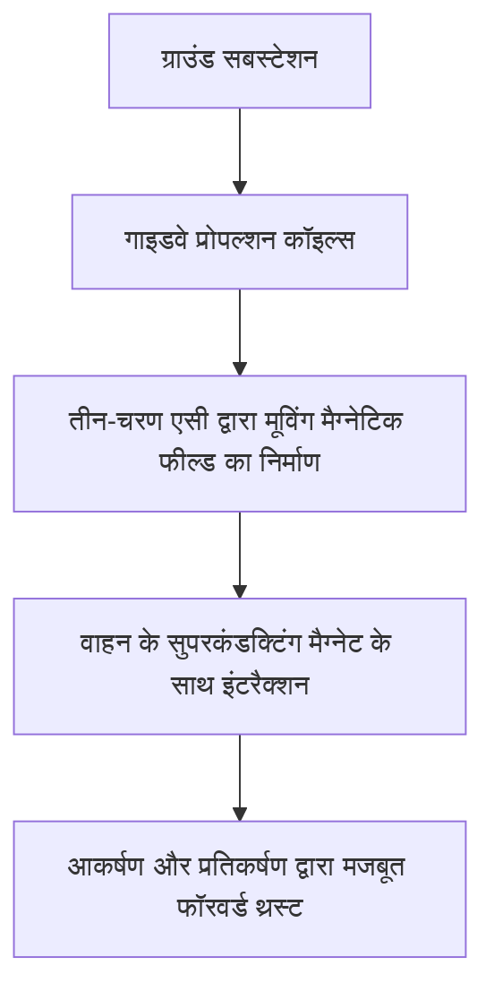
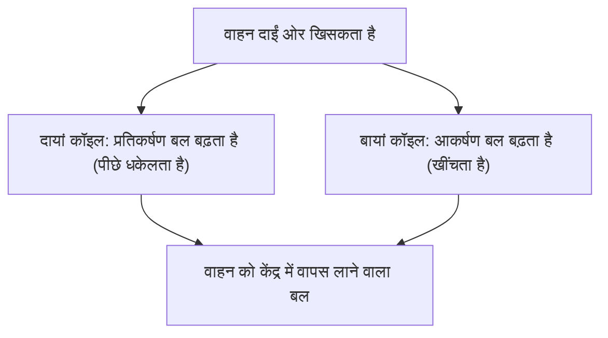

## परिचय: 500 किमी/घंटा की दुनिया में

मैग्लेव (मैग्नेटिक लेविटेशन, Maglev) एक अगली पीढ़ी का परिवहन सिस्टम है जो पारंपरिक पहियों और पटरियों के बीच घर्षण पर निर्भर रेलवे तकनीक से मौलिक रूप से अलग है। जापान में इसे 'सुपरकंडक्टिंग मैग्लेव' के रूप में जाना जाता है, जो 500 किमी/घंटा से अधिक की आश्चर्यजनक गति से जमीन पर दौड़ती है। इस गति को 'दौड़ना' कहने के बजाय 'कम ऊंचाई पर उड़ना' कहना अधिक सटीक हो सकता है।

इस लेख में, हम गहराई से और विस्तार से बताएंगे कि यह अभिनव वाहन कैसे हवा में तैरता है और कैसे यह इतनी तेज़ गति से आगे बढ़ता है, और इसके पीछे के भौतिकी और इंजीनियरिंग चमत्कारों के तंत्र को समझाएंगे।

## सुपरकंडक्टिविटी और मीस्नर प्रभाव: जादुई चुंबकीय बल का स्रोत

मैग्लेव के दिल में 'सुपरकंडक्टिंग मैग्नेट' (Superconducting Magnet) होता है। सुपरकंडक्टिविटी वह घटना है जिसमें कुछ धातुओं या मिश्र धातुओं को बेहद कम तापमान (जैसे, तरल हीलियम का उपयोग करके -269 डिग्री सेल्सियस) तक ठंडा करने पर विद्युत प्रतिरोध पूरी तरह से शून्य हो जाता है।

विद्युत प्रतिरोध शून्य होने का मतलब है कि एक बार करंट प्रवाहित होने पर, यह बाहरी ऊर्जा की आपूर्ति के बिना हमेशा के लिए बहता रहता है, जिसे 'स्थायी करंट' अवस्था कहा जाता है। इसके परिणामस्वरूप, पारंपरिक इलेक्ट्रोमैग्नेट की तुलना में अकल्पनीय रूप से शक्तिशाली चुंबकीय क्षेत्र उत्पन्न किया সুইস जा सकता है, बिना जूल हीटिंग के कारण किसी भी ऊर्जा हानि के।

इसके अलावा, सुपरकंडक्टिंग अवस्था की एक और महत्वपूर्ण विशेषता 'मीस्नर प्रभाव' (Meissner effect) है। यह एक ऐसी घटना है जिसमें चुंबकीय क्षेत्र रेखाएं पूरी तरह से सुपरकंडक्टर के भीतर से बाहर निकाल दी जाती हैं, जिससे सुपरकंडक्टर चुंबक के खिलाफ एक मजबूत प्रतिकर्षण बल उत्पन्न करता है। मैग्लेव को हवा में उठाने के लिए इस मीस्नर प्रभाव का स्वयं उपयोग करने वाली प्रणाली (पिनिंग प्रभाव आदि) और मजबूत सुपरकंडक्टिंग इलेक्ट्रोमैग्नेट्स और ग्राउंड कॉइल्स के बीच उत्पन्न प्रेरित प्रतिकर्षण का उपयोग करने वाली प्रणाली (जापान की सुपरकंडक्टिंग मैग्लेव प्रणाली) हैं। जापानी प्रणाली में, भारी चुंबकीय प्रवाह घनत्व वाले सुपरकंडक्टिंग मैग्नेट वाहन को हवा में उठाने, निर्देशित करने और आगे बढ़ाने में बेहद महत्वपूर्ण भूमिका निभाते हैं।

## प्रणोदन तंत्र: लीनियर सिंक्रोनस मोटर (LSM)

मैग्लेव के आगे बढ़ने का तरीका 'लीनियर मोटर' (रैखिक मोटर) नाम से लिया गया है। पारंपरिक मोटर जो रोटरी गति उत्पन्न करती है, उसके विपरीत, एक लीनियर मोटर की संरचना ऐसी होती है जैसे मोटर को एक सीधी रेखा में काट कर फैला दिया गया हो, जिससे प्रत्यक्ष रैखिक गति (थ्रस्ट या जोर) उत्पन्न होती है।

सुपरकंडक्टिंग मैग्लेव में, 'लीनियर सिंक्रोनस मोटर' (Linear Synchronous Motor: LSM) प्रणाली को अपनाया गया है।

ग्राउंड साइड (गाइडवे) की तरफ की दीवारों पर 'प्रोपल्शन कॉइल्स' (प्रणोदन कॉइल्स) की कतारें होती हैं। जब जमीन पर एक सबस्टेशन से इन कॉइल्स के माध्यम से तीन-चरण प्रत्यावर्ती धारा (Three-phase AC) प्रवाहित की जाती है, तो एक 'चलती हुई चुंबकीय क्षेत्र' (Moving magnetic field) उत्पन्न होती है जहां N और S ध्रुव लगातार चलते हैं।

दूसरी ओर, वाहन शक्तिशाली सुपरकंडक्टिंग मैग्नेट से लैस होता है (जिनमें हमेशा एक स्थिर N और S ध्रुव होता है)। वाहन का N ध्रुव जमीन पर चलते हुए चुंबकीय क्षेत्र के S ध्रुव की ओर खिंचता है, और साथ ही सामने वाले N ध्रुव द्वारा पीछे धकेला जाता है। जमीन पर चुंबकीय क्षेत्र की गति को नियंत्रित करके, वाहन को इस चुंबकीय क्षेत्र की लहर पर सवार होकर धकेला जाता है और आगे बढ़ने के लिए जोर मिलता है।

इस प्रणाली का सबसे बड़ा लाभ यह है कि मोटर के 'स्टेटर' के समतुल्य हिस्सा जमीन पर है, और वाहन के पास केवल 'रोटर' के समतुल्य एक मजबूत चुंबक है। इससे वाहन को बेहद हल्का बनाना संभव हो जाता है, जिससे उच्च गति की यात्रा के दौरान ऊर्जा दक्षता और त्वरण प्रदर्शन में काफी सुधार होता है।

## उठना और मार्गदर्शन: प्रेरण प्रतिकर्षण और "चित्र-8 कॉइल"

मैग्लेव को 500 किमी/घंटा की गति से चलने के लिए, उसे अपने पहियों को हवा में उठाना पड़ता है, जो घर्षण का एक प्रमुख कारण हैं। जापानी सुपरकंडक्टिंग मैग्लेव विद्युत चुम्बकीय प्रेरण के नियमों (फैराडे का नियम और लेन्ज़ का नियम) का उपयोग करते हुए 'प्रेरण प्रतिकर्षण प्रणाली' (EDS: Electrodynamic Suspension) को नियोजित करता है।

प्रोपल्शन कॉइल से अलग, गाइडवे की तरफ की दीवार पर 'उत्तोलन और मार्गदर्शन कॉइल' (Levitation and Guidance Coils) नामक अद्वितीय "8-आकार (figure-8)" के कॉइल स्थापित किए गए हैं। जब वाहन कम गति पर होता है, तो यह रबर के टायरों पर चलता है, लेकिन जैसे ही गति बढ़ती है, वाहन का सुपरकंडक्टिंग चुंबक तेज़ गति से चित्र-8 कॉइल से होकर गुजरता है।

जब चुंबक कॉइल के पास आता है और गुजरता है, तो कॉइल से गुजरने वाला चुंबकीय प्रवाह तेजी से बदलता है। विद्युत चुम्बकीय प्रेरण के कारण, कॉइल में एक प्रेरित धारा (induced current) उस दिशा (लेन्ज़ का नियम) में प्रवाहित होती है जो चुंबकीय प्रवाह में बदलाव का विरोध करती है। यह प्रेरित धारा एक चुंबकीय क्षेत्र बनाती है, जो वाहन के सुपरकंडक्टिंग चुंबक को पीछे हटाती है और एक 'उत्तोलन बल' (levitation force) पैदा करती है। जब गति लगभग 150 किमी/घंटा तक पहुँच जाती है, तो यह प्रतिकर्षण बल वाहन के वजन से अधिक हो जाता है, और यह लगभग 10 सेमी के अंतर के साथ पूरी तरह से हवा में उठ जाता है।

### यह गाइडवे की दीवारों से क्यों नहीं टकराता (मार्गदर्शन सिद्धांत)

उत्तोलन और मार्गदर्शन कॉइल्स "8 के आकार" के होने का एक महत्वपूर्ण कारण है। यह एक 'मार्गदर्शन बल' (guidance force) उत्पन्न करने के लिए है जो वाहन को हमेशा गाइडवे के केंद्र में रखता है।

चित्र-8 कॉइल में, ऊपरी लूप और निचले लूप को पार कर जोड़ा जाता है। जब वाहन गाइडवे (ऊपर, नीचे, बाएँ और दाएँ आदर्श स्थिति) के ठीक बीच में चल रहा होता है, तो चित्र-8 कॉइल के ऊपर और नीचे से गुजरने वाले चुंबकीय प्रवाह की मात्रा समान होती है, और प्रेरित धाराएं शून्य (नल-फ्लक्स स्थिति) होकर रद्द हो जाती हैं।

हालाँकि, यदि वाहन बाएँ या दाएँ भटकता है, तो बाएँ और दाएँ दीवारों पर कॉइल्स की दूरी बदल जाती है, जिससे प्रेरित धाराओं का संतुलन बिगड़ जाता है। जो कॉइल करीब है उसमें एक प्रतिकर्षण बल (पीछे धकेलने वाला बल) होता है, और जो कॉइल दूर है उसमें एक आकर्षण बल (खींचने वाला बल) होता है। इस शक्तिशाली पुनर्स्थापना बल के कारण, मैग्लेव कभी भी साइड की दीवारों से नहीं टकराता और हमेशा ट्रैक के केंद्र में लगातार "उड़ान" भर सकता है।

## पहिए न होने के कारण "शून्य घर्षण" के लाभ

मैग्लेव के पास पहिए और पटरियां न होना केवल गति से परे कई क्रांतिकारी लाभ लाता है।

1.  **जबरदस्त उच्च गति का प्रदर्शन**: पारंपरिक रेलवे में, त्वरण और मंदी पहियों और पटरियों के बीच चिपकने वाले बल (घर्षण) पर निर्भर करती है। इसे "आसंजन सीमा (adhesion limit)" कहा जाता है, और इसकी भौतिक सीमा लगभग 300 से 350 किमी/घंटा मानी जाती है। चूँकि मैग्लेव इस प्रतिबंध से पूरी तरह मुक्त है, यह आसानी से 500 किमी/घंटा से अधिक की गति तक पहुँच सकता है।
2.  **सवारी का आराम और कम शोर/कंपन**: क्योंकि पटरियों के साथ कोई संपर्क नहीं है, दौड़ने के दौरान कोई शारीरिक कंपन या पहिया लुढ़कने की आवाज़ नहीं होती है (हालाँकि, उच्च गति के कारण हवा का प्रतिरोध और हवा का शोर होता है)। पटरियों की सूक्ष्म असमानता के कारण कोई कंपन नहीं होता है, जिससे हवाई जहाज जैसी सुगम सवारी का एहसास होता है।
3.  **खड़ी ढलानों को संभालने की क्षमता**: चूंकि प्रणोदन बल घर्षण पर निर्भर नहीं करता है, इसलिए चढ़ाई की क्षमता बहुत अधिक होती है, और यह खड़े ढलान वाले मार्गों को डिजाइन करना संभव है जो पारंपरिक रेलवे में असंभव हैं। इसके कारण, पहाड़ी क्षेत्रों से सीधे गुजरने वाले सुरंग मार्गों का निर्माण किया जा सकता है।
4.  **रखरखाव में नाटकीय कमी**: पटरियों, पहियों, पैंटोग्राफ और ओवरहेड तारों जैसे कोई घिसने वाले हिस्से नहीं होते हैं। चूंकि कोई यांत्रिक घिसाव नहीं होता है, भागों के प्रतिस्थापन की आवृत्ति और बुनियादी ढांचे का रखरखाव काफी कम हो जाता है, जो लंबी अवधि के परिचालन लागतों के संदर्भ में एक बड़ा फायदा है।

## व्यावसायीकरण और भविष्य की चुनौतियों के लिए तकनीकी बाधाएं

हालाँकि, मैग्लेव के व्यावहारिक उपयोग और प्रसार में अभी भी कई तकनीकी और आर्थिक बाधाएं पार करनी हैं।

*   **क्रायोजेनिक कूलिंग बनाए रखना**: यदि निओबियम-टाइटेनियम मिश्र धातु जैसी सुपरकंडक्टिंग सामग्री का उपयोग किया जाता है, तो इसे लगातार -269 डिग्री सेल्सियस तक ठंडा करना चाहिए, और वाहन को महंगे तरल हीलियम और उन्नत रेफ्रिजरेटर से सुसज्जित किया जाना चाहिए। हाल के वर्षों में, उच्च तापमान वाली सुपरकंडक्टिंग सामग्रियों को लागू करने पर शोध किया गया है जो तरल नाइट्रोजन के तापमान (-196 डिग्री सेल्सियस) पर सुपरकंडक्टिंग हो जाते हैं, लेकिन व्यावहारिक बड़े पैमाने पर प्रणालियों में इनकी शुरूआत अभी भी विकास में है।
*   **बुनियादी ढांचे के निर्माण की भारी लागत**: वाहनों के हल्के वजन के बावजूद, ग्राउंड साइड गाइडवे को पूरी लाइन के साथ अनगिनत प्रोपल्शन कॉइल और लेविटेशन/गाइडेंस कॉइल के साथ सटीक रूप से बिछाया जाना चाहिए। इसके अतिरिक्त, मजबूत चुंबकीय क्षेत्रों को नियंत्रित करने के लिए हर छोटी दूरी पर सबस्टेशन उपकरण की आवश्यकता होती है, और कहा जाता है कि प्रारंभिक बुनियादी ढांचे की निर्माण लागत पारंपरिक हाई-स्पीड रेलवे की तुलना में कई गुना अधिक होती है।
*   **ऊर्जा खपत और हवा का प्रतिरोध**: 500 किमी/घंटा की हाइपरसोनिक रेंज में, हवा का प्रतिरोध गति के वर्ग के अनुपात में तेजी से बढ़ता है। भले ही घर्षण शून्य हो, लेकिन हवा की दीवार से गुजरने में बहुत बड़ी ऊर्जा खपत होती है, और पर्यावरणीय प्रभाव को कम करना और ऊर्जा दक्षता में सुधार करना प्रमुख चुनौतियाँ हैं।
*   **चुंबकीय क्षेत्र के रिसाव के खिलाफ उपाय**: क्योंकि मजबूत सुपरकंडक्टिंग मैग्नेट का उपयोग किया जाता है, इसलिए एक ऐसी तकनीक की आवश्यकता होती है जो केबिन या आसपास के वातावरण में चुंबकीय क्षेत्र के रिसाव को पूरी तरह से रोक दे (परिरक्षण/shielding)। यात्रियों की सुरक्षा सुनिश्चित करने और चिकित्सा उपकरणों पर प्रभाव को रोकने के लिए, वाहनों को सख्ती से चुंबकीय रूप से परिरक्षित (shielded) किया जाता है।

## निष्कर्ष: अगली पीढ़ी की गतिशीलता का अंतिम रूप

मैग्लेव मानवीय इंजीनियरिंग का एक स्मारक है जो बड़े पैमाने पर परिवहन बुनियादी ढांचे के लिए सुपरकंडक्टिविटी की क्वांटम यांत्रिक घटना को लागू करता है। इसका सरल और अंतिम तंत्र "चुंबकीय बल से तैरना और चुंबकीय बल से आगे बढ़ना" शारीरिक घर्षण की सीमाओं को तोड़ता है और हमें यात्रा का एक बिल्कुल नया आयाम प्रस्तुत करता है।

व्यावसायीकरण की बाधाएं, जैसे कि निर्माण लागत और ऊर्जा की समस्याएं, कम नहीं हैं। हालाँकि, इसकी जबरदस्त गति और क्षमता में देशों और शहरों के जुड़ने के तरीके को मौलिक रूप से बदलने की शक्ति है। सुपरकंडक्टिंग तकनीक के विकास के साथ, मैग्लेव सपनों के वाहन से भविष्य के दैनिक परिवहन का साधन बनने की ओर एक निश्चित कदम उठा रहा है。
